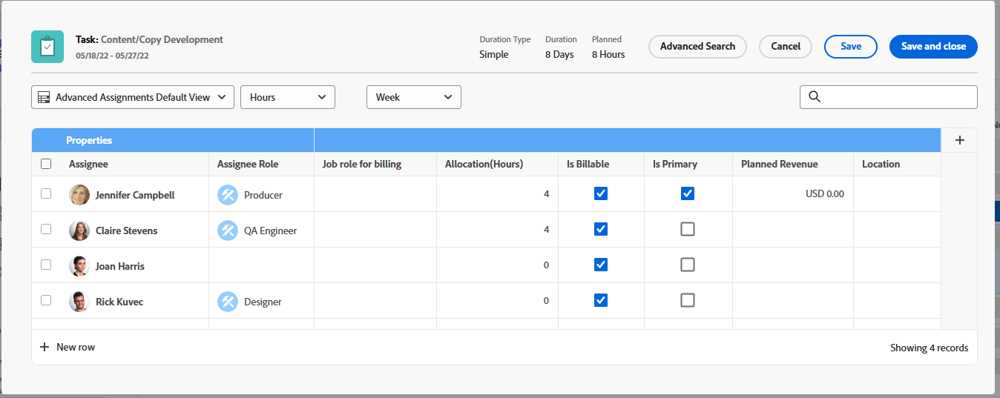

# Erstellen erweiterter Arbeitsaufträge

{{highlighted-preview}}

<!-- Audited: 11/2025-->

<!--remove the bullet indicated when we get rid of the new/old experience of editing tasks-->

<!--

 

The highlighted information on this page refers to functionality not yet generally available. It is available only in the Preview environment for all customers. The same features will also be available in the Production environment for all customers starting with  a week from the Preview release.      

For more information, see [Interface modernization](/help/quicksilver/product-announcements/product-releases/interface-modernization/interface-modernization.md).  

-->

Sie können Aufgaben- oder Problemzuweisungen mithilfe von „Erweiterte Zuweisungen“ verwalten.

Sie können bei erweiterten Zuweisungen die folgenden Zuweisungsinformationen anpassen:

* Weisen Sie der Aufgabe oder dem Problem Benutzer zu (dies kann außerhalb einer erweiterten Zuweisung erfolgen).
* Anpassen und Verteilen der Anzahl der Stunden, die jedem Zugewiesenen zugewiesen werden.
* Legen Sie fest, welcher Benutzer als Eigentümer oder Primärer Bevollmächtigter der Aufgabe oder des Problems bestimmt werden soll.
* Geben Sie an, welche Rolle jeder Benutzer bei der Arbeit an der Aufgabe oder dem Problem erfüllt.
* Fügen Sie Abrechnungs- und Kostensatzinformationen auf Zuordnungsebene hinzu.
* Überprüfen Sie für jede Zuweisung die folgenden Details: Zeitbasierte geplante Stunden, Gesamtkosten und Gesamtumsatz.

>[!NOTE]
>
>Wenn Sie Benutzende einer Arbeit zuweisen, wirkt sich ihre Verfügbarkeit entsprechend den Zeitplänen auf die geplanten und erwarteten Termine von Aufgaben und Problemen aus. Weitere Informationen zu Zeitplänen finden Sie unter [Erstellen eines Zeitplans](../../../administration-and-setup/set-up-workfront/configure-timesheets-schedules/create-schedules.md).

## Bereiche von Adobe Workfront, in denen Sie erweiterte Zuweisungen vornehmen können

In diesem Artikel wird beschrieben, wie Sie in der Kopfzeile der Aufgabe oder des Problems auf erweiterte Zuweisungen zugreifen können.

Darüber hinaus können Sie in den folgenden Bereichen von Workfront erweiterte Zuweisungen vornehmen:

* In Listen und Berichten, wenn das Feld „Zuweisungen“ in der Ansicht angezeigt wird.
* Im Abschnitt Arbeitsaufträge beim Bearbeiten einer Aufgabe. Weitere Informationen finden Sie unter [Aufgaben bearbeiten](../../../manage-work/tasks/manage-tasks/edit-tasks.md). <!--When we remove the old/ new experience: take this bullet out completely; in the new Edit Task experience, this is no longer possible-->
* In der Aufgaben- oder Problem-Kopfzeile im Bereich Zuweisungen .
* Im Workload Balancer. Weitere Informationen finden Sie unter [Arbeiten manuell über den Workload Balancer zuweisen](../../../resource-mgmt/workload-balancer/assign-work-in-workload-balancer-manually.md).

## Zugriffsanforderungen

+++ Erweitern, um die Zugriffsanforderungen für die in diesem Artikel beschriebene Funktionalität anzuzeigen.

<table style="table-layout:auto"> 
 <col> 
 <col> 
 <tbody> 
  <tr> 
   <td>Adobe Workfront-Paket</td> 
   <td> 
So fügen Sie Abrechnungs- und Kostensätze für Aufgabenzuweisungen hinzu und verwenden die erweiterte Suche: Workflow-Ultimate
 
So erstellen Sie erweiterte Zuweisungen: Beliebiges Workfront- oder Workflow-Paket
</td> 
  </tr> 
  <tr> 
   <td>Adobe Workfront-Lizenz</td> 
   <td> 
Standard

   
Work oder höher

   </td> 
  </tr> 
  <tr> 
   <td role>Konfigurationen der Zugriffsebene</td> 
   <td> 
Zugriff auf Aufgaben und Probleme bearbeiten
  </td> 
  </tr> 
  <tr> 
   <td>Objektberechtigungen</td> 
   <td> 
Mitwirken an oder höhere Berechtigungen für die Aufgabe oder das Problem
</td> 
  </tr> 
 </tbody> 
</table>

Weitere Informationen finden Sie unter [Zugriffsanforderungen](/help/quicksilver/administration-and-setup/add-users/access-levels-and-object-permissions/access-level-requirements-in-documentation.md) in der Dokumentation zu Workfront.

+++

## Erweiterte Zuweisungen erstellen - Workflow-Ultimate-Paket

Dieses Layout für erweiterte Zuweisungen gilt nur für Aufgaben. Informationen zu Problemen finden Sie unter [Erweiterte Zuweisungen erstellen - Alle anderen Pakete](#create-advanced-assignments--all-other-packages).

1. Wechseln Sie zu dem Projekt, dem Sie eine Aufgabe zuweisen möchten.
1. Klicken Sie **linken Bereich** Aufgaben“ oder **Probleme** und klicken Sie dann auf den Namen einer Aufgabe in der Liste.

   >[!TIP]
   >
   >Erweiterte Zuweisungen können direkt in der Aufgabenliste vorgenommen werden. Klicken Sie in das **Arbeitsaufträge**-Feld in derselben Zeile wie die Aufgabe und klicken Sie dann unten in der Liste auf **Erweitert** oder auf das **Personen-** in der oberen rechten Ecke des Arbeitsauftragsfelds, um das Fenster „Erweiterte Arbeitsaufträge“ zu öffnen. Fahren Sie mit Schritt 5 fort, um mit dem Erstellen erweiterter Zuweisungen fortzufahren.
   >

1. Klicken Sie **Zuweisen zu** im Feld **Zuweisungen** in der Kopfzeile der Aufgabe

   ODER

   Klicken Sie auf einen der zugewiesenen Namen, wenn die Aufgabe bereits zugewiesen ist.

1. Klicken Sie auf **Erweitert**.

   

   Das Fenster Erweiterte Zuweisungen wird angezeigt.

   

1. Überprüfen Sie die Informationen zur Aufgabendauer nach Bedarf. Diese Felder sind alle schreibgeschützt unter Erweiterte Zuweisungen, und Sie können sie in der Aufgabe aktualisieren.

   Informationen zur Aufgabendauer, zu den Dauertypen, zu den Zeiteinheiten und den geplanten Stunden finden Sie unter [Übersicht über Aufgabendauer und Dauertyp](/help/quicksilver/manage-work/tasks/taskdurtn/task-duration-and-duration-type.md).

1. (Optional) Wählen Sie **Stunden**, **VZÄ** oder **Prozentsatz**, um die Zuordnungen anzuzeigen.

   Sie können sehen, wie viel einem Benutzer in geplanten Stunden, als Prozentsatz seiner Kapazität oder in VZÄ (Vollzeitäquivalent, Skala 0-1) zugewiesen wird. Die Standardeinstellung ist Stunden.

   Weitere Informationen zu FTE finden Sie unter [Konfigurieren von Ressourcenverwaltungseinstellungen](/help/quicksilver/administration-and-setup/set-up-workfront/configure-system-defaults/configure-resource-mgmt-preferences.md).

1. Klicken Sie auf **Neue Zeile**, um der Aufgabe eine Zuweisung hinzuzufügen.

1. Klicken Sie in die Spalte **Verantwortlicher**, um einen Benutzer oder ein Team hinzuzufügen. Geben Sie den Namen des Benutzers oder Teams ein und klicken Sie auf den Namen, wenn er in der Dropdown-Liste angezeigt wird.

   >[!NOTE]
   >
   >Wenn der Name ein Sonderzeichen enthält, müssen Sie dieses in das Suchfeld einschließen.

   Wenn Sie einen Benutzer hinzufügen, der über ein primäres Aufgabengebiet verfügt, wird **Rolle des Verantwortlichen** ausgefüllt.

   Wenn dem/der Benutzenden Attribute seinem/ihrem Profil zugewiesen sind, werden die Attribute bei der Aufgabenzuweisung ausgefüllt.

1. Um ein Aufgabengebiet hinzuzufügen, wenn Sie den/die Benutzende(n) nicht kennen, der/die an der Aufgabe arbeiten wird, klicken Sie in der Spalte **Rolle des Verantwortlichen**. Geben Sie den Namen des Aufgabengebiets ein und klicken Sie auf den Namen, wenn er in der Dropdown-Liste angezeigt wird.

   >[!NOTE]
   >
   >Wenn der Name ein Sonderzeichen enthält, müssen Sie dieses in das Suchfeld einschließen.

   Wenn dem Aufgabengebiet Attribute aus der Tarifkarte eines Projekts zugewiesen sind, werden die Attribute in der Aufgabenzuweisung ausgefüllt.

   Wenn Sie einen Benutzer später über das Feld Bevollmächtigter zuweisen, folgt die einfache Suche diesem Algorithmus:

   * Vollständige Übereinstimmung: Aufgabengebiet und alle Attribute
   * Teilweise Übereinstimmung: Aufgabengebiet und einige Attribute
   * Nur Übereinstimmung bei Aufgabengebieten

   Weitere Informationen zur erweiterten Suche finden Sie unter [Verwenden der erweiterten Suche](#use-the-advanced-search) in diesem Artikel.

1. (Optional) Fügen Sie weitere Verantwortliche in neuen Zeilen hinzu, um der Aufgabe mehrere Ressourcen hinzuzufügen.

   >[!TIP]
   >
   >* Sie können mehrere Benutzer, Aufgabengebiete oder Teams zuweisen. Sie können nur aktive Benutzer, Aufgabengebiete und Teams zuweisen. Pro Aufgabe sind maximal 200 Beauftragte zulässig.
   >
   >
   >* Beachten Sie beim Hinzufügen einer Benutzerzuweisung den Avatar, die Primäre Rolle des Benutzers oder seine E-Mail-Adresse, um zwischen Benutzern mit identischen Namen zu unterscheiden.
   >Benutzende müssen mindestens einem Aufgabengebiet zugeordnet sein, damit sie es beim Hinzufügen anzeigen können.
   >Die Einstellung Kontaktinformationen anzeigen muss in Ihrer Zugriffsebene aktiviert sein, damit Benutzer die E-Mails von Benutzern anzeigen können. Weitere Informationen finden Sie unter [Gewähren des Benutzerzugriffs](../../../administration-and-setup/add-users/configure-and-grant-access/grant-access-other-users.md).
   >
   >
   >* Wenn ein(e) Benutzende(r), ein Aufgabengebiet oder ein Team zugewiesen wurde, bevor sie/er deaktiviert wurden, bleiben sie/sie dem Arbeitselement zugewiesen. In diesem Fall empfehlen wir Folgendes:
   >   
   >   * Weisen Sie das Arbeitselement den aktiven Ressourcen neu zu.
   >   * Verknüpfen Sie die Benutzer in einem deaktivierten Team mit einem aktiven Team und weisen Sie das Arbeitselement dem aktiven Team zu.

1. Um einen Verantwortlichen als Aufgabenbesitzer zu markieren, aktivieren Sie das Kontrollkästchen für die Zeile und klicken Sie **Primär festlegen** in der Aktionsleiste am unteren Rand des Fensters Erweiterte Zuweisungen .

   Standardmäßig markiert Workfront den ersten Benutzer oder das erste Aufgabengebiet, das Sie einer Aufgabe zuweisen, als Eigentümer oder Primäre Zuweisung. Ein Team kann nicht zum Primären Aufgabenbesitzer bestimmt werden.

   Wenn der Primäre Aufgabenbesitzer nicht angezeigt wird, können Sie der Tabelle die **Ist Primär** hinzufügen.

   >[!IMPORTANT]
   >
   >Je nachdem, wie der Workfront-Administrator oder der Gruppenadministrator Ihre Projektvoreinstellungen eingerichtet hat, kann Workfront den Zeitplan des Aufgabenbesitzers verwenden, um den Zeitplan der Aufgabe zu berechnen, wenn mehrere Benutzende der Aufgabe zugewiesen sind. Informationen zu mehreren Aufgabenzuweisungen finden Sie im Abschnitt [Überlegungen zu mehreren Zuweisungen zu Aufgabengebieten, Teams und ](/help/quicksilver/manage-work/tasks/assign-tasks/assign-tasks.md#considerations-for-multiple-assignments-to-job-roles-teams-and-users) im Artikel [Aufgaben zuweisen](../../../manage-work/tasks/assign-tasks/assign-tasks.md).

1. Geben Sie für jeden Benutzer in der Spalte **Verantwortlicher** die folgenden Informationen an:

   * (Optional) **Aufgabengebiet für Abrechnung**: Suchen Sie nach dem Aufgabengebiet für die Abrechnung für diesen spezifischen Bevollmächtigten und diese Aufgabe und wählen Sie es aus.

     Das Aufgabengebiet für die Fakturierung wird nur für diesen Arbeitsauftrag verwendet und nicht automatisch auf die anderen Arbeitsaufträge des Benutzers angewendet. Das Aufgabengebiet einer Benutzerin oder eines Benutzers ist beispielsweise Designer, in einer Aufgabe agiert sie jedoch als Senior Designer und der Abrechnungssatz sollte dies widerspiegeln. Das Aufgabengebiet für die Fakturierung gilt nur für Benutzer und kann nicht für andere Aufgabengebiete verwendet werden.

     Wenn ein Aufgabengebiet für die Fakturierung auf die Benutzerzuordnung angewendet wird, kann in Abrechnungs- und Umsatzberechnungen der mit dem Aufgabengebiet für die Fakturierung verknüpfte Satz anstelle der Sätze für Benutzer oder Aufgabengebiet verwendet werden.

     Ein Aufgabengebiet auf Projektebene für die Fakturierung kann auch für einen Benutzer festgelegt werden, wobei dieser Wert für alle Zuweisungen des Benutzers zu diesem Projekt verwendet wird.

     Weitere Informationen finden Sie unter [Einrichten eines Aufgabengebiets für die Abrechnung](/help/quicksilver/manage-work/projects/project-finances/set-up-job-role-for-billing.md).

   * **Zuordnung**: Wenn der Dauertyp einer Aufgabe „Einfach“ ist, geben Sie die Anzahl der Stunden an, die jeder Benutzer oder jedes Aufgabengebiet der Aufgabe zugewiesen werden soll. Die Summe aller zugewiesenen Stunden für jeden Benutzer ist gleich der Zahl im Feld **Geplante Stunden** oben im Fenster „Erweiterte Zuweisungen“. Geben Sie in allen anderen Fällen den Prozentsatz der Zeit (oder Zuordnung) an, die der Beauftragte für die Lösung der Aufgabe aufwenden soll.

     >[!TIP]
     >
     >Nachdem Sie die Zuweisungen für Aufgaben manuell geändert haben, werden die geplanten Stunden der Aufgaben möglicherweise entsprechend aktualisiert. Beachten Sie, dass Sie die Zuweisungen für Teams, die Aufgaben zugewiesen sind, nicht manuell ändern können. Weitere Informationen finden Sie im Abschnitt [Aktualisieren der geplanten Stunden bei der Verwaltung von Benutzerzuweisungen](/help/quicksilver/manage-work/tasks/task-information/planned-hours.md#update-task-planned-hours-when-managing-user-allocations) im Artikel [Geplante Stunden - Übersicht](/help/quicksilver/manage-work/tasks/task-information/planned-hours.md).

   * **Attribute**: Alle für den Benutzer verfügbaren Attribute werden in den Attributfeldern angezeigt. Der Administrator richtet die Attribute ein und sie werden dem Benutzerprofil hinzugefügt oder mit einem Aufgabengebiet in einer Tarifkarte verknüpft. Weitere Informationen finden Sie unter [Definieren von ](/help/quicksilver/administration-and-setup/manage-enterprise-operations/define-rate-attributes.md) und [Bearbeiten des Benutzerprofils](/help/quicksilver/administration-and-setup/add-users/create-and-manage-users/edit-a-users-profile.md).

     Attribute sind derzeit bei Benutzerzuweisungen schreibgeschützt. Sie können für Aufgabengebiete bearbeitet werden.

   * **Kurswährung**: Die Währung für die Abrechnungs- und Kostensätze wird standardmäßig aus dem Projekt übernommen, Sie können jedoch die Währung für diese Zuordnung ändern.

   * (Optional) **Abrechnungssatz**: Der Abrechnungssatz kann aus anderen Bereichen des Systems stammen, z. B. Tarifkarten. Weitere Informationen finden Sie unter [Übersicht über Umsatz und Kostenhierarchie](/help/quicksilver/manage-work/projects/project-finances/overview-revenue-cost-hierarchy.md). Sie können den Abrechnungssatz für diese spezifische Zuweisung in diesem Feld manuell überschreiben. Außerdem werden alle anderen Sätze für den Benutzer in den Umsatzberechnungen überschrieben.
   * (Optional) **Kostensatz**: Der Kostensatz kann aus anderen Bereichen des Systems stammen. Weitere Informationen finden Sie unter [Übersicht über Umsatz und Kostenhierarchie](/help/quicksilver/manage-work/projects/project-finances/overview-revenue-cost-hierarchy.md). Sie können den Kostensatz für diese spezifische Zuweisung in diesem Feld manuell überschreiben. Außerdem werden alle anderen Sätze für den Benutzer in Kostenberechnungen überschrieben.
   * **Ist fakturierbar**: Wählen Sie diese Option, um die Zuweisung in finanzielle Berechnungen einzubeziehen. Deaktivieren Sie diese Option, um die Zuordnung aus Finanzberechnungen auszuschließen.

     Dieses Feld ist standardmäßig für alle Zuweisungen aktiviert, wenn die Aufgabe über einen Umsatztyp verfügt.

1. (Optional) Um Zuweisungsdaten nach Datum für einen Benutzer oder eine Rolle anzuzeigen, wählen Sie die Tabellenzeile aus und klicken Sie **Nach Datum anzeigen** in der Aktionsleiste am unteren Rand des Fensters Erweiterte Zuweisungen. Weitere Informationen finden Sie unter [Zuweisungsdaten nach Datum anzeigen](#view-assignment-data-by-dates) in diesem Artikel.
1. (Optional) Um eine oder mehrere Zuweisungen aus der Liste zu löschen, aktivieren Sie das Kontrollkästchen für jede Zeile und klicken Sie **Löschen** in der Aktionsleiste am unteren Rand des Fensters Erweiterte Zuweisungen.
1. Klicken Sie auf **Speichern** oder **Speichern und schließen** wenn Sie mit der Bearbeitung der erweiterten Zuweisungen fertig sind.

### Hinzufügen und Entfernen von Spalten in der Liste „Erweiterte Zuweisungen“

Felder müssen vorhanden sein, bevor Sie sie der Liste hinzufügen können.

1. Klicken Sie oben rechts in der Liste auf **+**, um den **Spalten-Manager** zu öffnen.

   

1. Wählen Sie die Registerkarte **Eigenschaften** oder die Registerkarte **KPIs**, um den Typ des Felds auszuwählen, das Sie hinzufügen möchten.

   Eigenschaften wie Standort oder Kostenstelle bieten kontextuelle Informationen. Zeitphasenbezogene KPIs wie Umsatz- oder Kostenaufschlüsselungswerte über Zeiträume hinweg.

1. Suchen Sie im Abschnitt **Verfügbar** nach einem vorhandenen Objektfeld und klicken Sie dann auf **+** rechts neben dem Feldnamen, um es der Spalte **Ausgewählt** hinzuzufügen.
1. Klicken Sie auf **-** rechts neben einem Feld im Abschnitt **Ausgewählt**, um es aus der Liste zu entfernen.
1. Klicken Sie auf **Speichern**.

   Weitere Informationen zum Spalten-Manager finden Sie unter [Verwenden erweiterter Listen](/help/quicksilver/workfront-basics/navigate-workfront/use-lists/enhanced-lists.md).

### Ansicht auf die Liste „Erweiterte Zuweisungen“ anwenden

Eine Ansicht ist ein personalisierter Satz von Spaltenanordnungen, die Sie auf die Liste anwenden können.

1. Klicken Sie auf **Ansichten** und wählen Sie die Ansicht aus, die Sie auf die Liste anwenden möchten.

   **Systemansichten** sind Ansichten, die vom Systemadministrator hinzugefügt wurden, und sie können nicht geändert werden. **Meine Ansichten** sind Ansichten, die Sie erstellt haben oder die für Sie freigegeben wurden.

1. Klicken Sie **Neue Ansicht** in der **Ansichten** Dropdown-Liste, um eine Ansicht zu erstellen.

   Wenn Sie die Spalten hinzufügen, entfernen oder neu anordnen, werden die Änderungen automatisch in der Ansicht gespeichert. Wenn Sie diese Ansicht das nächste Mal anwenden, bleiben die Spalten so, wie Sie sie festlegen.

   Weitere Informationen zu Ansichten finden Sie unter [Verwenden erweiterter Listen](/help/quicksilver/workfront-basics/navigate-workfront/use-lists/enhanced-lists.md).

### Verwenden der erweiterten Suche

Die erweiterte Suche hilft Ihnen, den richtigen Benutzer oder das richtige Aufgabengebiet zu finden, das der Zuweisung hinzugefügt werden soll.

1. Führen Sie einen der folgenden Schritte aus, um das Fenster für die erweiterte Suche zu öffnen:

   * Klicken **oben rechts** Fenster „Erweiterte Zuweisungen“ auf „Erweiterte Suche“.
   * Wählen Sie eine Zuweisungszeile aus und klicken Sie **Erweiterte Suche** in der Aktionsleiste am unteren Rand des Fensters Erweiterte Zuweisungen. Dadurch wird die erweiterte Suche mit Filtern geöffnet, die automatisch für diese spezifische Zuweisung angewendet werden.

1. Wählen Sie im Fenster für die erweiterte Suche die Registerkarte Benutzer oder Aufgabengebiete aus.
1. Filter nach Bedarf anwenden:

   1. Klicken Sie **Filter** über der Liste auf.
   1. Klicken Sie im Feld Filter auf **Bedingung hinzufügen**.
   1. Wählen Sie ein Feld aus, nach dem gefiltert werden soll.
   1. Wählen Sie einen Filtermodifikator aus, z. B. „Hat eines von“, „Hat keines von“, „ist vor“ oder „ist nach“. Die Modifikatoroptionen unterscheiden sich je nach dem Typ des Felds, nach dem Sie filtern.
   1. Wählen Sie die Feldwerte aus. Je nach Feldtyp, nach dem Sie filtern, werden Sie möglicherweise aufgefordert, das Element aus einer Liste auszuwählen, danach zu suchen oder einen Kalender zu verwenden, um einen Datumsbereich auszuwählen.

   Der Filter wird automatisch auf die Liste angewendet. Weitere Informationen zu Filtern finden Sie unter [Verwenden erweiterter Listen](/help/quicksilver/workfront-basics/navigate-workfront/use-lists/enhanced-lists.md).

1. Nach einem Aufgabengebiet oder Benutzer suchen.

   Bei der Suche nach einem Benutzer, der einer Aufgabenrollenzuweisung entspricht, werden nur vollständige Übereinstimmungen (Aufgabengebiet und alle Attribute) angezeigt.

1. Klicken Sie auf **+**, um der Tabelle Spalten hinzuzufügen. Weitere Informationen finden Sie unter [Hinzufügen und Entfernen von Spalten in der Liste Erweiterte Zuweisungen](#add-and-remove-columns-on-the-advanced-assignments-list).
1. Wählen Sie einen oder mehrere Benutzer oder Aufgabengebiete aus und klicken Sie auf **Benutzer hinzufügen** oder **Rollen hinzufügen** in der Aktionsleiste am unteren Fensterrand.

   Die Arbeitsaufträge werden im Fenster „Erweiterte Arbeitsaufträge“ hinzugefügt.

### Zuweisungsdaten nach Datum anzeigen

Das Fenster **Nach Datum anzeigen** für erweiterte Zuweisungen zeigt den gesamten Verlauf der Zuweisung zum aktuellen Datum für einen bestimmten Benutzer oder eine bestimmte Rolle an. Es werden sowohl vergangene als auch zukünftige Änderungen angezeigt.

Beispiele für datumswirksame Elemente, die sich auf den Arbeitsauftragsverlauf auswirken können:

* Primäre/andere Aufgabengebiete des/der Benutzenden
* Aufgabengebiet auf Projektebene für die Fakturierung
* Benutzerprofil-Abrechnungs-/Kostensätze
* Projekt überschreiben Abrechnungs-/Kostensätze (Benutzer oder Aufgabengebiet)
* Tarife für Tarifkarten nach Aufgabengebiet/Attributen
* Benutzerattribute
* Benutzerzeitplan

Beachten Sie, dass es sich nicht um eine umfassende Liste handelt und das geänderte Feld nicht unbedingt in der Tabelle der Zuweisungsdaten angezeigt wird, sondern sich auf die Abrechnungs- und Kostensätze oder Attribute für den Benutzer oder das Aufgabengebiet auswirkt.

Zuweisungsdaten können nur nach Daten für einen einzelnen Benutzer oder eine einzelne Rolle angezeigt werden.

1. Wählen Sie die Tabellenzeile für einen Benutzer oder eine Rolle aus und klicken Sie **Nach Datum anzeigen** in der Aktionsleiste am unteren Rand des Fensters Erweiterte Zuweisungen.

   Das Fenster **Nach Datum anzeigen** wird angezeigt. Die Daten sind schreibgeschützt.

   Jede Zeile in der Tabelle stellt eine Datumsänderung für die Zuweisung dar. Wenn keine datumswirksamen Änderungen stattgefunden haben, enthält die Tabelle eine Zeile mit den aktuellen Daten. Hervorgehobene Felder zeigen auf, was sich geändert hat, und das Start- und Enddatum für jede Aktualisierung werden aufgelistet. Wenn sich der Abrechnungssatz beispielsweise von 202 am 20. August auf 205 am 21. August geändert hat, ist der Satz hervorgehoben. Der Text in Klammern gibt an, wo die Änderung an der Rate vorgenommen wurde, z. B. bei einem Projekt.

   

   Wenn Sie mit der Überprüfung der Daten fertig sind, klicken Sie auf den Pfeil oben links, um zum Fenster Erweiterte Zuweisungen zurückzukehren.

## Erweiterte Zuweisungen erstellen - alle anderen Pakete

Dieses Layout für erweiterte Zuweisungen gilt sowohl für Aufgaben als auch für Probleme.

1. Wechseln Sie zu dem Projekt, dem Sie eine Aufgabe oder ein Problem zuweisen möchten.
1. Klicken Sie **linken Bereich** Aufgaben“ oder **Probleme** und klicken Sie dann auf den Namen einer Aufgabe oder eines Problems in der Liste.

   >[!TIP]
   >
   >Erweiterte Zuweisungen können direkt in der Aufgaben- oder Problemliste vorgenommen werden. Klicken Sie in das **Arbeitsaufträge**-Feld in derselben Zeile wie die Aufgabe oder das Problem und klicken Sie dann unten in der Liste auf **Erweitert** oder auf das **Personen**-Symbol in der oberen rechten Ecke des Arbeitsauftragsfelds, um das Fenster „Erweiterte Arbeitsaufträge“ zu öffnen. Fahren Sie mit Schritt 5 fort, um mit dem Erstellen erweiterter Zuweisungen fortzufahren.
   >

1. Klicken Sie **Zuweisen zu** im Feld **Zuweisungen** in der Kopfzeile der Aufgabe oder des Problems

   ODER

   Klicken Sie auf einen der zugewiesenen Namen, wenn die Aufgabe oder das Problem bereits zugewiesen ist.

1. Klicken Sie auf **Erweitert**.

   

1. Geben Sie **Feld „Personen, Rollen und Teams suchen** den Namen eines Benutzers, einer Rolle oder eines Teams ein und klicken Sie dann auf den Namen, wenn er in der Dropdown-Liste angezeigt wird.

   >[!NOTE]
   >
   >Wenn der Name des Benutzers ein Sonderzeichen enthält, müssen Sie das Sonderzeichen in das Suchfeld einschließen.

1. (Optional) Fügen Sie im Feld **Personen, Rollen und Teams suchen** weitere Beauftragte hinzu, um der Aufgabe oder dem Problem mehrere Ressourcen hinzuzufügen.

   >[!TIP]
   >
   >* Sie können mehrere Benutzer, Aufgabengebiete oder Teams zuweisen. Sie können nur aktive Benutzer, Aufgabengebiete und Teams zuweisen.
   >
   >
   >* Beachten Sie beim Hinzufügen einer Benutzerzuweisung den Avatar, die Primäre Rolle des Benutzers oder seine E-Mail-Adresse, um zwischen Benutzern mit identischen Namen zu unterscheiden.
   >Benutzende müssen mindestens einem Aufgabengebiet zugeordnet sein, damit sie es beim Hinzufügen anzeigen können.
   >Die Einstellung Kontaktinformationen anzeigen muss in Ihrer Zugriffsebene aktiviert sein, damit Benutzer die E-Mails von Benutzern anzeigen können. Weitere Informationen finden Sie unter [Gewähren des Benutzerzugriffs](../../../administration-and-setup/add-users/configure-and-grant-access/grant-access-other-users.md).
   >
   >
   >* Wenn ein(e) Benutzende(r), ein Aufgabengebiet oder ein Team zugewiesen wurde, bevor sie/er deaktiviert wurden, bleiben sie/sie dem Arbeitselement zugewiesen. In diesem Fall empfehlen wir Folgendes:
   >   
   >   * Weisen Sie das Arbeitselement den aktiven Ressourcen neu zu.
   >   * Verknüpfen Sie die Benutzer in einem deaktivierten Team mit einem aktiven Team und weisen Sie das Arbeitselement dem aktiven Team zu.

1. Geben Sie für jeden Benutzer in der Spalte **Verantwortlicher** die folgenden Informationen an:

   * **Verantwortlicher**: Bewegen Sie den Mauszeiger über den Namen des Verantwortlichen und klicken Sie **Primär machen** im Feld „Verantwortlicher“, wenn Sie den Verantwortlichen als Aufgaben- oder Problembesitzer markieren möchten. Ein grünes Kontrollkästchen gibt an, dass der angegebene Benutzer der Primäre Ansprechpartner für die Aufgabe oder das Problem ist. Adobe Workfront markiert den ersten Benutzer oder das erste Aufgabengebiet, das Sie einer Aufgabe oder einem Problem zuweisen, als Inhaber oder Primäre Zuweisung. Ein Team kann nicht zum Primären Eigentümer einer Aufgabe oder eines Problems bestimmt werden.

     >[!IMPORTANT]
     >
     >Je nachdem, wie der Workfront-Administrator oder der Gruppenadministrator Ihre Projektvoreinstellungen eingerichtet hat, kann Workfront den Zeitplan des Aufgabenbesitzers verwenden, um den Zeitplan der Aufgabe zu berechnen, wenn mehrere Benutzende der Aufgabe zugewiesen sind. Informationen zu mehreren Aufgabenzuweisungen finden Sie im Abschnitt [Überlegungen zu mehreren Zuweisungen zu Aufgabengebieten, Teams und ](/help/quicksilver/manage-work/tasks/assign-tasks/assign-tasks.md#considerations-for-multiple-assignments-to-job-roles-teams-and-users) im Artikel [Aufgaben zuweisen](../../../manage-work/tasks/assign-tasks/assign-tasks.md).

   * **Zuteilungen**: Wenn der Dauertyp einer Aufgabe „Einfach“ ist, geben Sie die Anzahl der Stunden an, die jeder Benutzer oder jedes Aufgabengebiet der Aufgabe zugewiesen werden soll. Die Summe aller zugewiesenen Stunden für jeden Benutzer ist gleich der Zahl im Feld **Geplante Stunden** am unteren Rand der Spalte „Zuordnungen“. Geben Sie in allen anderen Fällen den Prozentsatz der Zeit (oder Zuordnung) an, die der Beauftragte für die Lösung der Aufgabe oder des Problems aufwenden soll.

     >[!TIP]
     >   
     >   * Nachdem Sie die Zuweisungen für Aufgaben manuell geändert haben, werden die geplanten Stunden der Aufgaben möglicherweise entsprechend aktualisiert. Weitere Informationen finden Sie im Abschnitt [Aktualisieren der geplanten Stunden bei der Verwaltung von Benutzerzuweisungen](/help/quicksilver/manage-work/tasks/task-information/planned-hours.md#update-task-planned-hours-when-managing-user-allocations) im Artikel [Geplante Stunden - Übersicht](/help/quicksilver/manage-work/tasks/task-information/planned-hours.md).
     >   * Zuweisungen für Probleme können nicht manuell geändert werden.
     >   * Zuteilungen für Teams, die Aufgaben zugewiesen sind, können nicht manuell geändert werden.

   * **Rolle des Verantwortlichen:** Wählen Sie die Rolle aus, die der Benutzer bei der Erfüllung dieser Zuweisung verwenden soll.  Standardmäßig wird die Primäre Rolle des/r Benutzenden angezeigt. Klicken Sie in das Feld **Rolle des Verantwortlichen**, um eine andere Rolle auszuwählen. Wenn Sie die Aufgabe oder das Problem zuerst einer Rolle zuweisen und dann einen Benutzer hinzufügen, der diese Rolle als zweite Zuweisung erfüllen kann, wird die Liste der vorgeschlagenen Benutzer nach den Benutzern gefiltert, die die der Aufgabe und dem Problem bereits zugewiesenen Rollen erfüllen können.

     

   * **Dauertyp**: Dies ist nur für Aufgaben verfügbar. Klicken Sie auf den Namen des Dauertyps und wählen Sie aus dem Dropdown-Menü einen Dauertyp aus. Weitere Informationen zu den Dauertypen finden Sie unter [Übersicht über die Aufgabendauer und den Dauertyp](../../../manage-work/tasks/taskdurtn/task-duration-and-duration-type.md).

   * **Dauer:** Sie können dieses Feld für eine Aufgabe aktualisieren, wenn Sie über Verwaltungsberechtigungen für die Aufgabe verfügen.

     Weitere Informationen finden Sie unter [Übersicht über Aufgabendauer und -typ](../../../manage-work/tasks/taskdurtn/task-duration-and-duration-type.md). Bei der Massenbearbeitung von Zuweisungsinformationen wird ein ähnliches Dialogfeld angezeigt, in dem Benutzer, Stunden, Zuordnung und Aufgabenbesitzer zugewiesen werden.

   * **Geplante Stunden**: Wenn der Dauertyp „Berechnete Zuweisung“ oder „Einfach“ ist, aktualisieren Sie die Anzahl der geplanten Stunden. Dadurch werden die Prozentsätze der Zuordnungen bzw. die Stunden für jede Ressource gleichmäßig verteilt. Workfront berechnet die geplanten Stunden, wenn der Dauertyp „Berechnete Arbeit“ oder „Leistungsgesteuert“ ist. Weitere Informationen finden Sie unter [Übersicht über Aufgabendauer und -typ](../../../manage-work/tasks/taskdurtn/task-duration-and-duration-type.md).

1. Klicken Sie auf **Speichern**.

