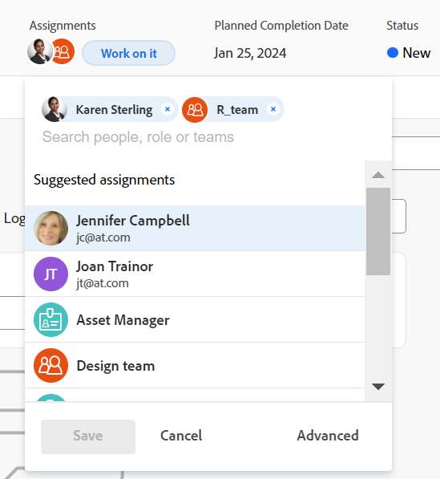

# Erweiterte Zuweisungen erstellen

<!-- Audited: 07/2024-->

Die hervorgehobenen Informationen auf dieser Seite beziehen sich auf Funktionen, die noch nicht allgemein verfügbar sind. Sie ist nur in der Vorschau-Umgebung für alle Kunden oder in der Produktionsumgebung für Kunden verfügbar, die schnelle Versionen aktiviert haben.

Informationen zu schnellen Versionen finden Sie unter [Schnellversionen für Ihr Unternehmen aktivieren oder deaktivieren](/help/quicksilver/administration-and-setup/set-up-workfront/configure-system-defaults/enable-fast-release-process.md).

Weitere Informationen zur aktuellen Version finden Sie unter [Überblick über die Version des vierten Quartals 2024](/help/quicksilver/product-announcements/product-releases/24-q4-release-activity/24-q4-release-overview.md).

Sie können Aufgaben- oder Problemzuweisungen mit erweiterten Zuweisungen verwalten.

Bei erweiterten Zuweisungen können Sie die folgenden Zuweisungsinformationen anpassen:

* Weisen Sie Benutzer der Aufgabe oder dem Problem zu (dies kann außerhalb einer erweiterten Zuweisung erreicht werden).
* Anpassen und Neuverteilung der Anzahl der Stunden, die jedem Bevollmächtigten zugewiesen werden.
* Bestimmen Sie, welcher Benutzer als Eigentümer oder Primärer Verantwortlicher der Aufgabe oder des Problems bestimmt werden soll.
* Geben Sie an, welche Rolle jeder Benutzer bei der Bearbeitung der Aufgabe oder des Problems erfüllt.
  <!--* Override the billing rate for a job role.-->

>[!NOTE]
>
>Wenn Benutzer zur Arbeit zugewiesen werden, wirkt sich ihre Verfügbarkeit entsprechend ihren Zeitplänen auf die geplanten und geplanten Daten von Aufgaben und Problemen aus. Weitere Informationen zu Zeitplänen finden Sie unter [Erstellen eines Zeitplans](../../../administration-and-setup/set-up-workfront/configure-timesheets-schedules/create-schedules.md).

## Bereiche von Adobe Workfront, in denen Sie erweiterte Zuweisungen vornehmen können

In diesem Artikel wird beschrieben, wie Sie auf erweiterte Zuweisungen in der Aufgabe oder in der Kopfzeile des Problems zugreifen.

Darüber hinaus können Sie erweiterte Zuweisungen in den folgenden Bereichen von Workfront vornehmen:

* In Listen und Berichten, wenn das Feld Zuweisungen in der Ansicht angezeigt wird.
* Im Abschnitt Zuweisungen beim Bearbeiten einer Aufgabe. Weitere Informationen finden Sie unter [Aufgaben bearbeiten](../../../manage-work/tasks/manage-tasks/edit-tasks.md).
* In der Aufgaben- oder Problemüberschrift im Bereich &quot;Zuweisungen&quot;.
* Im Arbeitslast-Balancer. Weitere Informationen finden Sie unter [Manuelles Zuweisen der Arbeit mit dem Arbeitslastausgleich](../../../resource-mgmt/workload-balancer/assign-work-in-workload-balancer-manually.md).

## Zugriffsanforderungen

+++ Erweitern Sie , um die Zugriffsanforderungen für die Funktionalität in diesem Artikel anzuzeigen.

<table style="table-layout:auto"> 
 <col> 
 <col> 
 <tbody> 
  <tr> 
   <td role="rowheader">Adobe Workfront-Abo</td> 
   <td> 
Alle
 </td> 
  </tr> 
  <tr> 
   <td role="rowheader">Adobe Workfront-Lizenz*</td> 
   <td> 
Neu: Standard

    
Aktuell: Arbeit oder höher
 </td> 
  </tr> 
  <tr> 
   <td role="rowheader">Konfigurationen auf Zugriffsebene</td> 
   <td> 
Zugriff auf Aufgaben und Probleme bearbeiten
  </td> 
  </tr> 
  <tr> 
   <td role="rowheader">Objektberechtigungen</td> 
   <td> 
Contribute oder höhere Berechtigungen für eine Aufgabe oder ein Problem
  </td> 
  </tr> 
 </tbody> 
</table>

*Weitere Informationen finden Sie unter [Zugriffsanforderungen in der Workfront-Dokumentation](/help/quicksilver/administration-and-setup/add-users/access-levels-and-object-permissions/access-level-requirements-in-documentation.md).

+++

## Erweiterte Zuweisungen vornehmen

1. Gehen Sie zum Projekt, dem Sie eine Aufgabe oder ein Problem zuweisen möchten.
1. Klicken Sie im linken Bereich auf **Aufgaben** oder **Probleme** und klicken Sie dann auf den Namen einer Aufgabe oder eines Problems in der Liste.

   >[!TIP]
   >
   >Sie können erweiterte Zuweisungen direkt in der Aufgaben- oder Problemliste vornehmen, wenn zwei oder mehr Personen zugewiesen sind. Klicken Sie in das Feld **Zuweisungen** in derselben Zeile wie die Aufgabe oder das Problem und klicken Sie dann auf das Symbol **Personen** , um das Fenster &quot;Erweiterte Zuweisungen&quot;zu öffnen. Fahren Sie mit Schritt 5 fort, um mit der Erstellung erweiterter Zuweisungen fortzufahren.\
   >
   >

1. Klicken Sie im Feld **Zuweisungen** in der Kopfzeile der Aufgabe oder des Problems auf **Zuweisen zu** .

   Oder

   Klicken Sie auf den Namen der Zuweisungen, falls die Aufgabe oder das Problem bereits zugewiesen wurde.

1. Klicken Sie auf **Erweitert**.

   

1. Geben Sie im Feld **Personen, Rollen und Teams durchsuchen** den Namen eines Benutzers, einer Rolle oder eines Teams ein und klicken Sie dann auf den Namen, wenn er in der Dropdown-Liste angezeigt wird.

   >[!NOTE]
   >
   >Wenn der Name des Benutzers ein Sonderzeichen enthält, müssen Sie das Sonderzeichen in das Suchfeld einfügen.

1. (Optional) Fügen Sie im Feld **Personen, Rollen oder Teams durchsuchen** weitere Zuweisende hinzu, um der Aufgabe oder dem Problem mehrere Ressourcen hinzuzufügen.

   >[!TIP]
   >
   >* Sie können mehrere Benutzer, Auftragsrollen oder Teams zuweisen. Sie können nur aktive Benutzer, Stellenrollen und Teams zuweisen.
   >
   >
   >* Beachten Sie beim Hinzufügen einer Benutzerzuweisung den Avatar, die Primäre Rolle des Benutzers oder seine E-Mail-Adresse, um zwischen Benutzern mit identischen Namen zu unterscheiden.
   >Benutzer müssen mindestens einer Auftragsrolle zugeordnet sein, damit sie beim Hinzufügen angezeigt werden können.
   >Sie müssen die Einstellung Kontaktinformationen anzeigen auf Ihrer Zugriffsebene aktivieren, damit Benutzer E-Mails von Benutzern anzeigen können. Weitere Informationen finden Sie unter [Gewähren des Zugriffs für Benutzer](../../../administration-and-setup/add-users/configure-and-grant-access/grant-access-other-users.md).
   >
   >
   >* Wenn ein Benutzer, eine Rolle oder ein Team zugewiesen wurde, bevor sie deaktiviert wurden, bleiben sie dem Arbeitselement zugewiesen. In diesem Fall empfehlen wir Folgendes:
   >   
   >   * Weisen Sie das Arbeitselement aktiven Ressourcen erneut zu.
   >   * Verknüpfen Sie die Benutzer in einem deaktivierten Team mit einem aktiven Team und weisen Sie das Arbeitselement dem aktiven Team erneut zu.
   >

   <!-- SHOULD BE THIRD BULLET POINT IN TIP TABLE WHEN THIS FEATURE IS RELEASED 
    * When adding a job role assignment, you can search for the job role or location. Select the System/Default Job Role to use the default billing rate for the assignment, or select a Rate Card Job Role to override the rate at the assignment level. For more information on rate cards, see [Manage rate cards](/help/quicksilver/administration-and-setup/set-up-workfront/configure-system-defaults/manage-rate-cards.md).
    -->

1. Geben Sie für jeden Benutzer in der Spalte **Zuweisung** die folgenden Informationen an:

   * **Inhaber**: Bewegen Sie den Mauszeiger über den Namen des Bevollmächtigten und klicken Sie im Feld &quot;Eigentümer&quot;auf **Als Primär machen** , wenn Sie den Bevollmächtigten als Aufgaben- oder Problemeigentümer markieren möchten. Ein grünes Kontrollkästchen zeigt an, dass der angegebene Benutzer der Primäre Kontakt der Aufgabe oder des Problems ist. Adobe Workfront markiert die erste Benutzer- oder Auftragsrolle, die Sie einer Aufgabe oder einem Problem zuweisen, als Inhaber oder Primäre Zuweisung. Ein Team kann nicht als Primärer Eigentümer einer Aufgabe oder eines Problems bestimmt werden.

     >[!IMPORTANT]
     >
     >Je nachdem, wie Ihr Workfront-Administrator oder Gruppenadministrator Ihre Projekteinstellungen eingerichtet hat, kann Workfront den Zeitplan des Aufgabenbesitzers verwenden, um die Zeitleiste der Aufgabe zu berechnen, wenn mehrere Benutzer der Aufgabe zugewiesen sind. Weitere Informationen zu mehreren Aufgabenzuweisungen finden Sie im Abschnitt &quot;Assign multiple users to a task&quot;im Artikel [Assign tasks](../../../manage-work/tasks/assign-tasks/assign-tasks.md).

   * **Zuordnungen** : Wenn der Dauer-Typ einer Aufgabe einfach ist, geben Sie an, wie viele Stunden jeder Benutzer oder jede Auftragsrolle der Aufgabe zugewiesen werden soll. Die Summe aller zugewiesenen Stunden für jeden Benutzer entspricht der Zahl im Feld **Geplante Stunden** unten in der Spalte &quot;Zuweisungen&quot;. Geben Sie in allen anderen Fällen den Prozentsatz der Zeit (oder Zuordnung) an, die der Verantwortliche für die Lösung der Aufgabe oder des Problems verwenden soll.

     <!--   
     
(NOTE: make sure this is right in the new UI for both classic and QS???)
   
     -->

     >[!TIP]
     >   
     >   * Nachdem Sie die Zuweisung von Aufgaben manuell geändert haben, werden die geplanten Stunden der Aufgaben möglicherweise entsprechend aktualisiert. Weitere Informationen finden Sie im Abschnitt &quot;Aktualisieren der geplanten Aufgaben bei der Verwaltung von Benutzerzuweisungen&quot;im Artikel [Übersicht über geplante Stunden](../../../manage-work/tasks/task-information/planned-hours.md).
     >   * Sie können die Zuweisungszuordnungen für Probleme nicht manuell ändern.
     >   * Sie können die Zuordnungen für Teams, die Aufgaben zugewiesen sind, nicht manuell ändern.

   * **Rolle des Bevollmächtigten:** Wählen Sie die Rolle aus, die der Benutzer bei der Erfüllung dieser Zuweisung verwenden soll.  Die Primäre Rolle des Benutzers wird standardmäßig angezeigt. Klicken Sie in das Feld &quot;Rolle des Bevollmächtigten&quot;, um eine andere Rolle auszuwählen.  Wenn Sie die Aufgabe oder das Problem zuerst einer Rolle zuweisen und dann einen Benutzer hinzufügen, der diese Rolle als zweite Zuweisung erfüllen kann, wird die Liste der vorgeschlagenen Benutzer nach Benutzern gefiltert, die die der Aufgabe und dem Problem bereits zugewiesenen Rollen erfüllen können.

     

   <!--

   * **Location**: The location comes from the rate card, if a rate card attached to the project uses locations with the job roles. The location can't be changed. 

   * **Billing Rates**: The billing rate for a user comes from the system rate for the user or their associated job role. The billing rate for a job role comes from the system rate or from the rate card, if a rate card is attached to the project. Existing billing rates are not displayed in this field. Click in the field to change the billing rate for this specific task assignment.

   
-->

   * **Dauer-Typ**: Dies ist nur für Aufgaben verfügbar. Klicken Sie auf den Namen des Typs Dauer und wählen Sie aus dem Dropdown-Menü einen Typ Dauer aus. Weitere Informationen zu den Arten der Dauer finden Sie unter [Übersicht über die Aufgabendauer und den -dauer-Typ](../../../manage-work/tasks/taskdurtn/task-duration-and-duration-type.md).

   * **Dauer:** Sie können dieses Feld für eine Aufgabe aktualisieren, wenn Sie über Verwaltungsberechtigungen für die Aufgabe verfügen.

     Weitere Informationen finden Sie unter [Übersicht über die Aufgabendauer und -dauer](../../../manage-work/tasks/taskdurtn/task-duration-and-duration-type.md). Bei Massenbearbeitung von Zuweisungsinformationen wird ein ähnliches Dialogfeld angezeigt, in dem Benutzer, Stunden, Zuordnungen und Aufgabeneigentümer zugewiesen werden.

   * **Geplante Stunden**: Wenn der Typ &quot;Dauer&quot;für die berechnete Zuweisung oder einfach ist, aktualisieren Sie die Anzahl der geplanten Stunden. Die Zuordnungsprozentsätze oder die Stunden für jede Ressource werden als Ergebnis gleichmäßig verteilt. Workfront berechnet die geplanten Stunden, wenn die Dauer berechnet wird (Work or Effort Driven). Weitere Informationen finden Sie unter [Übersicht über die Aufgabendauer und -dauer](../../../manage-work/tasks/taskdurtn/task-duration-and-duration-type.md).

1. Klicken Sie auf **Speichern**.
