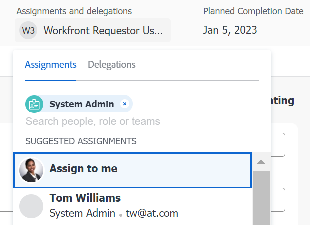
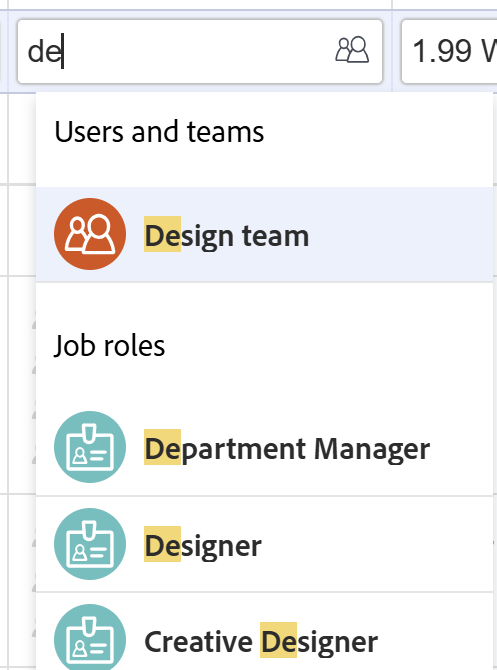

# Smart-Zuweisungen vornehmen

<!--Audited: 07/2024-->

Sie können intelligente Zuweisungen verwenden, um zu ermitteln, wer die Arbeit am besten erledigen kann.

Intelligente Zuweisungen sind Vorschläge für Benutzende, Rollen oder Teams, die Adobe Workfront Ihnen beim Zuweisen von Arbeitselementen zu Ressourcen vorlegt. Workfront stützt seine Vorschläge auf einen Algorithmus, der die am besten geeignete Ressource für den Auftrag bestimmt.

<!--There are two separate algorithms in Workfront that calculate smart assignments that work differently for tasks and for issues. -->

Weitere Informationen über die Kriterien zur Bestimmung von Smart-Zuweisungen finden Sie unter [Smart-Zuweisungen - Übersicht](/help/quicksilver/manage-work/tasks/assign-tasks/smart-assignments.md).

## Zugriffsanforderungen

+++ Erweitern, um die Zugriffsanforderungen für die in diesem Artikel beschriebene Funktionalität anzuzeigen.

<table style="table-layout:auto"> 
 <col> 
 <col> 
 <tbody> 
  <tr> 
   <td>Adobe Workfront-Paket</td> 
   <td> 
Beliebig
 </td> 
  </tr> 
  <tr> 
   <td>Adobe Workfront-Lizenz</td> 
   <td> 
Standard

   
Work oder höher

   </td> 
  </tr> 
  <tr> 
   <td>Konfigurationen der Zugriffsebene</td> 
   <td> 
Zugriff auf Aufgaben und Probleme bearbeiten
 
Zugriff auf Projekte anzeigen oder höher
 </td> 
  </tr> 
  <tr> 
   <td>Objektberechtigungen</td>
   <td>Mitwirken an oder höhere Berechtigungen mit der Möglichkeit, Zuweisungen zu Aufgaben und Problemen vorzunehmen</td>
  </tr>
 </tbody>
</table>

Weitere Informationen finden Sie unter [Zugriffsanforderungen in der Dokumentation zu Workfront](/help/quicksilver/administration-and-setup/add-users/access-levels-and-object-permissions/access-level-requirements-in-documentation.md).

+++

## Smart-Zuweisungen vornehmen

Smart-Zuweisungen sind an den meisten Stellen verfügbar, an denen Sie Zuweisungen in Workfront vornehmen können.

1. Wechseln Sie zu den folgenden Bereichen und klicken Sie auf das Feld **Arbeitsaufträge** oder **Diesen zuweisen zu**:

   * Aufgaben- oder Problemliste oder Bericht
   * Kopfzeile einer Aufgabe oder eines Problems
   * Das Bedienfeld „Aufgaben- oder Problemzusammenfassung“
   * Eine Aufgabe oder ein Problem im Workload Balancer
     <!--* A New Task or New Issue box, as you add a new task or issue to a project-->

1. Platzieren Sie den Cursor im Feld Arbeitsaufträge und warten Sie zwei Sekunden.

   <!--For issues, the smart assignments display in the following sections: 
      * **Users and teams**
      * **Job roles**
        -->

   Smart-Zuweisungen werden in den folgenden Abschnitten angezeigt<!--, depending on which phase of the algorithm's calculation identified the assignments-->:

   <!--* **Suggested assignments**: Displays assignments identified in the first phase of the task smart assignment algorithm. -->
   * **Benutzer und Teams** oder **Aufgabengebiete** <!--or **Rate card job roles**: Assignments identified in the second phase of the task smart assignment's algorithm calculation.-->

   

   Weitere Informationen finden Sie unter [Smart Assignments - Übersicht](../../../manage-work/tasks/assign-tasks/smart-assignments.md).

1. Wählen Sie die Ressource in der Liste Recommendations aus, indem Sie auf ihren Namen klicken.

1. (Optional) Klicken Sie auf **Mir zuweisen**, um das Arbeitselement sich selbst zuzuweisen.

   >[!TIP]
   >
   >Wenn keine Vorschläge vorliegen, wird die Vorschlagsliste nicht geöffnet.

1. (Optional) Wenn Sie keinen der empfohlenen Benutzer aus der Liste „Smart Assignments“ verwenden möchten, geben Sie den Namen der gewünschten Ressource ein und wählen Sie den Namen aus, wenn er in der Liste angezeigt wird.
1. Klicken Sie **Enter**, um die Zuweisung vorzunehmen.

   Der ausgewählte Benutzer wird der Aufgabe oder dem Problem zugewiesen.
