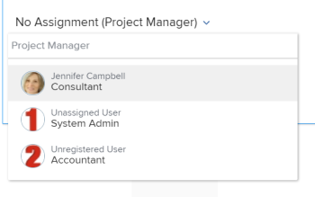

# Übersicht über Smart-Zuweisungen

Bei der Verwaltung von Aufgaben und Problemzuweisungen können Sie Smart-Zuweisungen verwenden, um zu ermitteln, wer der beste Benutzer ist, um die Arbeit abzuschließen. Smart-Zuweisungen sind Vorschläge, die Ihnen Adobe Workfront präsentiert, wenn Sie Arbeitselemente Ressourcen zuweisen, die auf einem Algorithmus basieren, der die am besten geeignete Ressource für den Auftrag bestimmt.

>[!NOTE]
>
>Bei intelligenten Zuweisungen wird die Verfügbarkeit des Benutzers nicht berücksichtigt. Die Verfügbarkeit der Aufgaben gemäß ihren Zeitplänen wirkt sich jedoch auf die geplanten und geplanten Termine von Aufgaben und Problemen aus, wenn sie zugewiesen werden. Weitere Informationen zu Zeitplänen finden Sie im Artikel [Zeitplan erstellen](../../../administration-and-setup/set-up-workfront/configure-timesheets-schedules/create-schedules.md).

Dieser Artikel enthält allgemeine Informationen zu Smart-Zuweisungen. Informationen zur Verwendung von Smart-Zuweisungen zum Zuweisen von Aufgaben und Problemen zu Benutzern finden Sie unter [Smart-Zuweisungen vornehmen](../../../manage-work/tasks/assign-tasks/make-smart-assignments.md).

## Übersicht über Smart-Zuweisungen

Beachten Sie beim Arbeiten mit Smart-Zuweisungen Folgendes:

* Der Algorithmus funktioniert unabhängig für Aufgaben und Probleme. Das bedeutet, dass die Liste der vorgeschlagenen Benutzer für Probleme möglicherweise von der Liste der vorgeschlagenen Benutzer für eine Aufgabe abweicht, da Workfront die Listen nach Kriterien erstellt, die sich auf Probleme und Aufgaben beziehen.
* Bei intelligenten Zuweisungen werden keine Auftrags- oder Teams empfohlen. Stattdessen handelt es sich um Vorschläge von Benutzern, die am besten geeignet sind, eine Aufgabe oder ein Problem abzuschließen.
* Die vorgeschlagenen Zuweisungen sind immer aktive Benutzer.
* Der zuerst aufgeführte Benutzer sollte die beste Übereinstimmung für die Aufgabe sein.

## Suchen nach Vorschlägen für intelligente Zuweisungen

Sie können Smart-Zuweisungen in den folgenden Bereichen anzeigen, wo Sie Aufgaben oder Probleme zuweisen können:

* Aufgabe oder Problemliste oder Bericht

   

* Aufgaben- oder Problemkopfzeile

   

* Bedienfeld &quot;Aufgabe oder Problem-Zusammenfassung&quot;

   

* Das Feld Zuweisungen für ein Element, das im Startbereich aufgeführt ist

   

<!--removed for scheduling deprecation: 

* Resource Scheduling

  

  >[!CAUTION]
  >
  >Resource Scheduling is a deprecated feature. For more information, see [Deprecation of Resource Scheduling tools in Adobe Workfront](../../../resource-mgmt/resource-mgmt-overview/deprecate-resource-scheduling.md).

-->
* Workload-Balancer

   

## Kriterien für intelligente Zuweisungen

Intelligente Zuweisungen zeigen die 50 wichtigsten Empfehlungen basierend auf einem proprietären Algorithmus an.

Benutzer werden in der Dropdown-Liste &quot;Smart-Zuweisungen&quot;empfohlen, die auf einer Kombination der folgenden Kriterien basiert (aufgelistet in der Reihenfolge von am wichtigsten zu am wenigsten wichtig):

* Benutzer, die der Benutzer, der die Zuweisung vornimmt, in den letzten 30 Tagen anderen Arbeitselementen zugewiesen hat. Die ersten 50 Benutzer, die diesen Kriterien entsprechen, werden angezeigt. Der am häufigsten zugewiesene Benutzer wird zuerst angezeigt.

   Wenn das Arbeitselement einem Team oder einer Rolle zugewiesen wird, wird die Liste der vorgeschlagenen Benutzer unter Berücksichtigung der folgenden vorhandenen Zuweisungen weiter gefiltert. In diesem Fall werden nur die folgenden Benutzer in der Liste der Vorschläge angezeigt:

   * Benutzer, deren Startseite das dem Arbeitselement zugewiesene Team ist.
   * Benutzer, deren Primäre Rolle die dem Arbeitselement zugewiesene Rolle ist.

      >[!TIP]
      >
      >* Wenn <!--you're not part of any team and --> Wenn für die Aufgabe oder das Problem keine Rolle oder kein Team zugewiesen ist, zeigt Workfront alle Benutzer an, die in den letzten 30 Tagen bis zu 50 Benutzer zugewiesen wurden.
      >* Wenn Sie in den letzten 30 Tagen keine Zuweisungen vorgenommen haben, werden in der Liste der Smart-Zuweisungen nur Benutzer angezeigt, die dem zugewiesenen Team angehören oder denen die Rolle zugewiesen ist.

<!--the commented out piece in the tip above was live before but I am not totally sure that smart assignments look at your team. I think they look JUST at the team/ role assigned to the work item; see this help site request for more info: https://experience.adobe.com/#/@adobeinternalworkfront/so:hub-Hub/workfront/issue/62fd222200037eb87572c5b6ad6bf53e/overview -->
<!--

<h3>Smart assignments criteria for the Production environment</h3>

(NOTE: drafted,this was the case BEFORE we updated the logic in the WB - with the 21.4 release)

Smart assignments display on tasks and issues when the following conditions are met:

<ul>
<li>The task or issue is subordinate to a parent task or issue that has a user, team, or job role currently assigned. </li>
</ul>

Smart assignments display the top twenty recommendations based on a proprietary algorithm that uses your own team information.

Users are recommended in the smart assignments drop-down list based on a combination of the following criteria (listed in order from most important to least important):

<ul>
<li>The user has the team assigned to the task or issue designated as their Home Team</li>
<li>The user is also assigned to the parent task</li>
<li>The user has the same primary job role as is currently assigned to the task or issue</li>
<li>The user has the team assigned to the parent task or issue designated as their Home Team</li>
<li>The user is associated with the same primary job role currently assigned to the parent task</li>
<li>The user is a member of the same team as the user who assigned the task or issue and the team is designated as their Home Team</li>
<li>The user is a member of the same Home Group as the user who is assigning the task or issue</li>
<li>The user has the same primary job role as the user who is assigning the task or issue.</li>
</ul>

-->

<!--

<h2>Make smart assignments</h2>

(NOTE:&nbsp;this was moved to its own article: make-smart-assignments.) 

Smart assignments are available in most locations where you can make assignments in Workfront.

You can use smart assignments on tasks and issues that have previously been assigned to a job role or a team.
 <note type="note">
You must have a Plan or a Work license and have at least Contribute permissions to a task or an issue to be able to make assignments to the task or the issue. You must have the Make Assignments option enabled in your permission level to make assignments.
</note>

To use smart assignments:

<ol>
<li value="1">Navigate to an issue or a task and click one of the following fields to edit them:  
<ul>
<li>
The <strong>Assignments</strong> field in the task or issue header
</li>
<li>The <strong>Assignments</strong> field of a task or issue list using in-line editing in a task or issue list. </li>
<li>The <strong>Assignee</strong> field after you have clicked <strong>Advanced</strong> from a task or an issue. </li>
</ul></li>
<li value="2"> 
Place your cursor in the assignment field, and wait for two seconds, then the <strong>Suggestions</strong> list is displayed.
 
Users displayed in this list are the smart assignment suggestions for the task or the issue. 
 
  
 </li>
<li value="3"> 
Select the user in the recommendations list by clicking their name. 
 
If there are no suggestions, the suggestion list does not open.
 </li>
<li value="4">(Optional) If you do not want to use one of the recommended users from the smart assignments list, start typing the name of the desired user and select the name when it appears in the list.</li>
<li value="5">Click <strong>Enter</strong> to make the assignment. </li>
</ol>

-->
