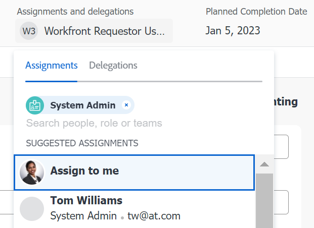

# Übersicht über Smart-Zuweisungen

<!--Audited: 07/2024-->

<!--keep the yellow around the Rate card job roles and the Preview intro for those-->

Die hervorgehobenen Informationen auf dieser Seite beziehen sich auf Funktionen, die noch nicht allgemein verfügbar sind. Sie ist nur in der Vorschau-Umgebung für alle Kunden oder in der Produktionsumgebung für Kunden verfügbar, die schnelle Versionen aktiviert haben.

Informationen zu schnellen Versionen finden Sie unter [Schnellversionen für Ihr Unternehmen aktivieren oder deaktivieren](/help/quicksilver/administration-and-setup/set-up-workfront/configure-system-defaults/enable-fast-release-process.md).

Weitere Informationen zur aktuellen Version finden Sie unter [Überblick über die Version des vierten Quartals 2024](/help/quicksilver/product-announcements/product-releases/24-q4-release-activity/24-q4-release-overview.md).

Bei der Verwaltung von Aufgaben und Problemzuweisungen können Sie mithilfe von intelligenten Zuweisungen ermitteln, wer die beste Ressource ist, um die Arbeit abzuschließen. Smart-Zuweisungen sind Vorschläge, die Ihnen Adobe Workfront präsentiert, wenn Sie Arbeitselemente Ressourcen zuweisen, die auf einem Algorithmus basieren, der die am besten geeignete Ressource für den Auftrag bestimmt. Bei intelligenten Zuweisungen kann es sich um Benutzer, Auftragsrollen oder Teams handeln.

>[!NOTE]
>
>Beim Vorschlag für Benutzer berücksichtigen Smart-Zuweisungen nicht die Verfügbarkeit des Benutzers. Die Verfügbarkeit der Aufgaben gemäß ihren Zeitplänen wirkt sich jedoch auf die geplanten und geplanten Termine von Aufgaben und Problemen aus, wenn sie zugewiesen werden. Weitere Informationen zu Zeitplänen finden Sie im Artikel [Zeitplan erstellen](../../../administration-and-setup/set-up-workfront/configure-timesheets-schedules/create-schedules.md).

Dieser Artikel enthält allgemeine Informationen zu Smart-Zuweisungen. Informationen zur Verwendung von Smart-Zuweisungen zum Zuweisen von Aufgaben und Problemen zu Benutzern finden Sie unter [Erstellen von Smart-Zuweisungen](../../../manage-work/tasks/assign-tasks/make-smart-assignments.md).

## Übersicht über Smart-Zuweisungen

Beachten Sie beim Arbeiten mit Smart-Zuweisungen Folgendes:

* Der Algorithmus funktioniert unabhängig für Aufgaben und Probleme. Das bedeutet, dass die Liste der vorgeschlagenen Benutzer für Probleme möglicherweise von der Liste der vorgeschlagenen Benutzer für eine Aufgabe abweicht, da Workfront die Listen nach Kriterien erstellt, die sich auf Probleme und Aufgaben beziehen. 
<!--not sure this is accurate: * Smart assignments do not recommend job roles or teams. Instead, they are suggestions of users who are best fit to complete a task or an issue. -->
* Bei den vorgeschlagenen Zuweisungen handelt es sich immer um aktive Benutzer, Stellenrollen oder Teams.
* Die zuerst aufgeführte Ressource sollte die beste Übereinstimmung für die Aufgabe sein.

## Suchen nach Vorschlägen für intelligente Zuweisungen

Sie können Smart-Zuweisungen in den folgenden Bereichen anzeigen, wo Sie Aufgaben oder Probleme zuweisen können:

* Eine Problemliste oder ein Bericht in der Spalte Zuweisungen

  

* Eine Aufgabenliste oder ein Bericht in der Spalte &quot;Zuweisungen&quot;

  

* Eine Aufgabenüberschrift im Feld &quot;Zuweisungen&quot;

  

* Eine Problem-Kopfzeile im Feld &quot;Zuweisungen&quot;

  

* Die Aufgaben- oder Problemzusammenfassung im Bereich &quot;Zuweisungen&quot;

  

* Das Feld &quot;Zuweisungen&quot;im Feld &quot;Neue Aufgabe&quot;beim Hinzufügen einer Aufgabe zu einem Projekt

  

<!--this is not possible in the new home  - we have Summary there: 
* The Assignments field for an item listed in the Home area, when you open a task or issue

  
-->

* Lastenausgleich im Bereich &quot;Zugeordnetes Element&quot;beim Zuweisen einer Aufgabe oder eines Problems

  

## Kriterien für intelligente Zuweisungen

Smart-Zuweisungen funktionieren bei Aufgaben anders als bei Problemen.

### Kriterien für intelligente Zuweisungen für Aufgaben

Die Berechnung der intelligenten Aufgabenzuweisungen funktioniert in zwei Phasen, die zwei verschiedene Algorithmen verwenden.

Je nachdem, welcher Algorithmus die intelligente Zuweisung findet, werden die Zuweisungen unter zwei separaten Abschnitten im Feld Zuweisungen aufgelistet. Weitere Informationen finden Sie unter [Smart-Zuweisungen vornehmen](/help/quicksilver/manage-work/tasks/assign-tasks/make-smart-assignments.md).

#### Erste Phase der Berechnung der intelligenten Zuweisung für Aufgaben

In der ersten Phase der Berechnung von Smart-Zuweisungen berechnet Workfront für jede Zuweisung einen Ähnlichkeitswert.

>[!NOTE]
>
>Die erste Phase der Berechnung der intelligenten Zuweisungen gilt nicht für die folgenden Aufgabenbereiche:
>
>* Massenzuweisungen im Lastenausgleich.
>* Verbundene Karten auf Pinnwänden.

Bei der Berechnung des Ähnlichkeitswerts und der Reihenfolge, in der die Zuweisungen aufgelistet werden, wird Folgendes berücksichtigt:

* Eine vorhandene Zuweisung wird mit 100 % bewertet, wobei die Namen der Aufgabe, des Projekts und des Portfolios mit der Aufgabe übereinstimmen, die Sie zuweisen möchten. Die Projekt- und Portfolionamen der Aufgabe einer vorhandenen Zuweisung müssen ebenfalls mit dem Projekt und Portfolio der Aufgabe übereinstimmen, die Sie zuweisen möchten.

* Wenn nur einige dieser Informationen aus anderen Zuweisungen mit den vorhandenen Aufgaben übereinstimmen, kann das Ergebnis unter 100 % liegen.

  Wenn Sie beispielsweise eine Aufgabe mit dem Namen &quot;Meine zweite Aufgabe&quot;für ein Projekt mit dem Namen &quot;Mein Projekt&quot;in einem Portfolio mit dem Namen &quot;Mein Portfolio&quot;zuweisen und in einem anderen Projekt mit dem Namen &quot;Mein Projekt&quot;in einem Portfolio mit dem Namen &quot;Mein Portfolio&quot;eine vorhandene Aufgabe mit dem Namen &quot;Meine Aufgabe&quot;haben, erhält der Benutzer möglicherweise eine Punktzahl von 95 %, da der Name der vorhandenen Aufgabe und die Aufgabe, die Sie jetzt zuweisen möchten, ähnlich sind .

  >[!TIP]
  >
  >  Workfront sucht nach Übereinstimmungen nur in den Namensfeldern von Aufgaben, Projekten und Portfolios und nicht in anderen Feldern.

* Eine Zuweisung kann einen höheren Wert erhalten, wenn sie einer Vielzahl von Aufgaben im System mit ähnlichen Namen zugewiesen werden. Wenn beispielsweise ein Team mit dem Namen &quot;Entwicklung&quot;50 % der Aufgaben im System zugewiesen ist, das &quot;KI&quot;im Namen enthält, und Sie jetzt eine weitere Aufgabe mit &quot;KI&quot;im Namen zuweisen, ist das Ergebnis des &quot;Entwicklungs&quot;-Teams höher. In diesem Fall sind die Namen von Projekten und Portfolios nicht so wichtig.

* Unter Berücksichtigung dieses Scoring-Systems werden die ersten sieben Vorschläge in absteigender Reihenfolge ihrer Bewertungen als Smart-Zuweisungen aufgeführt. Zuweisungen mit einer Punktzahl unter 40 % werden nicht angezeigt.

* Wenn mehrere Zuweisungen identische Werte aufweisen, werden diese ab dem letzten Datum in der Reihenfolge angezeigt, an der die Zuweisungen vorgenommen wurden.

  Wenn Rick beispielsweise zu einem früheren Zeitpunkt einer ähnlichen Aufgabe zugewiesen wurde und Jennifer vor zwei Tagen einer ähnlichen Aufgabe zugewiesen wurde, wird Rick zuerst angezeigt.

* Die in dieser Phase identifizierten Zuweisungen sind im Abschnitt    **Vorgeschlagene Zuweisungen** im Abschnitt &quot;Zuweisungen&quot;für Aufgaben.

* Wenn bei dieser Berechnung keine Übereinstimmung vorliegt, beginnt die zweite Phase der intelligenten Zuweisungen, die anhand eines anderen Algorithmus berechnet wird.

#### Zweite Phase der Berechnung der intelligenten Zuweisung für Aufgaben

Wenn im ersten Schritt von Aufgaben-Smart-Zuweisungen keine Übereinstimmungen gefunden wurden, berechnet Workfront Smart-Zuweisungen für Aufgaben auf die gleiche Weise wie für Probleme.

Weitere Informationen finden Sie im Abschnitt [Kriterien für intelligente Zuweisungen für Aufgaben und Probleme](#smart-assignments-criteria-for-tasks-and-issues) in diesem Artikel.

Zuweisungen, die in dieser Phase identifiziert werden, werden in den Abschnitten **Benutzer und Teams**, **Aufgabenrollenzuweisungen** und **Kartenrollen bewerten** des Felds &quot;Zuweisungen&quot;aufgeführt. Weitere Informationen zu Ratenkarten finden Sie unter [Ratenkarten verwalten](/help/quicksilver/administration-and-setup/set-up-workfront/configure-system-defaults/manage-rate-cards.md) <!--keep the rate cards roles in yellow after the release of assignments to Prod-->.

### Kriterien für intelligente Zuweisungen für Aufgaben und Probleme

>[!NOTE]
>
>Die folgenden Kriterien gelten nur für Aufgaben, wenn in der ersten Phase der Berechnung der intelligenten Aufgabenzuweisung keine Übereinstimmungen gefunden wurden. Weitere Informationen finden Sie im Abschnitt [Erste Phase der Berechnung der intelligenten Zuweisung für Aufgaben](#first-phase-of-smart-assignment-calculation-for-tasks) in diesem Artikel. Die folgenden Kriterien gelten standardmäßig immer für Probleme.

Benutzer werden in der Dropdown-Liste &quot;Smart-Zuweisungen&quot;empfohlen, die auf einer Kombination der folgenden Kriterien basiert (aufgelistet in der Reihenfolge von am wichtigsten zu am wenigsten wichtig):

1. Benutzer, die der Benutzer, der die Zuweisung vornimmt, in den letzten 30 Tagen anderen Arbeitselementen zugewiesen hat. Die ersten 50 Benutzer, die diesen Kriterien entsprechen, werden angezeigt. Der am häufigsten zugewiesene Benutzer wird zuerst angezeigt.

2. Wenn das Arbeitselement einem Team oder einer Rolle zugewiesen wird, wird die Liste der vorgeschlagenen Benutzer unter Berücksichtigung der folgenden vorhandenen Zuweisungen weiter gefiltert. In diesem Fall werden nur die folgenden Benutzer in der Liste der Vorschläge angezeigt:

   * Benutzer, deren Startseite das dem Arbeitselement zugewiesene Team ist.
   * Benutzer, deren Primäre Rolle die dem Arbeitselement zugewiesene Rolle ist.

>[!TIP]
>
>* Wenn für die Aufgabe oder das Problem keine Rolle oder kein Team zugewiesen ist, zeigt Workfront alle Benutzer an, die in den letzten 30 Tagen bis zu 50 Benutzern zugewiesen wurden.
>
>* Wenn Sie in den letzten 30 Tagen keine Zuweisungen vorgenommen haben, werden in der Liste der Smart-Zuweisungen nur Benutzer angezeigt, die dem zugewiesenen Team angehören oder denen die Rolle zugewiesen ist.

<!--the commented out piece in the tip above was live before but I am not totally sure that smart assignments look at your team. I think they look JUST at the team/ role assigned to the work item; see this help site request for more info: https://experience.adobe.com/#/@adobeinternalworkfront/so:hub-Hub/workfront/issue/62fd222200037eb87572c5b6ad6bf53e/overview -->
<!--

<h3>Smart assignments criteria for the Production environment</h3>

(NOTE: drafted,this was the case BEFORE we updated the logic in the WB - with the 21.4 release)

Smart assignments display on tasks and issues when the following conditions are met:

<ul>
<li>The task or issue is subordinate to a parent task or issue that has a user, team, or job role currently assigned. </li>
</ul>

Smart assignments display the top twenty recommendations based on a proprietary algorithm that uses your own team information.

Users are recommended in the smart assignments drop-down list based on a combination of the following criteria (listed in order from most important to least important):

<ul>
<li>The user has the team assigned to the task or issue designated as their Home Team</li>
<li>The user is also assigned to the parent task</li>
<li>The user has the same primary job role as is currently assigned to the task or issue</li>
<li>The user has the team assigned to the parent task or issue designated as their Home Team</li>
<li>The user is associated with the same primary job role currently assigned to the parent task</li>
<li>The user is a member of the same team as the user who assigned the task or issue and the team is designated as their Home Team</li>
<li>The user is a member of the same Home Group as the user who is assigning the task or issue</li>
<li>The user has the same primary job role as the user who is assigning the task or issue.</li>
</ul>

-->

<!--

<h2>Make smart assignments</h2>

(NOTE:&nbsp;this was moved to its own article: make-smart-assignments.) 

Smart assignments are available in most locations where you can make assignments in Workfront.

You can use smart assignments on tasks and issues that have previously been assigned to a job role or a team.
 <note type="note">
You must have a Plan or a Work license and have at least Contribute permissions to a task or an issue to be able to make assignments to the task or the issue. You must have the Make Assignments option enabled in your permission level to make assignments.
</note>

To use smart assignments:

<ol>
<li value="1">Navigate to an issue or a task and click one of the following fields to edit them:  
<ul>
<li>
The <strong>Assignments</strong> field in the task or issue header
</li>
<li>The <strong>Assignments</strong> field of a task or issue list using in-line editing in a task or issue list. </li>
<li>The <strong>Assignee</strong> field after you have clicked <strong>Advanced</strong> from a task or an issue. </li>
</ul></li>
<li value="2"> 
Place your cursor in the assignment field, and wait for two seconds, then the <strong>Suggestions</strong> list is displayed.
 
Users displayed in this list are the smart assignment suggestions for the task or the issue. 
 
  
 </li>
<li value="3"> 
Select the user in the recommendations list by clicking their name. 
 
If there are no suggestions, the suggestion list does not open.
 </li>
<li value="4">(Optional) If you do not want to use one of the recommended users from the smart assignments list, start typing the name of the desired user and select the name when it appears in the list.</li>
<li value="5">Click <strong>Enter</strong> to make the assignment. </li>
</ol>

-->
