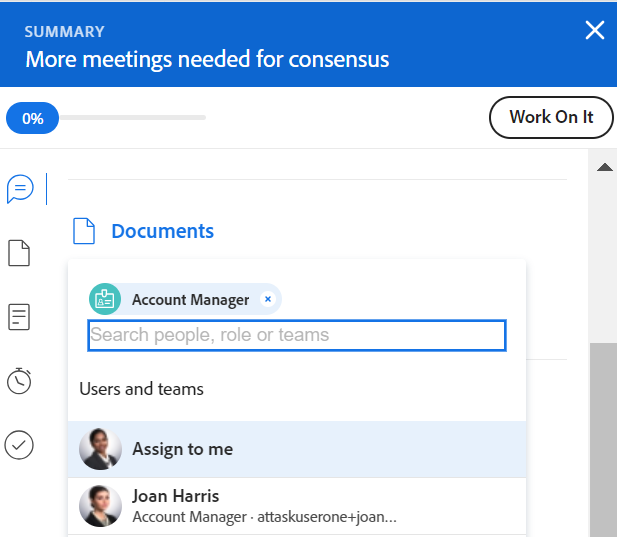

# Smart Assignments - Übersicht

<!--Audited: 07/2024-->

<!--keep the yellow around the Rate card job roles and the Preview intro for those-->

Die hervorgehobenen Informationen auf dieser Seite beziehen sich auf Funktionen, die nur in der Produktionsumgebung für Kunden verfügbar sind, die schnelle Versionen aktiviert haben.

Informationen zu Schnellversionen finden Sie unter [Aktivieren oder Deaktivieren von Schnellversionen für Ihre Organisation](/help/quicksilver/administration-and-setup/set-up-workfront/configure-system-defaults/enable-fast-release-process.md).

 Diese Funktion wird für Kunden, die die Schnellversion mit Version 25.1 im Januar 2025 aktiviert haben, aus der Produktionsumgebung entfernt. Weitere Informationen zur Version 25.1 finden Sie unter [Übersicht über die Version im ersten Quartal 2025](/help/quicksilver/product-announcements/product-releases/25-q1-release-activity/25-q1-release-overview.md).

Bei der Verwaltung von Aufgaben- und Problemzuweisungen können Sie mithilfe von Smart Assignments ermitteln, wer die beste Ressource ist, um die Arbeit abzuschließen. Smart-Zuweisungen sind Vorschläge, die Ihnen Adobe Workfront unterbreitet, wenn Sie Ressourcen Arbeitselemente auf der Grundlage eines Algorithmus zuweisen, der die am besten geeignete Ressource für den Auftrag bestimmt. Smart-Zuweisungen können Benutzer, Aufgabengebiete oder Teams sein.

>[!NOTE]
>
>Bei der Empfehlung von Benutzern berücksichtigen Smart Assignments nicht die Verfügbarkeit der Benutzer. Ihre Verfügbarkeit entsprechend ihren Zeitplänen wirkt sich jedoch auf die geplanten und geplanten Termine von Aufgaben und Problemen aus, wenn diese zugewiesen werden. Weitere Informationen zu Zeitplänen finden Sie im Artikel [Erstellen eines Zeitplans](../../../administration-and-setup/set-up-workfront/configure-timesheets-schedules/create-schedules.md).

Dieser Artikel enthält allgemeine Informationen zu Smart-Zuweisungen. Informationen zur Verwendung von Smart-Zuweisungen zum Zuweisen von Aufgaben und Problemen zu Benutzern finden Sie unter [Erstellen von Smart-Zuweisungen](../../../manage-work/tasks/assign-tasks/make-smart-assignments.md).

## Smart Assignments - Übersicht

Beachten Sie beim Arbeiten mit Smart-Zuweisungen Folgendes:

* Der Algorithmus arbeitet unabhängig für Aufgaben und Probleme. Das bedeutet, dass die Liste der empfohlenen Benutzer für Probleme möglicherweise von der Liste der empfohlenen Benutzer für eine Aufgabe abweicht, da Workfront die Listen nach Kriterien erstellt, die sich auf Probleme und Aufgaben separat beziehen. 
<!--not sure this is accurate: * Smart assignments do not recommend job roles or teams. Instead, they are suggestions of users who are best fit to complete a task or an issue. -->
* Die vorgeschlagenen Arbeitsaufträge sind immer aktive Benutzer, Aufgabengebiete oder Teams.
* Die zuerst aufgeführte Ressource sollte der Aufgabe am besten entsprechen.

## Suchen von Smart-Zuweisungsvorschlägen

Smart Assignments können in den folgenden Bereichen angezeigt werden, in denen Sie Aufgaben oder Probleme zuweisen können:

* Eine Problemliste oder ein Bericht in der Spalte „Zuweisungen“

  

* Eine Aufgabenliste oder ein Bericht in der Spalte „Zuweisungen“

  

* Eine Aufgabenkopfzeile im Feld Arbeitsaufträge

  

* Eine Anfragekopfzeile im Feld „Zuweisungen“

  

* Das Bedienfeld „Aufgaben- oder Problemzusammenfassung“ im Bereich „Zuweisungen“

  

* Das Feld Arbeitsaufträge im Feld Neue Aufgabe beim Hinzufügen einer Aufgabe zu einem Projekt

  

<!--this is not possible in the new home  - we have Summary there: 
* The Assignments field for an item listed in the Home area, when you open a task or issue

  
-->

* Lastenausgleich im Bereich Diesem Benutzer zugewiesen bei der Zuweisung einer Aufgabe oder eines Problems

  

## Kriterien für intelligente Zuweisungen

Intelligente Zuweisungen funktionieren bei Aufgaben anders als bei Problemen.

### Smart Assignments-Kriterien für Aufgaben

Die Berechnung der Smart Assignments von Aufgaben erfolgt in zwei Phasen, die zwei verschiedene Algorithmen verwenden.

Je nachdem, welcher Algorithmus die intelligente Zuweisung findet, werden die Zuweisungen unter zwei separaten Abschnitten im Feld Zuweisungen aufgeführt. Informationen finden Sie unter [Erstellen von Smart-Zuweisungen](/help/quicksilver/manage-work/tasks/assign-tasks/make-smart-assignments.md).

#### Erste Phase der intelligenten Zuweisungsberechnung für Aufgaben

In der ersten Phase der Berechnung von Smart Assignments berechnet Workfront für jede Zuweisung einen Ähnlichkeitswert.

>[!NOTE]
>
>Die erste Phase der Berechnung intelligenter Zuweisungen gilt nicht für die folgenden Aufgabenbereiche:
>
>* Massenzuweisungen im Workload Balancer.
>* Verbundene Karten auf Pinnwänden

Die Berechnung für den Ähnlichkeitswert und die Reihenfolge, in der die Zuweisungen aufgelistet sind, berücksichtigen Folgendes:

* Eine vorhandene Zuweisung, bei der die Namen von Aufgaben, Projekten und Portfolios mit der Aufgabe identisch sind, die Sie zuweisen möchten, erhält einen Wert von 100 %. Die Projekt- und Portfolionamen der Aufgabe einer vorhandenen Zuweisung müssen auch mit dem Projekt und Portfolio der Aufgabe übereinstimmen, die Sie zuweisen möchten.

* Wenn nur einige dieser Informationen aus anderen Zuweisungen zu den vorhandenen Aufgaben passen, kann der Wert unter Umständen unter 100 % liegen.

  Wenn Sie beispielsweise eine Aufgabe namens „Meine zweite Aufgabe“ einem Projekt namens „Mein Projekt“ in einem Portfolio mit der Bezeichnung „Mein Portfolio“ zuweisen und in einem Portfolio mit der Bezeichnung „Mein Portfolio“ eine vorhandene Aufgabe namens „Meine Aufgabe“ in einem anderen Projekt mit der Bezeichnung „Mein Projekt“ vorhanden ist, erhält der Benutzer, der „Meine Aufgabe“ zugewiesen ist, möglicherweise einen Wert von 95 %, da der Name der vorhandenen Aufgabe und der Aufgabe, die Sie jetzt zuweisen möchten, ähnlich sind, aber nicht identisch.

  >[!TIP]
  >
  >  Workfront sucht nur in den Feldern „Name“ von Aufgaben, Projekten und Portfolios nach Übereinstimmungen und nicht in anderen Feldern.

* Ein Arbeitsauftrag kann eine höhere Punktzahl erhalten, wenn er einer großen Anzahl von Aufgaben im System zugewiesen ist, die ähnliche Namen haben. Wenn beispielsweise ein Team mit dem Namen „Entwicklung“ zu 50 % den Aufgaben im System zugewiesen ist, das „KI“ im Namen enthält, und Sie jetzt eine andere Aufgabe mit „KI“ im Namen zuweisen, ist der Wert des Teams „Entwicklung“ höher. In diesem Fall sind die Namen von Projekten und Portfolios nicht so wichtig.

* Unter Berücksichtigung dieses Bewertungssystems werden die ersten 7 Vorschläge als Smart Assignments in absteigender Reihenfolge ihrer Bewertungen aufgeführt. Zuweisungen mit Werten unter 40 % werden nicht angezeigt.

* Wenn mehrere Zuweisungen identische Scores haben, werden sie nach dem Datum geordnet angezeigt, an dem die Zuweisungen vorgenommen wurden, beginnend mit dem letzten Datum.

  Wenn Rick beispielsweise heute früher einer ähnlichen Aufgabe zugewiesen wurde und Jennifer vor zwei Tagen einer ähnlichen Aufgabe zugewiesen wurde, wird Rick zuerst angezeigt.

* Zuweisungen, die in dieser Phase identifiziert wurden, werden in der    **Abschnitt** Vorgeschlagene Zuweisungen“ im Feld Zuweisungen für Aufgaben.

* Wenn bei dieser Berechnung keine Übereinstimmungen gefunden werden, beginnt die zweite Phase der Smart Assignments, die mit einem anderen Algorithmus berechnet wird.

#### Zweite Phase der intelligenten Zuweisungsberechnung für Aufgaben

Wenn im ersten Schritt von Smart Assignments für Aufgaben keine Übereinstimmungen gefunden wurden, berechnet Workfront Smart Assignments für Aufgaben auf dieselbe Weise, wie sie für Probleme berechnet werden.

Weitere Informationen finden Sie im Abschnitt [Smart Assignments-Kriterien für Aufgaben und Probleme](#smart-assignments-criteria-for-tasks-and-issues) in diesem Artikel.

Zuweisungen, die in dieser Phase identifiziert werden, werden in den Abschnitten **Benutzer und****, Aufgabenrollenzuweisungen** und **Tarifkartenrollen** des Felds Zuweisungen aufgeführt. Weitere Informationen zu Tarifkarten finden Sie unter [Tarifkarten verwalten](/help/quicksilver/administration-and-setup/set-up-workfront/configure-system-defaults/manage-rate-cards.md). <!--keep the rate cards roles in yellow after the release of assignments to Prod-->

### Smart Assignments-Kriterien für Aufgaben und Probleme

>[!NOTE]
>
>Die folgenden Kriterien gelten nur dann für Aufgaben, wenn in der ersten Phase der Smart-Zuweisungsberechnung keine Übereinstimmungen gefunden wurden. Weitere Informationen finden Sie im Abschnitt [Erste Phase der intelligenten Zuweisungsberechnung für Aufgaben](#first-phase-of-smart-assignment-calculation-for-tasks) in diesem Artikel. Die folgenden Kriterien gelten standardmäßig immer für Probleme.

Benutzer werden in der Dropdown-Liste Smart Assignments empfohlen, basierend auf einer Kombination der folgenden Kriterien (aufgeführt in der Reihenfolge von Wichtig bis Unwichtig):

1. Benutzer, die in den letzten 30 Tagen von dem Benutzer, der die Zuweisung vorgenommen hat, anderen Arbeitselementen zugewiesen wurden. Die ersten 50 Benutzer, die diesen Kriterien entsprechen, werden angezeigt. Der Benutzer, der am häufigsten zugewiesen wird, wird zuerst angezeigt.

2. Wenn das Arbeitselement einem Team oder einer Funktion zugewiesen ist, wird die Liste der vorgeschlagenen Benutzer unter Berücksichtigung der vorhandenen Zuweisungen unten weiter gefiltert. In diesem Fall werden in der Liste der Vorschläge nur die folgenden Benutzer angezeigt:

   * Benutzer, deren Home-Team das Team ist, das dem Arbeitselement zugewiesen ist.
   * Benutzende, deren Primäre Funktion die dem Arbeitselement zugewiesene Funktion ist.

>[!TIP]
>
>* Wenn der Aufgabe oder dem Problem keine Rolle oder kein Team zugewiesen wurde, zeigt Workfront alle Benutzenden an, die in den letzten 30 Tagen zugewiesen wurden, bis zu 50.
>
>* Wenn Sie in den letzten 30 Tagen keine Zuweisungen vorgenommen haben, werden in der Liste „Smart-Zuweisungen“ nur Benutzer angezeigt, die entweder dem zugewiesenen Team oder dem Arbeitselement die Rolle zugewiesen haben.

<!--the commented out piece in the tip above was live before but I am not totally sure that smart assignments look at your team. I think they look JUST at the team/ role assigned to the work item; see this help site request for more info: https://experience.adobe.com/#/@adobeinternalworkfront/so:hub-Hub/workfront/issue/62fd222200037eb87572c5b6ad6bf53e/overview -->
<!--

<h3>Smart assignments criteria for the Production environment</h3>

(NOTE: drafted,this was the case BEFORE we updated the logic in the WB - with the 21.4 release)

Smart assignments display on tasks and issues when the following conditions are met:

<ul>
<li>The task or issue is subordinate to a parent task or issue that has a user, team, or job role currently assigned. </li>
</ul>

Smart assignments display the top twenty recommendations based on a proprietary algorithm that uses your own team information.

Users are recommended in the smart assignments drop-down list based on a combination of the following criteria (listed in order from most important to least important):

<ul>
<li>The user has the team assigned to the task or issue designated as their Home Team</li>
<li>The user is also assigned to the parent task</li>
<li>The user has the same primary job role as is currently assigned to the task or issue</li>
<li>The user has the team assigned to the parent task or issue designated as their Home Team</li>
<li>The user is associated with the same primary job role currently assigned to the parent task</li>
<li>The user is a member of the same team as the user who assigned the task or issue and the team is designated as their Home Team</li>
<li>The user is a member of the same Home Group as the user who is assigning the task or issue</li>
<li>The user has the same primary job role as the user who is assigning the task or issue.</li>
</ul>

-->

<!--

<h2>Make smart assignments</h2>

(NOTE:&nbsp;this was moved to its own article: make-smart-assignments.) 

Smart assignments are available in most locations where you can make assignments in Workfront.

You can use smart assignments on tasks and issues that have previously been assigned to a job role or a team.
 <note type="note">
You must have a Plan or a Work license and have at least Contribute permissions to a task or an issue to be able to make assignments to the task or the issue. You must have the Make Assignments option enabled in your permission level to make assignments.
</note>

To use smart assignments:

<ol>
<li value="1">Navigate to an issue or a task and click one of the following fields to edit them:  
<ul>
<li>
The <strong>Assignments</strong> field in the task or issue header
</li>
<li>The <strong>Assignments</strong> field of a task or issue list using in-line editing in a task or issue list. </li>
<li>The <strong>Assignee</strong> field after you have clicked <strong>Advanced</strong> from a task or an issue. </li>
</ul></li>
<li value="2"> 
Place your cursor in the assignment field, and wait for two seconds, then the <strong>Suggestions</strong> list is displayed.
 
Users displayed in this list are the smart assignment suggestions for the task or the issue. 
 
  
 </li>
<li value="3"> 
Select the user in the recommendations list by clicking their name. 
 
If there are no suggestions, the suggestion list does not open.
 </li>
<li value="4">(Optional) If you do not want to use one of the recommended users from the smart assignments list, start typing the name of the desired user and select the name when it appears in the list.</li>
<li value="5">Click <strong>Enter</strong> to make the assignment. </li>
</ol>

-->
