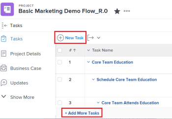

# Erstellen von Aufgaben in einem Projekt

<!-- Audited: 10/2024 -->

Sie können Aufgaben in Adobe Workfront wie folgt erstellen:

* Erstellen Sie eine Aufgabe in einem Projekt von Grund auf, nachdem das Projekt erstellt wurde.

  Nachdem Sie ein Projekt erstellt haben, können Sie Aufgaben hinzufügen und sie ändern, um den Projektplan zu organisieren. Weitere Informationen zum Erstellen eines Projekts finden Sie unter [Erstellen eines Projekts](../../../manage-work/projects/create-projects/create-project.md).

* Erstellen von Aufgaben durch Hinzufügen einer Vorlage zu einem Projekt.

  Weitere Informationen finden Sie unter [Anhängen einer Vorlage an ein Projekt](/help/quicksilver/manage-work/projects/create-and-manage-templates/attach-template-to-project.md).

* Erstellen Sie persönliche Aufgaben und verschieben Sie sie in ein Projekt.

  Sie können persönliche Aufgaben erstellen, indem Sie einen der folgenden Schritte ausführen:

   * Ad-hoc-Arbeitsauftrag erstellen und an einen Benutzer senden
   * Erstellen eines Aufgabenelements im Bereich „Startseite“

  Informationen zum Erstellen persönlicher Aufgaben, die sich nicht in einem Projekt befinden, finden Sie unter [Persönliche Aufgaben erstellen](/help/quicksilver/workfront-basics/updating-work-items-and-viewing-updates/create-personal-tasks.md).

  Sie können persönliche Aufgaben in ein Projekt verschieben und sie werden zu Arbeitsaufgaben.

In diesem Artikel wird beschrieben, wie Sie Aufgaben von Grund auf neu erstellen und persönliche Aufgaben in ein Projekt verschieben können.

Sie können Aufgaben auch wie folgt erstellen:

* Durch Kopieren oder Duplizieren vorhandener Aufgaben. Weitere Informationen finden Sie unter [Aufgaben kopieren und duplizieren](../../../manage-work/tasks/manage-tasks/copy-and-duplicate-tasks.md).
* Durch Verschieben von Aufgaben von einem Projekt in ein anderes. Weitere Informationen finden Sie unter [Aufgaben verschieben](../../../manage-work/tasks/manage-tasks/move-tasks.md).

## Zugriffsanforderungen

+++ Erweitern, um die Zugriffsanforderungen für die in diesem Artikel beschriebene Funktionalität anzuzeigen.

<table style="table-layout:auto"> 
 <col> 
 <col> 
 <tbody> 
  <tr> 
   <td role="rowheader">Adobe Workfront-Paket</td> 
   <td> 
Beliebig
 </td> 
  </tr> 
  <tr> 
   <td role="rowheader">Adobe Workfront-Lizenz</td> 
   <td> 
Standard
 
   
Work oder höher
 </td> 
  </tr> 
  <tr> 
   <td role="rowheader">Konfigurationen der Zugriffsebene</td> 
   <td> 
Zugriff auf Aufgaben und Projekte bearbeiten
 </td> 
  </tr> 
  <tr> 
   <td role="rowheader">Objektberechtigungen</td> 
   <td> 
Berechtigungen für das Projekt mit der Möglichkeit zum Hinzufügen von Aufgaben oder höher hinzufügen
 
   
Wenn Sie eine Aufgabe erstellen, erhalten Sie automatisch Verwaltungsberechtigungen für die Aufgabe
 
    </td> 
  </tr> 
 </tbody> 
</table>

Weitere Informationen finden Sie unter [Zugriffsanforderungen in der Dokumentation zu Workfront](/help/quicksilver/administration-and-setup/add-users/access-levels-and-object-permissions/access-level-requirements-in-documentation.md).

+++

<!--Old:

<table style="table-layout:auto"> 
 <col> 
 <col> 
 <tbody> 
  <tr> 
   <td role="rowheader">Adobe Workfront plan</td> 
   <td> 
Any
 </td> 
  </tr> 
  <tr> 
   <td role="rowheader"> 
Adobe Workfront license
 </td> 
   <td>
Standard
 
   
Work or higher

   </td> 
  </tr> 
  <tr> 
   <td role="rowheader">Access level configurations*</td> 
   <td> 
Edit access to Tasks and Projects
</td> 
  </tr> 
  <tr> 
   <td role="rowheader">Object permissions</td> 
   <td> 
Contribute permissions to the project with ability to Add Tasks or higher
 
When you create a task you automatically receive Manage permissions to the task
 
 For information about task permissions, see <a href="../../../workfront-basics/grant-and-request-access-to-objects/share-a-task.md" class="MCXref xref">Share a task </a>. 
 
For information on requesting additional permissions, see <a href="../../../workfront-basics/grant-and-request-access-to-objects/request-access.md" class="MCXref xref">Request access to objects. </a>
 </td> 
  </tr> 
 </tbody> 
</table>
-->

## Erstellen von Aufgaben in einem Projekt

Das Erstellen von Aufgaben in einem Projekt ähnelt dem Erstellen von Aufgaben in einer Vorlage. Gehen Sie wie folgt vor, wenn Sie einer Vorlage Vorlagenaufgaben hinzufügen.

So erstellen Sie Aufgaben in einem Projekt:

1. Wechseln Sie zu dem Projekt, in dem Sie eine Aufgabe erstellen möchten.
1. Klicken Sie **linken** auf „Aufgaben“.
1. (Bedingt) Wenn Sie die Aufgabenliste derzeit in einer Agile-Ansicht anzeigen, klicken Sie auf das **Listenansicht**-Symbol  in der oberen rechten Ecke, um die Aufgabenliste anzuzeigen.
1. (Optional) Klicken Sie auf das **Planmodus**-Symbol  Aufgabenliste) und wählen Sie **Manuelles Speichern** aus und wählen Sie dann entweder **Standard** oder **Timeline Planning**. Hiermit wird die Option **Automatisches Speichern** deaktiviert, die standardmäßig aktiviert ist.

   

   >[!TIP]
   >
   >Sie können Ihre Änderungen rückgängig machen, wenn Sie auf Manuelles Speichern klicken.

1. Erstellen Sie eine neue Aufgabe, indem Sie einen der folgenden Schritte ausführen:

   * Klicken Sie **oben** der Aufgabenliste auf „Neue Aufgabe“.
   * Klicken Sie **Weitere Aufgaben hinzufügen** unten in der Aufgabenliste.

   

1. (Bedingt) Wenn Sie auf **Neue Aufgabe** klicken, führen Sie folgende Schritte aus:

   1. Geben Sie eines der Felder in der begrenzten Liste der Felder im Feld **Neue Aufgabe** an und klicken Sie dann auf **Aufgabe erstellen**, wenn Sie schnell eine Aufgabe erstellen möchten.

      ODER

      Um alle Felder für die Aufgabe zu aktualisieren, klicken Sie auf **Weitere Optionen**, um das Feld **Aufgabe erstellen** zu öffnen.

      

      Das **Aufgabe erstellen** wird geöffnet.

      

      >[!NOTE]
      >
      >Je nachdem, wie Ihr Workfront-Administrator Ihre Layout-Vorlage einrichtet, werden in den Feldern im Feld Aufgabe erstellen möglicherweise unterschiedliche Felder in Ihrer Umgebung angezeigt. Weitere Informationen finden Sie unter [Anpassen der Detailansicht mithilfe einer Layout-Vorlage](../../../administration-and-setup/customize-workfront/use-layout-templates/customize-details-view-layout-template.md).

   1. Geben Sie Informationen zu den folgenden Bereichen im linken Bereich des Felds Aufgabe erstellen an:

      * Aufgabenname
      * Übersicht
      * Arbeitsaufträge
      * Benutzerdefinierte Formulare
      * Finanzielle Details
      * Einstellungen

        Informationen zum Definieren aller aufgabenbezogenen Felder in einer Aufgabe finden Sie unter [Aufgaben bearbeiten](../../../manage-work/tasks/manage-tasks/edit-tasks.md).

   1. (Bedingt und optional) Wenn die Aufgabe wiederkehrend sein soll, aktualisieren Sie das Feld **Wiederholungshäufigkeit**. Weitere Informationen zum Erstellen wiederkehrender Aufgaben finden Sie unter [Wiederkehrende Aufgaben erstellen](../../../manage-work/tasks/create-tasks/create-recurring-tasks.md).
   1. (Optional) Klicken Sie im **Bereich auf** Dokumente“, um ein Dokument an die neue Aufgabe anzuhängen, und klicken Sie dann auf **Dateien hinzufügen oder verknüpfen**, um der Aufgabe von Ihrem Computer oder einem anderen Dienst ein Dokument hinzuzufügen oder um Dokumente und Ordner von Ihrem Computer oder einem anderen Dienst zu verknüpfen.

1. (Bedingt) Wenn Sie in Schritt 5 auf **Weitere Aufgaben hinzufügen** geklickt haben, geben Sie die Aufgabeninformationen mithilfe der Inline-Bearbeitung ein und drücken Sie dann die Eingabetaste.

   <!--
   
(NOTE: ensure this stays accurate)

   -->

   Es wird empfohlen, diese Option insbesondere beim Hinzufügen mehrerer Aufgaben zur Liste zu verwenden.

   

1. (Bedingt) Führen Sie einen der folgenden Schritte aus:

   * Wenn Sie in Schritt 5 auf **Neue Aufgabe** geklickt haben, klicken Sie auf **Aufgabe erstellen**, um Ihre Änderungen zu speichern und die neue Aufgabe zu Ihrem Projekt hinzuzufügen.

     <!--   
     
(NOTE: is this step still right?)
   
     -->

   * Wenn Sie in **5 auf** Weitere Aufgaben hinzufügen“ geklickt haben, führen Sie folgende Schritte aus:

     <!--   
     
(NOTE: is this step still right?) 
   
     -->

      1. Klicken Sie auf eine beliebige Stelle im Browser, um Ihre Änderungen zu übermitteln, oder drücken Sie die Eingabetaste.
      1. (Optional) Wählen Sie in der Aufgabenliste die neu erstellte Aufgabe aus und klicken Sie dann auf **Einzug**.

         Dadurch wird die neue Aufgabe zu einer untergeordneten Aufgabe oder Teilaufgabe der vorherigen Aufgabe.

         Weitere Informationen zu untergeordneten Aufgaben finden Sie im Abschnitt „Erstellen von Teilaufgaben aus dem Abschnitt „Teilaufgaben“ im Artikel [Erstellen von Teilaufgaben](/help/quicksilver/manage-work/tasks/create-tasks/create-subtasks.md).

      1. (Bedingt) Wenn Sie die Option **Automatisches Speichern** nach dem Drücken von **Weitere Aufgaben hinzufügen** deaktiviert haben, können Sie Folgendes tun:

         * Klicken Sie **jederzeit auf** Rückgängig“, um Ihre letzte Änderung rückgängig zu machen, oder auf **Abbrechen**, um alle an der Aufgabenliste vorgenommenen Änderungen rückgängig zu machen.
         * Wenn Sie zuvor auf **Rückgängig** geklickt haben, klicken Sie auf **Wiederholen**, um die letzte Änderung, die Sie abgebrochen haben, erneut anzuwenden.
         * Klicken Sie **Speichern**, um Ihre Änderungen an der Aufgabenliste zu speichern.
   1. (Optional) Klicken Sie in einer Aufgabenliste auf den Abschnitt **Vorgänger**, um der Aufgabe Vorgänger hinzuzufügen. Weitere Informationen finden Sie unter [Erstellen einer Vorgängerbeziehung im Bereich Vorgänger](/help/quicksilver/manage-work/tasks/use-prdcssrs/create-predecessors-in-predecessors-area.md).
   1. (Optional) Klicken Sie in einer Aufgabenliste auf den Abschnitt **Teilaufgaben**, um untergeordnete Aufgaben hinzuzufügen. Weitere Informationen finden Sie unter [Erstellen von Teilaufgaben](/help/quicksilver/manage-work/tasks/create-tasks/create-subtasks.md).

## Erstellen von Aufgaben durch Verschieben einer persönlichen Aufgabe in ein Projekt

1. (Bedingt) Stellen Sie sicher, dass Sie oder andere Benutzer persönliche Aufgaben erstellt haben.

   Weitere Informationen finden Sie unter [Persönliche Aufgaben erstellen](/help/quicksilver/workfront-basics/updating-work-items-and-viewing-updates/create-personal-tasks.md).
1. Erstellen Sie einen Filter für persönliche Aufgaben und wenden Sie ihn auf einen Aufgabenbericht oder eine Aufgabenliste an.

   Weitere Informationen finden Sie [Filter: Persönliche Aufgaben](/help/quicksilver/reports-and-dashboards/reports/custom-view-filter-grouping-samples/filter-personal-tasks.md).

   
1. Klicken Sie im Bericht zur persönlichen Aufgabe auf einen Aufgabennamen, um ihn zu öffnen.

   Workfront speichert persönliche Aufgaben in einem nicht aufgelisteten persönlichen Projekt, das immer nach diesem Muster benannt wird: &quot;&lt; vollständiger Name des Benutzers > Aufgaben des Benutzers. Ein persönliches Projekt könnte z. B. „Ricks Aufgaben“ heißen.

1. Klicken Sie auf der Aufgabenseite auf das Menü **Mehr**  und dann auf **Verschieben**. Weitere Informationen zum Verschieben von Aufgaben finden Sie unter [Aufgaben verschieben](/help/quicksilver/manage-work/tasks/manage-tasks/move-tasks.md).

   Nachdem Sie die Aufgabe verschoben haben, wird die Aufgabe für das ausgewählte Projekt angezeigt. Die Zeitleiste des Projekts ist möglicherweise von der Zeitleiste der neuen Aufgabe betroffen.
