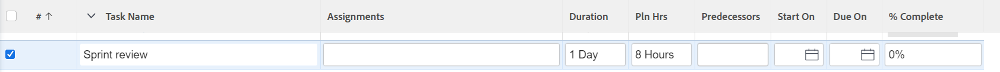

# Erstellen von Aufgaben in einem Projekt

<!-- Audited: 1/2024 -->

Sie können Aufgaben in einem Projekt erst erstellen, nachdem Sie das Projekt erstellt haben.

Beispielsweise können Sie nach der Erstellung eines Projekts Aufgaben hinzufügen und ändern, um den Projektplan zu organisieren. Weitere Informationen zum Erstellen eines Projekts finden Sie unter [Erstellen eines Projekts](../../../manage-work/projects/create-projects/create-project.md).

<!--Not possible anymore, after new Home: For information about creating personal tasks that are not in a project, see the [Create a personal task](../../../workfront-basics/using-home/using-the-home-area/create-work-items-in-home.md#create-a-personal-task) section in the article [Create work items and projects from the Home area](../../../workfront-basics/using-home/using-the-home-area/create-work-items-in-home.md).-->

In diesem Artikel wird beschrieben, wie Sie Aufgaben von Grund auf neu erstellen. Sie können Aufgaben auch wie folgt erstellen:

* Durch Kopieren oder Duplizieren vorhandener Aufgaben. Weitere Informationen finden Sie unter [Kopieren und Duplizieren von Aufgaben](../../../manage-work/tasks/manage-tasks/copy-and-duplicate-tasks.md).
* durch Verschieben von Aufgaben von einem Projekt in ein anderes. Weitere Informationen finden Sie unter [Verschieben von Aufgaben](../../../manage-work/tasks/manage-tasks/move-tasks.md).

## Zugriffsanforderungen

+++ Erweitern Sie , um die Zugriffsanforderungen für die Funktionalität in diesem Artikel anzuzeigen.

<table style="table-layout:auto"> 
 <col> 
 <col> 
 <tbody> 
  <tr> 
   <td role="rowheader">Adobe Workfront-Abo</td> 
   <td> 
Alle
 </td> 
  </tr> 
  <tr> 
   <td role="rowheader"> 
Adobe Workfront-Lizenz
 </td> 
   <td>
Aktuell: Arbeit oder höher
 
   Oder
   
Neu: Standard
 </td> 
  </tr> 
  <tr> 
   <td role="rowheader">Konfigurationen auf Zugriffsebene*</td> 
   <td> 
Zugriff auf Aufgaben und Projekte bearbeiten
</td> 
  </tr> 
  <tr> 
   <td role="rowheader">Objektberechtigungen</td> 
   <td> 
Contribute-Berechtigungen für das Projekt mit der Möglichkeit, Aufgaben hinzuzufügen oder höher
 
Wenn Sie eine Aufgabe erstellen, erhalten Sie automatisch Verwaltungsberechtigungen für die Aufgabe
 
 Weitere Informationen zu Aufgabenberechtigungen finden Sie unter <a href="../../../workfront-basics/grant-and-request-access-to-objects/share-a-task.md" class="MCXref xref">Aufgabe freigeben </a>. 
 
Informationen zum Anfordern zusätzlicher Berechtigungen finden Sie unter <a href="../../../workfront-basics/grant-and-request-access-to-objects/request-access.md" class="MCXref xref">Anfordern des Zugriffs auf Objekte </a>.
 </td> 
  </tr> 
 </tbody> 
</table>

Weitere Informationen zu den Informationen in dieser Tabelle finden Sie unter [Zugriffsanforderungen in der Workfront-Dokumentation](/help/quicksilver/administration-and-setup/add-users/access-levels-and-object-permissions/access-level-requirements-in-documentation.md).

+++

## Erstellen von Aufgaben in einem Projekt

1. Wechseln Sie zu dem Projekt, in dem Sie eine Aufgabe erstellen möchten.
1. Klicken Sie im linken Bereich auf **Aufgaben** .
1. (Bedingt) Wenn Sie die Aufgabenliste derzeit in einer agilen Ansicht anzeigen, klicken Sie oben rechts auf das Symbol **Listenansicht**  , um die Aufgabenliste anzuzeigen.
1. (Optional) Klicken Sie auf das Symbol &quot;**Planmodus**&quot; und wählen Sie &quot;**Manuelles Speichern**&quot;. Wählen Sie dann entweder &quot;**Standard**&quot;oder &quot;**Timeline-Planung**&quot;. Dadurch wird die standardmäßig aktivierte Option **Autosave** deaktiviert.

   

   >[!TIP]
   >
   >Sie können Ihre Änderungen rückgängig machen, wenn Sie Manuelles Speichern auswählen.

1. Erstellen Sie eine neue Aufgabe, indem Sie einen der folgenden Schritte ausführen:

   * Klicken Sie oben in der Aufgabenliste auf **Neue Aufgabe** .
   * Klicken Sie unten in der Aufgabenliste auf **Weitere Aufgaben hinzufügen** .

   

1. (Bedingt) Wenn Sie auf **Neue Aufgabe** geklickt haben, gehen Sie wie folgt vor:

   1. Geben Sie eines der Felder in der beschränkten Liste von Feldern im Feld **Neue Aufgabe** an und klicken Sie dann auf **Aufgabe erstellen** , wenn Sie eine Aufgabe schnell erstellen möchten.

      Oder

      Um alle Felder für die Aufgabe zu aktualisieren, klicken Sie auf **Mehr Optionen** , um das Feld **Aufgabe erstellen** zu öffnen.

      

      Das Feld **Aufgabe erstellen** wird geöffnet.

      

       

      >[!NOTE]
      >
      >Je nachdem, wie Ihr Workfront-Administrator unsere Layoutvorlage eingerichtet hat, werden in den Feldern im Feld &quot;Aufgabe erstellen&quot;möglicherweise verschiedene Felder in Ihrer Umgebung angezeigt. Weitere Informationen finden Sie unter [Anpassen der Detailansicht mithilfe einer Layoutvorlage](../../../administration-and-setup/customize-workfront/use-layout-templates/customize-details-view-layout-template.md).

   1. Geben Sie Informationen für die folgenden Bereiche im linken Bereich des Felds Aufgabe erstellen an:

      * Aufgabenname
      * Übersicht
      * Arbeitsaufträge
      * Benutzerdefinierte Formulare
      * Finanzielle Details
      * Einstellungen

        Informationen zum Definieren aller Aufgabenfelder für eine Aufgabe finden Sie unter [Aufgaben bearbeiten](../../../manage-work/tasks/manage-tasks/edit-tasks.md).

   1. (Bedingt und optional) Wenn die Aufgabe wiederkehrend sein soll, aktualisieren Sie das Feld **Häufigkeit der Wiederholung** . Weitere Informationen zum Erstellen wiederkehrender Aufgaben finden Sie unter [Erstellen wiederkehrender Aufgaben](../../../manage-work/tasks/create-tasks/create-recurring-tasks.md).
   1. (Optional) Klicken Sie im linken Bereich auf **Dokumente** , um ein Dokument an die neue Aufgabe anzuhängen, und klicken Sie dann auf **Dateien hinzufügen oder verknüpfen** , um ein Dokument von Ihrem Computer oder einem anderen Dienst zur Aufgabe hinzuzufügen oder Dokumente und Ordner von Ihrem Computer oder einem anderen Dienst zu verknüpfen.

1. (Bedingt) Wenn Sie in Schritt 5 auf &quot;**Weitere Aufgaben hinzufügen**&quot;geklickt haben, geben Sie die Aufgabeninformationen über die Inline-Bearbeitung ein und drücken Sie die Eingabetaste.

   <!--
   
(NOTE: ensure this stays accurate)

   -->

   Es wird empfohlen, diese Option insbesondere beim Hinzufügen mehrerer Aufgaben zur Liste zu verwenden.

   

1. (Bedingt) Führen Sie einen der folgenden Schritte aus:

   * Wenn Sie in Schritt 5 auf **Neue Aufgabe** geklickt haben, klicken Sie auf **Aufgabe erstellen** , um Ihre Änderungen zu speichern und die neue Aufgabe zu Ihrem Projekt hinzuzufügen.

     <!--   
     
(NOTE: is this step still right?)
   
     -->

   * Wenn Sie in Schritt 5 auf **Weitere Aufgaben hinzufügen** geklickt haben, gehen Sie wie folgt vor:

     <!--   
     
(NOTE: is this step still right?) 
   
     -->

      1. Klicken Sie auf eine beliebige Stelle im Browser, um Ihre Änderungen zu senden, oder drücken Sie die Eingabetaste.
      1. (Optional) Wählen Sie in der Aufgabenliste die neu erstellte Aufgabe aus und klicken Sie dann auf **Einzug**.

         Dadurch wird die neue Aufgabe zu einer untergeordneten Aufgabe oder Unteraufgabe der vorherigen Aufgabe.

         Weitere Informationen zu untergeordneten Aufgaben finden Sie unter [Unteraufgaben erstellen](/help/quicksilver/manage-work/tasks/create-tasks/create-subtasks.md).

      1. (Bedingt) Wenn Sie die Option **Autosave** nach dem Drücken von **Add More Tasks** deaktiviert haben, können Sie Folgendes tun:

         * Klicken Sie jederzeit auf **Rückgängig** , um Ihre letzte Änderung rückgängig zu machen, oder auf **Abbrechen** , um alle Änderungen rückgängig zu machen, die Sie an der Aufgabenliste vorgenommen haben.
         * Wenn Sie zuvor auf **Rückgängig** geklickt haben, klicken Sie auf **Wiederholen** , um die letzte Änderung, die Sie abgebrochen haben, erneut anzuwenden.
         * Klicken Sie auf **Speichern** , um Ihre Änderungen in der Aufgabenliste zu speichern.
