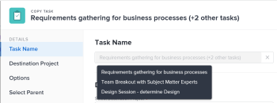

# Aufgaben kopieren und duplizieren

Sie können eine Aufgabe aus einem Projekt in ein anderes Projekt kopieren oder innerhalb desselben Projekts duplizieren.

Sie können eine oder mehrere Aufgaben oder übergeordnete Aufgaben gleichzeitig kopieren oder duplizieren.

## Zugriffsanforderungen

+++ Erweitern, um die Zugriffsanforderungen für die in diesem Artikel beschriebene Funktionalität anzuzeigen. 

<table style="table-layout:auto"> 
 <col> 
 <col> 
 <tbody> 
  <tr> 
   <td role="rowheader">Adobe Workfront-Paket</td> 
   <td> 
Beliebig
 </td> 
  </tr> 
  <tr> 
   <td role="rowheader">Adobe Workfront-Lizenz</td> 
   <td> 
Standard
 
   
Work oder höher
 </td> 
  </tr> 
  <tr> 
   <td role="rowheader">Konfigurationen der Zugriffsebene</td> 
   <td> 
Zugriff auf Aufgaben und Projekte bearbeiten
</td> 
  </tr> 
  <tr> 
   <td role="rowheader">Objektberechtigungen</td> 
   <td> 
Verwalten der Berechtigungen für eine Aufgabe
 
Mitwirken an oder höhere Berechtigungen für das Projekt
 
   </td> 
  </tr> 
 </tbody> 
</table>

Weitere Informationen finden Sie unter [Zugriffsanforderungen in der Dokumentation zu Workfront](/help/quicksilver/administration-and-setup/add-users/access-levels-and-object-permissions/access-level-requirements-in-documentation.md).

+++

<!--Old:

<table style="table-layout:auto"> 
 <col> 
 <col> 
 <tbody> 
  <tr> 
   <td role="rowheader">Adobe Workfront plan*</td> 
   <td> 
Any 
 </td> 
  </tr> 
  <tr> 
   <td role="rowheader">Adobe Workfront license*</td> 
   <td> 
Current license: Standard
 
   Or
   
Legacy license: Work or higher 
 </td> 
  </tr> 
  <tr> 
   <td role="rowheader">Access level configurations*</td> 
   <td> 
Edit access to Tasks and Projects
 
<b>NOTE</b>
   
   If you still don't have access, ask your Workfront administrator if they set additional restrictions in your access level. For information on how a Workfront administrator can modify your access level, see <a href="../../../administration-and-setup/add-users/configure-and-grant-access/create-modify-access-levels.md" class="MCXref xref">Create or modify custom access levels</a>.
 </td> 
  </tr> 
  <tr> 
   <td role="rowheader">Object permissions</td> 
   <td> 
Manage permissions to a task
 
Contribute or higher permissions to the project
 
   
For information on requesting additional access, see <a href="../../../workfront-basics/grant-and-request-access-to-objects/request-access.md" class="MCXref xref">Request access to objects </a>.
 </td> 
  </tr> 
 </tbody> 
</table>-->

## Überlegungen zum Kopieren von Aufgaben

Beachten Sie beim Kopieren einer Aufgabe Folgendes:

* Wenn Sie eine Aufgabe von einem Projekt in ein anderes kopieren, werden die Aufgabentermine möglicherweise neu berechnet. Bei der Neuberechnung werden der Zeitplan, den das neue Projekt verwendet, und die Zeitplaninformationen des Projekts aus berücksichtigt.
* Benutzerdefinierte Formulare werden mit der Aufgabe kopiert. Die Informationen in den benutzerdefinierten Feldern werden nur dann an die kopierten Aufgaben übertragen, wenn Sie beim Kopieren der Aufgabe die Option Benutzerdefinierte Daten kopieren auswählen.
* Sie haben während des Kopiervorgangs die Möglichkeit, einige mit der Aufgabe verknüpfte Elemente in die kopierte Aufgabe zu kopieren. Standardmäßig werden die folgenden Objekte jedoch nicht an die kopierte Aufgabe übertragen:
   * Probleme
   * Protokollierte Stunden
   * &#x200B;<!--not sure about this, enable only if requested by users and verified by Product: System activity comments transfer to the new task if they relate to information that you specifically select to be copied. For example, if you select to copy Expenses to the new task, system comments that identify adding expenses to the task will transfer to the copied task. --> der Benutzerkommentare
* Die folgenden Elemente werden standardmäßig zur kopierten Aufgabe verschoben:

   * Meilensteine werden auf die kopierte Aufgabe übertragen und aus der ursprünglichen Aufgabe entfernt.
   * Teilaufgaben werden auf die neue Aufgabe übertragen.

* Sie können jeweils nur eine Aufgabe kopieren oder mehrere Aufgaben gleichzeitig kopieren, wenn Sie Aufgaben in einer Liste bearbeiten.

## Aufgaben in eine Liste kopieren {#copy-tasks-in-a-list}

1. Wechseln Sie zu dem Projekt, das die Aufgabe(n) enthält, die Sie kopieren möchten.

   ODER

   Zu einem Aufgabenbericht wechseln.

1. (Bedingt) Klicken Sie **linken** auf „Aufgaben“, wenn Sie das Projekt geöffnet haben, das die Aufgaben enthält.
1. Klicken Sie auf das **Planmodus**-Symbol  und stellen Sie sicher, dass die Option **Automatisches Speichern** aktiviert ist.

   

   >[!IMPORTANT]
   >
   >Sie können Aufgaben nur dann in eine Liste kopieren, wenn Sie Ihre Änderungen automatisch speichern. Informationen zum Speichern von Optionen beim Bearbeiten von Aufgaben finden Sie unter [Bearbeiten von Aufgaben in einer Liste](../../../manage-work/tasks/manage-tasks/edit-tasks-in-a-list.md).

1. Wählen Sie die Aufgabe(n) aus, die Sie kopieren möchten, und führen Sie einen der folgenden Schritte aus:

   * Klicken Sie oben **der Aufgabenliste** das Menü „Mehr“ und dann auf **Kopieren nach**.
   * Klicken Sie mit der rechten Maustaste auf die ausgewählten Aufgaben und dann auf **Kopieren nach**.
   * Klicken Sie bei der Auswahl einer Aufgabe auf das **Mehr** Menü  Aufgabenliste neben dem Aufgabennamen in der Liste und klicken Sie dann auf **Kopieren nach**.

   

1. Fahren Sie mit dem Kopieren der Aufgabe fort, wie im Abschnitt [Kopieren einer Aufgabe auf Aufgabenebene](#copy-a-task-at-the-task-level) beschrieben, beginnend mit Schritt 4.

   <!--
      (NOTE: is this still accurate?!)
   -->

## Kopieren einer Aufgabe auf Aufgabenebene {#copy-a-task-at-the-task-level}

Sie können Aufgaben nicht nur in eine Aufgabenliste kopieren, sondern auch nach dem Öffnen einer Aufgabe kopieren.

1. Suchen Sie nach einer Aufgabe in Ihrem Workfront-System.
1. Klicken Sie auf den Namen der Aufgabe, um sie zu öffnen.
1. Klicken Sie auf **Mehr** Dropdown-Menü  neben dem Namen der Aufgabe und dann auf **Kopieren nach**.

   

   Das Feld Aufgabe kopieren wird angezeigt.

1. (Optional) Aktualisieren Sie den **Aufgabennamen**.

   >[!TIP]
   >
   >Dieses Feld ist abgeblendet und kann nicht bearbeitet werden, wenn mehrere Aufgaben in einer Liste kopiert werden sollen. Sie können den Mauszeiger über das Feld Aufgabenname bewegen, und eine Liste aller ausgewählten Aufgaben wird angezeigt.
   >
   >

1. Geben Sie den Namen des **Zielprojekts** in das Feld **Zielprojekt auswählen** ein, in das Sie die Aufgabe kopieren möchten.

   >[!TIP]
   >
   >* Beim Namen des Projekts wird zwischen Groß- und Kleinschreibung unterschieden.
   >* Sie können auch mit der Eingabe der Referenznummer beginnen oder die ID des Projekts eingeben. Auf diese Weise können Sie zwischen Projekten mit identischen Namen unterscheiden.
   >* In der Liste werden nur 100 Projekte angezeigt.

   Standardmäßig wird der aktuelle Projektname angezeigt. Wenn Sie die Aufgabe innerhalb desselben Projekts kopieren möchten, lassen Sie dieses Feld unverändert.

1. (Bedingt) Klicken Sie auf **Zugriff anfordern**, um Zugriff auf das Projekt anzufordern, wenn Sie keinen Zugriff auf das ausgewählte Projekt haben.
1. (Bedingt) Kopieren Sie die Aufgabe weiterhin in das ausgewählte Zielprojekt, ohne Zugriff anzufordern, wenn Sie Zugriff zum Hinzufügen von Aufgaben zu einer der Aufgaben im Zielprojekt haben.

   

   >[!TIP]
   >
   >Ähnliche Meldungen werden angezeigt, wenn das ausgewählte Projekt ausstehend, genehmigt, abgeschlossen oder eingestellt ist und der Workfront-Administrator das Hinzufügen von Aufgaben zu diesen Projekten verhindert. Weitere Informationen finden Sie unter [Systemweite Projektvoreinstellungen konfigurieren](../../../administration-and-setup/set-up-workfront/configure-system-defaults/set-project-preferences.md).

1. Klicken Sie **linken** auf „Optionen“ und heben Sie dann die Auswahl der Aufgabenattribute auf, die Sie nicht mit der Aufgabe kopieren möchten. Alle Optionen sind standardmäßig ausgewählt.

   >[!TIP]
   >
   >Wenn Sie auswählen und **Alle auswählen** wird die Auswahl aller Optionen aufgehoben.

   Deaktivieren Sie die Auswahl aus den folgenden Optionen, um sie nicht auf die kopierte Aufgabe zu übertragen. In der folgenden Tabelle wird beschrieben, was passiert, wenn die Optionen deaktiviert sind:

   <table style="table-layout:auto"> 
    <col> 
    <col> 
    <tbody> 
     <tr> 
      <td role="rowheader">Beschränkung</td> 
      <td> 
Die Aufgabenbeschränkung wird auf So bald wie möglich oder So spät wie möglich basierend auf der Einstellung des Projektzeitplanmodus festgelegt.
 
 Wenn diese Option aktiviert ist, wird die aktuelle Einschränkung der Aufgabe auf die kopierte Aufgabe übertragen. 
 
Hinweis: Wenn ein Vorgang mit datumsspezifischen Einschränkungen in ein anderes Projekt verschoben oder kopiert wird und die Einschränkungstermine des Vorgangs außerhalb der Termine des neuen Projekts liegen, wird entweder die Aufgabenbeschränkung auf „So bald wie möglich“ oder „So spät wie möglich“ geändert oder die geplanten Start- oder Abschlussdaten der Projekte werden angepasst. Einige Beispiele für datumsspezifische Einschränkungen sind „Muss beginnen am“, „Muss enden am“, „Nicht früher als“, „Start nicht später als“ usw. Informationen zu Aufgabenbeschränkungen und dazu, wie sich Vorgangseinschränkungen oder Projekttermine auswirken können, finden Sie unter <a href="../../../manage-work/tasks/task-constraints/task-constraint-overview.md" class="MCXref xref">Übersicht über </a> Aufgabenbeschränkung“. Suchen Sie nach einer bestimmten Einschränkung.
 </td> 
     </tr> 
     <tr> 
      <td role="rowheader">Arbeitsaufträge</td> 
      <td> 
Alle Zuweisungen werden aus der Aufgabe entfernt. 
 </td> 
     </tr> 
     <tr> 
      <td role="rowheader">Genehmigungsprozess</td> 
      <td>Alle Genehmigungsprozesse werden aus der Aufgabe entfernt.</td> 
     </tr> 
     <tr> 
      <td role="rowheader">Fortschritt</td> 
      <td>Der Aufgabenstatus ist Neu. Andernfalls behält die kopierte Aufgabe den Status der vorhandenen Aufgabe bei.</td> 
     </tr> 
     <tr> 
      <td role="rowheader">Finanzinformationen</td> 
      <td>Die Finanzinformationen für die Aufgabe werden entfernt.</td> 
     </tr> 
     <tr> 
      <td role="rowheader">Alle Vorgänger</td> 
      <td> 
Das bedeutet, dass die Abhängigkeiten nicht auf die kopierten Aufgaben übertragen werden. 
 
Wenn diese Option aktiviert ist, werden die Vorgänger innerhalb der Gruppe kopierter Aufgaben beibehalten, andere werden gelöscht.
 </td> 
     </tr> 
     <tr> 
      <td role="rowheader">Dokumente</td> 
      <td> 
Die an die Aufgabe angehängten Dokumente werden nicht an die kopierte Aufgabe übertragen. Dazu gehören Versionen, Testsendungen und verknüpfte Dokumente.
 
Dies umfasst keine Dokumentengenehmigungen. Dokumentgenehmigungen können beim Kopieren einer Aufgabe niemals kopiert werden.
 </td> 
     </tr> 
     <tr> 
      <td role="rowheader">Erinnerungsnachrichten</td> 
      <td>Die Aufgabenerinnerungen werden nicht an die kopierte Aufgabe übertragen. </td> 
     </tr> 
     <tr> 
      <td role="rowheader">Ausgaben</td> 
      <td>Die für die Aufgabe protokollierten Ausgaben werden nicht auf die kopierte Aufgabe übertragen. </td> 
     </tr> 
     <tr> 
      <td role="rowheader">Berechtigungen</td> 
      <td>Workfront entfernt die Namen aller Entitäten, die in der Freigabeliste der Aufgabe angezeigt werden. </td> 
     </tr> 
     <tr> 
      <td role="rowheader">Benutzerdefinierte Daten</td> 
      <td> 
Die Werte für die benutzerdefinierten Felder werden gelöscht und die benutzerdefinierten Formulare werden an die kopierte Aufgabe übertragen. 
 
Wenn diese Option aktiviert ist, werden sowohl die Formulare als auch die Werte für die benutzerdefinierten Felder an die kopierte Aufgabe übertragen. 
 </td> 
     </tr> 
    </tbody> 
   </table>

1. (Optional) Klicken Sie **linken Bereich auf**&#x200B;Übergeordnetes Element auswählen) und wählen Sie dann die Aufgabe im Zielprojekt aus, die Sie zum übergeordneten Element der kopierten Aufgabe werden möchten.

   >[!TIP]
   >
   >Wenn Sie auswählen, dass mehrere Aufgaben in einer Liste kopiert werden sollen, werden alle ausgewählten Aufgaben zu untergeordneten Aufgaben des ausgewählten übergeordneten Elements.

   Wählen Sie ein übergeordnetes Element aus, indem Sie einen der folgenden Schritte ausführen:

   * Wählen Sie in der Aufgabenliste eines der übergeordneten Elemente im Projektplan aus.
   * Klicken Sie auf das Suchsymbol  und suchen Sie nach einer übergeordneten Aufgabe anhand des Namens.

   Die Aufgabe wird in der Liste angezeigt.

   

1. Wählen Sie das Optionsfeld für das übergeordnete Element aus, nachdem Sie es gefunden haben.

   Wenn Sie keine übergeordnete Aufgabe auswählen, werden die Aufgaben als Hauptaufgaben anstatt als Teilaufgaben kopiert und an das Ende der Aufgabenliste im Zielprojekt gesetzt.

1. Klicken Sie auf **Aufgabe kopieren**

   ODER

   Klicken Sie **Aufgaben kopieren** wenn Sie mehrere Aufgaben in einer Liste auswählen.
Die kopierten Aufgaben befinden sich nun im angegebenen Projekt und sind entweder Teilaufgaben der ausgewählten übergeordneten Aufgabe oder die letzten Aufgaben im Projekt.

## Aufgaben duplizieren

Sie können eine Aufgabe schnell in einer Aufgabenliste duplizieren, wenn Sie eine identische Aufgabe für dasselbe Projekt benötigen.

* [Überlegungen zum Duplizieren von Aufgaben](#considerations-for-duplicating-tasks)
* [Aufgaben duplizieren](#duplicate-tasks)

### Überlegungen zum Duplizieren von Aufgaben {#considerations-for-duplicating-tasks}

* Sie können eine Aufgabe in einer Aufgabenliste nur duplizieren, wenn die Liste nach Aufgabennummer sortiert ist.
* Die neue Aufgabe hat denselben Namen wie die ursprüngliche Aufgabe.
* Es kann nicht ausgewählt werden, welche Informationen für die neue Aufgabe dupliziert werden sollen. Fast alle Informationen aus der ursprünglichen Aufgabe werden standardmäßig an die duplizierte Aufgabe übertragen, einschließlich der übergeordneten Beziehung.
* Die folgenden Elemente werden nicht auf die neue Aufgabe übertragen:

   * Protokollierte Stunden
   * Anmerkungen
   * Probleme
   * Nur die Vorgänger, die derselben Gruppe kopierter Aufgaben angehören, werden ebenfalls mit ihren Nachfolgeaufgaben kopiert.

     **BEISPIEL**

     Wenn Sie z. B. Aufgabe 2 und ihren Vorgänger, Aufgabe 1, gleichzeitig kopieren, verfügen Sie über eine Kopie von Aufgabe 2 und eine Kopie von Aufgabe 1. Die Kopie von Aufgabe 1 ist der Vorgänger der Kopie von Aufgabe 2. Wenn Sie jedoch nur Aufgabe 2 kopieren, ohne den Vorgänger zu kopieren, hat die Kopie keinen Vorgänger.

* Wenn Sie eine übergeordnete Aufgabe duplizieren, werden auch alle untergeordneten Aufgaben dupliziert, selbst wenn die untergeordneten Aufgaben nicht ausgewählt sind.
* Sie können eine oder mehrere Aufgaben gleichzeitig duplizieren.

  Es ist jedoch nicht möglich, mehrere Aufgaben zu duplizieren, die nicht gleichzeitig sequenziell sind.

* Meilensteine werden in die neue Aufgabe verschoben und aus der ursprünglichen Aufgabe entfernt.

### Aufgaben duplizieren

1. Wechseln Sie zu dem Projekt, das die Aufgabe(n) enthält, die Sie duplizieren möchten.
1. Klicken Sie **linken** auf „Aufgaben“.
1. Führen Sie einen der folgenden Schritte aus:

   * (Bedingt) Klicken Sie auf das Symbol **Planungsmodus** ( und stellen Sie sicher, dass die Option **Automatisches Speichern** aktiviert ist, wählen Sie die Aufgaben aus, die Sie duplizieren möchten, und klicken Sie dann auf das Menü **Mehr** > **Duplizieren**.

     

   * (Bedingt) Klicken Sie auf das Symbol **Planungsmodus** ( > **Manuelles Speichern** > **Standard** oder **Timeline Planning** und führen Sie dann einen der folgenden Schritte aus:

      1. Wählen Sie die Aufgabe(n) aus, die Sie duplizieren möchten, und klicken Sie auf **Duplizieren**.
      1. (Optional) Klicken Sie auf **Rückgängig**, um Ihre Änderungen rückgängig zu machen und die Aufgaben nicht zu duplizieren.
      1. (Optional und bedingt) Klicken Sie auf **Wiederholen** wenn Sie zuvor auf **Rückgängig** geklickt hatten, um die Änderungen beizubehalten und die Aufgaben zu duplizieren.

      1. Klicken Sie **Speichern**, um Ihre Änderungen zu speichern.

         Die Aufgaben werden dupliziert und demselben Projekt wie die ursprünglichen Aufgaben hinzugefügt.
