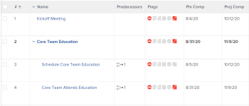
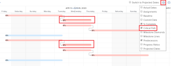
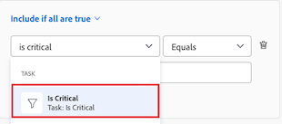

# Überblick über den kritischen Projektpfad

<!-- Audited: 5/2025 -->

Das Bestimmen des kritischen Pfads eines Projekts ist eine automatische Möglichkeit für Adobe Workfront, eine Abfolge von Aufgaben in einem Projekt zu kennzeichnen, die sich auf die Zeitleiste des Projekts auswirken können. Aufgaben, die sich auf die Zeitleiste des Projekts auswirken können, werden als Aufgaben des kritischen Pfads gekennzeichnet.

Die folgenden Funktionen können sich auf den kritischen Pfad eines Projekts auswirken:

* Die Projektstrukturplan-Struktur.

  Weitere Informationen finden Sie unter [Bestimmen der Projektstrukturaufschlüsselung in einem Projekt](../../../manage-work/projects/planning-a-project/determine-project-work-breakdown-structure.md).

* Die Zeit (Dauer), die zum Abschluss jeder Aufgabe benötigt wird.
* Die Abhängigkeiten zwischen den Aufgaben.

  Beachten Sie Folgendes:

   * Wenn eine Aufgabe auf dem kritischen Pfad eine Vorgängerbeziehung hat, befinden sich ihre Vorgänger und Nachfolger auch auf dem kritischen Pfad, wenn sich die Änderungen am Datum der Vorgänger oder Nachfolger direkt auf ihre Angehörigen auswirken.

     >[!TIP]
     >
     >Wenn sich das Nachfolgedatum einer Aufgabe nicht direkt auf das Datum der von ihr abhängigen Aufgaben oder das Projektdatum auswirkt, befindet sich die Nachfolgeaufgabe nicht auf dem kritischen Pfad.
     >
     >
     > >
     >

   * Wenn eine Teilaufgabe als Aufgabe vom Typ „Kritischer Pfad“ identifiziert wird, wird die übergeordnete Aufgabe auch als Aufgabe vom Typ „Kritischer Pfad“ identifiziert, wenn das voraussichtliche Startdatum und die Uhrzeit der übergeordneten Aufgabe mit der Zeit der Teilaufgabe übereinstimmen.

Unter Berücksichtigung dieser Funktionen berechnet das System den kritischen Pfad anhand des längsten Pfads zwischen der frühesten Aufgabe und der Aufgabe, die das Ende des Projekts bestimmt. Bei der Berechnung des kritischen Pfads wird der früheste und letzte Zeitpunkt berücksichtigt, zu dem jede Aufgabe gestartet und beendet werden kann, ohne dass das Projekt verlängert wird. Dieser Prozess bestimmt, welche Aufgaben „kritisch“ sind (und zum längsten Pfad gehören) und welche den „Total Float“ haben (kann verzögert werden, ohne das Projekt zu verlängern).

Jede Verzögerung bei der Aktivität einer Aufgabe auf dem kritischen Pfad wirkt sich direkt auf das voraussichtliche Abschlussdatum des Projekts aus (es gibt keinen Gleitkommazahl auf dem kritischen Pfad).

## Zugriffsanforderungen

+++ Erweitern, um die Zugriffsanforderungen für die in diesem Artikel beschriebene Funktionalität anzuzeigen.

<table style="table-layout:auto"> 
 <col> 
 <col> 
 <tbody> 
  <tr> 
   <td role="rowheader">Adobe Workfront-Paket</td> 
   <td> 
Beliebig
 </td> 
  </tr> 
  <tr> 
   <td role="rowheader">Adobe Workfront-Lizenz</td> 
   <td> 
   
Standard

   
Work oder höher

    </td> 
  </tr> 
  <tr> 
   <td role="rowheader">Konfigurationen der Zugriffsebene</td> 
   <td> 
Zugriff auf Aufgaben anzeigen oder höher
</td> 
  </tr> 
  <tr> 
   <td role="rowheader">Objektberechtigungen</td> 
   <td> 
Anzeigen von oder höheren Berechtigungen für eine Aufgabe 
</td> 
  </tr> 
 </tbody> 
</table>

Weitere Informationen finden Sie unter [Zugriffsanforderungen in der Dokumentation zu Workfront](/help/quicksilver/administration-and-setup/add-users/access-levels-and-object-permissions/access-level-requirements-in-documentation.md).

+++

<!--
Old:

<table style="table-layout:auto"> 
 <col> 
 <col> 
 <tbody> 
  <tr> 
   <td role="rowheader">Adobe Workfront plan</td> 
   <td> 
Any
 </td> 
  </tr> 
  <tr> 
   <td role="rowheader">Adobe Workfront license</td> 
   <td> 
   
New: Standard

   
Or

   
Current: Work or higher

    </td> 
  </tr> 
  <tr> 
   <td role="rowheader">Access level configurations</td> 
   <td> 
View or higher access to Tasks
 
Note: If you still don't have access, ask your Workfront administrator if they set additional restrictions in your access level. For information on how a Workfront administrator can modify your access level, see <a href="../../../administration-and-setup/add-users/configure-and-grant-access/create-modify-access-levels.md" class="MCXref xref">Create or modify custom access levels</a>.
 </td> 
  </tr> 
  <tr> 
   <td role="rowheader">Object permissions</td> 
   <td> 
View or higher permissions on a task 
 
For information on requesting additional access, see <a href="../../../workfront-basics/grant-and-request-access-to-objects/request-access.md" class="MCXref xref">Request access to objects </a>.
 </td> 
  </tr> 
 </tbody> 
</table>
-->

## Anzeigen des kritischen Pfads

Sie können die Aufgaben, die zum kritischen Pfad gehören, in den folgenden Bereichen des Workfront-Programms anzeigen:

* [Anzeigen des kritischen Pfads im Gantt-Diagramm](#view-the-critical-path-in-the-gantt-chart)
* [Anzeigen des kritischen Pfads in einer Aufgabenliste oder einem Bericht](#view-the-critical-path-in-a-task-list-or-report)

### Anzeigen des kritischen Pfads im Gantt-Diagramm {#view-the-critical-path-in-the-gantt-chart}

So zeigen Sie Aufgaben auf dem kritischen Pfad im Gantt-Diagramm an:

{{step1-to-projects}}

1. Wählen Sie in der Projektliste ein Projekt aus.

1. Klicken Sie im linken Bedienfeld auf **Aufgaben**. Die **Aufgaben** wird geöffnet.

1. Klicken Sie oben rechts in der Aufgabenliste auf das Symbol **Gantt-Diagramm**.

   

1. Klicken Sie in der rechten oberen Ecke des Abschnitts Gantt-Diagramm auf das Symbol **Optionen**  und wählen Sie dann die Option **Kritischer Pfad** in der angezeigten Dropdown-Liste aus. Die Aufgaben, die sich auf dem kritischen Pfad befinden, haben nun eine rote Linie über ihrem Zeitplan.

   

### Anzeigen des kritischen Pfads in einer Aufgabenliste oder einem Bericht {#view-the-critical-path-in-a-task-list-or-report}

So zeigen Sie in einer Aufgabenliste an, welche Aufgaben sich auf dem kritischen Pfad befinden:

{{step1-to-projects}}

1. Wählen Sie in der Projektliste ein Projekt aus.

1. Klicken Sie im linken Bedienfeld auf **Aufgaben**. Die **Aufgaben** wird geöffnet.

1. Klicken Sie auf das **Ansicht**-Symbol  und wählen Sie dann **Status** aus. **Die Aufgaben, die sich auf dem kritischen Pfad befinden, zeigen in der Spalte** Flags **der Liste die** „Kritischer Pfad“ an.

   ODER

   Klicken Sie auf **Filter**-Symbol  und wählen Sie dann **+ Neuer Filter**.
1. Geben Sie im ersten Feld &quot;*ist wichtig* ein und wählen Sie es aus, wenn es unter dem Abschnitt **Aufgaben** in der Liste angezeigt wird.

   

1. Stellen Sie sicher **dass** Ist wahr) im zweiten Dropdown-Menü ausgewählt ist.

   

1. Schließen Sie das Bedienfeld Filter . In der Aufgabenliste werden jetzt nur noch Aufgaben angezeigt, die sich auf dem kritischen Pfad befinden.
