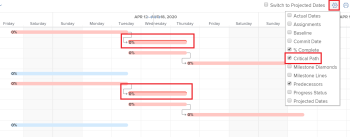

# Übersicht über den kritischen Projektpfad

Das Bestimmen des kritischen Pfads eines Projekts ist eine automatische Möglichkeit für Adobe Workfront, eine Abfolge von Aufgaben in einem Projekt zu kennzeichnen, die sich auf die Zeitleiste des Projekts auswirken können. Aufgaben, die sich auf die Zeitleiste des Projekts auswirken können, werden als „Kritische Pfadaufgaben“ gekennzeichnet.

Die folgenden Funktionen können sich auf den kritischen Pfad eines Projekts auswirken:

* Die Projektstrukturplan-Struktur.

  Weitere Informationen zur Projektaufschlüsselungsstruktur finden Sie unter [Bestimmen der Projektaufschlüsselungsstruktur in einem Projekt](../../../manage-work/projects/planning-a-project/determine-project-work-breakdown-structure.md)

* Die Zeit (Dauer), die zum Abschluss jeder Aufgabe benötigt wird.
* Die Abhängigkeiten zwischen den Aufgaben.

  Beachten Sie Folgendes:

   * Wenn eine Aufgabe auf dem kritischen Pfad eine Vorgängerbeziehung hat, befinden sich ihre Vorgänger und Nachfolger auch auf dem kritischen Pfad, wenn sich die Änderungen am Datum der Vorgänger oder der Nachfolger direkt auf ihre Angehörigen auswirken.

     >[!TIP]
     >
     >Wenn sich das Datum des Nachfolgers einer Aufgabe nicht direkt auf das Datum der von ihr abhängigen Aufgaben auswirkt und es sich nicht auf die Daten des Projekts auswirkt, befindet sich die Nachfolgeaufgabe nicht auf dem kritischen Pfad.
     >
     >
     >     >
     >

   * Wenn eine Teilaufgabe als Aufgabe mit kritischem Pfad identifiziert wird, wird die übergeordnete Aufgabe auch als Aufgabe mit kritischem Pfad identifiziert, wenn das voraussichtliche Startdatum und die voraussichtliche Startzeit des übergeordneten Elements mit dem der Teilaufgabe übereinstimmen.

Unter Berücksichtigung dieser Funktionen berechnet das System den kritischen Pfad anhand des längsten Pfads zwischen der frühesten Aufgabe und der Aufgabe, die das Ende des Projekts bestimmt. Bei der Berechnung des kritischen Pfads wird der früheste und letzte Zeitpunkt berücksichtigt, zu dem jede Aufgabe gestartet und beendet werden kann, ohne dass das Projekt verlängert wird. Dieser Prozess bestimmt, welche Aufgaben „kritisch“ sind (und zum längsten Pfad gehören) und welche den „Total Float“ haben (kann verzögert werden, ohne das Projekt zu verlängern).

Jede Verzögerung bei der Aktivität einer Aufgabe auf dem kritischen Pfad wirkt sich direkt auf das voraussichtliche Abschlussdatum des Projekts aus (es gibt keinen Gleitkommazahl auf dem kritischen Pfad).

## Zugriffsanforderungen

Sie müssen über folgenden Zugriff verfügen, um die Schritte in diesem Artikel ausführen zu können:

<table style="table-layout:auto"> 
 <col> 
 <col> 
 <tbody> 
  <tr> 
   <td role="rowheader">Adobe Workfront-Plan*</td> 
   <td> 
Beliebig
 </td> 
  </tr> 
  <tr> 
   <td role="rowheader">Adobe Workfront-Lizenz*</td> 
   <td> 
Arbeit oder höher
 </td> 
  </tr> 
  <tr> 
   <td role="rowheader">Konfigurationen der Zugriffsebene*</td> 
   <td> 
Zugriff auf Aufgaben anzeigen oder höher
 
Hinweis: Wenn Sie immer noch keinen Zugriff haben, fragen Sie Ihren Workfront-Administrator, ob er zusätzliche Einschränkungen in Ihrer Zugriffsebene festgelegt hat. Informationen dazu, wie Workfront-Admins Ihre Zugriffsebene ändern können, finden Sie unter <a href="../../../administration-and-setup/add-users/configure-and-grant-access/create-modify-access-levels.md" class="MCXref xref">Erstellen oder Ändern benutzerdefinierter Zugriffsebenen</a>.
 </td> 
  </tr> 
  <tr> 
   <td role="rowheader">Objektberechtigungen</td> 
   <td> 
Anzeigen von oder höheren Berechtigungen für eine Aufgabe 
 
Informationen zum Anfordern zusätzlicher Zugriffsberechtigungen finden Sie unter <a href="../../../workfront-basics/grant-and-request-access-to-objects/request-access.md" class="MCXref xref">Anfordern von Zugriffsberechtigungen für Objekte </a>.
 </td> 
  </tr> 
 </tbody> 
</table>

&#42;Wenden Sie sich an Ihren Workfront-Administrator, um herauszufinden, über welchen Plan, welchen Lizenztyp oder welchen Zugriff Sie verfügen.

## Anzeigen des kritischen Pfads

Sie können die Aufgaben, die zum kritischen Pfad gehören, in den folgenden Bereichen des Workfront-Programms anzeigen:

* [Anzeigen des kritischen Pfads im Gantt-Diagramm](#view-the-critical-path-in-the-gantt-chart)
* [Anzeigen des kritischen Pfads in einer Aufgabenliste oder einem Bericht](#view-the-critical-path-in-a-task-list-or-report)

### Anzeigen des kritischen Pfads im Gantt-Diagramm {#view-the-critical-path-in-the-gantt-chart}

So zeigen Sie Aufgaben auf dem kritischen Pfad im Gantt-Diagramm an:

1. Wechseln Sie zu einem Projekt, für das Sie den kritischen Pfad anzeigen möchten.
1. Klicken Sie **linken** auf „Aufgaben“.
1. Klicken Sie **oben rechts in der Aufgabenliste** das Symbol „Gantt-Diagramm“.

   

1. Erweitern Sie das Menü **Optionen** und aktivieren Sie dann die Option **Kritischer Pfad**.

   Die Aufgaben im kritischen Pfad haben eine rote Linie über ihrer Zeitleiste im Gantt-Diagramm.

   

### Anzeigen des kritischen Pfads in einer Aufgabenliste oder einem Bericht {#view-the-critical-path-in-a-task-list-or-report}

So zeigen Sie in einer Aufgabenliste an, welche Aufgaben sich auf dem kritischen Pfad befinden:

1. Wechseln Sie zu einem Projekt, für das Sie den kritischen Pfad anzeigen möchten.
1. Klicken Sie **linken** auf „Aufgaben“.
1. Wählen Sie im **-**-Menü die Option **Status** aus.

   Die Aufgaben im kritischen Pfad verfügen über eine Markierung **Kritischer Pfad** in der Spalte **Flags** der Liste.

   Sie können dieselbe Ansicht auf einen Aufgabenbericht anwenden.

   Weitere Informationen zum Erstellen von Berichten finden Sie im Artikel [Erstellen eines benutzerdefinierten Berichts](../../../reports-and-dashboards/reports/creating-and-managing-reports/create-custom-report.md).

   Oder

   Wählen Sie **Dropdown** Menü „Filter“ die Option **Neuer Filter**.

1. Klicken Sie auf **Filterregel hinzufügen** und geben Sie **Ist** in das Feld **Nur Aufgaben anzeigen, in denen …** ein.

1. Auswählen, wenn es in der Liste angezeigt wird.
1. Klicken Sie auf **Filter speichern**.

   In der Liste sollten nur Aufgaben angezeigt werden, die sich auf dem kritischen Pfad befinden.
