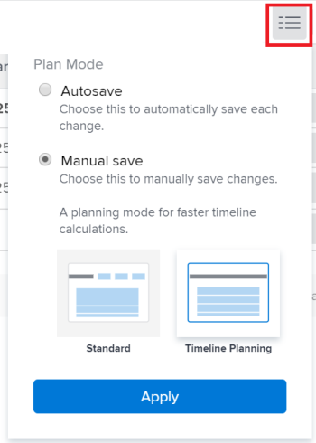
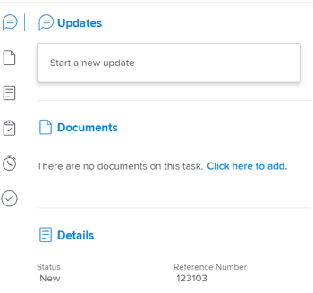

# Aufgaben in einer Liste bearbeiten {#edit-tasks-in-a-list}

Sie können Aufgabeninformationen in einer Aufgabenliste bearbeiten, indem Sie die in der Liste angezeigten Felder bearbeiten. Weitere Informationen zu anderen Möglichkeiten zum Bearbeiten von Aufgaben finden Sie unter [Aufgaben bearbeiten](../../../manage-work/tasks/manage-tasks/edit-tasks.md).

## Zugriffsanforderungen

Sie müssen über folgenden Zugriff verfügen, um die Schritte in diesem Artikel ausführen zu können:

<table style="table-layout:auto"> 
 <col> 
 <col> 
 <tbody> 
  <tr> 
   <td role="rowheader">Adobe Workfront-Plan*</td> 
   <td> 
Alle
 </td> 
  </tr> 
  <tr> 
   <td role="rowheader">Adobe Workfront-Lizenz*</td> 
   <td> 
Arbeit oder höher
 </td> 
  </tr> 
  <tr> 
   <td role="rowheader">Konfigurationen auf Zugriffsebene*</td> 
   <td> 
Zugriff auf Aufgaben und Projekte bearbeiten
 
Hinweis: Wenn Sie immer noch keinen Zugriff haben, fragen Sie Ihren Workfront-Administrator, ob er zusätzliche Zugriffsbeschränkungen für Ihre Zugriffsebene festlegt. Informationen dazu, wie ein Workfront-Administrator Ihre Zugriffsstufe ändern kann, finden Sie unter <a href="../../../administration-and-setup/add-users/configure-and-grant-access/create-modify-access-levels.md" class="MCXref xref">Benutzerdefinierte Zugriffsebenen erstellen oder ändern</a>.
 </td> 
  </tr> 
  <tr> 
   <td role="rowheader">Objektberechtigungen</td> 
   <td> 
Beitragen oder höhere Berechtigungen für die Aufgabe und das Projekt
 
Informationen zum Anfordern von zusätzlichem Zugriff finden Sie unter <a href="../../../workfront-basics/grant-and-request-access-to-objects/request-access.md" class="MCXref xref">Zugriff auf Objekte anfordern </a>.
 </td> 
  </tr> 
 </tbody> 
</table>

&#42;Wenden Sie sich an Ihren Workfront-Administrator, um zu erfahren, welchen Plan, welchen Lizenztyp oder welchen Zugriff Sie haben.

## Überlegungen zum Bearbeiten von Aufgaben in einer Liste {#considerations-about-editing-tasks-in-a-list}

Das Bearbeiten von Aufgaben in einer Liste ist eine schnelle Möglichkeit, Änderungen an mehreren Aufgaben gleichzeitig vorzunehmen, mit einer klaren Übersicht darüber, wie sich Ihre Änderungen auf die Projekt-Timeline auswirken können.

Beachten Sie beim Bearbeiten von Aufgaben in einer Liste Folgendes:

* Anders als beim Bearbeiten im Feld &quot;Bearbeiten&quot;die Berechtigung für die Aufgabe verwalten erforderlich, können Sie eine Aufgabe in einer Liste nur mit der Berechtigung &quot;Beitrag&quot;für die Aufgabe bearbeiten. Auf diese Weise können Sie die folgenden eingeschränkten Informationen für die Aufgabe bearbeiten:

   * Beschreibung
   * Status
   * Prozent abgeschlossen
   * Benutzerdefinierte Formulare - Informationen

     >[!NOTE]
     >
     >Sie können ein benutzerdefiniertes Aufgabenfeld nur dann in einer Liste bearbeiten, wenn Sie berechtigt sind, das Feld zu aktualisieren.

   * Stunden protokollieren
   * Zuweisungen ändern
   * Finanzinformationen anzeigen
   * Hinzufügen von Ausgaben, Aufgaben oder Problemen

* Sie können eine Aufgabe in den folgenden Listen bearbeiten:

   * Der Abschnitt &quot;Aufgaben&quot;des Projekts
   * Der Abschnitt &quot;Unteraufgaben&quot;des Projekts
   * Ein Aufgabenbericht

     >[!NOTE]
     >
     >Standardmäßig speichert Workfront Ihre Änderungen an Aufgaben automatisch im Bereich Unteraufgaben oder in einem Aufgabenbericht.

* Sie können steuern, wann Workfront die Änderungen speichert, die Sie an den Aufgaben in einer Liste vornehmen. Ihre Änderungen können automatisch gespeichert oder manuell gespeichert werden.

  Informationen zum Konfigurieren, wenn Workfront Änderungen speichert, die Sie an Aufgaben in einer Liste vornehmen, finden Sie unter [Auswählen einer Speicheroption beim Bearbeiten von Aufgaben in einer Liste](#select-a-save-option-when-editing-tasks-in-a-list) in diesem Artikel beschrieben.

* Andere Benutzer müssen ihre Seiten aktualisieren, bevor sie die Aktualisierungen anzeigen können, die Sie an einer Aufgabe vornehmen.

## Auswählen einer Speicheroption beim Bearbeiten von Aufgaben in einer Liste {#select-a-save-option-when-editing-tasks-in-a-list}

Sie können entscheiden, wo die Änderungen, die Sie an Aufgaben in einer Liste vornehmen, automatisch gespeichert werden, wann sie auftreten, oder ob Sie jede Änderung manuell speichern möchten.

>[!IMPORTANT]
>
>Je nachdem, ob Sie die Aufgaben automatisch oder manuell speichern, können Sie die Informationen eines anderen Benutzers überschreiben, wenn Sie Aufgaben in einer Liste bearbeiten. Informationen dazu, wie Workfront Änderungen an Aufgaben speichert, die Sie gleichzeitig mit anderen Benutzern ausführen, finden Sie unter [Übersicht über das Speichern gleichzeitiger Änderungen in einer Aufgabenliste](../../../manage-work/tasks/manage-tasks/save-concurrent-changes-in-a-task-list.md).

Wenn Sie Ihre Änderungen in einer Liste für ein Projekt speichern, für das entweder &quot;Automatisch&quot;oder &quot;Automatisch&quot;und &quot;Bei Änderung&quot;als Aktualisierungstyp ausgewählt sind, aktualisiert Workfront die Projekt-Timeline zusammen mit allen Projekt- und projektübergreifenden Abhängigkeiten. Timeline-Berechnungen können lange dauern, wenn das Projekt groß ist oder viele Abhängigkeiten vorliegen. Einige Methoden zum Bearbeiten einer Aufgabenliste können je nach der Methode, die Sie zum Speichern der Änderungen auswählen, schneller sein als andere.

Sie können steuern, wann Workfront die Änderungen speichert, die Sie an den Aufgaben in einer Liste vornehmen. Die folgenden Szenarien existieren: 

* Sie können die Änderungen nach jeder Aktualisierung automatisch von Workfront speichern lassen.

  Weitere Informationen finden Sie im Abschnitt . [Aufgaben in einer Liste bearbeiten und Änderungen automatisch speichern](#edit-tasks-in-a-list-and-automatically-save-changes) in diesem Artikel.

* Über die Schaltfläche Speichern können Sie steuern, wann Sie mehrere Änderungen gleichzeitig anwenden.

  Weitere Informationen finden Sie im Abschnitt . [Aufgaben in einer Liste bearbeiten und Änderungen manuell speichern](#edit-tasks-in-a-list-and-manually-save-changes) in diesem Artikel.

### Aufgaben in einer Liste bearbeiten und Änderungen automatisch speichern {#edit-tasks-in-a-list-and-automatically-save-changes}

>[!TIP]
>
>Das Speichern Ihrer Änderungen und aller Projektabhängigkeiten kann langsamer sein, wenn Ihr Projekt mehr als 2000 Aufgaben hat oder viele Abhängigkeiten aufweist.

Beachten Sie beim automatischen Speichern der Aufgabenlisten Folgendes:

* Sie können eine benutzerdefinierte Ansicht auf die Aufgabenliste anwenden und alle Aufgabenfelder bearbeiten, auf die Sie Zugriff haben, um sie zu aktualisieren.
* Sie können automatisch gespeicherte Änderungen nicht rückgängig machen. Dies ist die Standardeinstellung.
* Workfront berechnet die Timeline des Projekts und alle Abhängigkeiten zwischen Projekt und Projekten automatisch nach jeder Änderung neu, wenn der Projektaktualisierungstyp automatisch oder automatisch und bei Änderung ist. Informationen zum Projektaktualisierungstyp finden Sie unter [Wählen Sie den Projektaktualisierungstyp aus](../../../manage-work/projects/manage-projects/select-project-update-type.md).

So bearbeiten Sie Aufgaben in einer Liste und speichern Änderungen automatisch:

1. Wechseln Sie zum Projekt und klicken Sie auf das **Aufgaben** Abschnitt.
1. Klicken Sie auf **Menü &quot;Planungsmodus&quot;**  am Anfang der Liste und stellen Sie sicher, dass die Variable **Automatische Speicherung** ausgewählt ist.

   

1. Bearbeiten Sie alle Felder, die Sie manuell aktualisieren können.

   

1. (Optional) Drücken Sie die **Escape** , um Ihre Änderungen abzubrechen.
1. Drücken Sie die Eingabetaste , um Ihre Änderungen an den Aufgaben und an der Projekt-Timeline zu speichern.
1. (Optional) Klicken Sie mit der rechten Maustaste auf eine Aufgabe, die Sie ändern möchten.

   Oder

   Klicken Sie auf **Mehr** Menü  rechts neben dem Aufgabennamen.

1. (Optional) Wählen Sie aus den folgenden Optionen aus:

   <table style="table-layout:auto"> 
    <col> 
    <col> 
    <tbody> 
     <tr> 
      <td role="rowheader"><strong>In neuer Registerkarte öffnen</strong></td> 
      <td>Öffnet die Aufgabe in einer neuen Registerkarte des Browsers. </td> 
     </tr> 
     <tr> 
      <td role="rowheader"><strong>Bearbeiten</strong></td> 
      <td>
Öffnet die <strong>Aufgabe bearbeiten</strong> -Feld, in dem Sie die Aufgabe bearbeiten können.

Informationen zum Bearbeiten einer Aufgabe finden Sie unter <a href="#edit-tasks-in-a-list" class="MCXref xref">Aufgaben in einer Liste bearbeiten</a>.
</td> 
     </tr> 
     <tr> 
      <td role="rowheader">Löschen</td> 
      <td>
Löscht die Aufgabe.

Informationen zum Löschen von Aufgaben finden Sie unter <a href="../../../manage-work/tasks/manage-tasks/delete-tasks.md" class="MCXref xref">Aufgaben löschen</a>.
</td> 
     </tr> 
     <tr> 
      <td role="rowheader">Einrücken</td> 
      <td>
Ruft die Aufgabe auf einer Ebene auf. 

Diese Option wird nur bei eigenständigen Aufgaben angezeigt.
</td> 
     </tr> 
     <tr> 
      <td role="rowheader">Ausrücken</td> 
      <td>
Verbirgt die Aufgabe nach einer Ebene. 

Diese Option wird nur bei untergeordneten Aufgaben angezeigt. 
</td> 
     </tr> 
     <tr> 
      <td role="rowheader">Aufgabe oben einfügen</td> 
      <td>Fügt eine Aufgabe über der ausgewählten Aufgabe ein.</td> 
     </tr> 
     <tr> 
      <td role="rowheader">Aufgabe unten einfügen</td> 
      <td>Fügt eine Aufgabe unter der ausgewählten Aufgabe ein</td> 
     </tr> 
     <tr> 
      <td role="rowheader">Duplizieren</td> 
      <td>
Erstellt eine duplizierte Version der Aufgabe innerhalb desselben Projekts. 
</td> 
     </tr> 
     <tr> 
      <td role="rowheader">Kopieren in</td> 
      <td>
Kopiert die Aufgabe in ein anderes Projekt.

Informationen zum Kopieren und Duplizieren von Aufgaben finden Sie unter <a href="../../../manage-work/tasks/manage-tasks/copy-and-duplicate-tasks.md" class="MCXref xref">Aufgaben kopieren und duplizieren</a>.
</td> 
     </tr> 
     <tr> 
      <td role="rowheader">Verschieben nach</td> 
      <td>
Verschiebt die Aufgabe in ein anderes Projekt.

Informationen zum Verschieben von Aufgaben finden Sie unter <a href="../../../manage-work/tasks/manage-tasks/move-tasks.md" class="MCXref xref">Aufgaben verschieben</a>.
</td> 
     </tr> 
    </tbody> 
   </table>

   Änderungen werden automatisch gespeichert und können nicht rückgängig gemacht werden.

### Aufgaben in einer Liste bearbeiten und Änderungen manuell speichern {#edit-tasks-in-a-list-and-manually-save-changes}

Sie können Änderungen, die Sie an Aufgaben in einer Liste vornehmen, manuell speichern. Wenn Sie Änderungen auf diese Weise speichern, können Sie sie vor dem Speichern umkehren.

>[!TIP]
>
>* Sie können Änderungen, die Sie an Aufgaben in einer Liste vornehmen, nicht rückgängig machen, wenn Sie sie im Bereich Unteraufgaben oder in einem Aufgabenbericht bearbeiten.
>* Es gibt keine Einschränkungen dafür, wie viele Änderungen rückgängig gemacht werden können. Sie können alle nacheinander umkehren, bis Sie den ursprünglichen Status der Aufgaben erreicht haben.
>

Beachten Sie beim manuellen Speichern von Änderungen in einer Aufgabenliste Folgendes:

* Um Aufgabenlistenänderungen manuell zu speichern, benötigen Sie Berechtigungen zum Verwalten der Aufgaben und des Projekts.
* Das Projekt kann nicht bearbeitet werden. Die Option zum Bearbeiten des Projekts ist deaktiviert.
* Informationen in der Kopfzeile des Projekts können nicht aktualisiert werden. Sie können nur Folgendes tun, wenn Sie die Änderungen in der Aufgabenliste manuell speichern:

   * Abonnieren Sie das Projekt.
   * Fügen Sie das Projekt Ihrer Favoritenliste hinzu.
   * Öffnen Sie eine Aufgabe, indem Sie in der Liste auf ihren Namen klicken.

* Bearbeiten Sie die Aufgaben stapelweise. Das Symbol Bearbeiten ist bei der Auswahl mehrerer Aufgaben deaktiviert.
* Workfront Trigger benachrichtigt Sie erst nach dem Speichern Ihrer Änderungen über die Änderungen, die Sie an den Aufgaben vornehmen.

Es gibt zwei Möglichkeiten, Änderungen an Aufgaben in einer Liste manuell zu speichern. Diese beiden Möglichkeiten werden nachfolgend beschrieben.

* [Manuelles Speichern von Änderungen in einer Aufgabenliste, wenn Sie die Option Manuelles Speichern als Standard auswählen](#save-changes-in-a-task-list-manually-when-you-select-the-manual-save-standard-option)
* [Manuelles Speichern von Änderungen in einer Aufgabenliste, wenn Sie die Option &quot;Manuelles Speichern der Timeline-Planung&quot;auswählen](#save-changes-in-a-task-list-manually-when-you-select-the-manual-save-timeline-planning-option)

#### Manuelles Speichern von Änderungen in einer Aufgabenliste, wenn Sie die Option Manuelles Speichern als Standard auswählen {#save-changes-in-a-task-list-manually-when-you-select-the-manual-save-standard-option}

>[!TIP]
>
>Wenn Ihr Projekt mehr als 2000 Aufgaben hat oder viele Abhängigkeiten aufweist, kann es eine Weile dauern, die Änderungen, die Sie an Ihren Aufgaben vornehmen, visuell zu identifizieren und zu sehen, wie sich diese Änderungen auf alle Projektabhängigkeiten auswirken. In diesem Fall kann das Speichern Ihrer Änderungen länger dauern, wenn Ihr Projekt mehr als 2000 Aufgaben hat oder wenn es viele Abhängigkeiten hat.

Beachten Sie beim Aktualisieren von Aufgaben in einer Liste nach Auswahl der Option Manuelles Speichern von Standard Folgendes:

* Sie können eine benutzerdefinierte Ansicht auf die Aufgabenliste anwenden und alle Aufgabenfelder bearbeiten, für die Sie in dieser Ansicht über die Berechtigung &quot;Verwalten&quot;verfügen.
* Workfront berechnet die Timeline des Projekts sowie alle projektbezogenen und projektübergreifenden Abhängigkeiten, nachdem Sie auf Speichern geklickt haben, wenn der Projektaktualisierungstyp automatisch oder automatisch und bei Änderung ist. Informationen zum Projektaktualisierungstyp finden Sie unter [Wählen Sie den Projektaktualisierungstyp aus](../../../manage-work/projects/manage-projects/select-project-update-type.md).

So bearbeiten Sie Aufgaben in einer Liste, wenn Sie die Option Manuelles Speichern von Standard auswählen:

1. Wechseln Sie zu einem Projekt und klicken Sie dann auf das **Aufgaben** Abschnitt .
1. Klicken Sie auf **Planmodus** Menü  oben in der Liste und wählen Sie **Manuelles Speichern** Klicken Sie auf **Standard** > **Anwenden**.

   

   Eine Symbolleisteneinstellung mit Optionen zum Rückgängigmachen, Wiederholen und Speichern Ihrer Änderungen wird angezeigt.

   

1. Klicken Sie in jedes Feld, das Sie manuell aktualisieren können. Das Feld wird bearbeitbar und Sie können Ihre Änderungen vornehmen.

   

1. Drücken Sie die Eingabetaste , um die vorgenommenen Änderungen vorübergehend zu speichern.
1. (Optional) Klicken Sie auf die **Symbol &quot;Rückgängig&quot;**  , um eine Änderung rückgängig zu machen und ein Feld in den Originalzustand zurückzuversetzen.
1. (Optional und bedingt) Klicken Sie auf die **Symbol &quot;Wiederherstellen&quot;**  um die rückgängig gemachte Änderung wiederherzustellen.

1. (Optional) Klicken Sie mit der rechten Maustaste auf eine Aufgabe, die Sie ändern möchten.

   Oder

   Klicken Sie auf **Mehr** Menü .

1. (Optional) Wählen Sie aus den folgenden Optionen aus:

   <table style="table-layout:auto"> 
    <col> 
    <col> 
    <tbody> 
     <tr> 
      <td role="rowheader"><strong>In neuer Registerkarte öffnen</strong> </td> 
      <td>Öffnet die Aufgabe in einer neuen Registerkarte des Browsers. </td> 
     </tr> 
     <tr> 
      <td role="rowheader">Löschen</td> 
      <td>Informationen zum Löschen von Aufgaben finden Sie unter <a href="../../../manage-work/tasks/manage-tasks/delete-tasks.md" class="MCXref xref">Aufgaben löschen</a>.</td> 
     </tr> 
     <tr> 
      <td role="rowheader">Einrücken</td> 
      <td> 
Ruft die Aufgabe auf einer Ebene auf. 
 
Diese Option wird nur bei eigenständigen Aufgaben angezeigt.
 </td> 
     </tr> 
     <tr> 
      <td role="rowheader">Ausrücken</td> 
      <td> 
Verbirgt die Aufgabe nach einer Ebene. 
 
Diese Option wird nur bei untergeordneten Aufgaben angezeigt. 
 </td> 
     </tr> 
     <tr> 
      <td role="rowheader">Aufgabe oben einfügen</td> 
      <td>Fügt eine Aufgabe über der ausgewählten Aufgabe ein.</td> 
     </tr> 
     <tr> 
      <td role="rowheader">Aufgabe unten einfügen</td> 
      <td>Fügt eine Aufgabe unter der ausgewählten Aufgabe ein</td> 
     </tr> 
     <tr> 
      <td role="rowheader">Duplizieren</td> 
      <td> 
Erstellt eine duplizierte Version der Aufgabe innerhalb desselben Projekts. 
 
Informationen zum Kopieren und Duplizieren von Aufgaben finden Sie unter <a href="../../../manage-work/tasks/manage-tasks/copy-and-duplicate-tasks.md" class="MCXref xref">Aufgaben kopieren und duplizieren</a>.
 </td> 
     </tr> 
    </tbody> 
   </table>

1. Workfront aktualisiert alle projektbezogenen und projektübergreifenden Abhängigkeiten, wenn Sie Änderungen an der Zeitleiste von Aufgaben vornehmen.
1. Klicks **Speichern** wenn Sie die Aufgabenänderungen dauerhaft beibehalten und die Timeline des Projekts speichern möchten.

#### Manuelles Speichern von Änderungen in einer Aufgabenliste, wenn Sie die Option &quot;Manuelles Speichern der Timeline-Planung&quot;auswählen {#save-changes-in-a-task-list-manually-when-you-select-the-manual-save-timeline-planning-option}

Das Speichern Ihrer Änderungen und aller Projektabhängigkeiten ist schneller. Dies ist nicht für Projekte mit mehr als 2000 Aufgaben verfügbar.

>[!IMPORTANT]
>
>Es wird empfohlen, diese Option zu verwenden, wenn Sie eine große Liste von Aufgaben mit mehr als hundert Abhängigkeiten bearbeiten. Mit dieser Option können Sie Ihre Änderungen viel schneller visuell erkennen als mit der Option Manuelles Speichern .

Beachten Sie Folgendes bei Verwendung der Option Timeline-Planung manuell speichern in einer Aufgabenliste:

* Sie können die Option Manuelles Speichern der Timeline-Planung nicht auf Projekte mit mehr als 2000 Aufgaben anwenden.
* Sie können keine benutzerdefinierte Ansicht, Filter oder Gruppierung auf die Aufgabenliste anwenden. Die Dropdownmenüs Ansicht, Filter und Gruppierung sowie das Symbol für die Agile Ansicht sind deaktiviert. Die standardmäßig angewendete Ansicht enthält eine begrenzte Anzahl von Feldern.
* Die Timeline des Projekts und alle im Projekt enthaltenen Abhängigkeiten werden nach jeder Änderung automatisch berechnet, wenn der Projektaktualisierungstyp automatisch oder automatisch und bei Änderung ist.
* Die projektübergreifenden Abhängigkeiten werden nach dem Klicken auf Speichern berechnet, wenn der Projektaktualisierungstyp automatisch oder Automatisch und Bei Änderung ist. Informationen zum Projektaktualisierungstyp finden Sie unter [Wählen Sie den Projektaktualisierungstyp aus](../../../manage-work/projects/manage-projects/select-project-update-type.md).

So bearbeiten Sie Aufgaben in einer Liste, wenn Sie die Option Manuelles Speichern der Timeline-Planung verwenden:

1. Wechseln Sie zu einem Projekt und klicken Sie dann auf das **Aufgaben** Abschnitt.
1. Klicken Sie auf **Planmodus** Menü  oben in der Liste und wählen Sie **Manuelles Speichern** Klicken Sie auf **Timeline-Planung**> **Anwenden**.

   Diese Option ist für Projekte mit mehr als 2000 Aufgaben abgeblendet.

   

   >[!TIP]
   >
   >Wenn Sie von dieser Seite weg navigieren, aktiviert Workfront erneut die Option Automatisches Speichern .

   Beachten Sie die folgenden Änderungen in der Liste:

   * Die Dropdownmenüs Ansicht, Gruppierung und Filter werden entfernt und die Ansicht wird durch die folgenden Felder ersetzt:

      * Aufgabennummer
      * Aufgabenname
      * Einschränkungstyp
      * Dauer
      * Geplantes Startdatum
      * Geplantes Abschlussdatum
      * Vorgänger
      * Arbeitsaufträge
      * Status
      * Prozent abgeschlossen

   * Das Symbol für die Agile-Ansicht wurde entfernt.
   * Eine Symbolleisteneinstellung mit Optionen zum Rückgängigmachen, Wiederholen und Speichern Ihrer Änderungen wird angezeigt.

     

1. Bearbeiten Sie alle Felder, die Sie manuell aktualisieren können.

   

1. Drücken Sie die Eingabetaste , um die vorgenommenen Änderungen vorübergehend zu speichern.
1. (Optional) Klicken Sie auf die **Symbol &quot;Rückgängig&quot;**  , um eine Änderung rückgängig zu machen und ein Feld in den Originalzustand zurückzuversetzen.
1. (Optional und bedingt) Klicken Sie auf die **Symbol &quot;Wiederherstellen&quot;**  um die rückgängig gemachte Änderung wieder zu aktivieren.

1. (Optional) Klicken Sie mit der rechten Maustaste auf eine Aufgabe, die Sie ändern möchten

   Oder

   Klicken Sie auf **Mehr** Menü .

1. Wählen Sie aus den folgenden Optionen aus:

   <table style="table-layout:auto"> 
    <col> 
    <col> 
    <tbody> 
     <tr> 
      <td role="rowheader"><strong>In neuer Registerkarte öffnen</strong> </td> 
      <td>Öffnet die Aufgabe in einer neuen Registerkarte des Browsers. </td> 
     </tr> 
     <tr> 
      <td role="rowheader">Löschen</td> 
      <td>Informationen zum Löschen von Aufgaben finden Sie unter <a href="../../../manage-work/tasks/manage-tasks/delete-tasks.md" class="MCXref xref">Aufgaben löschen</a>.</td> 
     </tr> 
     <tr> 
      <td role="rowheader">Einrücken</td> 
      <td> 
Ruft die Aufgabe auf einer Ebene auf. 
 
Diese Option wird nur bei eigenständigen Aufgaben angezeigt.
 </td> 
     </tr> 
     <tr> 
      <td role="rowheader">Ausrücken</td> 
      <td> 
Verbirgt die Aufgabe nach einer Ebene. 
 
Diese Option wird nur bei untergeordneten Aufgaben angezeigt. 
 </td> 
     </tr> 
     <tr> 
      <td role="rowheader">Aufgabe oben einfügen</td> 
      <td>Fügt eine Aufgabe über der ausgewählten Aufgabe ein.</td> 
     </tr> 
     <tr> 
      <td role="rowheader">Aufgabe unten einfügen</td> 
      <td>Fügt eine Aufgabe unter der ausgewählten Aufgabe ein</td> 
     </tr> 
     <tr> 
      <td role="rowheader">Duplizieren</td> 
      <td> 
Erstellt eine duplizierte Version der Aufgabe innerhalb desselben Projekts. 
 
Informationen zum Kopieren und Duplizieren von Aufgaben finden Sie unter <a href="../../../manage-work/tasks/manage-tasks/copy-and-duplicate-tasks.md" class="MCXref xref">Aufgaben kopieren und duplizieren</a>.
 </td> 
     </tr> 
    </tbody> 
   </table>

1. Workfront aktualisiert alle projektbezogenen und projektübergreifenden Abhängigkeiten, wenn Sie die Timeline einer Aufgabe ändern.
1. Klicks **Speichern** wenn Sie die Aufgabenänderungen dauerhaft beibehalten und die Timeline des Projekts speichern möchten.

## Bearbeiten einer Aufgabe in einer Liste mithilfe der Zusammenfassung

1. Wechseln Sie zu dem Projekt mit den Aufgaben, die Sie bearbeiten möchten.
1. Klicks **Aufgaben** im linken Bereich.

   Die Liste der Aufgaben im Projekt wird angezeigt.

1. Klicken Sie auf das Menü Mehr  Klicken Sie nach dem Aufgabennamen auf **Zusammenfassung öffnen**. Wählen Sie die Aufgabe aus, die Sie bearbeiten möchten, und klicken Sie dann auf die **Symbol &quot;Zusammenfassung öffnen&quot;**  in der oberen rechten Ecke der Liste.

   Die **Zusammenfassung** geöffnet.

   

1. (Optional) Klicken Sie auf die **X-Symbol** oben rechts in der Zusammenfassung, um das Bedienfeld zu schließen und die Aufgaben inline zu bearbeiten.

   Führen Sie die Schritte zum Bearbeiten einer Aufgabe in einer Liste aus, um die Aufgabe inline zu bearbeiten.

   Informationen zum Bearbeiten der Aufgabe in einer Liste finden Sie unter [Überlegungen zum Bearbeiten von Aufgaben in einer Liste](#considerations-about-editing-tasks-in-a-list) in diesem Artikel.

1. (Optional) Geben Sie eine Aktualisierung für die Aufgabe in das **Updates** Bereich.
1. Klicken Sie auf eines der folgenden Symbole oder Bereiche, um zur Aufgabe zu wechseln und Informationen auf Aufgabenebene zu bearbeiten:

   | Dokumente | Klicks **Klicken Sie hier zum Hinzufügen** , um der Aufgabe Dokumente hinzuzufügen. |
   |---|---|
   | Details | Klicken Sie auf , um Informationen zur Aufgabe zu aktualisieren. |
   | Benutzerdefinierte Formulare | Klicken Sie auf , um benutzerdefinierte Forms hinzuzufügen oder zu entfernen oder Informationen zu den Formularen zu aktualisieren. |
   | Stunden | Klicken Sie auf , um die Stunden zu protokollieren. |
   | Genehmigungen | Klicken Sie auf , um Aufgabengenehmigungen hinzuzufügen. |

   {style="table-layout:auto"}

1. Klicken Sie in Ihrem Browser auf die Schaltfläche &quot;Zurück&quot;, um zur Aufgabenliste zurückzukehren, wenn Sie die Aufgabe aktualisiert haben.

## Stapelweises Bearbeiten von Aufgaben

Sie können mehrere Aufgaben gleichzeitig bearbeiten. Stellen Sie sicher, dass Sie über Verwaltungsberechtigungen für die Aufgaben verfügen, um sie bearbeiten zu können.

1. Wechseln Sie zu einem Projekt mit Aufgaben, die Sie stapelweise bearbeiten möchten.
1. Klicks **Aufgaben** im linken Bereich.
1. Stellen Sie sicher, dass **Automatische Speicherung** ausgewählt ist.

   >[!IMPORTANT]
   >
   >Aufgaben können beim manuellen Speichern von Aufgaben nicht stapelweise bearbeitet werden.

   Weitere Informationen zum Speichern von Änderungen an Aufgaben in einer Liste finden Sie im Abschnitt [Überlegungen zum Bearbeiten von Aufgaben in einer Liste](#considerations-about-editing-tasks-in-a-list) in diesem Artikel.

1. Wählen Sie mehrere Aufgaben in der Aufgabenliste aus.
1. Klicken Sie auf **Symbol Bearbeiten** .

   Die **Aufgaben bearbeiten** wird geöffnet.

1. Geben Sie die Informationen an, die Sie für alle ausgewählten Aufgaben ändern möchten.

   Das Bearbeiten der Informationen für alle Aufgaben entspricht dem Bearbeiten der Informationen für eine Aufgabe. Wenn Sie die Aufgabendauer bearbeiten möchten, müssen die ausgewählten Aufgaben dieselbe Aufgabenbegrenzung aufweisen. Andernfalls wird die **Dauer** wird nicht aufgefüllt.

   Weitere Informationen zum Bearbeiten einer Aufgabe finden Sie unter [Aufgaben bearbeiten](../../../manage-work/tasks/manage-tasks/edit-tasks.md).

   >[!NOTE]
   >
   >Die Informationen, die Sie für alle ausgewählten Aufgaben ändern, überschreiben die vorhandenen Informationen zu einzelnen Aufgaben mit Ausnahme der **Zuweisungen** -Feld. Durch das Hinzufügen eines neuen Verantwortlichen zur Massenbearbeitung wird dieser Verantwortliche zu allen ausgewählten Aufgaben hinzugefügt. Wenn den ausgewählten Aufgaben andere Verantwortliche zugewiesen sind, bleiben diese zusätzlich zu der durch Massenbearbeitung hinzugefügten Aufgabe zugewiesen.

1. Klicks **Benutzerdefinierte Forms** , um die benutzerdefinierten Formulare zu bearbeiten, die an alle ausgewählten Aufgaben angehängt sind. In der Liste werden nur aktive benutzerdefinierte Formulare angezeigt.

   Wenn die ausgewählten Aufgaben keine gemeinsamen benutzerdefinierten Formulare haben, werden in diesem Abschnitt keine Formulare aufgeführt.

   Sie können nur die Felder in den Formularen bearbeiten, die an alle ausgewählten Aufgaben angehängt sind und die Sie bearbeiten können.

1. (Optional) Wählen Sie im Abschnitt Benutzerdefinierter Forms die **Benutzerdefinierte Ausdrücke neu berechnen** , um sicherzustellen, dass alle berechneten benutzerdefinierten Felder in den benutzerdefinierten Formularen, die mit den ausgewählten Aufgaben verknüpft sind, auf dem neuesten Stand sind.
1. Klicken Sie auf **Änderungen speichern**.

   Alle von Ihnen vorgenommenen Änderungen sind nun für alle ausgewählten Aufgaben sichtbar.

Informationen zur Massenbearbeitung von benutzerdefinierten Formularen finden Sie im Abschnitt &quot;Mehrere benutzerdefinierte Forms beim Bearbeiten von Objekten in Massenbearbeitung bearbeiten&quot;in [Verwalten benutzerdefinierter Formulare, die an Objekte angehängt werden](../../../workfront-basics/work-with-custom-forms/manage-custom-forms-attached-to-objects.md).
