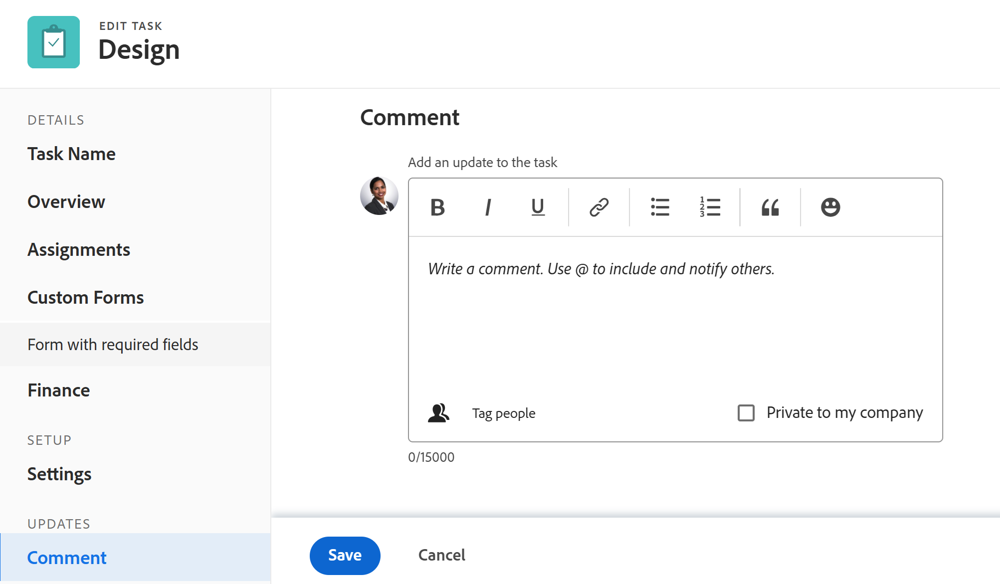

# Aufgaben bearbeiten

<!--Audited: 10/2025-->

<!--take out prod and preview references at release, or new and old experience-->

<!--

(NOTE: some information in this area is repeated in the following articles. If you need to update a field, update it in both:

** Task finances in details

** Task information in overview)

-->

<!--
 

The highlighted information on this page refers to functionality not yet generally available. It is available only in the Preview environment for all customers. The same features will also be available in the Production environment for all customers starting with  a week from the Preview release.      

For more information, see [Second Quarter 2026 release overview](/help/quicksilver/product-announcements/product-releases/26-q2-release-activity/26-q2-release-overview.md).

 -->

Sie können Informationen zu Aufgaben bearbeiten, die Sie erstellt haben oder für die Sie über die Berechtigung Beitragen oder Verwalten verfügen.

## Zugriffsanforderungen

+++ Erweitern, um die Zugriffsanforderungen für die in diesem Artikel beschriebene Funktionalität anzuzeigen. 

<table style="table-layout:auto"> 
 <col> 
 <col> 
 <tbody> 
  <tr> 
   <td role="rowheader">Adobe Workfront-Paket</td> 
   <td> 
Beliebig
 </td> 
  </tr> 
  <tr> 
   <td role="rowheader">Adobe Workfront-Lizenz</td> 
   <td> 
Standard

   
Work oder höher
 </td> 
  </tr> 
  <tr> 
   <td role="rowheader">Zugriffsebene</td> 
   <td> 
Zugriff auf Aufgaben und Projekte bearbeiten
 </td> 
  </tr> 
  <tr> 
   <td role="rowheader">Objektberechtigungen</td> 
   <td> 
    <ul> 
     <li> 
Tragen Sie Berechtigungen zu einer Aufgabe bei, um die folgenden Informationen im Bereich Aufgabendetails zu bearbeiten: 

     <ul>
     <li>Beschreibung</li>
     <li>Status</li>
     </ul>  
      </li> 
     <li> 
Verwalten Sie die Berechtigungen für eine Aufgabe, um alle Informationen im Bereich Details und im Feld Aufgabe bearbeiten zu bearbeiten
 </li> 
    </ul> 
    <ul> 
     <li> 
Mitwirken an oder höhere Berechtigungen für das Projekt
 </li> 
    </ul> </td> 
  </tr> 
 </tbody> 
</table>

*Weitere Informationen finden Sie unter [Zugriffsanforderungen in der Dokumentation zu Workfront](/help/quicksilver/administration-and-setup/add-users/access-levels-and-object-permissions/access-level-requirements-in-documentation.md).

+++

<!--Old:

<table style="table-layout:auto"> 
 <col> 
 <col> 
 <tbody> 
  <tr> 
   <td role="rowheader">Adobe Workfront plan</td> 
   <td> 
Any 
 </td> 
  </tr> 
  <tr> 
   <td role="rowheader">Adobe Workfront license*</td> 
   <td> 
Standard

   
Work or higher
 </td> 
  </tr> 
  <tr> 
   <td role="rowheader">Access level</td> 
   <td> 
Edit access to Tasks and Projects
 </td> 
  </tr> 
  <tr> 
   <td role="rowheader">Object permissions</td> 
   <td> 
    <ul> 
     <li> 
Contribute permissions to a task to edit the following information in the Task Details area: 

     <ul>
     <li>Description</li>
     <li>Status</li>
     </ul>  
      </li> 
     <li> 
Manage permissions to a task to edit all the information in the Details area and the Edit Task box
 </li> 
    </ul> 
    <ul> 
     <li> 
Contribute or higher permissions to the project
 </li> 
    </ul> </td> 
  </tr> 
 </tbody> 
</table>-->

## Einschränkungen bei der Aufgabenbearbeitung

Es gibt einige Einschränkungen, die Sie möglicherweise daran hindern, Aufgaben zu bearbeiten.

Beachten Sie beim Bearbeiten von Aufgaben Folgendes:

* Trigger Aufgabenstatusbenachrichtigungen für Projekte mit dem Status „Aktuell“ werden aktualisiert. Um Verwirrung bei den Benutzern zu vermeiden, die den Aufgaben zugewiesen sind, sollten Sie die Bearbeitung von Aufgaben so weit wie möglich einschränken, wenn das Projekt den Status „Aktuell“ aufweist.
* Aufgaben, die sich in einem Genehmigungsprozess befinden, können nicht bearbeitet werden. Sie können nur die Zeit protokollieren oder den Status für eine Aufgabe in einem Genehmigungsprozess aktualisieren.

  

* Sie können Dokumente nur dann zu Aufgaben in einem Projekt mit dem Status „Abgeschlossen“, „Eingestellt“ oder „Genehmigung steht aus“ bearbeiten oder hinzufügen, wenn diese Funktion von Ihrem Workfront-Administrator oder einem Gruppenadministrator im Bereich „Projektvoreinstellungen“ aktiviert wurde. Informationen zum Festlegen von Projektvoreinstellungen finden Sie [Konfigurieren von systemweiten Projektvoreinstellungen](../../../administration-and-setup/set-up-workfront/configure-system-defaults/set-project-preferences.md).

* Sie können jederzeit die folgenden Informationen zu einer Aufgabe bearbeiten, wenn das Projekt als abgeschlossen, eingestellt oder in einem Genehmigungsprozess ist:

   * Zeit erfassen
   * Bestehende Ausgaben bearbeiten
   * Benutzerdefiniertes Formular anhängen

* Andere Benutzer müssen ihre Seiten aktualisieren, bevor sie die Aktualisierungen sehen können, die Sie an einer Aufgabe vornehmen.

## Aufgabe in einer Liste bearbeiten

Sie können Aufgabeninformationen in einer Aufgabenliste bearbeiten, indem Sie die in der Listenansicht angezeigten Felder inline bearbeiten.

Informationen zum Bearbeiten von Aufgaben in Listen finden Sie unter [Bearbeiten von Aufgaben in einer Liste](../../../manage-work/tasks/manage-tasks/edit-tasks-in-a-list.md).

## Aufgabe in einer Liste mithilfe der Zusammenfassung bearbeiten

Sie können eine Aufgabe in einer Liste mithilfe des Bedienfelds Zusammenfassung bearbeiten. Informationen zum Bearbeiten einer Aufgabe im Zusammenfassungsbereich finden Sie im Abschnitt „Bearbeiten einer Aufgabe in der Zusammenfassung“ im Artikel [Bearbeiten von Aufgaben in einer Liste](../../../manage-work/tasks/manage-tasks/edit-tasks-in-a-list.md).

## Aufgabe bearbeiten im Feld Aufgabe bearbeiten

Sie können eine Aufgabe über die Bereiche Aufgabe bearbeiten oder Aufgabendetails bearbeiten. Die folgenden Schritte beschreiben das Bearbeiten einer Aufgabe im Feld Aufgabe bearbeiten .

{{step1-click-main-menu}}

1. Klicken Sie **Projekte** und anschließend auf den Namen eines Projekts, um es zu öffnen.
1. Klicken Sie **linken** auf „Aufgaben“.
1. Klicken Sie auf die Aufgabe, die Sie bearbeiten möchten.
1. (Bedingt) Um eingeschränkte Informationen zu einer Aufgabe zu bearbeiten, klicken Sie **linken Bereich auf** Aufgabendetails“.

   

   Erwägen Sie, Informationen in den folgenden Bereichen im Abschnitt „Aufgabendetails“ zu bearbeiten:

   * **Übersicht**

     Dieser Bereich ist standardmäßig erweitert.

   * **Benutzerdefinierte Formulare**

     Namen von benutzerdefinierten Formularen werden nur angezeigt, wenn dem -Objekt benutzerdefinierte Formulare beigefügt sind.

   * **Finanzen**

   >[!NOTE]
   >
   >Je nachdem, wie Ihr Workfront-Administrator oder Gruppenadministrator Ihre Layout-Vorlage geändert hat, werden die Felder im Bereich Aufgabendetails möglicherweise neu angeordnet oder nicht angezeigt. Weitere Informationen finden Sie unter [Anpassen der Detailansicht mithilfe einer Layout-Vorlage](../../../administration-and-setup/customize-workfront/use-layout-templates/customize-details-view-layout-template.md).

   Um Informationen zu den Feldern zu erhalten, die im Abschnitt Aufgabendetails sichtbar sind, fahren Sie mit dem Bearbeiten der Aufgabe im Feld Aufgabe bearbeiten wie unten beschrieben fort.

   Gehen Sie wie folgt vor, um Informationen im Abschnitt Details zu bearbeiten:

   1. (Optional) Klicken Sie auf das Symbol **Alle reduzieren**  in der oberen rechten Ecke, um alle Bereiche zu reduzieren.
   1. (Optional und bedingt) Wenn ein Bereich reduziert ist, klicken Sie auf den **Nach rechts zeigenden** Nach  neben jedem Bereich, um den Bereich zu erweitern, den Sie bearbeiten möchten.
   1. Weitere Informationen zum Bearbeiten von Informationen auf der Registerkarte „Aufgabendetails“ finden Sie in den folgenden Artikeln:

      * [Verwalten von Aufgabeninformationen im Bereich Aufgabendetails - Übersicht](../../../manage-work/tasks/manage-tasks/task-information-in-overview.md)
      * [Verwalten der Aufgabenfinanzen im Abschnitt Aufgabendetails](../../../manage-work/tasks/manage-tasks/task-finances-in-details.md)

   1. (Optional) Wenn keine benutzerdefinierten Formulare an die Aufgabe angehängt sind, geben Sie den Namen eines Formulars in das Feld **Benutzerdefiniertes Formular hinzufügen** ein, wählen Sie es aus, wenn es in der Liste angezeigt wird, und klicken Sie dann auf **Änderungen speichern**.
   1. (Optional) Klicken Sie auf **Export**-Symbol , um die Übersichts- und benutzerdefinierten Formularinformationen in eine PDF-Datei zu exportieren, und klicken Sie dann auf **Exportieren**. Wählen Sie aus den folgenden Optionen aus:

      * Alle auswählen (wird nur angezeigt, wenn mindestens ein benutzerdefiniertes Formular angehängt ist)
      * Übersicht
      * Der Name eines oder mehrerer benutzerdefinierter Formulare

      Die PDF-Datei wird auf Ihren Computer heruntergeladen.

      

      Weitere Informationen finden Sie unter [Exportieren benutzerdefinierter Formulare und Objektdetails](../../../workfront-basics/work-with-custom-forms/export-custom-forms-details.md).

1. (Bedingt) Um alle Informationen zu der Aufgabe zu bearbeiten, klicken Benutzende mit der Berechtigung zum Verwalten der Aufgabe auf das Menü **Mehr**  neben dem Namen der Aufgabe und anschließend auf **Bearbeiten**.

   ODER

   Wählen Sie aus einer Aufgabenliste eine Aufgabe aus und klicken Sie dann oben in der Liste auf **Bearbeiten** Symbol .

   Das Feld Aufgabe bearbeiten wird geöffnet.

   >[!IMPORTANT]
   >
   >Sie müssen über Verwaltungsberechtigungen für die Aufgabe verfügen, um die Option Bearbeiten anzuzeigen.

   Alle Aufgabenfelder sind im Feld Aufgabe bearbeiten verfügbar und werden nach den im linken Bereich aufgelisteten Bereichen gruppiert.

   >[!NOTE]
   >
   >Je nachdem, wie Ihr Workfront-Administrator oder Gruppenadministrator Ihre Layout-Vorlage geändert hat, werden die Felder im Bereich Aufgabendetails möglicherweise neu angeordnet oder nicht angezeigt. Weitere Informationen finden Sie unter [Anpassen der Detailansicht mithilfe einer Layout-Vorlage](../../../administration-and-setup/customize-workfront/use-layout-templates/customize-details-view-layout-template.md).

   Erwägen Sie, Informationen in einem der folgenden Abschnitte anzugeben:

   * [Aufgabenname](#task-name)
   * [Übersicht](#overview)
   * [Arbeitsaufträge](#assignments)
   * [Benutzerdefinierte Formulare](#Custom%C2%A0F)
   * [Finanzen](#finance)
   * [Einstellungen](#settings)
   * [Kommentar](#comment)

   >[!NOTE]
   >
   >Je nachdem, wie Workfront-Admins oder Gruppenadmins Ihre Layout-Vorlage einrichten, werden die Felder im Feld Aufgabe bearbeiten möglicherweise neu angeordnet oder nicht angezeigt. Weitere Informationen finden Sie unter [Anpassen der Detailansicht mithilfe einer Layout-Vorlage](../../../administration-and-setup/customize-workfront/use-layout-templates/customize-details-view-layout-template.md).

### Aufgabenname {#task-name}

1. Beginnen Sie mit der Bearbeitung Ihrer Aufgabe, wie oben beschrieben.
1. Klicken Sie **linken** auf „Aufgabenname“.

   

1. Aktualisieren Sie den Namen der Aufgabe.

1. Klicken **auf &quot;**&quot; oder fahren Sie mit den folgenden Abschnitten fort.

### Übersicht {#overview}

1. Beginnen Sie mit der Bearbeitung Ihrer Aufgabe, wie oben beschrieben.
1. Klicken Sie **linken** auf „Übersicht“.

   

1. Aktualisieren Sie die folgenden Informationen zur Aufgabe:

   <table style="table-layout:auto"> 
    <col> 
    <col> 
    <tbody> 
     <tr> 
      <td role="rowheader">Beschreibung</td> 
      <td>Fügen Sie zusätzliche Informationen über die Aufgabe hinzu. </td> 
     </tr> 
     <tr> 
      <td colspan="2" role="rowheader">Abschnitt „Grundlegende Informationen“ </td> 
     </tr> 
     <tr> 
      <td role="rowheader">Status</td> 
      <td> 
Wählen Sie den Status der Aufgabe aus, der angibt, in welchem Entwicklungsstadium sich die Aufgabe befindet.
 
<b>TIPP</b>

   Sie können den Aufgabenstatus in der Aufgabenkopfzeile aktualisieren. 

   
Ihr Workfront- oder Gruppenadministrator kann die Namen der Aufgabenstatus anpassen. Weitere Informationen finden Sie unter <a href="/help/quicksilver/administration-and-setup/customize-workfront/creating-custom-status-and-priority-labels/create-or-edit-a-status.md">Erstellen oder Bearbeiten eines Status</a>. 
      </td> 
     </tr> 
     <tr> 
      <td role="rowheader">Priorität</td> 
      <td> 
Dies ist eine visuelle Markierung, mit der Sie Ihre Aufgaben priorisieren können. 
 
Wählen Sie aus den folgenden Optionen aus: 
 
       <ul> 
      <li> 
 Keine
 </li> 
      <li> 
 Niedrig 
 </li> 
      <li> 
Normal 
 </li> 
      <li> 
Hoch 
 </li> 
      <li> 
 Dringend 
 </li> 
       </ul> 
Je nach den vom Workfront-Administrator ausgewählten Projektvoreinstellungen können die Namen der Prioritäten für Sie unterschiedlich sein. Informationen zu Aufgabenprioritäten finden Sie unter <a href="../../../manage-work/tasks/task-information/task-priority.md" class="MCXref xref">Aufgabenpriorität aktualisieren</a>. 
 </td> 
     </tr> 
     <tr> 
      <td colspan="2" role="rowheader">Abschnitt „Aufgabendaten und -begrenzungen“ </td> 
     </tr> 
     <tr> 
      <td role="rowheader">Aufgabenbeschränkung</td> 
      <td> 
Legen Sie durch Angabe einer Aufgabenbeschränkung fest, wann die Aufgabe abgeschlossen werden muss. 
 
Wählen Sie aus den folgenden Optionen aus: 
 
       <ul> 
      <li> 
Feste Daten 
 
Geben Sie <strong>Geplanter Start</strong> und ein <strong>Geplantes Abschlussdatum</strong> an. 
 </li> 
      <li> 
Muss beginnen am 
 
Geben Sie <strong>Geplantes Startdatum“ </strong>. 
 </li> 
      <li> 
Muss beendet werden am 
 
Geben Sie <strong> „Geplantes Abschlussdatum“ </strong>. 
 </li> 
       </ul> 
       <ul> 
      <li> 
So bald wie möglich
 </li> 
      <li> 
So spät wie möglich
 </li> 
      <li> 
Frühestmögliche Zeit
 </li> 
      <li> 
 Letzte verfügbare Zeit
 </li> 
      <li> 
Start spätestens 
 </li> 
      <li> 
Geplantes Startdatum angeben
 </li> 
      <li> 
Start nicht früher als 
 
Geben Sie <strong>Geplantes Startdatum“ </strong>. 
 </li> 
      <li> 
 Beenden spätestens
 
Geben Sie <strong> „Geplantes Abschlussdatum“ </strong>. 
 </li> 
      <li> 
 Beenden nicht früher als
 
Geben Sie <strong>Geplantes Abschlussdatum“ </strong>
 </li> 
       </ul> 
Weitere Informationen zur Aufgabenbeschränkung finden Sie unter <a href="../../../manage-work/tasks/task-constraints/task-constraint-overview.md" class="MCXref xref">Aufgabenbeschränkung - Übersicht</a>.
 </td> 
     </tr> 
     <tr> 
      <td role="rowheader">Commit-Datum und -Uhrzeit</td> 
      <td> 
Dies ist das Datum, zu dem sich der Benutzer, der der Aufgabe zugewiesen wurde, verpflichtet, sie abzuschließen. Dies kann vom geplanten Abschlussdatum abweichen. Nur Beauftragte können dieses Feld bearbeiten. Informationen zu Commit-Daten in Workfront finden Sie unter <a href="../../../manage-work/projects/updating-work-in-a-project/overview-of-commit-dates.md" class="MCXref xref">Übersicht über Commit-Datum</a>. 
 </td> 
     </tr> 
     <tr> 
      <td role="rowheader">Geplantes Startdatum und Uhrzeit</td> 
      <td> 
Wann die Aufgabe geplant ist. Das geplante Startdatum einer Aufgabe wird durch eine Reihe von Faktoren festgelegt und beeinflusst:
 
       <ul> 
      <li>Je nach der systemweiten Voreinstellung für das geplante Startdatum der Aufgabe kann das Startdatum einer neuen Aufgabe für ein Projekt standardmäßig entweder heute oder das Startdatum des Projekts sein. Der Gruppenadministrator bzw. die Gruppenadministratorin für die mit dem Projekt verknüpfte Gruppe kann diese Einstellung auch für die Gruppe festlegen. Weitere Informationen zu den Voreinstellungen für Aufgaben auf Systemebene oder Gruppenebene finden Sie unter <a href="../../../administration-and-setup/set-up-workfront/configure-system-defaults/set-task-issue-preferences.md" class="MCXref xref">Systemweite Voreinstellungen für Aufgaben und Probleme konfigurieren</a>.</li> 
      <li>Abhängig von den Vorgängern der Aufgabe wählt Workfront das geplante Startdatum als nächstes verfügbares Datum nach dem Ende der Vorgänger oder als Startdatum, je nach der Vorgängerbeziehung. Weitere Informationen zu Vorgängerbeziehungen finden Sie unter <a href="../../../manage-work/tasks/use-prdcssrs/predecessors-overview.md" class="MCXref xref">Übersicht über Aufgabenvorgänger</a>.</li> 
      <li>Der Projektmanager oder Aufgabenbesitzer kann das geplante Startdatum manuell festlegen, wenn die Aufgabenbeschränkung entweder Feste Termine oder Muss beginnen am lautet. Weitere Informationen zu Aufgabenbeschränkungen finden Sie unter <a href="../../../manage-work/tasks/task-constraints/task-constraint-overview.md" class="MCXref xref">Übersicht über Aufgabenbeschränkungen</a>.</li> 
       </ul> </td> 
     </tr> 
     <tr> 
      <td role="rowheader">Geplantes Abschlussdatum und -zeit</td> 
      <td> 
Das voraussichtliche Abschlussdatum, wie es bei der Planung der Aufgabe angezeigt wird. Workfront legt das geplante Abschlussdatum anhand der folgenden Faktoren fest:
 
       <ul> 
      <li>Das geplante Abschlussdatum wird anhand des geplanten Startdatums berechnet, indem die Dauer der Aufgabe zum geplanten Startdatum hinzugefügt wird. Wenn der Projekt-Manager oder die Workfront die Dauer der Aufgabe angibt, wird dadurch eine Aktualisierung des geplanten Abschlussdatums Trigger. Wenn sich das geplante Datum ändert, liegt das oft daran, dass die Dauer der Aufgabe aktualisiert wurde.</li> 
      <li>Der Projektmanager oder Aufgabenbesitzer kann das geplante Abschlussdatum manuell festlegen, wenn die Aufgabenbeschränkung entweder Feste Termine oder Muss abgeschlossen sein muss. Weitere Informationen zu Aufgabenbeschränkungen finden Sie unter <a href="../../../manage-work/tasks/task-constraints/task-constraint-overview.md" class="MCXref xref">Übersicht über Aufgabenbeschränkungen</a>.</li> 
      <li>Wenn sich der Dauertyp der Aufgabe ändert und sich gleichzeitig die Anzahl der Ressourcen für die Aufgaben ändert, ändert sich auch das geplante Abschlussdatum. Weitere Informationen zu Dauertypen finden Sie unter <a href="../../../manage-work/tasks/taskdurtn/task-duration-and-duration-type.md" class="MCXref xref">Übersicht über Aufgabendauer und Dauertyp</a>.</li> 
       </ul> </td> 
     </tr> 
     <tr> 
      <td role="rowheader">Tatsächliches Startdatum und Uhrzeit</td> 
      <td> 
Geben Sie ein tatsächliches Startdatum für die Aufgabe an. Der Standardwert wird in der Regel automatisch ausgefüllt, wenn Sie den Status der Aufgabe in „In Bearbeitung“ ändern. Das tatsächliche Startdatum kann auch manuell vom Projektmanager oder dem Aufgabenbesitzer geändert werden. 
 </td> 
     </tr> 
     <tr> 
      <td role="rowheader">Tatsächliches Abschlussdatum und -uhrzeit</td> 
      <td> 
Geben Sie Datum und Uhrzeit des tatsächlichen Abschlusses der Aufgabe an. Der standardmäßige Zeitpunkt (Datum und Uhrzeit), zu dem eine Aufgabe abgeschlossen wird, entspricht immer dem tatsächlichen Zeitpunkt, zu dem der Status zu „Abgeschlossen“ wird. Das tatsächliche Abschlussdatum kann auch manuell vom Projektmanager oder dem Aufgabenbesitzer geändert werden. 
 </td> 
     </tr> 
     <tr> 
      <td role="rowheader"><b>Arbeitszeitabschnitt</b></td> 
     </tr> 
     <tr> 
      <td role="rowheader">Work Effort </td> 
      <td>

   
Der erforderliche Aufwand zum Abschließen der Aufgabe. Möglicherweise verwendet der Projektmanager dieses Feld anstelle der geplanten Stunden, um den für die Erfüllung einer Aufgabe erforderlichen Arbeitsaufwand einzuschätzen. Dieses Feld ist nur sichtbar, wenn die folgenden Bedingungen erfüllt sind:
 
      <ul> 
      <li> 
Die Aufgabe hat einen einfachen Dauertyp. 
 
<b>TIPP</b>

   Wenn Sie den Dauertyp der Aufgabe ändern, wird dieses Feld abgeblendet. 
 </li>
   <li>Ihr Projektmanager hat das Feld „Arbeitsaufwand verwenden“ zur automatischen Berechnung der geplanten Stunden für die Aufgabe im Projekt aktiviert. </li> 
      </ul> 
      
Wählen Sie aus den folgenden Optionen aus:
 
      <ul> 
      <li>Klein</li> 
      <li>Medium (dies ist der Standardwert für eine neue Aufgabe)</li> 
      <li>Groß</li> 
      </ul> 
      
<b>NOTIZ</b>

   Durch die Aktualisierung des Aufwands kann die geplante Arbeitszeit der Aufgabe aktualisiert werden. Die Aktualisierung erfolgt sofort, wenn der Projektaktualisierungstyp Automatisch ist. Wenn der Projektaktualisierungstyp „Manuell“ ist, müssen Sie die Zeitleiste neu berechnen, um die aktualisierten geplanten Stunden anzuzeigen. 

   
Informationen zur Verwendung des Work Effort anstelle der geplanten Stunden zur Schätzung des Task Effort finden Sie <a href="../../../manage-work/tasks/task-information/work-effort.md" class="MCXref xref">Work Effort Overview</a>. 
 
    </td> 
     </tr> 
    </tbody> 
   </table>

1. Klicken **auf &quot;**&quot; oder fahren Sie mit den folgenden Abschnitten fort.

### Arbeitsaufträge {#assignments}

>[!TIP]
>
>Bei der Massenbearbeitung von Aufgabenzuweisungen wird ein Indikator für mehrere Werte für die Felder angezeigt, deren Werte sich zwischen den ausgewählten Aufgaben unterscheiden.
>
>Es können nicht die einzelnen Zuweisungen für jede ausgewählte Aufgabe angezeigt werden.

1. Beginnen Sie mit der Bearbeitung Ihrer Aufgabe, wie oben beschrieben.
1. Klicken Sie **linken** auf „Arbeitsaufträge“.

   

1. Klicken Sie auf **Personen, Rollen oder Teams suchen** und geben Sie den Namen eines Benutzers, einer Rolle oder eines Teams ein, den/das Sie der Aufgabe zuweisen möchten. Klicken Sie dann auf den Namen oder drücken Sie die Eingabetaste, wenn er/sie in der Liste angezeigt wird.

   >[!TIP]
   >
   >* Wenn der Name des Benutzers ein Sonderzeichen enthält, müssen Sie das Sonderzeichen in das Suchfeld einschließen.
   >* Sie können mehrere Benutzer, Aufgabengebiete oder Teams zuweisen. Sie können nur aktive Benutzer, Aufgabengebiete und Teams zuweisen.
   >
   >* Wenn ein(e) Benutzende(r), ein Aufgabengebiet oder ein Team zugewiesen wurde, bevor sie/er deaktiviert wurden, bleiben sie/sie dem Arbeitselement zugewiesen. In diesem Fall empfehlen wir Folgendes:
   >
   >* Weisen Sie das Arbeitselement den aktiven Ressourcen neu zu.
   >* Verknüpfen Sie die Benutzer in einem deaktivierten Team mit einem aktiven Team und weisen Sie das Arbeitselement dem aktiven Team zu.

1. (Optional) Bewegen Sie den Mauszeiger über den Namen eines Verantwortlichen und klicken Sie dann auf **Primär machen** um anzugeben, ob ein Verantwortlicher der primäre Verantwortliche oder der Eigentümer der Aufgabe ist. Ein Team kann nicht der primäre Zugewiesene einer Aufgabe sein.
1. (Optional) Aktualisieren Sie die folgenden Felder:

   <table style="table-layout:auto"> 
    <col> 
    <col> 
    <tbody> 
     <tr> 
      <td role="rowheader">Dauertyp</td> 
      <td> 
Dadurch wird die Beziehung zwischen folgenden Elementen identifiziert: 
 
       <ul> 
      <li> 
Die Anzahl der Ressourcen, die einer Aufgabe zugewiesen sind 
 </li> 
      <li> 
Der Gesamtaufwand, der zum Abschließen der Aufgabe erforderlich ist 
 </li> 
      <li> 
 Die Gesamtdauer der Aufgabe. 
 </li> 
       </ul> 
Ihr Workfront-Administrator oder ein Gruppenadministrator wählt die Standardeinstellung für den Dauertyp für die Aufgaben in Ihrem System oder Ihrer Gruppe aus. Informationen zum Festlegen von Projektstandards finden Sie <a href="../../../administration-and-setup/set-up-workfront/configure-system-defaults/set-task-issue-preferences.md" class="MCXref xref">Konfigurieren von systemweiten Aufgaben- und Problemvoreinstellungen</a>. 
 
Mit Dauertypen können Sie konsistente Ressourcenzuweisungen auf der Grundlage der Anforderungen der Aufgabe festlegen. Weitere Informationen zum Dauertyp einer Aufgabe finden Sie unter <a href="../../../manage-work/tasks/taskdurtn/task-duration-and-duration-type.md" class="MCXref xref">Übersicht über die Aufgabendauer und den Dauertyp</a>. 
 
Wählen Sie aus den folgenden Optionen aus: 
 
       <ul> 
      <li> 
Berechnete Zuweisung 
 </li> 
      <li> 
 Berechnete Arbeit 
 </li> 
      <li> 
Leistungsgesteuert 
 </li> 
      <li> 
Einfach
 </li> 
       </ul> </td> 
     </tr> 
     <tr data-mc-conditions="QuicksilverOrClassic.Quicksilver"> 
      <td role="rowheader">Dauer pro Termin</td> 
      <td> 
Wird nur für das übergeordnete Element der wiederkehrenden Aufgaben angezeigt. Sie zeigt die Dauer jeder wiederkehrenden Aufgabe an, wie sie bei der Erstellung der Aufgabe definiert wurde. Informationen zum Erstellen wiederkehrender Aufgaben finden Sie unter <a href="../../../manage-work/tasks/create-tasks/create-recurring-tasks.md" class="MCXref xref">Wiederkehrende Aufgaben erstellen</a>. 
 
 <b>HINWEIS</b>

   In einzelnen wiederkehrenden Aufgaben geänderte Dauer zeigt nicht den in diesem Feld angegebenen Wert an. 
 </td>
   </tr> 
     <tr> 
      <td role="rowheader">Dauer</td> 
      <td> 
      
 
      
 
      
Dies ist der Zeitraum, den Sie einer Aufgabe erlauben, offen zu bleiben, bevor sie abgeschlossen ist. 
 
      
<b>WICHTIG</b>

   Da die Aufgabendauer in der Regel die Zeit zwischen dem geplanten Start- und dem geplanten Abschlussdatum ist, wirkt sich dies auf die Zeitleiste des Projekts aus.

   
Gehen Sie wie folgt vor, um die Dauer der Aufgabe und die Zeiteinheit anzugeben:
 
      <ul> 
      <li> 
Geben Sie die Zeitdauer ein und wählen Sie aus den verfügbaren Zeiteinheiten im Dropdown-Menü aus.
 
<b>TIPP</b>

      Wenn Sie die Dauer von Aufgaben in einer Aufgabenliste aktualisieren, können Sie die Abkürzung für die Zeiteinheit verwenden. 
 </li> 
      </ul> 
      
 In der folgenden Tabelle können Sie zwischen den Optionen „Reguläre Zeit“ und „Verstrichene Zeit“ wählen: 
 
      <table style="table-layout:auto"> 
      <col> 
      <col data-mc-conditions=""> 
      <tbody> 
      <tr> 
      <td>Zeiteinheit</td> 
      <td>Abkürzung</td> 
      </tr> 
      <tr> 
      <td>Minutes</td> 
      <td>M</td> 
      </tr> 
      <tr> 
      <td>Stunden</td> 
      <td>H</td> 
      </tr> 
      <tr> 
      <td>Tage. Dies ist der Standardwert. </td> 
      <td>D</td> 
      </tr> 
      <tr> 
      <td>Weeks</td> 
      <td>W</td> 
      </tr> 
      <tr> 
      <td>Months</td> 
      <td>T</td> 
      </tr> 
      <tr> 
      <td>Verstrichene Minuten</td> 
      <td>EM</td> 
      </tr> 
      <tr> 
      <td>Verstrichene Stunden</td> 
      <td>EH</td> 
      </tr> 
      <tr> 
      <td>Verstrichene Tage</td> 
      <td>ED</td> 
      </tr> 
      <tr> 
      <td>Verstrichene Wochen</td> 
      <td>EW</td> 
      </tr> 
      <tr> 
      <td>Verstrichene Monate</td> 
      <td>ET</td> 
      </tr> 
      </tbody> 
   </table>

   
<b>NOTIZ</b>

   
Verstrichene Zeit ist eine Zeiteinheit für die Dauer einer Aufgabe. Dies ist die Zeit zwischen dem geplanten Startdatum und dem geplanten Abschlussdatum einer Aufgabe, die Feiertage, Wochenenden und Ausfallzeiten umfasst. Mit anderen Worten: Verstrichene Zeit ist der Ablauf von Kalendertagen.

   Die reguläre Zeit berücksichtigt Feiertage, Wochenenden und Auszeiten und schließt sie von der Dauer der Aufgabe aus. Weitere Informationen zur Aufgabendauer finden Sie unter <a href="../../../manage-work/tasks/taskdurtn/task-duration-and-duration-type.md" class="MCXref xref">Übersicht über die Aufgabendauer und den </a>). 

   
 
      
 </td> 
      </tr> 
      <tr> 
      <td role="rowheader">Geplante Stunden</td> 
      <td> 
Anzahl der geplanten Stunden für die Aufgabe angeben (in Stunden) Dies ist die tatsächliche Zeit, die die Verantwortlichen für die Aufgabe benötigen würden, um diese abzuschließen. Sie können die Anzahl der geplanten Stunden für eine Aufgabe nur angeben, wenn als Dauertyp Berechnete Zuweisung festgelegt ist. Weitere Informationen zu Dauertypen finden Sie unter <a href="../../../manage-work/tasks/taskdurtn/task-duration-and-duration-type.md" class="MCXref xref">Übersicht über Aufgabendauer und Dauertyp</a>.
 
      <b>HINWEIS</b>
      

      Beim Erstellen wiederkehrender Aufgaben sind die geplanten Stunden die Stunden für jedes Vorkommen. Die geplanten Stunden der übergeordneten Aufgaben sind die Summe aller geplanten Stunden aus allen Vorfällen. Informationen zum Erstellen wiederkehrender Aufgaben finden Sie unter <a href="../../../manage-work/tasks/create-tasks/create-recurring-tasks.md" class="MCXref xref">Wiederkehrende Aufgaben erstellen</a>.
      

   </td> 
      </tr> 
      <tr> 
      <td role="rowheader">Zuteilung</td> 
      <td> 
Wenn Ihre Aufgabenbeschränkung auf „Berechnete Arbeit“ oder „Arbeitsaufwand“ basiert, geben Sie <strong>Zuordnung %</strong> (Zuordnungsprozentsatz) für jeden Zugewiesenen an. Dies ist die Zeit aus dem Zeitplan des Verantwortlichen, die er für diese Aufgabe aufwenden kann. Wenn Sie den Zuordnungsprozentsatz für einen Verantwortlichen ändern, werden auch die geplanten Stunden einer Aufgabe geändert. 
 
Wenn die Aufgabenbeschränkung einfach ist, können Sie Folgendes angeben:
 
         <ul> 
         <li> 
Zuweisungsstunden jedes Zugewiesenen.
 </li> 
         <li> 
Geplante Stunden der Aufgabe
 </li> 
         <li> 
Dauer der Aufgabe
 </li> 
         </ul> </td> 
      </tr> 
      <tr> 
      <td role="rowheader">Rolle des Zugewiesenen</td> 
      <td> 
Wählen Sie eine Rolle aus dem Dropdown<strong>Menü „Rolle des Verantwortlichen</strong> aus, wenn Sie eine Person als Verantwortlicher ausgewählt haben. Dies ist die Rolle, die der Verantwortliche bei dieser Aufgabe erfüllen kann. 
 
<b>TIPP</b>

   Im Dropdown-Menü werden nur die Aufgabengebiete angezeigt, die jedem Bearbeiter in seinem Profil zugeordnet sind.
 </td>
   </tr>
   </tbody>
   </table>

1. Klicken **auf &quot;**&quot; oder fahren Sie mit den folgenden Abschnitten fort.

### Benutzerdefinierte Formulare

Sie können benutzerdefinierte Standardformulare definieren, die automatisch an Aufgaben angehängt werden, wenn die Aufgaben zu einem Projekt hinzugefügt werden. Informationen dazu, wie Sie das Projekt so einrichten, dass für alle neuen Aufgaben benutzerdefinierte Standardformulare für Aufgaben einbezogen werden, finden Sie im Abschnitt „Aufgaben“ im Artikel [Projekte bearbeiten](../../../manage-work/projects/manage-projects/edit-projects.md).

1. Beginnen Sie mit der Bearbeitung der Aufgabe, wie oben beschrieben.
1. Klicken Sie **linken** auf „Benutzerdefinierte Forms&quot; oder klicken Sie auf den Namen eines benutzerdefinierten Formulars, wenn es bereits angehängt ist.

   

1. Klicken Sie **Benutzerdefiniertes Formular hinzufügen** und wählen Sie das oder die benutzerdefinierten Formulare aus, die Sie mit der Aufgabe verknüpfen möchten. Sie müssen die benutzerdefinierten Formulare erstellen, bevor sie in diesem Feld ausgewählt werden können. In der Liste werden nur aktive benutzerdefinierte Formulare angezeigt.

   Weitere Informationen zum Erstellen benutzerdefinierter Formulare finden Sie unter [Erstellen eines benutzerdefinierten Formulars](/help/quicksilver/administration-and-setup/customize-workfront/create-manage-custom-forms/form-designer/design-a-form/design-a-form.md). Sie können einer Aufgabe bis zu zehn benutzerdefinierte Formulare hinzufügen

1. (Bedingt) Wenn Sie ein benutzerdefiniertes Formular an die Aufgabe angehängt haben, bearbeiten Sie alle Felder im Formular. Sie müssen alle erforderlichen Felder angeben, bevor Sie die Aufgabe speichern können.

   >[!NOTE]
   >
   >Je nachdem, wie der Workfront-Administrator die Berechtigungen für die Abschnitte in Ihrem benutzerdefinierten Formular festgelegt hat, können nicht alle dieselben Felder in einem bestimmten benutzerdefinierten Formular anzeigen oder bearbeiten. Die Berechtigungen zum Bearbeiten von Feldern innerhalb eines Abschnitts eines benutzerdefinierten Formulars hängen von den Berechtigungen ab, die Sie für die Aufgabe selbst haben. Informationen zum Festlegen von Aufgabenberechtigungen finden Sie unter [Freigeben einer Aufgabe](../../../workfront-basics/grant-and-request-access-to-objects/share-a-task.md).

1. Klicken **auf &quot;**&quot; oder fahren Sie mit den folgenden Abschnitten fort.

### Finanzielle Details {#finance}

1. Beginnen Sie mit der Bearbeitung Ihrer Aufgabe, wie [ Abschnitt ](#Edit2)Aufgaben bearbeiten“ in diesem Artikel beschrieben.
1. Klicken Sie **linken** auf „Finanzen“.

   

1. Aktualisieren Sie die folgenden Felder:

   <table style="table-layout:auto"> 
    <col> 
    <col> 
    <tbody> 
     <tr> 
      <td role="rowheader">Kostenart</td> 
      <td> 
Geben Sie den Kostentyp für die Aufgabe an. Dadurch wird bestimmt, wie die Kosten der Aufgabe basierend auf der Anzahl der Stunden für die Aufgaben berechnet werden. 
 
Wählen Sie aus den folgenden Optionen aus: 
 
       <ul> 
        <li> 
Keine Kosten
 </li> 
        <li> 
Festgelegt pro Stunde 
 </li> 
        <li> 
 Benutzer pro Stunde 
 </li> 
        <li> 
 Stundensatz nach Funktion
 </li> 
       </ul> 
Weitere Informationen zur Kostennachverfolgung finden Sie unter <a href="../../../manage-work/projects/project-finances/track-costs.md" class="MCXref xref">Kosten nachverfolgen</a> . Ihr Workfront-Administrator oder ein Gruppenadministrator wählt die Standardkostenart für die Aufgaben in Ihrem System oder Ihrer Gruppe aus. Informationen zum Festlegen von Projektstandards finden Sie <a href="../../../administration-and-setup/set-up-workfront/configure-system-defaults/set-project-preferences.md" class="MCXref xref">Konfigurieren von systemweiten Projektvoreinstellungen</a> .
 </td> 
     </tr> 
     <tr> 
      <td role="rowheader">Umsatztyp</td> 
      <td> 
Geben Sie den Umsatztyp für die Aufgabe an. Dadurch wird bestimmt, wie der Umsatz für die Aufgabe basierend auf der Anzahl der Stunden für die Aufgaben berechnet wird. 
 
Wählen Sie aus den folgenden Optionen aus: 
 
       <ul> 
      <li> 
 Nicht fakturierbar 
 </li> 
      <li> 
Benutzer pro Stunde 
 </li> 
      <li> 
Stundensatz nach Funktion 
 </li> 
      <li> 
Festgelegt pro Stunde 
 </li> 
      <li> 
Benutzende pro Stunde mit Begrenzung 
 </li> 
      <li> 
Stundensatz nach Funktion mit Begrenzung 
 </li> 
      <li> 
Benutzer pro Stunde plus festgelegt 
 </li> 
      <li> 
Stundensatz nach Funktion plus fest 
 </li> 
      <li> 
Festeinnahmen 
 </li> 
       </ul> 
Weitere Informationen zur Umsatzverfolgung finden Sie unter <a href="../../../manage-work/projects/project-finances/billing-and-revenue-overview.md" class="MCXref xref">Übersicht über Abrechnung und Umsatz</a> . 
 
Ihr Workfront-Administrator oder Gruppenadministrator wählt die Standardeinstellung für den Umsatztyp für die Aufgaben in Ihrem System oder Ihrer Gruppe aus. Informationen zum Festlegen von Projektstandards finden Sie <a href="../../../administration-and-setup/set-up-workfront/configure-system-defaults/set-project-preferences.md" class="MCXref xref">Konfigurieren von systemweiten Projektvoreinstellungen</a>.
 </td> 
     </tr> 
    </tbody> 
   </table>

1. Klicken **auf &quot;**&quot; oder fahren Sie mit dem folgenden Abschnitt fort.

### Einstellungen {#settings}

1. Beginnen Sie mit der Bearbeitung Ihrer Aufgabe, wie [ Abschnitt ](#Edit2)Aufgaben bearbeiten“ in diesem Artikel beschrieben.
1. Klicken Sie **linken** auf „Einstellungen“.

   

1. Aktualisieren Sie die folgenden Felder:

   <table style="table-layout:auto"> 
    <col> 
    <col> 
    <tbody> 
     <tr> 
      <td role="rowheader">Überwachungsmodus</td> 
      <td> 
Geben Sie an, wie der Fortschrittsstatus der Aufgabe verfolgt wird. 
 
Wählen Sie aus den folgenden Optionen aus: 
 
       <ul> 
      <li> 
 Benutzer muss aktualisieren 
 </li> 
      <li> 
Annahme: pünktlich 
 </li> 
      <li> 
Späte Warnungen ignorieren
 </li> 
      <li> 
 AutoVervollständigen 
 </li> 
      <li> 
Vorgänger 
 </li> 
       </ul> 
Weitere Informationen zum Tracking-Modus für Aufgaben finden Sie unter <a href="../../../manage-work/tasks/task-information/task-tracking-mode.md" class="MCXref xref">Übersicht über den Tracking-Modus für Aufgaben</a>.
 </td> 
     </tr> 
     <tr> 
      <td role="rowheader">Ressourcenabgleich</td> 
      <td> 
Wählen Sie das Feld <strong>Aus Ressourcenabgleich ausschließen</strong>, wenn Sie möchten, dass die dem Vorgang zugewiesenen Ressourcen vom Abgleich ausgeschlossen werden.
 </td> 
     </tr> 
     <tr> 
      <td role="rowheader">Abgleichsverzögerung</td> 
      <td> 
Angabe der Abgleichsverzögerung in Stunden. 
 
 Weitere Informationen zu Abgleichsverzögerungen finden Sie unter <a href="../../../manage-work/tasks/task-information/task-leveling-delay.md" class="MCXref xref">Abgleichsverzögerung für Aufgaben aktualisieren</a>. 
 </td> 
     </tr> 
     <tr> 
      <td role="rowheader">Genehmigungsprozess</td> 
      <td> 
Wählen Sie einen Genehmigungsprozess aus, den Sie mit der Aufgabe verknüpfen möchten. Ihr Workfront-Administrator muss Genehmigungsprozesse auf Systemebene definieren, bevor Sie sie mit Aufgaben verknüpfen können. Ein Benutzer mit administrativem Zugriff auf Genehmigungsprozesse kann auch gruppenspezifische Genehmigungsprozesse erstellen. 
 
Weitere Informationen zum Erstellen von Genehmigungsprozessen finden Sie unter <a href="../../../administration-and-setup/customize-workfront/configure-approval-milestone-processes/create-approval-processes.md">Erstellen eines Genehmigungsprozesses für Arbeitselemente</a>. Beachten Sie beim Hinzufügen von Genehmigungsprozessen Folgendes: 
 
       <ul>

   <li> 
In der Liste werden nur aktive Genehmigungsprozesse angezeigt. 
 </li>

   <li> 
In der Liste werden systemweite und gruppenspezifische Genehmigungsprozesse angezeigt. Ein Genehmigungsprozess, der mit einer anderen Gruppe als der des Projekts verknüpft ist, wird nicht in der Liste angezeigt. 

   
<b>WICHTIG</b>

   Wenn sich die Gruppe des Projekts ändert, wird der zuvor angehängte gruppenspezifische Genehmigungsprozess zu einem einmaligen Genehmigungsprozess. Weitere Informationen darüber, wie sich Änderungen an der Projektgruppe oder Änderungen im Genehmigungsprozess auf die Genehmigungseinstellungen auswirken, finden Sie unter <a href="../../../administration-and-setup/customize-workfront/configure-approval-milestone-processes/how-changes-affect-group-approvals.md">Wie sich Änderungen an Gruppen- und Genehmigungsprozessen auf zugewiesene Genehmigungsprozesse auswirken</a>. 

   </li>

   <li> 
Sie können standardmäßige Genehmigungsprozesse definieren, die automatisch an Aufgaben angehängt werden, wenn die Aufgaben zu einem Projekt hinzugefügt werden. Informationen dazu, wie Sie das Projekt so einrichten, dass Standardaufgaben-Genehmigungsprozesse einbezogen werden, finden Sie im Abschnitt „Aufgaben“ im Artikel <a href="../../../manage-work/projects/manage-projects/edit-projects.md" class="MCXref xref">Projekte bearbeiten</a>. 
 </li>

   <li> 
Bei der Massenbearbeitung von Aufgaben gibt es die folgenden Szenarien: 
 
      <ul> 
      <li> 
Wenn Sie mehrere Aufgaben aus derselben Gruppe auswählen, werden in diesem Feld sowohl Genehmigungsprozesse auf Systemebene als auch auf Gruppenebene angezeigt. 
 </li> 
      <li> 
Wenn Sie mehrere Aufgaben aus verschiedenen Gruppen auswählen, werden in diesem Feld nur Genehmigungsprozesse auf Systemebene angezeigt. 
 </li> 
      <li> 
Wenn an eine der Aufgaben ein Genehmigungsprozess für den einmaligen Gebrauch angehängt ist, wird sie durch den von Ihnen ausgewählten Genehmigungsprozess auf Systemebene oder Gruppenebene ersetzt. 
 </li>

   </ul> </li> 
      </ul> </td> 
     </tr> 
    </tbody> 
   </table>
    </li>

1. Klicken **auf &quot;**&quot; oder fahren Sie mit dem folgenden Abschnitt fort.

<!--notes from the table: 
(NOTE: this bullet stays here although the sections it might appear in are QS only, so we can use the snippet for both Qs and classic)
       -->

### Kommentar

1. Beginnen Sie mit der Bearbeitung Ihrer Aufgabe, wie [ Abschnitt ](#Edit2)Aufgaben bearbeiten“ in diesem Artikel beschrieben.
1. Klicken Sie **linken** auf „Kommentar“.

   

1. Fügen Sie in dem dafür vorgesehenen Bereich ein Update hinzu.
1. (Optional) Fügen Sie Ihrer Aktualisierung eine der folgenden Aktionen hinzu:

   * Fügen Sie Ihrem Update im Bereich **Personen taggen** Benutzer oder Teams hinzu oder verwenden Sie @, um sie in Ihr Update aufzunehmen.
   * Aktivieren Sie das **Privat für meine Firma**, um die Aktualisierung für Personen in Ihrer Firma privat zu halten.

   >[!TIP]
   >
   >Die Einstellung **Privat für meine**) ist nur verfügbar, wenn Ihr Workfront-Profil mit einer Firma verknüpft ist.

1. Klicken Sie auf **Speichern**.

## Aufgabe in der Aufgabenkopfzeile bearbeiten (eingeschränkt)

Sie können in der Aufgabenkopfzeile eine begrenzte Menge an Informationen bearbeiten.

Ihr System- oder Gruppenadministrator kann die Felder anpassen, die Sie in der Aufgabenkopfzeile sehen. Weitere Informationen finden Sie unter [Anpassen von Objektkopfzeilen mithilfe einer Layout-Vorlage](../../../administration-and-setup/customize-workfront/use-layout-templates/customize-object-headers.md).

Die folgenden Felder sind standardmäßig in der Aufgabenkopfzeile enthalten:

* Name der Aufgabe
* Prozent abgeschlossen

  Weitere Informationen finden Sie unter [Anzeigen und Aktualisieren des Prozentsatzes für abgeschlossene Aufgaben](/help/quicksilver/manage-work/projects/updating-work-in-a-project/view-update-percent-complete-for-tasks.md).
* Arbeitsaufträge
* Geplantes Abschlussdatum

  >[!CAUTION]
  >
  >Einige Aufgabenbeschränkungen und andere Abhängigkeiten können verhindern, dass Sie das geplante Abschlussdatum einer Aufgabe bearbeiten. Informationen zu Aufgabenbeschränkungen finden Sie unter [Übersicht über Aufgabenbeschränkungen](../../../manage-work/tasks/task-constraints/task-constraint-overview.md).

* Status
* Treffen von Genehmigungsentscheidungen, wenn Sie in einem aktuellen Genehmigungsprozess als genehmigende Person festgelegt sind

## Aufgaben stapelweise bearbeiten

Sie können Aufgaben in einer Liste stapelweise bearbeiten und alle zugehörigen Informationen gleichzeitig aktualisieren, indem Sie auswählen, dass die Änderungen, die Sie an Aufgaben in der Liste vornehmen, automatisch gespeichert werden.

Informationen zum Massenspeichern von Aufgaben finden Sie im Abschnitt „Aufgaben stapelweise bearbeiten“ im Artikel [Aufgaben in einer Liste bearbeiten](../../../manage-work/tasks/manage-tasks/edit-tasks-in-a-list.md).

<!--Temporary content while changing Assignments area: 

Editing assignments is different in the Edit Task box depending on which environment you choose.

#### Edit the Assignments area in the Production environment

>[!NOTE]
>
>Some customers can edit Assignments in the Edit Task box in their Production environments the same way they edit them in their Preview environment.
>
>For information about editing tasks in the Preview environment, see the section [Edit the Assignments area in the Preview environment](#edit-the-assignments-area-in-the-preview-environment) in this article. 

1. Begin editing your task as described above.
1. Click **Assignments** in the left panel.

      The Assignments area opens in the new experience. 

1. (Conditional) Using the new experience, do the following:
 
   1. Start typing the name of a user, job role, or team in the **Search people, role or team** field, then select them when they display in the list

      Or

      Click **Assign to me** to assign the task to yourself. 

   1. Update the following information:

         <table style="table-layout:auto"> 
         <col> 
         <col> 
         <tbody> 
         <tr> 
         <td role="rowheader">Duration Type</td> 
         <td> 
This identifies the relationship between the following: 
 
         <ul> 
         <li> 
The number of resources assigned to a task 
 </li> 
         <li> 
The total effort required to complete the task 
 </li> 
         <li> 
 The total duration of the task. 
 </li> 
         </ul> 
Your Workfront administrator or a group administrator selects the default Duration Type setting for the tasks in your system or your group. For information about setting project defaults, see <a href="../../../administration-and-setup/set-up-workfront/configure-system-defaults/set-task-issue-preferences.md" class="MCXref xref">Configure system-wide task and issue preferences</a>. 
 
Duration Types enable you to set consistent resource assignments based on the needs of the task. For more information about the Duration Type of a task, see <a href="../../../manage-work/tasks/taskdurtn/task-duration-and-duration-type.md" class="MCXref xref">Overview of Task Duration and Duration Type</a>. 
 
Select from the following options: 
 
         <ul> 
         <li> 
Calculated Assignment 
 </li> 
         <li> 
 Calculated Work 
 </li> 
         <li> 
Effort Driven 
 </li> 
         <li> 
Simple
 </li> 
         </ul> </td> 
         </tr> 
         <td role="rowheader">Duration per Occurrence</td> 
         <td> 
This displays only on the parent of recurring tasks. It displays the duration of each recurring task, as defined when the task was created. For information about creating recurring tasks, see <a href="../../../manage-work/tasks/create-tasks/create-recurring-tasks.md" class="MCXref xref">Create recurring tasks</a>. 
 
 <b>NOTE</b>          
         Durations modified in individual recurring tasks do not display the value indicated in this field. 
 </td> 
         </tr>
         <tr> 
         <td role="rowheader">Duration</td> 
         <td> 
         
 
         
 
         
This is the amount of time that you allow a task to remain open before it is completed. 
 
         
<b>IMPORTANT</b>
      
         Because the task duration is typically the amount of time between the Planned Start and the Planned Completion Dates, it affects the timeline of the project.
 
      
         
To indicate the Duration of the task and the unit of time do the following:
 
         <ul> 
         <li> 
Type the length of time and select from the units of time available in the drop-down menu.
 
<b>TIP</b>

         When you update the Duration of tasks in a task list, you can use the abbreviation for the unit of time. 
 </li> 
         </ul> 
         
 You can choose from the regular time or elapsed time options in the following table: 
 
         <table style="table-layout:auto"> 
         <col> 
         <col data-mc-conditions=""> 
         <tbody> 
         <tr> 
         <td>Unit of Time</td> 
         <td>Abbreviation</td> 
         </tr> 
         <tr> 
         <td>Minutes</td> 
         <td>M</td> 
         </tr> 
         <tr> 
         <td>Hours</td> 
         <td>H</td> 
         </tr> 
         <tr> 
         <td>Days. This is the default. </td> 
         <td>D</td> 
         </tr> 
         <tr> 
         <td>Weeks</td> 
         <td>W</td> 
         </tr> 
         <tr> 
         <td>Months</td> 
         <td>T</td> 
         </tr> 
         <tr> 
         <td>Elapsed Minutes</td> 
         <td>EM</td> 
         </tr> 
         <tr> 
         <td>Elapsed Hours</td> 
         <td>EH</td> 
         </tr> 
         <tr> 
         <td>Elapsed Days</td> 
         <td>ED</td> 
         </tr> 
         <tr> 
         <td>Elapsed Weeks</td> 
         <td>EW</td> 
         </tr> 
         <tr> 
         <td>Elapsed Months</td> 
         <td>ET</td> 
         </tr> 
         </tbody> 
         </table> 

         
<b>NOTE</b>
         
         
Elapsed time is a unit of time for a task's Duration. It is the time between the Planned Start Date and the Planned Completion Date of a task that includes holidays, weekends, and time off. In other words, elapsed time is the passage of calendar days. 

         Regular time takes into account holidays, weekends, and time off and excludes them from the Duration of the task. For more information about task duration, see <a href="../../../manage-work/tasks/taskdurtn/task-duration-and-duration-type.md" class="MCXref xref">Overview of Task Duration and Duration Type</a>. 

         </td> 
         </tr> 
         <tr> 
         <td role="rowheader">Planned Hours</td> 
         <td> 
Specify the number of Planned Hours for the task, in hours. This is the amount of actual time that it would take the assignees of the task to complete it. You can only specify the number of Planned Hours for a task when the Duration Type is set to Calculated Assignment. For more information about duration types, see <a href="../../../manage-work/tasks/taskdurtn/task-duration-and-duration-type.md" class="MCXref xref">Overview of Task Duration and Duration Type</a>.
 
         <b>NOTE</b>
         

         When creating recurring tasks, the Planned Hours are those of each occurrence. The Planned Hours of the parent tasks are the total of all Planned Hours from all the occurrences. For information about creating recurring tasks, see <a href="../../../manage-work/tasks/create-tasks/create-recurring-tasks.md" class="MCXref xref">Create recurring tasks</a>.
         

         
         </td> 
         </tr> 
         </tbody> 
         </table>
      
   
      <!--<tr> 
      <td role="rowheader">Allocation</td> 
      <td> 
If your Task Constraint is Calculated Work or Effort Driven, specify the <strong>Allocation %</strong> (allocation percentage) for each assignee. This is the amount of time from the schedule of the assignee that they can spend on this task. Changing the allocation percentage for an assignee will change the Planned Hours of a task. 
 
When the Task Constraint is Simple, you can specify the following:
 
         <ul> 
         <li> 
Allocation Hours of each assignee.
 </li> 
         <li> 
Planned Hours of the task
 </li> 
         <li> 
Duration of the task
 </li> 
         </ul> </td> 
      </tr> 
      <tr> 
      <td role="rowheader">Assignee's Role</td> 
      <td> 
Select a role from the <strong>Assignee's Role</strong> drop-down menu when you selected a person as an assignee. This is the role that the assignee can fulfill on this task. 
 
<b>TIP</b>
         Only the job roles associated with each assignee in their profile appear in the drop-down menu.
 </td> 
         </tr>
         </tbody> 
         </table>**********************

   1. (Optional) Click **Switch to old experience** at the bottom of the **Edit Task** box. 
      The Assignments area opens in the old experience. 
   
      

1. (Conditional) Using the old experience, do the following: 

   1. Click **Search people, roles, or teams** and start typing the name of a user, role, or team that you want to assign to the task, then click it or press Enter when it displays on the list.

      >[!TIP]
      >
      >* If the user's name contains a special character, you must include the special character in the search field.
      >* You can assign multiple users, job roles, or teams. You can assign only active users, job roles, and teams.
      >
      >* If a user, job role, or a team was assigned before they were deactivated, they remain assigned to the work item. In this case, we recommend the following: 
      >
      >* Reassign the work item to active resources. 
      >* Associate the users in a deactivated team with an active team and reassign the work item to the active team. 

   1. (Optional) Hover over an assignee's name, then click **Make Primary** to indicate whether an assignee is the primary assignee or the owner of the task. A team cannot be the primary assignee of a task. 
   1. (Optional) Update the following fields: 

      <table style="table-layout:auto"> 
      <col> 
      <col> 
      <tbody> 
      <tr> 
         <td role="rowheader">Duration Type</td> 
         <td> 
This identifies the relationship between the following: 
 
         <ul> 
         <li> 
The number of resources assigned to a task 
 </li> 
         <li> 
The total effort required to complete the task 
 </li> 
         <li> 
 The total duration of the task. 
 </li> 
         </ul> 
Your Workfront administrator or a group administrator selects the default Duration Type setting for the tasks in your system or your group. For information about setting project defaults, see <a href="../../../administration-and-setup/set-up-workfront/configure-system-defaults/set-task-issue-preferences.md" class="MCXref xref">Configure system-wide task and issue preferences</a>. 
 
Duration Types enable you to set consistent resource assignments based on the needs of the task. For more information about the Duration Type of a task, see <a href="../../../manage-work/tasks/taskdurtn/task-duration-and-duration-type.md" class="MCXref xref">Overview of Task Duration and Duration Type</a>. 
 
Select from the following options: 
 
         <ul> 
         <li> 
Calculated Assignment 
 </li> 
         <li> 
 Calculated Work 
 </li> 
         <li> 
Effort Driven 
 </li> 
         <li> 
Simple
 </li> 
         </ul> </td> 
      </tr> 
      <tr data-mc-conditions="QuicksilverOrClassic.Quicksilver"> 
         <td role="rowheader">Duration per Occurrence</td> 
         <td> 
This displays only on the parent of recurring tasks. It displays the duration of each recurring task, as defined when the task was created. For information about creating recurring tasks, see <a href="../../../manage-work/tasks/create-tasks/create-recurring-tasks.md" class="MCXref xref">Create recurring tasks</a>. 
 
 <b>NOTE</b> 
         
         Durations modified in individual recurring tasks do not display the value indicated in this field. 
 </td> 
      </tr> 
      <tr> 
         <td role="rowheader">Duration</td> 
         <td> 
         
 
         
 
         
This is the amount of time that you allow a task to remain open before it is completed. 
 
         
<b>IMPORTANT</b>
         
         Because the task duration is typically the amount of time between the Planned Start and the Planned Completion Dates, it affects the timeline of the project.
 
         
         
To indicate the Duration of the task and the unit of time do the following:
 
         <ul> 
         <li> 
Type the length of time and select from the units of time available in the drop-down menu.
 
<b>TIP</b>

         When you update the Duration of tasks in a task list, you can use the abbreviation for the unit of time. 
 </li> 
         </ul> 
         
 You can choose from the regular time or elapsed time options in the following table: 
 
         <table style="table-layout:auto"> 
         <col> 
         <col data-mc-conditions=""> 
         <tbody> 
         <tr> 
         <td>Unit of Time</td> 
         <td>Abbreviation</td> 
         </tr> 
         <tr> 
         <td>Minutes</td> 
         <td>M</td> 
         </tr> 
         <tr> 
         <td>Hours</td> 
         <td>H</td> 
         </tr> 
         <tr> 
         <td>Days. This is the default. </td> 
         <td>D</td> 
         </tr> 
         <tr> 
         <td>Weeks</td> 
         <td>W</td> 
         </tr> 
         <tr> 
         <td>Months</td> 
         <td>T</td> 
         </tr> 
         <tr> 
         <td>Elapsed Minutes</td> 
         <td>EM</td> 
         </tr> 
         <tr> 
         <td>Elapsed Hours</td> 
         <td>EH</td> 
         </tr> 
         <tr> 
         <td>Elapsed Days</td> 
         <td>ED</td> 
         </tr> 
         <tr> 
         <td>Elapsed Weeks</td> 
         <td>EW</td> 
         </tr> 
         <tr> 
         <td>Elapsed Months</td> 
         <td>ET</td> 
         </tr> 
         </tbody> 
      </table> 

         
<b>NOTE</b>
            
         
Elapsed time is a unit of time for a task's Duration. It is the time between the Planned Start Date and the Planned Completion Date of a task that includes holidays, weekends, and time off. In other words, elapsed time is the passage of calendar days. 

         Regular time takes into account holidays, weekends, and time off and excludes them from the Duration of the task. For more information about task duration, see <a href="../../../manage-work/tasks/taskdurtn/task-duration-and-duration-type.md" class="MCXref xref">Overview of Task Duration and Duration Type</a>. 

         
 
         
 </td> 
         </tr> 
         <tr> 
         <td role="rowheader">Planned Hours</td> 
         <td> 
Specify the number of Planned Hours for the task, in hours. This is the amount of actual time that it would take the assignees of the task to complete it. You can only specify the number of Planned Hours for a task when the Duration Type is set to Calculated Assignment. For more information about duration types, see <a href="../../../manage-work/tasks/taskdurtn/task-duration-and-duration-type.md" class="MCXref xref">Overview of Task Duration and Duration Type</a>.
 
         <b>NOTE</b>
         

         When creating recurring tasks, the Planned Hours are those of each occurrence. The Planned Hours of the parent tasks are the total of all Planned Hours from all the occurrences. For information about creating recurring tasks, see <a href="../../../manage-work/tasks/create-tasks/create-recurring-tasks.md" class="MCXref xref">Create recurring tasks</a>.
         

         
         </td> 
         </tr> 
         <tr> 
         <td role="rowheader">Allocation</td> 
         <td> 
If your Task Constraint is Calculated Work or Effort Driven, specify the <strong>Allocation %</strong> (allocation percentage) for each assignee. This is the amount of time from the schedule of the assignee that they can spend on this task. Changing the allocation percentage for an assignee will change the Planned Hours of a task. 
 
When the Task Constraint is Simple, you can specify the following:
 
            <ul> 
            <li> 
Allocation Hours of each assignee.
 </li> 
            <li> 
Planned Hours of the task
 </li> 
            <li> 
Duration of the task
 </li> 
            </ul> </td> 
         </tr> 
         <tr> 
         <td role="rowheader">Assignee's Role</td> 
         <td> 
Select a role from the <strong>Assignee's Role</strong> drop-down menu when you selected a person as an assignee. This is the role that the assignee can fulfill on this task. 
 
<b>TIP</b>
         
         Only the job roles associated with each assignee in their profile appear in the drop-down menu.
 </td> 
            </tr> 
            </tbody> 
            </table>

1. Click **Save** or continue with the following sections.

#### Edit the Assignments area in the Preview environment-->