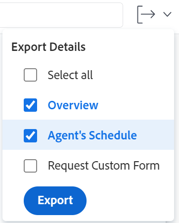

# Aufgaben bearbeiten

<!--Audited: 07/2024-->

<!--

(NOTE: some information in this area is repeated in the following articles. If you need to update a field, update it in both:

** Task finances in details

** Task information in overview)

-->

Sie können Informationen zu Aufgaben bearbeiten, die Sie erstellt haben oder für die Sie über Contribute- oder Verwaltungsberechtigungen verfügen.

## Zugriffsanforderungen

Sie müssen über folgenden Zugriff verfügen, um die Schritte in diesem Artikel ausführen zu können:

<table style="table-layout:auto"> 
 <col> 
 <col> 
 <tbody> 
  <tr> 
   <td role="rowheader">Adobe Workfront-Abo</td> 
   <td> 
Alle 
 </td> 
  </tr> 
  <tr> 
   <td role="rowheader">Adobe Workfront-Lizenz*</td> 
   <td> 
Neu: Standard

   
Aktuell: Arbeit oder höher
 </td> 
  </tr> 
  <tr> 
   <td role="rowheader">Zugriffsebene</td> 
   <td> 
Zugriff auf Aufgaben und Projekte bearbeiten
 </td> 
  </tr> 
  <tr> 
   <td role="rowheader">Objektberechtigungen</td> 
   <td> 
    <ul> 
     <li> 
Contribute berechtigt eine Aufgabe, die folgenden Informationen im Bereich "Aufgabendetails"zu bearbeiten: 

     <ul>
     <li>Beschreibung</li>
     <li>Status</li>
     </ul>  
      </li> 
     <li> 
Berechtigungen für eine Aufgabe verwalten, um alle Informationen im Bereich Details und im Feld Aufgabe bearbeiten zu bearbeiten
 </li> 
    </ul> 
    <ul> 
     <li> 
Contribute oder höhere Berechtigungen für das Projekt
 </li> 
    </ul> </td> 
  </tr> 
 </tbody> 
</table>

*Weitere Informationen finden Sie unter [Zugriffsanforderungen in der Workfront-Dokumentation](/help/quicksilver/administration-and-setup/add-users/access-levels-and-object-permissions/access-level-requirements-in-documentation.md).

## Einschränkungen bei der Bearbeitung von Aufgaben

Es gibt einige Einschränkungen, die Sie daran hindern können, Aufgaben zu bearbeiten.

Beachten Sie beim Bearbeiten von Aufgaben Folgendes:

* Aktualisieren von Benachrichtigungen für Trigger zu Aufgaben, die einen aktuellen Status aufweisen. Um Verwirrung bei Benutzern zu vermeiden, die den Aufgaben zugewiesen sind, begrenzen Sie Bearbeitungsaufgaben so weit wie möglich, wenn das Projekt den Status Aktuell aufweist.
* Sie können keine Aufgaben bearbeiten, die sich in einem Genehmigungsprozess befinden. Sie können die Zeit nur protokollieren oder den Status einer Aufgabe in einem Genehmigungsprozess aktualisieren.

  

* Sie können Dokumente nur dann bearbeiten und Aufgaben in einem Projekt hinzufügen, für das der Status &quot;Abgeschlossen&quot;, &quot;Dead&quot;oder &quot;Ausstehende Genehmigung&quot;lautet, wenn der Workfront-Administrator oder ein Gruppenadministrator diese Funktion im Bereich &quot;Projekteinstellungen&quot;aktiviert hat. Weitere Informationen zum Festlegen von Projektvoreinstellungen finden Sie unter [Konfigurieren von systemweiten Projekteigenschaften](../../../administration-and-setup/set-up-workfront/configure-system-defaults/set-project-preferences.md).

* Sie können die folgenden Informationen zu einer Aufgabe jederzeit bearbeiten, wenn das Projekt als abgeschlossen, ungültig oder in einem Genehmigungsprozess markiert wurde:

   * Zeit erfassen
   * Bestehende Ausgaben bearbeiten
   * Benutzerdefiniertes Formular anhängen

* Andere Benutzer müssen ihre Seiten aktualisieren, bevor sie die Aktualisierungen anzeigen können, die Sie an einer Aufgabe vornehmen.

## Aufgabe in einer Liste bearbeiten

Sie können Aufgabeninformationen in einer Liste von Aufgaben bearbeiten, indem Sie in der Ansicht der Liste angezeigte Inline-Bearbeitungsfelder verwenden.

Informationen zum Bearbeiten von Aufgaben in Listen finden Sie unter [Aufgaben in einer Liste bearbeiten](../../../manage-work/tasks/manage-tasks/edit-tasks-in-a-list.md).

## Bearbeiten einer Aufgabe in einer Liste mithilfe der Zusammenfassung

Sie können eine Aufgabe in einer Liste über das Bedienfeld &quot;Zusammenfassung&quot;bearbeiten. Informationen zum Bearbeiten einer Aufgabe im Bereich &quot;Zusammenfassung&quot;finden Sie im Abschnitt &quot;Aufgabe in der Zusammenfassung bearbeiten&quot;im Artikel [Aufgaben in einer Liste bearbeiten](../../../manage-work/tasks/manage-tasks/edit-tasks-in-a-list.md) .

## Bearbeiten einer Aufgabe im Feld &quot;Aufgabe bearbeiten&quot;

Sie können eine Aufgabe in den Bereichen Aufgabe bearbeiten oder Aufgabendetails bearbeiten. Die folgenden Schritte beschreiben die Bearbeitung einer Aufgabe im Feld &quot;Aufgabe bearbeiten&quot;.

{{step1-click-main-menu}}

1. Klicken Sie auf **Projekte** und dann auf den Namen eines Projekts, um es zu öffnen.
1. Klicken Sie im linken Bereich auf **Aufgaben** .
1. Klicken Sie auf die Aufgabe, die Sie bearbeiten möchten.
1. (Bedingt) Um beschränkte Informationen zu einer Aufgabe zu bearbeiten, klicken Sie im linken Bereich auf **Aufgabendetails** .

   

   Bearbeiten Sie Informationen in den folgenden Bereichen im Abschnitt Aufgabendetails :

   * **Überblick**

     Dieser Bereich wird standardmäßig erweitert.

   * **Benutzerdefinierte Formulare**

     Namen von Zollformularen werden nur angezeigt, wenn benutzerdefinierte Formulare an das Objekt angehängt sind.

   * **Finance**

   >[!NOTE]
   >
   >Je nachdem, wie Ihr Workfront-Administrator oder Gruppenadministrator Ihre Layout-Vorlage geändert hat, werden die Felder im Bereich &quot;Aufgabendetails&quot;möglicherweise neu angeordnet oder nicht angezeigt. Weitere Informationen finden Sie unter [Anpassen der Detailansicht mithilfe einer Layoutvorlage](../../../administration-and-setup/customize-workfront/use-layout-templates/customize-details-view-layout-template.md).

   Informationen zu den Feldern, die im Abschnitt &quot;Aufgabendetails&quot;angezeigt werden, erhalten Sie, wenn Sie die Aufgabe im Feld &quot;Aufgabe bearbeiten&quot;bearbeiten möchten, wie unten beschrieben.

   Gehen Sie wie folgt vor, um Informationen im Abschnitt Details zu bearbeiten:

   1. (Optional) Klicken Sie oben rechts auf das Symbol **Alle reduzieren**  , um alle Bereiche zu reduzieren.
   1. (Optional und bedingt) Wenn ein Bereich ausgeblendet wird, klicken Sie neben jedem Bereich auf den Pfeil **rechts zeigen**  , um den zu bearbeitenden Bereich zu erweitern.
   1. Weitere Informationen zum Bearbeiten von Informationen auf der Registerkarte &quot;Aufgabendetails&quot;finden Sie in den folgenden Artikeln:

      * [Verwalten von Aufgabeninformationen im Übersichtsbereich &quot;Aufgabendetails&quot;](../../../manage-work/tasks/manage-tasks/task-information-in-overview.md)
      * [Verwalten von Aufgabenfinanzen im Abschnitt &quot;Aufgabendetails&quot;](../../../manage-work/tasks/manage-tasks/task-finances-in-details.md)

   1. (Optional) Wenn der Aufgabe keine benutzerdefinierten Formulare angehängt sind, geben Sie den Namen eines Formulars in das Feld **Benutzerdefiniertes Formular hinzufügen** ein, wählen Sie es aus, wenn es in der Liste angezeigt wird, und klicken Sie dann auf **Änderungen speichern**.
   1. (Optional) Klicken Sie auf das Symbol **Exportieren** , um die Übersicht und die benutzerdefinierten Formulardaten in eine PDF-Datei zu exportieren, und klicken Sie dann auf **Exportieren**. Wählen Sie aus den folgenden Optionen aus:

      * Alle auswählen (wird nur angezeigt, wenn mindestens ein benutzerdefiniertes Formular angehängt ist)
      * Übersicht
      * Der Name eines oder mehrerer benutzerdefinierter Formulare

      Die PDF-Datei wird auf Ihren Computer heruntergeladen.

      

      Weitere Informationen finden Sie unter [Exportieren benutzerdefinierter Formulare und Objektdetails](../../../workfront-basics/work-with-custom-forms/export-custom-forms-details.md).

1. (Bedingt) Um alle Informationen über die Aufgabe zu bearbeiten, klicken Sie als Benutzer mit Verwaltungsberechtigungen für die Aufgabe auf das Menü **Mehr** neben dem Namen der Aufgabe und klicken Sie dann auf **Bearbeiten**.

   Oder

   Wählen Sie aus einer Aufgabenliste eine Aufgabe aus und klicken Sie dann oben in der Liste auf das Symbol **Bearbeiten**  .

   Das Feld Aufgabe bearbeiten wird geöffnet.

   >[!IMPORTANT]
   >
   >Sie müssen über Verwaltungsberechtigungen für die Aufgabe verfügen, um die Option &quot;Bearbeiten&quot;zu sehen.

   Alle Aufgabenfelder sind im Feld Aufgabe bearbeiten verfügbar und werden nach den im linken Bereich aufgelisteten Bereichen gruppiert.

   >[!NOTE]
   >
   >Je nachdem, wie Ihr Workfront-Administrator oder Gruppenadministrator Ihre Layout-Vorlage geändert hat, werden die Felder im Bereich &quot;Aufgabendetails&quot;möglicherweise neu angeordnet oder nicht angezeigt. Weitere Informationen finden Sie unter [Anpassen der Detailansicht mithilfe einer Layoutvorlage](../../../administration-and-setup/customize-workfront/use-layout-templates/customize-details-view-layout-template.md).

   Ziehen Sie in Erwägung, Informationen in einem der folgenden Abschnitte anzugeben:

   * [Aufgabenname](#task-name)
   * [Überblick](#overview)
   * [Arbeitsaufträge](#assignments)
   * [Benutzerdefinierte Formulare](#Custom%C2%A0F)
   * [Finance](#finance)
   * [Einstellungen](#settings)

   >[!NOTE]
   >
   >Je nachdem, wie Ihr Workfront-Administrator oder Gruppenadministrator Ihre Layout-Vorlage einrichtet, werden die Felder im Feld &quot;Aufgabe bearbeiten&quot;möglicherweise neu angeordnet oder nicht angezeigt. Weitere Informationen finden Sie unter [Anpassen der Detailansicht mithilfe einer Layoutvorlage](../../../administration-and-setup/customize-workfront/use-layout-templates/customize-details-view-layout-template.md).

### Aufgabenname {#task-name}

1. Beginnen Sie mit der Bearbeitung Ihrer Aufgabe wie oben beschrieben.
1. Klicken Sie im linken Bereich auf **Task Name** .

   

1. Aktualisieren Sie den Namen der Aufgabe.

1. Klicken Sie auf **Speichern** oder fahren Sie mit den folgenden Abschnitten fort.

### Übersicht {#overview}

1. Beginnen Sie mit der Bearbeitung Ihrer Aufgabe wie oben beschrieben.
1. Klicken Sie im linken Bereich auf **Überblick** .

   

1. Aktualisieren Sie die folgenden Informationen zur Aufgabe:

   <table style="table-layout:auto"> 
    <col> 
    <col> 
    <tbody> 
     <tr> 
      <td role="rowheader">Beschreibung</td> 
      <td>Fügen Sie zusätzliche Informationen zur Aufgabe hinzu. </td> 
     </tr> 
     <tr> 
      <td colspan="2" role="rowheader">Abschnitt mit grundlegenden Informationen </td> 
     </tr> 
     <tr> 
      <td role="rowheader">Status</td> 
      <td> 
Wählen Sie den Status der Aufgabe aus, der angibt, in welcher Entwicklungsphase sich die Aufgabe befindet.
 
<b>TIPP</b>

   Sie können den Aufgabenstatus in der Aufgabenkopfzeile aktualisieren. 
 </td>
   </tr> 
     <tr> 
      <td role="rowheader">Priorität</td> 
      <td> 
Dies ist eine visuelle Kennzeichnung, mit der Sie Ihre Aufgaben priorisieren können. 
 
Wählen Sie aus den folgenden Optionen aus: 
 
       <ul> 
      <li> 
 Keine
 </li> 
      <li> 
 Niedrig 
 </li> 
      <li> 
Normal 
 </li> 
      <li> 
Hoch 
 </li> 
      <li> 
 Dringend 
 </li> 
       </ul> 
Je nach den von Ihrem Workfront-Administrator ausgewählten Projekteinstellungen können die Prioritätsnamen für Sie unterschiedlich sein. Informationen zu Aufgabenprioritäten finden Sie unter <a href="../../../manage-work/tasks/task-information/task-priority.md" class="MCXref xref">Aufgabenpriorität aktualisieren</a>. 
 </td> 
     </tr> 
     <tr> 
      <td colspan="2" role="rowheader">Abschnitt "Aufgabendaten und Einschränkungen" </td> 
     </tr> 
     <tr> 
      <td role="rowheader">Aufgabenbeschränkung</td> 
      <td> 
Entscheiden Sie, wann die Aufgabe abgeschlossen sein muss, indem Sie eine Aufgabenbegrenzung angeben. 
 
Wählen Sie aus den folgenden Optionen aus: 
 
       <ul> 
      <li> 
Feste Datumswerte 
 
Geben Sie einen <strong>geplanten Start</strong> und ein <strong>geplantes Abschlussdatum</strong> an. 
 </li> 
      <li> 
Muss am beginnen 
 
Geben Sie ein <strong>geplantes Startdatum</strong> an. 
 </li> 
      <li> 
Muss am beendet werden 
 
Geben Sie ein <strong>geplantes Abschlussdatum</strong> an. 
 </li> 
       </ul> 
       <ul> 
      <li> 
So bald wie möglich
 </li> 
      <li> 
So bald wie möglich
 </li> 
      <li> 
Frühestmögliche Zeit
 </li> 
      <li> 
 Neueste verfügbare Zeit
 </li> 
      <li> 
Anfang nicht später als 
 </li> 
      <li> 
Angeben eines geplanten Startdatums
 </li> 
      <li> 
Anfang nicht früher als 
 
Geben Sie ein <strong>geplantes Startdatum</strong> an. 
 </li> 
      <li> 
 Beenden Sie nicht später als
 
Geben Sie ein <strong>geplantes Abschlussdatum</strong> an. 
 </li> 
      <li> 
 Beenden Sie nicht früher als
 
Angeben eines <strong>geplanten Abschlussdatums</strong>
 </li> 
       </ul> 
Weitere Informationen zur Aufgabenbegrenzung finden Sie unter <a href="../../../manage-work/tasks/task-constraints/task-constraint-overview.md" class="MCXref xref">Aufgabenbegrenzung - Übersicht</a>.
 </td> 
     </tr> 
     <tr> 
      <td role="rowheader">Datum und Uhrzeit der Veröffentlichung</td> 
      <td> 
Dies ist das Datum, bis zu dem der Aufgabe zugewiesene Benutzer verpflichtet, sie abzuschließen. Dies kann vom geplanten Abschlussdatum abweichen. Nur Bevollmächtigte können dieses Feld bearbeiten. Weitere Informationen zu den Zusendedaten in Workfront finden Sie unter <a href="../../../manage-work/projects/updating-work-in-a-project/overview-of-commit-dates.md" class="MCXref xref">Übersicht über das Veröffentlichungsdatum</a>. 
 </td> 
     </tr> 
     <tr> 
      <td role="rowheader">Geplantes Startdatum und geplante Startzeit</td> 
      <td> 
Wann die Aufgabe beginnen soll. Das geplante Startdatum einer Aufgabe wird durch eine Reihe von Faktoren bestimmt und beeinflusst:
 
       <ul> 
      <li>Je nach systemweiter Voreinstellung für das geplante Startdatum der Aufgabe kann das Anfangsdatum einer neuen Aufgabe für ein Projekt entweder heute oder standardmäßig das Anfangsdatum des Projekts sein. Der Gruppenadministrator für die mit dem Projekt verknüpfte Gruppe kann diese Voreinstellung auch für die Gruppe festlegen. Weitere Informationen zu den Aufgabenvoreinstellungen auf Systemebene oder Gruppenebene finden Sie unter <a href="../../../administration-and-setup/set-up-workfront/configure-system-defaults/set-task-issue-preferences.md" class="MCXref xref">Konfigurieren von systemweiten Aufgaben und Ausgabevoreinstellungen</a>.</li> 
      <li>Je nach den Vorgängern der Aufgabe wählt Workfront das geplante Startdatum als nächstes Verfügbarkeitsdatum aus, nachdem die Vorgängerbeziehung beendet oder begonnen hat. Weitere Informationen zu Vorgängerbeziehungen finden Sie unter <a href="../../../manage-work/tasks/use-prdcssrs/predecessors-overview.md" class="MCXref xref">Übersicht über Aufgabenvorherigen</a>.</li> 
      <li>Der Projektmanager oder Aufgabenbesitzer kann das geplante Startdatum manuell festlegen, wenn die Aufgabenbegrenzung entweder "Feste Datumswerte"oder "Muss am"lautet. Weitere Informationen zu Aufgabenbegrenzungen finden Sie unter <a href="../../../manage-work/tasks/task-constraints/task-constraint-overview.md" class="MCXref xref">Übersicht über Aufgabenbegrenzungen</a>.</li> 
       </ul> </td> 
     </tr> 
     <tr> 
      <td role="rowheader">Geplantes Abschlussdatum und -zeit</td> 
      <td> 
Das erwartete Abschlussdatum, wie zum Zeitpunkt der Aufgabenplanung angezeigt. Workfront legt das geplante Abschlussdatum mithilfe der folgenden Faktoren fest:
 
       <ul> 
      <li>Das geplante Abschlussdatum wird ausgehend vom geplanten Startdatum berechnet, indem die Dauer der Aufgabe zum geplanten Startdatum hinzugefügt wird. Wenn der Projektmanager oder Workfront die Dauer der Aufgabe angibt, kann dieser Trigger das geplante Abschlussdatum aktualisieren. Wenn sich das geplante Datum ändert, liegt dies häufig daran, dass die Dauer der Aufgabe aktualisiert wurde.</li> 
      <li>Der Projektmanager oder Aufgabenbesitzer kann das geplante Abschlussdatum manuell festlegen, wenn die Aufgabenbegrenzung entweder "Feste Datumswerte"oder "Muss abgeschlossen am"lautet. Weitere Informationen zu Aufgabenbegrenzungen finden Sie unter <a href="../../../manage-work/tasks/task-constraints/task-constraint-overview.md" class="MCXref xref">Übersicht über Aufgabenbegrenzungen</a>.</li> 
      <li>Wenn sich der Dauer-Typ der Aufgabe ändert und sich die Anzahl der Ressourcen für die Aufgaben gleichzeitig ändert, ändert sich auch das geplante Abschlussdatum. Weitere Informationen zu Dauer-Typen finden Sie unter <a href="../../../manage-work/tasks/taskdurtn/task-duration-and-duration-type.md" class="MCXref xref">Übersicht über Aufgabendauer und -dauer</a>.</li> 
       </ul> </td> 
     </tr> 
     <tr> 
      <td role="rowheader">Tatsächliches Startdatum und -zeit</td> 
      <td> 
Geben Sie ein tatsächliches Startdatum für die Aufgabe an. Der Standardwert wird normalerweise automatisch ausgefüllt, wenn Sie den Status der Aufgabe in "Wird ausgeführt"ändern. Das tatsächliche Startdatum kann auch vom Projektmanager oder Aufgabenbesitzer manuell geändert werden. 
 </td> 
     </tr> 
     <tr> 
      <td role="rowheader">Datum und Uhrzeit des tatsächlichen Abschlusses</td> 
      <td> 
Geben Sie das Datum und die Uhrzeit an, zu der die Aufgabe abgeschlossen ist. Das Standarddatum und die Standardzeit, zu der eine Aufgabe abgeschlossen wird, entsprechen immer dem Zeitpunkt, zu dem der Status Abgeschlossen wird. Das tatsächliche Abschlussdatum kann auch manuell vom Projektmanager oder Aufgabenbesitzer geändert werden. 
 </td> 
     </tr> 
     <tr> 
      <td role="rowheader"><b>Arbeitszeitabschnitt</b></td> 
     </tr> 
     <tr> 
      <td role="rowheader">Work Effort </td> 
      <td>

   
Der für die Ausführung der Aufgabe erforderliche Arbeitsaufwand. Ihr Projektmanager kann beschließen, dieses Feld anstelle von "Geplante Stunden"zu verwenden, um den Aufwand abzuschätzen, der zum Abschließen einer Aufgabe erforderlich ist. Dieses Feld ist nur sichtbar, wenn die folgenden Bedingungen erfüllt sind:
 
      <ul> 
      <li> 
Die Aufgabe hat einen einfachen Dauerhaltungstyp. 
 
<b>TIPP</b>

   Wenn Sie den Aufgabentyp ändern, wird dieses Feld abgeblendet. 
 </li>
   <li>Ihr Projektmanager hat die Option "Use Work Effort"aktiviert, um die Aufgabe "Geplante Stunden"für das Projekt automatisch zu berechnen. </li> 
      </ul> 
      
Wählen Sie aus den folgenden Optionen aus:
 
      <ul> 
      <li>Klein</li> 
      <li>Medium  (dies ist der Standardwert für eine neue Aufgabe)</li> 
      <li>Groß</li> 
      </ul> 
      
<b>NOTIZ</b>

   Durch die Aktualisierung des Aufwands kann die Aufgabe &quot;Geplante Stunden&quot;aktualisiert werden. Die Aktualisierung ist sofort möglich, wenn der Projektaktualisierungstyp Automatisch ist. Wenn der Projektaktualisierungstyp manuell ist, müssen Sie die Timeline neu berechnen, um die aktualisierten geplanten Stunden anzuzeigen. 

   
Informationen zur Verwendung von "Arbeitsaufwand"anstelle von "Geplante Stunden"zur Schätzung des Aufgabenaufwands finden Sie unter <a href="../../../manage-work/tasks/task-information/work-effort.md" class="MCXref xref">Arbeitsaufwand - Übersicht</a>. 
 
    </td> 
     </tr> 
    </tbody> 
   </table>

1. Klicken Sie auf **Speichern** oder fahren Sie mit den folgenden Abschnitten fort.

### Arbeitsaufträge {#assignments}

1. Beginnen Sie mit der Bearbeitung Ihrer Aufgabe wie oben beschrieben.
1. Klicken Sie im linken Bereich auf **Zuweisungen** .

   

1. Klicken Sie auf **Personen, Rollen und Teams durchsuchen** und geben Sie den Namen eines Benutzers, einer Rolle oder eines Teams ein, den/das Sie der Aufgabe zuweisen möchten, und klicken Sie dann auf die Aufgabe oder drücken Sie die Eingabetaste , wenn sie in der Liste angezeigt wird.

   >[!NOTE]
   >
   >Wenn der Name des Benutzers ein Sonderzeichen enthält, müssen Sie das Sonderzeichen in das Suchfeld einfügen.

   >[!TIP]
   >
   >Sie können mehrere Benutzer, Auftragsrollen oder Teams zuweisen. Sie können nur aktive Benutzer, Stellenrollen und Teams zuweisen.
   >
   >Wenn ein Benutzer, eine Rolle oder ein Team zugewiesen wurde, bevor sie deaktiviert wurden, bleiben sie dem Arbeitselement zugewiesen. In diesem Fall empfehlen wir Folgendes:
   >
   >* Weisen Sie das Arbeitselement aktiven Ressourcen erneut zu.
   >* Verknüpfen Sie die Benutzer in einem deaktivierten Team mit einem aktiven Team und weisen Sie das Arbeitselement dem aktiven Team erneut zu.

1. (Optional) Geben Sie an, ob ein Bevollmächtigter der Aufgabe der primäre Bevollmächtigte ist, indem Sie neben seinem Namen das Optionsfeld **Inhaber** auswählen. Ein Team kann nicht der Hauptverantwortliche einer Aufgabe sein.
1. (Bedingt und optional) Aktualisieren Sie die folgenden Felder:

   <table style="table-layout:auto"> 
    <col> 
    <col> 
    <tbody> 
     <tr> 
      <td role="rowheader">Dauertyp</td> 
      <td> 
Dadurch wird die Beziehung zwischen folgenden Elementen identifiziert: 
 
       <ul> 
      <li> 
Die Anzahl der Ressourcen, die einer Aufgabe zugewiesen sind 
 </li> 
      <li> 
Der zum Abschließen der Aufgabe erforderliche Gesamtaufwand 
 </li> 
      <li> 
 Die Gesamtdauer der Aufgabe. 
 </li> 
       </ul> 
Ihr Workfront-Administrator oder Gruppenadministrator wählt die Standardeinstellung für den Dauerhaltungstyp für die Aufgaben in Ihrem System oder Ihrer Gruppe aus. Weitere Informationen zum Festlegen der Projektnormen finden Sie unter <a href="../../../administration-and-setup/set-up-workfront/configure-system-defaults/set-project-preferences.md" class="MCXref xref">Systemweite Projekteigenschaften konfigurieren</a>. 
 
Mit den Ereignistypen können Sie konsistente Ressourcenzuweisungen entsprechend den Anforderungen der Aufgabe festlegen. Weitere Informationen zum Dauer-Typ einer Aufgabe finden Sie unter <a href="../../../manage-work/tasks/taskdurtn/task-duration-and-duration-type.md" class="MCXref xref">Übersicht über Aufgabendauer und -dauer</a>. 
 
Wählen Sie aus den folgenden Optionen aus: 
 
       <ul> 
      <li> 
Berechnete Zuweisung 
 </li> 
      <li> 
 Berechnete Arbeit 
 </li> 
      <li> 
Leistungsgesteuert 
 </li> 
      <li> 
Einfach
 </li> 
       </ul> </td> 
     </tr> 
     <tr data-mc-conditions="QuicksilverOrClassic.Quicksilver"> 
      <td role="rowheader">Dauer pro Termin</td> 
      <td> 
Dies wird nur bei den übergeordneten wiederkehrenden Aufgaben angezeigt. Er zeigt die Dauer jeder wiederkehrenden Aufgabe an, wie sie bei der Erstellung der Aufgabe definiert wurde. Informationen zum Erstellen wiederkehrender Aufgaben finden Sie unter <a href="../../../manage-work/tasks/create-tasks/create-recurring-tasks.md" class="MCXref xref">Erstellen wiederkehrender Aufgaben</a>. 
 
 <b>NOTE</b>

   Die in einzelnen wiederkehrenden Aufgaben geänderten Zeiträume zeigen nicht den in diesem Feld angegebenen Wert an. 
 </td>
   </tr> 
     <tr> 
      <td role="rowheader">Dauer</td> 
      <td> 
      
 
      
 
      
Dies ist der Zeitraum, in dem Sie einer Aufgabe erlauben, offen zu bleiben, bevor sie abgeschlossen wird. 
 
      
<b>WICHTIG</b>

   Da die Aufgabendauer normalerweise die Zeit zwischen dem geplanten Start und dem geplanten Abschlussdatum ist, wirkt sich dies auf die Zeitleiste des Projekts aus.

   
Gehen Sie wie folgt vor, um die Dauer der Aufgabe und die Zeiteinheit anzugeben:
 
      <ul> 
      <li> 
Geben Sie die Zeitdauer ein und wählen Sie aus den im Dropdown-Menü verfügbaren Zeiteinheiten aus.
 
<b>TIPP</b>

      Wenn Sie die Dauer von Aufgaben in einer Aufgabenliste aktualisieren, können Sie die Abkürzung für die Zeiteinheit verwenden. 
 </li> 
      </ul> 
      
 In der folgenden Tabelle können Sie aus den Optionen für die reguläre Zeit oder die verstrichene Zeit auswählen: 
 
      <table style="table-layout:auto"> 
      <col> 
      <col data-mc-conditions=""> 
      <tbody> 
      <tr> 
      <td>Zeiteinheit</td> 
      <td>Abkürzung</td> 
      </tr> 
      <tr> 
      <td>Minuten</td> 
      <td>M</td> 
      </tr> 
      <tr> 
      <td>Stunden</td> 
      <td>H</td> 
      </tr> 
      <tr> 
      <td>Tage. Dies ist die Standardeinstellung. </td> 
      <td>D</td> 
      </tr> 
      <tr> 
      <td>Wochen</td> 
      <td>W </td> 
      </tr> 
      <tr> 
      <td>Monate</td> 
      <td>D</td> 
      </tr> 
      <tr> 
      <td>Verstrichene Minuten</td> 
      <td>EM</td> 
      </tr> 
      <tr> 
      <td>Verstrichene Stunden</td> 
      <td>EH</td> 
      </tr> 
      <tr> 
      <td>Verstrichene Tage</td> 
      <td>ED</td> 
      </tr> 
      <tr> 
      <td>Verstrichene Wochen</td> 
      <td>EW</td> 
      </tr> 
      <tr> 
      <td>Verstrichene Monate</td> 
      <td>ET</td> 
      </tr> 
      </tbody> 
   </table>

   
<b>NOTIZ</b>

   
Die verstrichene Zeit ist eine Zeiteinheit für die Dauer einer Aufgabe. Dies ist die Zeit zwischen dem geplanten Startdatum und dem geplanten Abschlussdatum einer Aufgabe, die Feiertage, Wochenenden und eine Verspätung umfasst. Mit anderen Worten, vergangene Zeit ist der Durchgang von Kalendertagen.

   Bei der regulären Zeit werden Feiertage, Wochenenden und eine Zeitüberschreitung berücksichtigt und von der Dauer der Aufgabe ausgeschlossen. Weitere Informationen zur Aufgabendauer finden Sie unter <a href="../../../manage-work/tasks/taskdurtn/task-duration-and-duration-type.md" class="MCXref xref">Übersicht über Aufgabendauer und -dauer</a>. 

   
 
   
 </td> 
   </tr> 
   <tr> 
   <td role="rowheader">Geplante Stunden</td> 
   <td> 
Geben Sie die Anzahl der geplanten Stunden für die Aufgabe in Stunden an. Dies ist die tatsächliche Zeit, die die Bevollmächtigten der Aufgabe benötigen würden, um sie abzuschließen. Sie können die Anzahl der geplanten Stunden für eine Aufgabe nur angeben, wenn für den Typ der Dauer die Option "Berechnete Zuweisung"ausgewählt ist. Weitere Informationen zu Dauer-Typen finden Sie unter <a href="../../../manage-work/tasks/taskdurtn/task-duration-and-duration-type.md" class="MCXref xref">Übersicht über Aufgabendauer und -dauer</a>.
 
   <b>NOTE</b>
   

   Bei der Erstellung wiederkehrender Aufgaben sind die geplanten Stunden die Aufgaben jedes Vorkommens. Die geplanten Stunden der übergeordneten Aufgaben entsprechen der Gesamtzahl aller geplanten Stunden von allen Vorkommen. Informationen zum Erstellen wiederkehrender Aufgaben finden Sie unter <a href="../../../manage-work/tasks/create-tasks/create-recurring-tasks.md" class="MCXref xref">Erstellen wiederkehrender Aufgaben</a>.
   

   </td> 
   </tr> 
   <tr> 
   <td role="rowheader">Zuteilung</td> 
   <td> 
Wenn Ihre Aufgabenbegrenzung "Berechnete Arbeit"oder "Aufwand gesteuert"ist, geben Sie für jeden Bevollmächtigten den Wert <strong>Zuordnung %</strong> (Zuordnungsprozentsatz) an. Dies ist die Zeit ab dem Zeitplan des Bevollmächtigten, die er für diese Aufgabe verbringen kann. Wenn Sie den Zuordnungsprozentsatz für einen Verantwortlichen ändern, ändern sich die geplanten Stunden einer Aufgabe. 
 
Wenn die Aufgabenbegrenzung einfach ist, können Sie Folgendes angeben:
 
      <ul> 
      <li> 
Zuweisungszeiten für jeden Bevollmächtigten.
 </li> 
      <li> 
Geplante Stunden der Aufgabe
 </li> 
      <li> 
Dauer der Aufgabe
 </li> 
      </ul> </td> 
   </tr> 
   <tr> 
   <td role="rowheader">Rolle des Zugewiesenen</td> 
   <td> 
Wählen Sie eine Rolle aus dem Dropdownmenü <strong>Rolle des Bevollmächtigten</strong> aus, wenn Sie eine Person als Bevollmächtigten ausgewählt haben. Dies ist die Rolle, die der Bevollmächtigte für diese Aufgabe erfüllen kann. 
 
<b>TIPP</b>

   Im Dropdown-Menü werden nur die mit jedem Bevollmächtigten in seinem Profil verknüpften Vorgangsrollen angezeigt.
 </td>
   </tr> 
      </tbody> 
      </table>

1. Klicken Sie auf **Speichern** oder fahren Sie mit den folgenden Abschnitten fort.

### Benutzerdefinierte Formulare

Sie können benutzerdefinierte Standardformulare definieren, die automatisch an Aufgaben angehängt werden, wenn die Aufgaben einem Projekt hinzugefügt werden. Weitere Informationen zum Einrichten des Projekts, das benutzerdefinierte Standardformulare für Aufgaben für alle neuen Aufgaben enthält, finden Sie im Abschnitt &quot;Aufgaben&quot;im Artikel [Projekte bearbeiten](../../../manage-work/projects/manage-projects/edit-projects.md).

1. Beginnen Sie mit der Bearbeitung der Aufgabe wie oben beschrieben.
1. Klicken Sie im linken Bereich auf **Benutzerdefinierter Forms** oder klicken Sie auf den Namen eines benutzerdefinierten Formulars, falls es bereits angehängt ist.

   

1. Klicken Sie auf **Benutzerdefiniertes Formular hinzufügen** und wählen Sie das benutzerdefinierte Formular oder die Formulare aus, die Sie mit der Aufgabe verknüpfen möchten. Sie müssen die benutzerdefinierten Formulare erstellen, bevor sie in diesem Feld ausgewählt werden können. In der Liste werden nur aktive benutzerdefinierte Formulare angezeigt.

   Weitere Informationen zum Erstellen benutzerdefinierter Formulare finden Sie unter [Erstellen oder Bearbeiten eines benutzerdefinierten Formulars](../../../administration-and-setup/customize-workfront/create-manage-custom-forms/create-or-edit-a-custom-form.md). Sie können einer Aufgabe bis zu zehn benutzerdefinierte Formulare hinzufügen.

1. (Bedingt) Wenn Sie ein benutzerdefiniertes Formular an die Aufgabe angehängt haben, bearbeiten Sie alle Felder im Formular. Sie müssen alle erforderlichen Felder angeben, bevor Sie die Aufgabe speichern können.

   >[!NOTE]
   >
   >Je nachdem, wie Ihr Workfront-Administrator die Berechtigungen für die Abschnitte in Ihrem benutzerdefinierten Formular festgelegt hat, können nicht alle die gleichen Felder in einem bestimmten benutzerdefinierten Formular anzeigen oder bearbeiten. Die Berechtigungen zum Bearbeiten von Feldern in einem Abschnitt eines benutzerdefinierten Formulars hängen von den Berechtigungen ab, die Sie für die Aufgabe selbst haben. Weitere Informationen zum Festlegen von Aufgabenberechtigungen finden Sie unter [Freigeben einer Aufgabe](../../../workfront-basics/grant-and-request-access-to-objects/share-a-task.md).

1. Klicken Sie auf **Speichern** oder fahren Sie mit den folgenden Abschnitten fort.

### Finanzielle Details {#finance}

1. Beginnen Sie mit der Bearbeitung Ihrer Aufgabe, wie im Abschnitt [Aufgaben bearbeiten](#Edit2) in diesem Artikel beschrieben.
1. Klicken Sie im linken Bereich auf **Finance** .

   

1. Aktualisieren Sie die folgenden Felder:

   <table style="table-layout:auto"> 
    <col> 
    <col> 
    <tbody> 
     <tr> 
      <td role="rowheader">Kostenart</td> 
      <td> 
Geben Sie den Kostentyp für die Aufgabe an. Auf diese Weise wird bestimmt, wie die Kosten der Aufgabe basierend auf der Anzahl der Stunden für die Aufgaben berechnet werden. 
 
Wählen Sie aus den folgenden Optionen aus: 
 
       <ul> 
        <li> 
Keine Kosten
 </li> 
        <li> 
Festgelegt pro Stunde 
 </li> 
        <li> 
 Benutzer pro Stunde 
 </li> 
        <li> 
 Stundensatz nach Funktion
 </li> 
       </ul> 
Weitere Informationen zu Tracking-Kosten finden Sie unter <a href="../../../manage-work/projects/project-finances/track-costs.md" class="MCXref xref">Tracking-Kosten</a> . Ihr Workfront-Administrator oder Gruppenadministrator wählt die Standardeinstellung für den Kostentyp für die Aufgaben in Ihrem System oder Ihrer Gruppe aus. Weitere Informationen zum Festlegen der Projektnormen finden Sie unter <a href="../../../administration-and-setup/set-up-workfront/configure-system-defaults/set-project-preferences.md" class="MCXref xref">Systemweite Projekteigenschaften konfigurieren</a> .
 </td> 
     </tr> 
     <tr> 
      <td role="rowheader">Umsatztyp</td> 
      <td> 
Geben Sie den Umsatztyp für die Aufgabe an. Auf diese Weise wird bestimmt, wie der Umsatz aus der Aufgabe basierend auf der Anzahl der Stunden für die Aufgaben berechnet wird. 
 
Wählen Sie aus den folgenden Optionen aus: 
 
       <ul> 
      <li> 
 Nicht fakturierbar 
 </li> 
      <li> 
Benutzer pro Stunde 
 </li> 
      <li> 
Stundensatz nach Funktion 
 </li> 
      <li> 
Festgelegt pro Stunde 
 </li> 
      <li> 
Benutzende pro Stunde mit Begrenzung 
 </li> 
      <li> 
Stundensatz nach Funktion mit Begrenzung 
 </li> 
      <li> 
Benutzer pro Stunde plus festgelegt 
 </li> 
      <li> 
Stundensatz nach Funktion plus fest 
 </li> 
      <li> 
Festeinnahmen 
 </li> 
       </ul> 
Weitere Informationen zum Tracking von Umsätzen finden Sie unter<a href="../../../manage-work/projects/project-finances/billing-and-revenue-overview.md" class="MCXref xref">Übersicht über Rechnungsstellung und Umsatz</a> . 
 
Ihr Workfront-Administrator oder Gruppenadministrator wählt die standardmäßige Einstellung "Umsatztyp"für die Aufgaben in Ihrem System oder Ihrer Gruppe aus. Weitere Informationen zum Festlegen der Projektnormen finden Sie unter <a href="../../../administration-and-setup/set-up-workfront/configure-system-defaults/set-project-preferences.md" class="MCXref xref">Systemweite Projekteigenschaften konfigurieren</a>.
 </td> 
     </tr> 
    </tbody> 
   </table>

1. Klicken Sie auf **Speichern** oder fahren Sie mit dem folgenden Abschnitt fort.

### Einstellungen {#settings}

1. Beginnen Sie mit der Bearbeitung Ihrer Aufgabe, wie im Abschnitt [Aufgaben bearbeiten](#Edit2) in diesem Artikel beschrieben.
1. Klicken Sie im linken Bereich auf **Einstellungen** .

   

1. Aktualisieren Sie die folgenden Felder:

   <table style="table-layout:auto"> 
    <col> 
    <col> 
    <tbody> 
     <tr> 
      <td role="rowheader">Überwachungsmodus</td> 
      <td> 
Geben Sie an, wie der Fortschritt der Aufgabe verfolgt werden soll. 
 
Wählen Sie aus den folgenden Optionen aus: 
 
       <ul> 
      <li> 
 Benutzer muss aktualisieren 
 </li> 
      <li> 
Zeitliche Annahme 
 </li> 
      <li> 
Späte Warnungen ignorieren
 </li> 
      <li> 
 Automatische Vervollständigung 
 </li> 
      <li> 
Vorgänger 
 </li> 
       </ul> 
Weitere Informationen zum Tracking-Modus für Aufgaben finden Sie unter <a href="../../../manage-work/tasks/task-information/task-tracking-mode.md" class="MCXref xref">Übersicht über den Task Tracking Mode</a>.
 </td> 
     </tr> 
     <tr> 
      <td role="rowheader">Ressourcenabgleich</td> 
      <td> 
Wählen Sie das Feld <strong>Von Ressourcenebene ausschließen</strong> aus, wenn die der Aufgabe zugewiesenen Ressourcen von der Leerung ausgeschlossen werden sollen.
 </td> 
     </tr> 
     <tr> 
      <td role="rowheader">Abgleichsverzögerung</td> 
      <td> 
Geben Sie die Verzögerung auf Stundenbasis an. 
 
 Weitere Informationen zu Levelverzögerungen finden Sie unter <a href="../../../manage-work/tasks/task-information/task-leveling-delay.md" class="MCXref xref">Verzögerung auf Aufgabenebene aktualisieren</a>. 
 </td> 
     </tr> 
     <tr> 
      <td role="rowheader">Genehmigungsprozess</td> 
      <td> 
Wählen Sie einen Validierungsprozess aus, den Sie mit der Aufgabe verknüpfen möchten. Ihr Workfront-Administrator muss Validierungsprozesse auf Systemebene definieren, bevor Sie sie mit Aufgaben verknüpfen können. Benutzer mit Administratorzugriff auf Genehmigungsprozesse können auch gruppenspezifische Validierungsprozesse erstellen. 
 
Weitere Informationen zum Erstellen von Genehmigungsprozessen finden Sie unter <a href="../../../administration-and-setup/customize-workfront/configure-approval-milestone-processes/create-approval-processes.md">Erstellen eines Genehmigungsprozesses für Arbeitselemente</a>. Beachten Sie beim Hinzufügen von Validierungsprozessen Folgendes: 
 
       <ul>

   <li> 
In der Liste werden nur aktive Validierungsprozesse angezeigt. 
 </li>

   <li> 
Systemweite und gruppenspezifische Validierungsprozesse werden in der Liste angezeigt. Ein Genehmigungsprozess, der mit einer anderen Gruppe als der des Projekts verknüpft ist, wird nicht in der Liste angezeigt. 

   
<b>WICHTIG</b>

   Wenn sich die Gruppe des Projekts ändert, wird der zuvor angehängte gruppenspezifische Validierungsprozess zu einem Validierungsprozess für die einmalige Verwendung. Weitere Informationen dazu, wie sich Änderungen an der Gruppe des Projekts oder am Genehmigungsprozess auf die Genehmigungseinstellungen auswirken, finden Sie unter <a href="../../../administration-and-setup/customize-workfront/configure-approval-milestone-processes/how-changes-affect-group-approvals.md">Auswirkungen von Änderungen am Gruppen- und Genehmigungsprozess auf zugewiesene Genehmigungsprozesse</a>. 

   </li>

   <li> 
Sie können Standardgenehmigungsverfahren definieren, die automatisch an Aufgaben angehängt werden, wenn die Aufgaben einem Projekt hinzugefügt werden. Weitere Informationen zum Einrichten des Projekts, um standardmäßige Aufgabengenehmigungsprozesse einzuschließen, finden Sie im Abschnitt "Aufgaben"im Artikel <a href="../../../manage-work/projects/manage-projects/edit-projects.md" class="MCXref xref">Projekte bearbeiten</a>. 
 </li>

   <li> 
Bei der Massenbearbeitung von Aufgaben gibt es die folgenden Szenarien: 
 
      <ul> 
      <li> 
Wenn Sie mehrere Aufgaben aus derselben Gruppe auswählen, werden in diesem Feld sowohl Validierungsprozesse auf Systemebene als auch auf Gruppenebene angezeigt. 
 </li> 
      <li> 
Wenn Sie mehrere Aufgaben aus verschiedenen Gruppen auswählen, werden in diesem Feld nur Validierungsprozesse auf Systemebene angezeigt. 
 </li> 
      <li> 
Wenn an eine der Aufgaben ein Validierungsprozess für die einmalige Verwendung angehängt wird, wird dieser durch den von Ihnen ausgewählten Validierungsprozess auf Systemebene oder Gruppenebene ersetzt. 
 </li>

   </ul> </li> 
      </ul> </td> 
     </tr> 
    </tbody> 
   </table>
    </li>

1. Klicken Sie auf **Speichern**.

<!--notes from the table: 
(NOTE: this bullet stays here although the sections it might appear in are QS only, so we can use the snippet for both Qs and classic)
       -->

## Bearbeiten einer Aufgabe in der Aufgabenkopfzeile (begrenzt)

Sie können eine begrenzte Anzahl von Informationen in der Aufgabenüberschrift bearbeiten.

Ihr System- oder Gruppenadministrator kann die in der Aufgabenüberschrift angezeigten Felder anpassen. Weitere Informationen finden Sie unter [Anpassen von Objektüberschriften mithilfe einer Layoutvorlage](../../../administration-and-setup/customize-workfront/use-layout-templates/customize-object-headers.md).

Die folgenden Felder sind standardmäßig in der Aufgabenüberschrift enthalten:

* Name der Aufgabe
* Prozent abgeschlossen
* Arbeitsaufträge
* Geplantes Abschlussdatum

  >[!CAUTION]
  >
  >Einige Aufgabenbeschränkungen und andere Abhängigkeiten können die Bearbeitung dieses Felds verhindern. Informationen zu Aufgabenbeschränkungen finden Sie unter [Aufgabenbegrenzung - Übersicht](../../../manage-work/tasks/task-constraints/task-constraint-overview.md).

* Status
* Entscheidungsfindung bei Genehmigungseinstellungen, wenn Sie in einem aktuellen Genehmigungsprozess als Genehmiger festgelegt sind

## Stapelweises Bearbeiten von Aufgaben

Sie können Aufgaben stapelweise in einer Liste bearbeiten und alle zugehörigen Informationen gleichzeitig aktualisieren, wenn Sie die Änderungen, die Sie an Aufgaben in der Liste vornehmen, automatisch speichern.

Informationen zum Speichern von Aufgaben in großen Mengen finden Sie im Abschnitt &quot;Aufgaben stapelweise bearbeiten&quot;im Artikel [Aufgaben in einer Liste bearbeiten](../../../manage-work/tasks/manage-tasks/edit-tasks-in-a-list.md).
