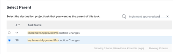

# Verschieben von Aufgaben

<!--Audited: 5/2025-->

<!--The highlighted information on this page refers to functionality not yet generally available. It is available only in the Preview environment for all customers. After the monthly releases to Production, the same features are also available in the Production environment for customers who enabled fast releases.    

For information about fast releases, see [Enable or disable fast releases for your organization](/help/quicksilver/administration-and-setup/set-up-workfront/configure-system-defaults/enable-fast-release-process.md). -->

Sie können Aufgaben in Adobe Workfront zwischen den folgenden Objekten verschieben:

* Eine Ad-hoc-Aufgabe für ein Projekt.
* Eine Aufgabe von einem Projekt in ein anderes Projekt.
* Eine Aufgabe aus einem Projekt unter einem anderen übergeordneten Element in einem anderen Projekt.
* Eine Aufgabe innerhalb desselben Projekts unter einem anderen übergeordneten Element.

Sie können eine Aufgabe auf Aufgabenebene verschieben oder eine Aufgabe aus einer Liste von Aufgaben verschieben.

Sie können eine einzelne Aufgabe verschieben oder mehrere Aufgaben gleichzeitig aus einer Aufgabenliste verschieben.

## Zugriffsanforderungen

+++ Erweitern, um die Zugriffsanforderungen für die in diesem Artikel beschriebene Funktionalität anzuzeigen. 

<table style="table-layout:auto"> 
 <col> 
 <col> 
 <tbody> 
  <tr> 
   <td role="rowheader">Adobe Workfront-Paket</td> 
   <td> 
Beliebig
 </td> 
  </tr> 
  <tr> 
   <td role="rowheader">Adobe Workfront-Lizenz</td> 
   <td> 
Standard 
 
 
Work oder höher
 </td> 
  </tr> 
  <tr> 
   <td role="rowheader">Konfigurationen der Zugriffsebene</td> 
   <td> 
Zugriff auf Aufgaben und Projekte bearbeiten
 </td> 
  </tr> 
  <tr> 
   <td role="rowheader">Objektberechtigungen</td> 
   <td> 
Verwalten der Berechtigungen für die Aufgaben
 
Tragen Sie Berechtigungen oder höhere Berechtigungen zum Projekt mit der Möglichkeit zum Hinzufügen von Aufgaben bei
  </td> 
  </tr> 
 </tbody> 
</table>

Weitere Informationen finden Sie unter [Zugriffsanforderungen in der Dokumentation zu Workfront](/help/quicksilver/administration-and-setup/add-users/access-levels-and-object-permissions/access-level-requirements-in-documentation.md).

+++

<!--Old:

<table style="table-layout:auto"> 
 <col> 
 <col> 
 <tbody> 
  <tr> 
   <td role="rowheader">Adobe Workfront plan</td> 
   <td> 
Any
 </td> 
  </tr> 
  <tr> 
   <td role="rowheader">Adobe Workfront license</td> 
   <td> 
New: Standard 
 
 
or
  

Current: Work or higher 
 </td> 
  </tr> 
  <tr> 
   <td role="rowheader">Access level configurations</td> 
   <td> 
Edit access to Tasks and Projects
 </td> 
  </tr> 
  <tr> 
   <td role="rowheader">Object permissions</td> 
   <td> 
Manage permissions to the tasks
 
Contribute or higher permissions to the project with ability to Add Tasks
  </td> 
  </tr> 
 </tbody> 
</table>-->

## Überlegungen zum Verschieben von Aufgaben

Beachten Sie beim Verschieben einer Aufgabe Folgendes:

* Ihr System- oder Gruppenadministrator kann verhindern, dass Aufgaben, für die Stunden protokolliert wurden, verschoben werden, je nachdem, wie er die Einstellung Benutzern erlauben, Aufgaben zu verschieben konfiguriert hat, und welche Probleme mit protokollierten Stunden im Bereich Setup auftreten. Weitere Informationen finden Sie [Konfigurieren von systemweiten Aufgaben- und Problemvoreinstellungen](/help/quicksilver/administration-and-setup/set-up-workfront/configure-system-defaults/set-task-issue-preferences.md).

* Wenn Sie eine Aufgabe von einem Projekt in ein anderes verschieben, werden die Aufgabentermine möglicherweise neu berechnet. Bei der Neuberechnung werden der Zeitplan, den das neue Projekt verwendet, und die Zeitplaninformationen des Projekts aus berücksichtigt.

* Während des Verschiebungsvorgangs können Sie einige mit der Aufgabe verknüpfte Elemente in die verschobene Aufgabe verschieben. Standardmäßig werden die folgenden Objekte jedoch an die verschobene Aufgabe übertragen:

   * Probleme
   * Protokollierte Stunden
   * Benutzerkommentare
   * Benutzerdefinierte Formulare und Informationen zu benutzerdefinierten Feldern
   * Teilaufgaben

* Standardmäßig werden die folgenden Elemente nicht mit der Aufgabe verschoben:

   * Meilensteine

## Verschieben von Aufgaben in einer Liste

{{step1-to-projects}}

1. Wählen **auf der** „Projekte“ das Projekt aus, das die zu verschiebende(n) Aufgabe(n) enthält.
1. Klicken Sie **linken** auf „Aufgaben“, um die Aufgabenliste anzuzeigen.
1. Klicken Sie auf das **Planmodus**-Symbol  und stellen Sie sicher, dass der **Automatische Speicherung** aktiviert ist. Wählen Sie dann die Aufgabe(n) aus, die Sie verschieben möchten.

   

   >[!IMPORTANT]
   >
   >Aufgaben können nicht verschoben werden, wenn der Umschalter **Automatisches Speichern** deaktiviert ist.

1. (Optional und bedingt) Wenn Sie die ausgewählten Aufgaben innerhalb desselben Projekts verschieben möchten, klicken Sie auf die ausgewählten Aufgaben und ziehen Sie sie dann per Drag-and-Drop an die Position, an die sie im Projekt verschoben werden sollen. Die Aufgabenhierarchie ändert sich sofort und die mit den einzelnen Aufgaben verknüpften Informationen werden mit den Aufgaben verschoben.

1. (Bedingt) Wählen Sie die Aufgabe(n) aus, die Sie verschieben möchten, und führen Sie einen der folgenden Schritte aus:

   * Klicken Sie auf das **Mehr**-Menü  oben in der Aufgabenliste und klicken Sie dann auf **Verschieben nach**.
   * Klicken Sie mit der rechten Maustaste auf die ausgewählten Aufgaben und dann auf **Verschieben nach**.
   * Klicken Sie bei der Auswahl einer Aufgabe auf das **Mehr** Menü  neben dem Aufgabennamen in der Liste und klicken Sie dann auf **Verschieben nach**.

   Das **Aufgabe verschieben** wird angezeigt.

1. Fahren Sie mit dem Verschieben der Aufgabe fort, wie im Abschnitt [Verschieben einer Aufgabe auf Aufgabenebene](#move-a-task-at-the-task-level) in diesem Artikel beschrieben.

   <!--
   is this still accurate?!
   -->

## Verschieben einer Aufgabe auf Aufgabenebene {#move-a-task-at-the-task-level}

Sie können eine Aufgabe nicht nur aus einer Aufgabenliste verschieben, sondern auch nach dem Öffnen auf Aufgabenebene.

1. Suchen Sie nach einer Aufgabe in Ihrem Workfront-System.
1. Klicken Sie auf den Namen der Aufgabe, um sie zu öffnen.
1. Klicken Sie auf das **Mehr** Dropdown-Menü  neben dem Aufgabennamen und dann auf **Verschieben nach**. Das **Seitenbedienfeld „Aufgabe verschieben** wird angezeigt.

1. (Optional) Aktualisieren Sie den **Aufgabennamen**. Die Aufgabe wird mit dem neuen Namen an den neuen Speicherort verschoben.

   >[!TIP]
   >
   >Das **Aufgabenname** ist abgeblendet und kann nicht bearbeitet werden, wenn mehrere Aufgaben in einer Liste verschoben werden. Sie können den Mauszeiger über das Feld **Aufgabenname** bewegen, woraufhin eine Liste aller ausgewählten Aufgaben angezeigt wird.
   >
   >
   >

1. Geben Sie **Feld „Zielprojekt**&quot; den Namen des Projekts ein, in das die Aufgabe verschoben werden soll. Wenn Sie die Aufgabe innerhalb desselben Projekts verschieben möchten, geben Sie den Namen des aktuellen Projekts ein.

   >[!TIP]
   >
   >* Beim Projektnamen wird zwischen Groß- und Kleinschreibung unterschieden.
   >* Sie können nach einem Projekt suchen, indem Sie die Referenznummer eingeben oder die ID des Projekts eingeben. Auf diese Weise können Sie zwischen Projekten mit identischen Namen unterscheiden.
   >* In der Liste werden nur 100 Projekte angezeigt.

1. (Bedingt) Wenn Sie keinen Zugriff auf das Projekt haben, klicken Sie auf **Zugriff anfordern**.
1. (Bedingt) Verschiebt die Aufgabe in das Zielprojekt, ohne Zugriff anzufordern, wenn ihr Zugriff zum Hinzufügen von Aufgaben zu einer der Aufgaben im Zielprojekt habt.

   

   >[!TIP]
   >
   >Ähnliche Meldungen werden angezeigt, wenn das ausgewählte Projekt ausstehend, genehmigt, abgeschlossen oder eingestellt ist, wenn der Workfront-Administrator verhindert, dass Aufgaben zu diesen Projekten hinzugefügt werden. Weitere Informationen finden Sie unter [Systemweite Projektvoreinstellungen konfigurieren](../../../administration-and-setup/set-up-workfront/configure-system-defaults/set-project-preferences.md).

1. (Optional) Heben Sie im **Optionen** die Auswahl eines der in der folgenden Tabelle aufgelisteten Elemente auf, um sie aus den verschobenen Aufgaben zu entfernen. Alle Optionen sind standardmäßig ausgewählt.

   >[!IMPORTANT]
   >
   >Wenn Sie Elemente in der **Optionen**-Liste deaktivieren, gehen Daten verloren. Informationen aus der vorhandenen Aufgabe werden entfernt und können nicht wiederhergestellt werden.

   <table style="table-layout:auto"> 
    <col> 
    <col> 
    <tbody> 
     <tr> 
      <td role="rowheader">Alle auswählen</td> 
      <td>Deaktivieren Sie diese Option, um alle Informationen aus der Aufgabe zu entfernen, wenn Sie sie an die neue Position verschieben. </td> 
     </tr> 
     <tr> 
      <td role="rowheader">Beschränkung</td> 
      <td> 
Die Aufgabenbeschränkung wird auf So bald wie möglich oder So spät wie möglich basierend auf der Einstellung des Projektzeitplanmodus festgelegt.
 
 Wenn diese Option aktiviert ist, wird die aktuelle Einschränkung der Aufgabe mit der Aufgabe übertragen. 
 
      
Hinweis: Wenn ein Vorgang mit datumsspezifischen Einschränkungen in ein anderes Projekt verschoben oder kopiert wird und die Einschränkungstermine des Vorgangs außerhalb der neuen Projekttermine liegen, wird entweder die Aufgabenbeschränkung auf „So bald wie möglich“ oder „So spät wie möglich“ geändert oder die geplanten Start- oder Abschlussdaten der Projekte werden angepasst.

   Im Folgenden finden Sie Beispiele für datumsspezifische Einschränkungen:
   <ul>
      <li> Starten am</li>
      <li> Muss beendet werden am</li>
      <li> Nicht früher anfangen als</li>
      <li> Nicht später anfangen als</li>
      </ul>

   Weitere Informationen finden Sie unter <a href="../../../manage-work/tasks/task-constraints/task-constraint-overview.md" class="MCXref xref">Übersicht über die Aufgabenbeschränkung</a>.
 </td>
   </tr> 
     <tr> 
      <td role="rowheader">Arbeitsaufträge</td> 
      <td> 
Alle Zuweisungen werden aus der Aufgabe entfernt. 
 </td> 
     </tr> 
     <tr> 
      <td role="rowheader">Genehmigungsprozess</td> 
      <td>Alle Genehmigungsprozesse werden aus der Aufgabe entfernt.</td> 
     </tr> 
     <tr> 
      <td role="rowheader">Fortschritt</td> 
      <td>Der Aufgabenstatus ist auf „Neu“ festgelegt. Andernfalls wird der vorhandene Aufgabenstatus beibehalten. </td> 
     </tr> 
     <tr> 
      <td role="rowheader">Finanzinformationen</td> 
      <td>Die Finanzinformationen für die Aufgabe werden entfernt und Workfront aktualisiert den Kostentyp der Aufgabe auf „Keine Kosten“ und den Umsatztyp der Aufgabe als „Nicht fakturierbar“. </td> 
     </tr> 
     <tr> 
      <td role="rowheader">Alle Vorgänger</td> 
      <td> 
Wenn diese Option ausgewählt ist, wird die Abhängigkeit zu einem projektübergreifenden Vorgänger, wenn Sie die Aufgabe in ein anderes Projekt verschieben. 
 </td> 
     </tr> 
     <tr> 
      <td role="rowheader">Dokumente</td> 
      <td> 
Die an die Aufgabe angehängten Dokumente werden nicht an die verschobene Aufgabe übertragen. Dazu gehören Versionen, Testsendungen und verknüpfte Dokumente.
 
Dies umfasst keine Dokumentengenehmigungen. Dokumentgenehmigungen können beim Verschieben einer Aufgabe nicht verschoben werden.
 
      
Hinweis: Wenn Sie die Dokumente nicht mit der Aufgabe verschieben möchten, werden die Dokumente gelöscht und für 30 Tage in den Papierkorb gelegt. Ein Administrator kann sie wiederherstellen und sie werden bei der verschobenen Aufgabe wiederhergestellt. 

   
Wenn die Aufgabe nach dem Verschieben gelöscht wird, werden die wiederhergestellten Dokumente im Bereich Dokumente der Benutzerseite des Administrators platziert, der sie wiederherstellt.

   </td> 
     </tr> 
     <tr> 
      <td role="rowheader">Erinnerungsnachrichten</td> 
      <td>Die Aufgabenerinnerungen werden nicht an die verschobene Aufgabe übertragen. </td> 
     </tr> 
     <tr> 
      <td role="rowheader">Ausgaben</td> 
      <td>Die für die Aufgabe protokollierten Ausgaben werden nicht auf die verschobene Aufgabe übertragen. </td> 
     </tr> 
     <tr> 
      <td role="rowheader">Berechtigungen</td> 
      <td> 
Workfront entfernt die Namen aller Entitäten, die in der Freigabeliste der Aufgabe angezeigt werden. 
 </td> 
     </tr> 
    </tbody> 
   </table>

1. (Optional) Wählen Sie im **Übergeordnetes Element auswählen** die Aufgabe im Zielprojekt aus, die der verschobenen Aufgabe übergeordnet werden soll.

   >[!TIP]
   >
   >Wenn Sie auswählen, dass mehrere Aufgaben in einer Liste verschoben werden sollen, werden alle ausgewählten Aufgaben zu untergeordneten Aufgaben des ausgewählten übergeordneten Elements.

   Wählen Sie ein übergeordnetes Element aus, indem Sie einen der folgenden Schritte ausführen:

   * Wählen Sie in der Aufgabenliste eines der übergeordneten Elemente im Projektplan aus.
   * Klicken Sie auf das Suchsymbol  und suchen Sie nach einer übergeordneten Aufgabe anhand des Namens.

   Die Aufgabe wird in der Liste angezeigt.

   

   >[!NOTE]
   >
   >Wenn Sie keine übergeordnete Aufgabe auswählen, werden die Aufgaben nicht als Teilaufgaben, sondern als Hauptaufgaben verschoben und am Ende der Aufgabenliste im Zielprojekt platziert.

1. Klicken Sie **Aufgabe verschieben**. Die Aufgaben werden entweder als Teilaufgaben an eine übergeordnete Aufgabe oder als letzte Aufgaben im Projekt in das angegebene Projekt verschoben.
