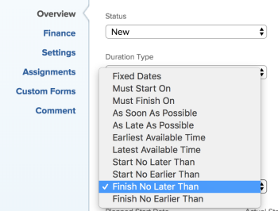

# Überblick über Aufgabenbeschränkungen: Nicht später beenden als (NSBA)

„Spätestes Ende“ (FNLT) ist eine Aufgabenbeschränkung, die einen Vorgang so terminiert, dass er vor dem angegebenen Datum abgeschlossen wird.

## Übersicht über die Bedingung „Spätestens am“

Beachten Sie Folgendes, wenn Sie die Einschränkung Beenden nicht später als (FNLT) für eine Aufgabe verwenden:

* Sie sollten diese Einschränkung verwenden, wenn das Projekt ab Startdatum geplant wird. In diesem Fall können Sie eine weiche Begrenzung für eine Aufgabe bereitstellen, bevor andere abhängige Aufgaben als gefährdet angezeigt werden.
* Wenn Sie die FNLT-Beschränkung mit einem Projekt „Zeitplan ab Abschlussdatum“ verwenden, plant diese Beschränkung die Aufgabe so, wie es bei einer Aufgabe mit möglichst spätem Datum der Fall wäre.
* Wenn Sie einen Vorgang mit einer FNET-Einschränkung in ein anderes Projekt verschieben oder kopieren, kann sich die Einschränkung für den Vorgang oder die Termine des Projekts ändern, je nachdem, welche Einschränkungstermine es gibt und welches Start- und Abschlussdatum das Projekt hat. Die folgenden Szenarien sind vorhanden:

   * Wenn das Zielprojekt von Anfang an geplant ist:

      * Wenn das Einschränkungsdatum der Aufgabe vor dem geplanten Startdatum des Projekts liegt, ändert sich die Aufgabenbeschränkung in So bald wie möglich.
      * Wenn das Einschränkungsdatum der Aufgabe nach dem geplanten Abschlussdatum des Projekts liegt, ändert sich das geplante Abschlussdatum des Projekts entsprechend dem Einschränkungsdatum der Aufgabe.

      * Wenn das Zielprojekt für den Abschluss geplant ist:

         * Wenn das Einschränkungsdatum der Aufgabe nach dem Abschlussdatum des Projekts liegt, ändert sich die Aufgabenbeschränkung in So spät wie möglich.
         * Wenn das Einschränkungsdatum der Aufgabe vor dem geplanten Startdatum des Projekts liegt, ändert sich das geplante Startdatum des Projekts, sodass es dem Starteinschränkungsdatum der Aufgabe entspricht.

      * Wenn das Einschränkungsdatum der Aufgabe innerhalb des Start- und Abschlussdatums des Projekts liegt, gibt es unabhängig vom Projektplan keine Änderungen an der Aufgabenbeschränkung oder den Projektdaten.

  Informationen zum Verschieben von Aufgaben finden Sie unter [Aufgaben verschieben](../../../manage-work/tasks/manage-tasks/move-tasks.md). Informationen zum Kopieren von Aufgaben finden Sie unter [Aufgaben kopieren und duplizieren](../../../manage-work/tasks/manage-tasks/copy-and-duplicate-tasks.md).

Informationen zum Aktualisieren der Aufgabenbeschränkung für eine Aufgabe finden Sie unter [Aktualisieren der Aufgabenbeschränkung einer Aufgabe](../../../manage-work/tasks/task-constraints/update-task-constraint-of-task.md).

<!--

<h2>Use the Finish No Later Than constraint</h2>

To update the Task Constraint to Finish No Later Than:

<ol>
<li value="1">Go to a task whose Task Constraint you want to update.</li>
<li value="2"> 
Click the <strong>More</strong> icon  next to the task name, then click <strong>Edit</strong>.
 </li>
<li value="3">In the <strong>Overview</strong> section, expand the <strong>Task Constraint</strong> drop-down menu.</li>
<li value="4"> 
Select <strong>Finish No Later Than</strong>.
 
  
 </li>
<li value="5"> 
Specify a <strong>Planned Completion Date</strong>.
 
You must complete the task on and not later than this date. 
 </li>
<li value="6">Click <strong>Save Changes</strong>.</li>
</ol>

-->
