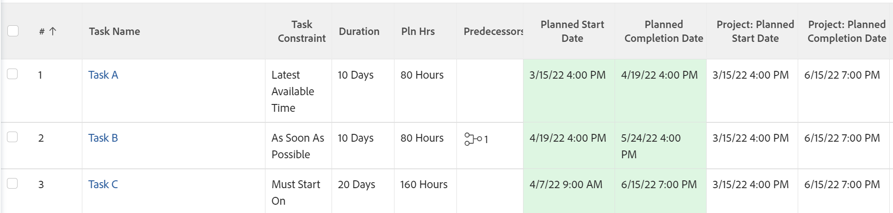

# Überblick über Aufgabenbeschränkungen: Spätestmögliche Zeit

Latest Available Time (LAT) ist eine Art von Aufgabenbeschränkung in Adobe Workfront.

## Letzte verfügbare Zeitaufgabenbeschränkung verwenden

Sie können die letzte Einschränkung verwenden, wenn Sie einen Vorgang so planen möchten, dass er zum spätestens verfügbaren Zeitpunkt beginnt, nachdem Sie Vorgänger-Nachfolger-Beziehungen im Projekt berücksichtigt haben.

Diese Einschränkung unterscheidet sich von So bald wie möglich insofern, als sie keine Neuplanung von Vorgängern oder Nachfolgern erzwingt. Stattdessen wirkt sich dies nur auf den Zeitplan der Aufgabe aus, mit der es verknüpft ist, und setzt sie auf die neueste verfügbare Zeit, basierend auf ihrer Beziehung zu anderen Aufgaben.

Informationen zum Aktualisieren der Aufgabenbeschränkung für eine Aufgabe finden Sie unter [Aktualisieren der Aufgabenbeschränkung einer Aufgabe](../../../manage-work/tasks/task-constraints/update-task-constraint-of-task.md).

<!--

To update the Task Constraint to Latest Available Time:

(NOTE: replaced with new article linked above) 

<ol>
<li value="1">Go to a task whose Task Constraint you want to update.</li>
<li value="2"> 
Click the <strong>More</strong> icon  next to the task name, then click <strong>Edit</strong>.
 </li>
<li value="3">In the <strong>Overview</strong> section, expand the <strong>Task Constraint</strong> drop-down menu.</li>
<li value="4"> 
Select <strong>Latest Available Time</strong>.
 </li>
<li value="5">Click <strong>Save Changes</strong>.</li>
</ol>

-->

## Die Differenz zwischen der neuesten verfügbaren Zeit und so spät wie möglich

<!--

(NOTE: [! This section is duplicated in "As Late As Possible"] - inserted snippet in both (Alina)) 

-->

Die Zeitbeschränkung „Zuletzt verfügbar“ unterscheidet sich von der Beschränkung „So spät wie möglich“, wenn die folgenden Kriterien vorliegen:

* Das Projekt ist ab dem Startdatum geplant
* Aufgaben im Projekt haben eine Vorgängerbeziehung
* Die Nachfolgeaufgabe weist eine flexible Aufgabenbeschränkung auf

In dieser Situation:

* **Letzte verfügbare Zeit**: Bei Verwendung der Zeitbeschränkung „Letzte verfügbare Zeit“ für die Vorgängeraufgabe hat die flexible Beschränkung des Nachfolgers Priorität.

  **Beispiel:** Zum Beispiel ist Aufgabe A ein Vorgänger von Aufgabe B. Aufgabe A hat die neueste verfügbare Zeitbeschränkung und Aufgabe B hat die so bald wie möglich-Beschränkung. In diesem Fall wird Aufgabe A so nahe wie möglich am Beginn des Projekts geplant.

  

* **So spät wie möglich:** In diesem Szenario wird bei Verwendung der Einschränkung So spät wie möglich für die Vorgängeraufgabe die Priorität der Vorgängeraufgabe zugewiesen.

  **Beispiel:** Zum Beispiel ist Aufgabe A ein Vorgänger von Aufgabe B. Aufgabe A hat die Einschränkung So spät wie möglich und Aufgabe B hat die Einschränkung So bald wie möglich. In diesem Fall wird Aufgabe A so nah wie möglich am Ende des Projekts geplant.

  

<!--

(NOTE: this content was here before but it was wrong - according to this issue in Hub, per Dev, the correct functionality is in the snippet above: https://hub.workfront.com/task/6193c6910004bce9de07cda7757f3ce8/updates?email-source=subscribedCommunication) 

The Latest Available Time constraint differs from the As Late As Possible constraint when the following criteria exist:

<ul>
<li> The project is scheduled From Completion </li>
<li> Tasks in the project have a predecessor relationship </li>
<li> The predecessor task has a flexible task constraint </li>
</ul>

 In this situation: 

<ul>
<li> 
<strong>Latest Available Time:</strong> Using the Latest Available Time constraint on the successor task gives priority to flexible constraint of the predecessor.
 
For example, Task A is a predecessor to Task B. Task B has the Latest Available Time constraint and Task A has the As Soon As Possible constraint. In this situation, Task B is scheduled as close to the start of the project as possible.
 </li>
<li> 
<strong>As Late As Possible:</strong> In this scenario, using the As Late As Possible constraint on the successor task gives the priority to the successor task.
 
For example, Task A is a predecessor to Task B. Task B has the As Late As Possible constraint and Task A has the As Soon As Possible constraint. In this situation, Task B is scheduled as close to the end of the project as possible.
 </li>
</ul>

-->
