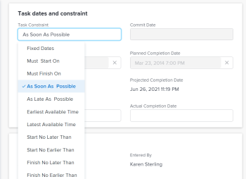

# Aktualisieren der Aufgabenbeschränkung einer Aufgabe

Aufgabenbeschränkungen bestimmen, wann eine Aufgabe in einem Projekt beginnen und enden soll. Weitere Informationen finden Sie unter [Übersicht über die Aufgabenbeschränkung](../../../manage-work/tasks/task-constraints/task-constraint-overview.md).

## Zugriffsanforderungen

+++ Erweitern, um die Zugriffsanforderungen für die in diesem Artikel beschriebene Funktionalität anzuzeigen. 

<table style="table-layout:auto"> 
 <col> 
 <col> 
 <tbody> 
  <tr> 
   <td role="rowheader">Adobe Workfront-Paket</td> 
   <td> 
Beliebig
 </td> 
  </tr> 
  <tr> 
   <td role="rowheader">Adobe Workfront-Lizenz</td> 
   <td>
Standard
 
   
Work oder höher
 </td> 
  </tr> 
  <tr> 
   <td role="rowheader">Konfigurationen der Zugriffsebene</td> 
   <td> 
Zugriff auf Projekte anzeigen oder höher
 
Zugriff auf Aufgaben bearbeiten
</td> 
  </tr> 
  <tr> 
   <td role="rowheader">Objektberechtigungen</td> 
   <td> 
Zugriff auf die Aufgabe verwalten
</td> 
  </tr> 
 </tbody> 
</table>

Weitere Informationen finden Sie unter [Zugriffsanforderungen in der Dokumentation zu Workfront](/help/quicksilver/administration-and-setup/add-users/access-levels-and-object-permissions/access-level-requirements-in-documentation.md).

+++

<!--
Old:

<table style="table-layout:auto"> 
 <col> 
 <col> 
 <tbody> 
  <tr> 
   <td role="rowheader">Adobe Workfront plan*</td> 
   <td> 
Any 
 </td> 
  </tr> 
  <tr> 
   <td role="rowheader">Adobe Workfront license*</td> 
   <td> 
Work or higher
 </td> 
  </tr> 
  <tr> 
   <td role="rowheader">Access level configurations*</td> 
   <td> 
View or higher access to Projects
 
Edit access to Tasks
 
Note: If you still don't have access, ask your Workfront administrator if they set additional restrictions in your access level. For information on how a Workfront administrator can modify your access level, see <a href="../../../administration-and-setup/add-users/configure-and-grant-access/create-modify-access-levels.md" class="MCXref xref">Create or modify custom access levels</a>.
 </td> 
  </tr> 
  <tr> 
   <td role="rowheader">Object permissions</td> 
   <td> 
Manage access to the task 
 
For information on requesting additional access, see <a href="../../../workfront-basics/grant-and-request-access-to-objects/request-access.md" class="MCXref xref">Request access to objects </a>.
 </td> 
  </tr> 
 </tbody> 
</table>
-->

## Aktualisieren der Aufgabenbeschränkung einer Aufgabe

1. Klicken Sie auf **Hauptmenü** > **Projekte** und dann auf ein Projekt, um darauf zuzugreifen.
1. Klicken Sie auf **Abschnitt** Aufgaben“ im linken Bereich.
1. Klicken Sie **linken Bereich auf** Aufgabendetails“ und dann im Bereich Übersicht auf **Aufgabenbeschränkung**.

   

1. Wählen Sie aus den folgenden Optionen aus

   | Feste Daten | Weitere Informationen finden Sie unter [Übersicht über die Aufgabenbeschränkung: Feste Daten](../../../manage-work/tasks/task-constraints/fixed-dates.md). |
   |---|---|
   | Muss beginnen am | Weitere Informationen finden Sie unter [Übersicht über die Aufgabenbeschränkung: Muss beginnen am](../../../manage-work/tasks/task-constraints/must-start-on.md). |
   | Muss beendet werden am | Weitere Informationen finden Sie unter [Übersicht über die Aufgabenbeschränkung: Muss abgeschlossen sein am](../../../manage-work/tasks/task-constraints/must-finish-on.md). |
   | So bald wie möglich (SBWM) | Weitere Informationen finden Sie unter [Übersicht über die Aufgabenbeschränkung: So bald wie möglich](../../../manage-work/tasks/task-constraints/as-soon-as-possible.md). |
   | So spät wie möglich (SSWM) | Weitere Informationen finden Sie unter [Übersicht über die Aufgabenbeschränkung: So spät wie möglich](../../../manage-work/tasks/task-constraints/as-late-as-possible.md). |
   | Frühestmögliche Zeit | Weitere Informationen finden Sie unter [Übersicht über die Aufgabenbeschränkung: Früheste verfügbare Zeit](../../../manage-work/tasks/task-constraints/earliest-available-time.md). |
   | Spätestmögliche Zeit | Weitere Informationen finden Sie unter [Übersicht über die Aufgabenbeschränkung: Letzte verfügbare Zeit](../../../manage-work/tasks/task-constraints/latest-available-time.md). |
   | Nicht später anfangen als | Weitere Informationen finden Sie unter [Übersicht über die Aufgabenbeschränkung: Spätestens beginnen am](../../../manage-work/tasks/task-constraints/start-no-later-than.md). |
   | Nicht früher anfangen als | Weitere Informationen finden Sie unter [Übersicht über die Aufgabenbeschränkung: Nicht früher starten als](../../../manage-work/tasks/task-constraints/start-no-earlier-than.md). |
   | Nicht später beenden als (NSBA) | Weitere Informationen finden Sie unter [Übersicht über die Aufgabenbeschränkung: Spätestes Beenden bis](../../../manage-work/tasks/task-constraints/finish-no-later-than.md). |
   | Nicht früher beenden als (NFBA) | Weitere Informationen finden Sie unter [Übersicht über die Aufgabenbeschränkung: Nicht früher als &#x200B;](../../../manage-work/tasks/task-constraints/finish-no-earlier-than.md). |

   {style="table-layout:auto"}

1. Klicken Sie **Speichern** **Änderungen**.

