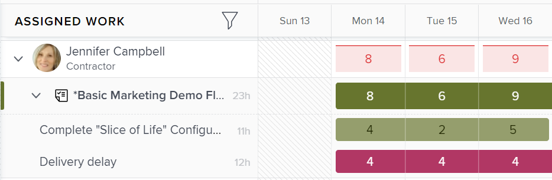

# Übersicht über geplante Stunden

<!-- Audited: 01/2024 -->

Die mit einer Aufgabe, einem Problem oder einem Projekt verknüpften geplanten Stunden stellen die Zeit dar, die die zugewiesenen Benutzer benötigen, um die Aufgabe, das Problem oder das Projekt abzuschließen.

## Überlegungen zum Stundenplan in Adobe Workfront

* Geplante Stunden sind in erster Linie mit Arbeitselementen (Aufgaben und Problemen) in Adobe Workfront verknüpft. Die geplanten Stunden von Arbeitselementen werden auf die geplanten Stunden ihrer Projekte hochgerechnet.
* Standardmäßig verteilt Workfront die geplanten Stunden für Aufgaben und Probleme gleichmäßig auf alle Tage der Aufgaben- oder Problemdauer.
* Wenn Benutzende und Rollen Aufgaben und Problemen zugewiesen werden, werden die geplanten Stunden aus den Aufgaben und Problemen mit Benutzenden- oder Rollenzuweisungen verknüpft.
* Wenn Sie die Ressourcenverwaltungstools in Workfront verwenden möchten, müssen Sie den Wert der geplanten Stunden für Aufgaben und Probleme definieren.
* Sie können den Wert der geplanten Stunden für Aufgaben nur für einige Dauertypen ändern.

  Weitere Informationen zur Änderung der geplanten Stunden für Aufgaben in Bezug auf den Dauertyp der Aufgaben finden Sie im Abschnitt [Aktualisieren der geplanten Stunden für Aufgaben basierend auf dem ](#update-task-planned-hours-based-on-duration-type)) in diesem Artikel.

* Sie können den Wert der geplanten Stunden für Probleme jederzeit ändern.
* Der Wert der geplanten Stunden von Projekten oder übergeordneten Aufgaben kann nicht geändert werden, da es sich um die berechnete Summe aller geplanten Stunden aller zugehörigen Aufgaben und Teilaufgaben handelt.
* Die Verwaltung von Benutzerzuordnungen mithilfe von Tools zur Ressourcenverwaltung kann die Anzahl der geplanten Stunden für Aufgaben, Probleme und Projekte sowie die Anzahl der Zuordnungen ändern, die mit Arbeitselementen verknüpft sind.

## Geplante Stunden für Aufgaben vs. Geplante Stunden für Projekte {#planned-hours-on-tasks-vs-planned-hours-on-projects}

Geplante Stunden von Aufgaben werden zu den geplanten Stunden des Projekts aggregiert. Geplante Stunden aus Problemen werden nicht immer auf die geplanten Stunden des Projekts hochgerechnet.

In diesem Abschnitt werden die Unterschiede zwischen der Aufgabe und den geplanten Stunden des Projekts beschrieben. Außerdem wird beschrieben, wo Sie die geplanten Stunden für das Problem anzeigen können, die für das Projekt berechnet werden.

### Geplante Stunden für Aufgaben {#planned-hours-on-tasks}

Die geplanten Stunden einer Aufgabe geben an, wie viel Zeit die tatsächliche Arbeit an der Aufgabe voraussichtlich in Anspruch nehmen wird. Standardmäßig verteilt Workfront die gesamte geplante Arbeitszeit während der Laufzeit einer Aufgabe gleichmäßig auf jeden Tag. Die tägliche Anzahl geplanter Stunden wird zur täglichen Zuordnung für die Aufgabe. Wenn die Aufgabe mehreren Ressourcen zugewiesen ist, wird standardmäßig jeder Ressource die gleiche Anzahl täglicher Stunden zugewiesen.

Mithilfe des Workload Balancer können Sie die täglichen Zuweisungen für die Benutzer ändern, die den Aufgaben zugewiesen sind. Dadurch können auch die geplanten Stunden der Aufgabe aktualisiert werden, wenn der Dauertyp der Aufgabe „Einfach“ ist. Weitere Informationen finden Sie im Abschnitt „Geplante Stunden für die Aktualisierung von Aufgaben bei der Verwaltung von Benutzerzuweisungen“ im Artikel [Verwalten von Benutzerzuweisungen im Workload-Balancer](../../../resource-mgmt/workload-balancer/manage-user-allocations-workload-balancer.md).

Wenn eine Aufgabe Teilaufgaben enthält, ist die geplante Stunde der übergeordneten Aufgabe die Summe aller geplanten Stunden für alle Teilaufgaben. Die geplanten Stunden einer übergeordneten Aufgabe können nicht aktualisiert werden.

>[!NOTE]
>
>Im Gegensatz zu „Geplante Stunden“ werden die tatsächlichen Stunden einer übergeordneten Aufgabe direkt in der übergeordneten Aufgabe protokolliert. Sie stellen keine Summe der tatsächlichen Stunden der untergeordneten Aufgaben dar.\
>Weitere Informationen zu den tatsächlichen Stunden finden Sie unter [Tatsächliche Stunden anzeigen](../../../manage-work/tasks/task-information/actual-hours.md).

### Geplante Stunden für Projekte {#planned-hours-on-projects}

Die Anzahl der geplanten Stunden für ein Projekt kann nicht bearbeitet werden. Geplante Stunden für ein Projekt sind die Summe aller geplanten Stunden aus allen Aufgaben im Projekt.

Ob Probleme in die Berechnung der geplanten Stunden einbezogen werden, hängt von der Position innerhalb des Projekts ab, in der die geplanten Stunden angezeigt werden. Die geplanten Stunden für ein Projekt können an den folgenden Speicherorten innerhalb eines Projekts angezeigt werden:

* **Abschnitt „Projektdetails“ und im Feld „Projekt bearbeiten** werden nur die geplanten Stunden für die Aufgaben im Projekt berücksichtigt. Die geplanten Stunden für die Probleme im Projekt werden nicht berücksichtigt, wenn die Gesamtzahl der geplanten Stunden für das Projekt im Abschnitt „Projektdetails“ oder im Feld „Projekt bearbeiten“ angezeigt wird.

* **Der Workload-Balancer**: Im Workload-Balancer für Projekte werden nur die geplanten Stunden angezeigt, die mit den Aufgaben verknüpft sind, die im Workload-Balancer sichtbar sind. Durch tägliche Benutzerzuweisungen können die täglichen geplanten Stunden des Projekts im Workload Balancer geändert werden.
* **Abschnitt „Nutzung**: Die geplanten Stunden, die mit den Benutzern verknüpft sind, die den Aufgaben zugewiesen wurden, und die Probleme im Projekt werden berücksichtigt, wenn die Gesamtzahl der geplanten Stunden für das Projekt im Abschnitt „Nutzung“ angezeigt wird.
* **Bedienfeld „Rollenzuweisung** in der Aufgabenliste: Die geplanten Stunden für die Aufgaben und Probleme im Projekt, die einem Aufgabengebiet oder einem mit einem Aufgabengebiet verbundenen Benutzer zugewiesen sind, werden in diesem Bereich angezeigt. Geplante Stunden im Zusammenhang mit Aufgaben und Problemen, die nicht zugewiesen oder Teams zugewiesen sind, werden in diesem Bereich nicht angezeigt. Weitere Informationen finden Sie unter [Anzeigen der geplanten Stunden für das Projekt im Bedienfeld „Rollenzuweisung“](../../../manage-work/projects/planning-a-project/view-planed-hours-in-role-allocation-panel.md).

## Verteilung der geplanten Stunden über die Dauer einer Aufgabe

Standardmäßig verteilt Workfront die geplanten Stunden gleichmäßig auf die Dauer einer Aufgabe, wobei für jeden Aufgabentag die gleiche Anzahl geplanter Stunden entsprechend der Verfügbarkeit des Projektplans zugewiesen wird.

Wenn beispielsweise eine Aufgabe so eingestellt ist, dass sie um 16 Uhr beginnt, und der Aufgabenplan am ersten Tag der Aufgabe eine Stunde übrig hat, gibt Workfront am ersten Tag der Aufgabendauer eine geplante Stunde ein und teilt dann den Rest der geplanten Stunden gleichmäßig auf die restlichen Tage in der Aufgabendauer auf.

>[!NOTE]
>
>Die „Geplante Stunden pro Tag“ oder die tägliche Zuordnung entspricht der Zuordnung der geplanten Stunden für jeden Tag während der Aufgabendauer. Wenn die Aufgabe über eine Zuweisung verfügt, stellt diese Zahl die geplanten Stunden pro Tag und Zuweisung dar. Wenn die Aufgabe mehrere Zuweisungen hat, unterscheidet sich die geplante Stunde pro Tag und Zuweisung von der geplanten Stunde pro Tag für die Aufgabe. In Workfront gibt es keine visuelle Darstellung der geplanten Stunden pro Tag und Zuweisung für Aufgaben mit mehreren Zuweisungen.

## Werte für geplante Stunden suchen und verstehen

Die Werte für „Geplante Stunden“ finden Sie in verschiedenen Bereichen von Workfront.

Die Anzahl der angezeigten geplanten Stunden stammt entweder von den Arbeitselementen im Projekt oder wird je nach Bereich und Objekt, in dem sie angezeigt werden, anders berechnet.

Geplante Stunden finden Sie in den folgenden Bereichen von Workfront:

* [Der Abschnitt „Details“ eines Projekts, einer Aufgabe oder eines Problems](#the-details-section-of-a-project-task-or-issue)
* [Das Feld „Aufgabe bearbeiten“ oder „Problem bearbeiten“](#the-edit-task-or-edit-issue-box)
* [Berichte](#reports)
* [Der Workload Balancer](#the-workload-balancer)
* [Der Ressourcenplaner](#the-resource-planner)
* [Der Auslastungsbericht](#the-utilization-report)
* [Das Bedienfeld „Rollenzuweisung“](#the-role-allocation-panel)

### Der Abschnitt „Details“ eines Projekts, einer Aufgabe oder eines Problems {#the-details-section-of-a-project-task-or-issue}

Die geplanten Stunden im Abschnitt „Details“ einer Aufgabe, eines Problems oder Projekts sind die geplanten Gesamtstunden, die mit dem Element verknüpft sind.

Weitere Informationen zu den geplanten Stunden für das Projekt finden Sie [ Abschnitt „Geplante Stunden für Aufgaben vs. Geplante Stunden für Projekte](#planned-hours-on-tasks-vs-planned-hours-on-projects) in diesem Artikel.

### Das Feld „Aufgabe bearbeiten“ oder „Problem bearbeiten“ {#the-edit-task-or-edit-issue-box}

Die geplanten Stunden im Feld „Bearbeiten“ einer Aufgabe oder eines Problems entsprechen den geplanten Gesamtstunden des jeweiligen Elements.

Weitere Informationen zu den geplanten Stunden für das Projekt finden Sie [ Abschnitt „Geplante Stunden für Aufgaben vs. Geplante Stunden für Projekte](#planned-hours-on-tasks-vs-planned-hours-on-projects) in diesem Artikel.

Bei Aufgaben können Sie die Anzahl der geplanten Stunden nur für bestimmte Dauertypen bearbeiten. Weitere Informationen finden Sie im Abschnitt [Aktualisieren der geplanten Stunden auf der Grundlage ](#update-task-planned-hours-based-on-duration-type) Dauertyps“ in diesem Artikel.

Sie können die individuelle Zuordnung der geplanten Stunden für jeden Benutzer oder jedes Aufgabengebiet anzeigen, der bzw. das der Aufgabe oder dem Problem im Bereich „Zuweisungen“ zugewiesen wurde.

### Berichte {#reports}

Sie können das Feld „Geplante Stunden“ in Projekt-, Aufgaben- und Problemberichten hinzufügen.

Die Spalte Geplante Stunden ist standardmäßig in der Standardansicht einer Aufgabenliste enthalten.

Die geplanten Stunden in einem Aufgaben-, Problem- oder Projektbericht sind die geplanten Gesamtstunden des jeweiligen Elements, wie sie im Abschnitt „Details“ oder im Feld „Bearbeiten“ der Elemente angezeigt werden.

Informationen zum Erstellen von Berichten finden Sie [Erstellen eines benutzerdefinierten Berichts](../../../reports-and-dashboards/reports/creating-and-managing-reports/create-custom-report.md).

>[!NOTE]
>
>Wenn Sie einen Projektbericht (finanzielle Daten) erstellen und ihn nach Datum gruppieren, kann es sein, dass in den geplanten Stunden je nach Zeitleiste der Aufgaben im Projekt ein Teil der geplanten Stunden des Projekts angezeigt wird. Standardmäßig verteilt Workfront die geplanten Aufgabenstunden gleichmäßig auf jeden Tag der Aufgabendauer. Die geplanten Stunden für einen bestimmten Zeitrahmen entsprechen der von Workfront für diesen Zeitrahmen im Projektbericht (Finanzdaten) festgelegten Gleichverteilung.

<!--
### The Scheduling areas  {#the-scheduling-areas}

The Planned Hours for tasks and issues display in the Scheduling areas in the Planned Hours field.

You can view the daily allocation of Planned Hours for each user assigned to a task or an issue in the Scheduling areas.

The daily hour amount represents one of the following:

* the default amount equally distributed by Workfront for each day of the Duration of the tasks or issues
* the adjusted daily allocation managed by resource managers.

  For information about adjusting daily allocations in the Scheduling tools, see [Manage user allocations in the Scheduling areas](../../../resource-mgmt/resource-scheduling/manage-allocations-scheduling-areas.md).
-->

### Der Workload Balancer {#the-workload-balancer}

Die folgenden geplanten Stunden für Aufgaben, Probleme und Projekte werden im Workload Balancer rechts neben dem Namen der Aufgabe, des Problems oder des Projekts angezeigt:

* Für Aufgaben und Probleme werden die ihnen zugeordneten geplanten Stunden angezeigt.
* Bei Projekten wird die Gesamtzahl der geplanten Stunden aus den Aufgaben und Problemen angezeigt, die auf dem Bildschirm sichtbar sind.

  >[!TIP]
  >
  >Der Workload Balancer zeigt nicht alle geplanten Stunden eines Projekts als im Bereich „Projektdetails“ angezeigt an.

Sie können die tägliche Zuordnung der geplanten Stunden für jeden Benutzer bzw. jede Benutzerin, die einer Aufgabe oder einem Problem zugewiesen ist, im Workload Balancer anzeigen.

Der tägliche Stundenbetrag der geplanten Stunden stellt einen der folgenden Werte dar:

* den Standardbetrag, der von Workfront für jeden Tag der Aufgaben-, Problem- oder Projektdauer gleichmäßig verteilt wird
* Die von Ressourcenmanagern verwaltete angepasste tägliche Zuordnung

  Informationen zum Anpassen der täglichen Zuweisungen im Workload Balancer finden Sie unter [Verwalten von Benutzerzuweisungen im Workload Balancer](../../../resource-mgmt/workload-balancer/manage-user-allocations-workload-balancer.md).

### Der Ressourcenplaner {#the-resource-planner}

Der Ressourcenplaner zeigt geplante Stunden für Projekte, Aufgaben und Probleme an.

Sie können die wöchentlichen Zuordnungen von geplanten Stunden für die Benutzer und Aufgabengebiete anzeigen, die mit Arbeitselementen in der Spalte „Gpl. Gpl.“ des Ressourcenplaners verknüpft sind.

>[!TIP]
>
>Die täglichen Zuordnungsanpassungen im Workload Balancer beeinflussen die wöchentlichen Zuweisungen für Aufgaben und Probleme im Ressourcenplaner.

Die Anzahl der geplanten Stunden für jedes Objekt unterscheidet sich je nachdem, welche Ansicht Sie auf den Ressourcenplaner anwenden. Weitere Informationen finden Sie unter [Übersicht über Stunden, FTE und Kosteninformationen in den Projekt- und Rollenansichten des Ressourcenplaners](../../../resource-mgmt/resource-planning/overview-of-planner-hour-fte-cost-information-in-role-project-views.md).

Die wöchentliche Stundenmenge der geplanten Stunden für Aufgaben und Probleme stellt eine der folgenden Möglichkeiten dar:

* der standardmäßige wöchentliche Betrag, der von Workfront für jeden Tag der Aufgaben- oder Problemdauer gleichmäßig verteilt wird
* die angepasste wöchentliche Zuordnung, die von Ressourcen-Managern im Workload Balancer verwaltet wird

  Informationen zum Anpassen der täglichen Zuweisungen im Workload Balancer finden Sie unter [Verwalten von Benutzerzuweisungen im Workload Balancer](../../../resource-mgmt/workload-balancer/manage-user-allocations-workload-balancer.md).

Der wöchentliche Betrag für Projekte, Benutzer und Rollen wird durch die wöchentlichen geplanten Stunden für die Aufgaben und die damit verbundenen Probleme beeinflusst.

### Der Auslastungsbericht {#the-utilization-report}

Die geplanten Stunden des Projekts sind die Stunden, die mit den Zuweisungen für jede Aufgabe und jedes Problem verknüpft sind.

>[!IMPORTANT]
>
>Beachten Sie, dass die geplanten Stunden im Auslastungsbericht mit den Zuweisungen und nicht mit den Aufgaben und Problemen selbst verknüpft sind. Die geplanten Stunden im Auslastungsbericht stimmen nicht immer mit den geplanten Stunden für die Aufgaben und Probleme des Projekts überein. Die geplanten Stunden stimmen jedoch mit den Stunden überein, die mit den Zuweisungen zu Aufgaben und Problemen verknüpft sind.

Im Auslastungsbericht können Sie die folgenden Arten von geplanten Stunden anzeigen:

* die insgesamt geplanten Stunden aller Zuweisungen für das Projekt für die gesamte Lebensdauer der eingeschlossenen Projekte
* Die insgesamt geplanten Stunden aller Zuweisungen nur für den angegebenen Datumsbereich (Sie können eine einzelne Woche oder einen einzelnen Monat angeben).

  Wenn die tägliche Stundenzuordnung des Benutzers mithilfe des Workload Balancers angepasst wurde, können die geplanten Stunden für einen bestimmten Datumsbereich beeinträchtigt werden, wenn die im Auslastungsbericht ausgewählten Datumsangaben nur einen Teil der Dauer einer Aufgabe oder eines Problems enthalten. Informationen zum Anpassen der täglichen Zuweisungen für Benutzer finden Sie unter [Verwalten von Benutzerzuweisungen im Workload-Balancer](../../../resource-mgmt/workload-balancer/manage-user-allocations-workload-balancer.md).

Weitere Informationen finden Sie unter [Informationen zur Ressourcenauslastung anzeigen](../../../resource-mgmt/resource-utilization/view-utilization-information.md).

### Das Bedienfeld „Rollenzuweisung“

Die „Geplante Stunden“ im Bedienfeld „Rollenzuweisung“ stellen die Anzahl der geplanten Stunden dar, die mit jedem Aufgabengebiet verknüpft sind, das den Aufgaben oder Problemen im Projekt für die Gesamtdauer des Projekts zugewiesen wurde. Die Zahl entspricht der Rolle „Geplante Stunden“ im Ressourcenplaner.

>[!TIP]
>
>Beachten Sie, dass die mit Benutzenden verknüpften geplanten Stunden nicht im Bedienfeld „Rollenzuweisung“ angezeigt werden.

Weitere Informationen finden Sie unter &quot;[ für Projekte und Initiativen anzeigen“ im Workload-Balancer](../../../scenario-planner/show-role-allocation-workload-balancer.md).

## Geplante Stunden für Aufgabe basierend auf Dauertyp aktualisieren {#update-task-planned-hours-based-on-duration-type}

Sie können die geplanten Gesamtstunden für Aufgaben beim Bearbeiten von Aufgaben nur aktualisieren, wenn die Aufgaben einen bestimmten Dauertyp aufweisen.

Die folgenden Szenarien sind vorhanden:

* Geplante Stunden für Aufgaben können nur geändert werden, wenn beim Bearbeiten einer Aufgabe die Typen „Berechnete Zuweisung“ oder „Einfache Dauer“ verwendet werden.

  Weitere Informationen zum Dauertyp für berechnete Zuweisungen finden Sie unter [Dauertyp - Übersicht: Berechnete Zuweisung](../../../manage-work/tasks/taskdurtn/calculated-assignment.md).

  Weitere Informationen zum einfachen Dauertyp finden Sie unter [Übersicht über den Dauertyp: Einfach](../../../manage-work/tasks/taskdurtn/simple-duration-type.md).

* Sie können die geplanten Stunden für Aufgaben im Workload Balancer nur für Aufgaben vom Typ „Einfache Dauer“ aktualisieren, wenn Sie die Zuweisungen der Benutzer zu Aufgaben verwalten. Informationen zum Verwalten von Benutzerzuweisungen im Workload Balancer finden Sie unter [Verwalten von Benutzerzuweisungen im Workload Balancer](../../../resource-mgmt/workload-balancer/manage-user-allocations-workload-balancer.md).
* Die geplanten Stunden für Aufgaben mit dem Dauertyp „Leistungsgesteuerte Arbeit“ oder „Berechnete Arbeit“ können nicht geändert werden. In diesen Fällen bestimmt Workfront die geplanten Stunden auf Grundlage der Aufgabendauer. In diesem Fall entsprechen die geplanten Stunden jedoch immer der Dauer (in Stunden) und sind von der prozentualen Zuordnung der zugewiesenen Ressourcen nicht betroffen.

  Weitere Informationen über den Typ der leistungsgesteuerten Dauer finden Sie unter [Übersicht über den Dauertyp: Leistungsgesteuert](../../../manage-work/tasks/taskdurtn/effort-driven.md).

  Weitere Informationen zum Typ „Berechnete Arbeitsdauer“ finden Sie unter [Übersicht über den Dauertyp: Berechnete Arbeit](../../../manage-work/tasks/taskdurtn/calculated-work.md).

## Geplante Stunden für Aufgabe bei der Verwaltung von Benutzerzuweisungen aktualisieren

Sie können „Geplante Stunden für Aufgaben“ aktualisieren, wenn Sie die Zuordnung von Benutzern oder Aufgabengebieten zu Aufgaben manuell aktualisieren. Dies ist nur möglich, wenn Aufgaben den Dauertyp „Einfach“ aufweisen.

Weitere Informationen finden Sie unter [Duration Type Overview: Simple](../../../manage-work/tasks/taskdurtn/simple-duration-type.md).

Sie können bei Verwendung des Workload-Balancers entweder die Gesamtzuweisung der der Aufgabe zugewiesenen Benutzer und Rollen oder die täglichen Benutzerzuweisungen aktualisieren.

Informationen zum Verwalten der Gesamtzuweisungen von Benutzern und Aufgabengebieten für Aufgaben finden Sie unter [Verwalten von Stunden für die Zuordnung von Benutzern und Rollen für Aufgaben](../../../manage-work/tasks/assign-tasks/manage-allocation-hours-on-tasks.md).

Informationen zur Verwaltung der täglichen Zuweisungen für Aufgaben finden Sie unter [Verwalten von Benutzerzuweisungen im Workload-Balancer](../../../resource-mgmt/workload-balancer/manage-user-allocations-workload-balancer.md).

Die folgenden Szenarien bestehen, wenn die Zuordnung von Benutzenden oder Aufgabengebieten für Aufgaben manuell aktualisiert wird:

* Wenn Sie die Trigger- oder Rollenzuweisungen für eine Aufgabenänderung nicht manuell aktualisiert haben, bleiben die geplanten Stunden unverändert, wenn Sie Zuweisungen zu der Aufgabe hinzufügen, entfernen oder ersetzen. Beim Hinzufügen einer neuen Zuweisung zur Aufgabe werden die individuellen Zuweisungen zwischen allen Bevollmächtigten neu verteilt.
* Trigger Wenn Sie die Zuordnungen manuell aktualisiert haben, um eine Änderung an den Vorgangsplanstunden vorzunehmen, verringern sich die Planstunden, wenn Sie Zuweisungen aus der Aufgabe entfernen. Sie bleiben unverändert, wenn Sie eine Zuweisung ersetzen.
* Wenn Sie die Zuordnungen manuell in den Trigger „Geplante Stunden für die Aufgabe“ aktualisiert haben und der Aufgabe eine Zuweisung hinzufügen, wird die neue Zuweisung standardmäßig mit 0 Stunden zugeordnet. Sie müssen die Zuordnung der Aufgaben manuell aktualisieren, was sich auf die geplanten Stunden auswirken kann.
* Wenn Sie die Zuordnungen nicht manuell aktualisiert haben, um eine Änderung an den Vorgangsplanstunden in den Trigger zu übernehmen, und Sie alle Zuweisungen zu der Aufgabe entfernen, bleiben die Planstunden unverändert.
* Wenn Sie die Zuordnungen manuell in Trigger A geändert haben und alle Zuweisungen zu der Aufgabe entfernen, werden auch die geplanten Stunden entfernt und die geplanten Stunden der Aufgabe werden zu 0.

>[!NOTE]
>
>Wenn eine Aufgabe beispielsweise 10 geplante Stunden hat und Sie zwei Beauftragte haben, werden diese standardmäßig jeweils 5 Stunden zugewiesen.
>
>* Wenn Sie die individuelle Benutzerzuordnung oder die täglichen Zuweisungen nicht mit dem Workload Balancer aktualisieren und Sie einen oder alle Zugewiesenen aus der Aufgabe entfernen, bleiben die geplanten Stunden für die Aufgabe 10 Stunden.
>* Wenn Sie die Zuordnungen der Zuweisungen manuell in 4 bzw. 6 Stunden ändern und die Person, die 6 Stunden zugewiesen wurde, sowie deren Aufgabengebiet entfernen, wird die geplante Stunde der Aufgabe auf 4 Stunden aktualisiert. Wenn Sie auch den Benutzer entfernen, der vier Stunden zugewiesen ist, aber das Aufgabengebiet, das mit dem entfernten Benutzer verknüpft ist, beibehalten, bleiben die geplanten Stunden der Aufgabe 4 Stunden. Wenn Sie den letzten Benutzer entfernen, der vier Stunden sowie seinem Aufgabengebiet zugewiesen ist, und die Zuweisung der Aufgabe nicht aufgehoben wird, wird die geplante Stunde der Aufgabe zu 0.

## Geplante Stunden für die Aufgabe mithilfe von Work Effort automatisch aktualisieren

Wenn Sie den Work Effort verwenden, um den für die Erfüllung einer Aufgabe erforderlichen Arbeitsaufwand zu schätzen, wird die Anzahl der geplanten Stunden für die Aufgaben automatisch aktualisiert. Dies ist nur für Aufgaben mit dem Typ Einfache Dauer möglich.

Informationen zur Verwendung von Work Effort zur Schätzung des Aufgabenaufwands finden Sie unter [Work Effort - Übersicht](../../../manage-work/tasks/task-information/work-effort.md).

<!--

(NOTE: this issue has the explanation of how Planned Hours should work - from Vazgen and Anna: https://hub.workfront.com/issue/6217dced00730b7034c4b808339a35ce/

-->

<!--

Details of their comments: 

-->

<!--

Anna Asatryan

3/22/2022 At 3:16 PM

 

to Mark Paul, Corrie Butler, Arman Simonyan, Gagik Khalatyan, Alina Wilson, Artur Sargsyan, Vazgen Babayan, Anna Asatryan

I have done some rough calculations on what the planned hours/revenues should look like Book.xlsx . And if we look, for example at the 2 users highlighted in one of the screenshots their planned hours look way off from what the calculation looks like in the spreadsheet (i.e. equally distributed allocation). When looking at the Workload balancer (the second screenshot), as an example for the user Yashas Mitta, I can see that the allocation has been modified. Obviously the utilization report calculates the allocations based on the modified contouring using the new work per day calculation. The project financial report uses the old, equal distribution of allocation along the full duration of the task. Hence. there is a difference when grouping per periods.

Vazgen Babayan

I believe we will need to prioritise syncing the project financial data report with the new work per day.

Alina Wilson

@Anna Asatryan , do you have a definition of what we should say in documentation (glossary, for example) for how the Planned Hours (or Planned Revenue) is calculated, keeping in mind that we don't document the concept of "workPerDay". We call them "daily allocations", for example, but let me know if that's accurate, too.

Vazgen Babayan

Last Thursday at 3:13 PM

I think an important note here is that regardless the calculation, even if the both views used the same formula, they will not display the same data, because the underlying data sources are different. The Financial Data report does not respect user-entered allocations in Workload Balancer at this moment. So there will be a clear discrepancy, as Anna showed in her message. My recommendation for communication will be to explain that the data sources are different so there can be a mismatch in data and that we will look into addressing that on our roadmap.

Alina Wilson

So far, I hear you guys say this (with my questions for confirmation/ comments in bold):

- the utilization report calculates the allocations based on the modified contouring using the new work per day calculation (so this is what we see in the Workload Balancer, right?)

- the project financial report uses the old, equal distribution of allocation along the full duration of the task (this is before the daily allocations for example were modified in the WB, right?)

I have these additional questions:

- what does the Project Details show? Which Planned Hours, for instance - because earlier, we had a question about this also. - which numbers?

- what does any Planned Hours/ Planned Revenue field that can be pulled in any other report (outside of Financial Data and Utilization reports) show? - which numbers?

- are there any other areas I am not thinking of that we need to document, @Corrie Butler

I will try to document all the possible areas where these display but please help. Thanks!

Vazgen Babayan

Last Saturday at 3:41 PM

<ul>
<li> 
Confirming the first two points 
 </li>
</ul>

For the following questions

<ul>
<li> 
Project details show an aggregated sum of task planned hours. It doesn't have anything to do with the work per day because it always deals with total numbers for the whole duration of the Project/Task.
 </li>
<li> 
Same thing applies to the Planned Hours and Planned Revenue fields in reports - they show totals for the whole Project/Task duration and thus have no use of work per day.
 </li>
<li> 
Can't think of any other fields related to this right now.
 </li>
<li> 
In general, if I were to summarize the system behavior, it's as follows:
 </li>
<li> 
Every area that only deals with total numbers of Planned Hours / Planned Revenue, uses the numbers entered on the tasks. Those are Task / Project Details, reports exposing those fields.
 </li>
<li> 
Areas that deal with time-sensitive portions of Planned Hours / Planned Revenue, use work per day. Those are all Resource Management tools - Workload Balancer, Resource Planner, Utilization Report, importing projects via Scenario Planner.
 </li>
<li> 
All the areas in the second point support user-edited allocations made in Workload Balancer.
 </li>
<li> 
Scheduling area and Project Financial Data reports use the old version of the work per day, which doesn't respect user-edited allocations from Workload Balancer.
 </li>
<li> 
Scheduling will be removed this year, and we need to do work to move the Project Financial Data reports to the new work per day sometime after Q3.
 </li>
</ul>

Alina Wilson

@Vazgen Babayan , one clarifying question: when you say "Scheduling and Project Financial Data reports use the old version of the work per day, which doesn't respect user-edited allocations from WB" - you mean that those use the system default which spreads the allocations evenly, correct? Because you can edit (daily) allocations in Scheduling tools, but it doesn't use that, correct? It uses the default of the daily allocation that the system figures out when dividing the Planned Hours by the number of days in the Duration. Please let me know. And thanks!

Anna Asatryan

Yesterday at 11:42 AM

@Alina Wilson , that's correct, when saying "Scheduling and Project Financial Data reports use the old version of the work per day, which doesn't respect user-edited allocations from WB" Vazgen meant that it spreads the allocation evenly.

As for the scheduling, the allocation modification that's being done there isn't reflected anywhere else in the application other than in the Scheduling itself. That's probably one of the reasons it's being deprecated.

-->

<!--

   

-->

<!--

(NOTE: everything below is drafted because I replaced it with the table above)

-->

<!--

You can find the Planned Hours information on tasks, issues, or projects in the following locations:

-->

<!--

The Planned Hours in the Details  section  of a task, issue, or project are the total Planned Hours of the respective item. 

Finding the Planned Hours in the Details  section  is identical for tasks, issues, and projects. 
 <note type="tip">
You cannot edit the Planned Hours of projects manually, as they are a calculation of all Planned Hours of all the tasks on the project.
</note>

To locate the Planned Hours value on the Details  section  of a task: 

<ol>
<li value="1">Go to a task for which you want to review the Planned Hours.</li>
<li value="2"> 
Click <strong>Task Details</strong> in the left panel. 
 </li>
<li value="3"> 
Click the <strong>Overview</strong> area and notice the Planned Hours value.
 
This value represents the time it would take the user assigned to the task to complete it. 
 </li>
</ol>

-->

<!--

<h3> </h3>

The Planned Hours in the Edit box of a task, issue, or project are the total Planned Hours of the respective item. 

Finding the Planned Hours while editing a task or an issue is identical. 
 <note type="tip">
You cannot edit the Planned Hours of projects manually, as they are a calculation of all Planned Hours of all the tasks on the project.
</note>

To locate the value of Planned Hours while editing a task:

<ol>
<li value="1">Go to the task or issue you want to view Planned Hours for.</li>
<li value="2"> 
Click the <strong>More</strong> icon  next to the task name, then click <strong>Edit</strong>.
 
The Planned Hours are located in the <strong>Overview</strong> section. 
 </li>
</ol>

-->

<!--

The Planned Hours column is included in the Standard view of a task list, by default. For issues and projects, you can add it to the view, when you are editing the view or when you build a report. 

The Planned Hours in a task, issue, or project report are the total Planned Hours of the respective item as they display in the Details  section  or the Edit box of the items. 

Adding the Planned Hours column to a project view is similar to building a view in a project report. 

To show Planned Hours in a project report:

<ol>
<li value="1"> 
Click the <strong>Main Menu</strong> icon  in the upper-right corner of Workfront, then click <strong>Reports</strong>. 
 </li>
<li value="2">Click <strong>New Report</strong>, then choose <strong>Project</strong> as your object.</li>
<li value="3">Click <strong>Add Column</strong>, and start typing <strong>Planned Hours</strong> when the <strong>Show in this column</strong> drop-down field is displayed. Select the field when it appears in the list.</li>
<li value="4"> 
Click <strong>Save + Close</strong> to save the report. 
 
The Planned Hours column shows the total number of Planned Hours on each project. 
 </li>
</ol>

-->

<!--

Planned Hours in Resource Management tools
 <note type="important">
When viewing Planned Hours in the Resource Management tools by a specific time frame, the daily allocations for each work item and the daily allocations for the resources assigned to the work items during that time frame can influence the daily Planned Hours of projects or work items.
</note>

You can see the value of Planned Hours for your tasks, issues, or projects when using the following Resource Management tools:

<ul>
<li> 
Resource Planner
 
For information about using the Resource Planner, see <a href="../../../resource-mgmt/resource-planning/get-started-resource-planner.md" class="MCXref xref">Resource Planner overview</a>.
 </li>
<li> 
Utilization Report.
 
For information about the utilization report, see <a href="../../../reports-and-dashboards/reports/using-built-in-reports/resource-utilization-report.md" class="MCXref xref">Overview of the Resource Utilization report</a>.
 </li>
<li>

Workload Balancer or Scheduling areas in the following sections:

<ul>
<li>Scheduling or Workload Balancer sections in the Resourcing area</li>
<li>Scheduling or Workload Balancer section at the project level</li>
<li>Schedule or Workload Balancer section at the team level</li>
</ul>

 
For information about scheduling resources, see <a href="../../../resource-mgmt/resource-scheduling/get-started-resource-scheduling.md" class="MCXref xref">Get started with Resource Scheduling</a>.
 
For information about the Workload Balancer, see <a href="../../../resource-mgmt/workload-balancer/overview-workload-balancer.md" class="MCXref xref">Workload Balancer overview</a>. 
 </li>
<li> 
<b>Role Allocation panel</b> in the project  task list or  Workload Balancer: The Planned Hours for the tasks and the issues on the project that are assigned to a job role or a user associated with a job role are taken into account in this area. For more information, see <a href="../../../manage-work/projects/planning-a-project/view-planed-hours-in-role-allocation-panel.md" class="MCXref xref">View project Planned Hours in the Role Allocation panel</a>. 
 </li>
</ul>

-->
