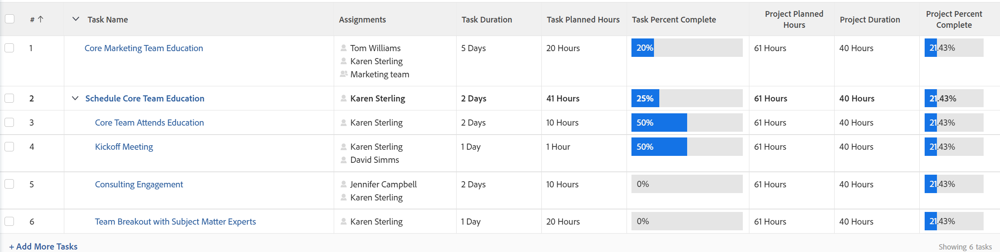

# Projekt Prozent abgeschlossen - Übersicht

<!-- Audited 01/2024 -->

Der Wert Prozent abgeschlossen wird für ein Projekt basierend auf der Dauer oder den geplanten Stunden der Aufgaben im Projekt berechnet. Ihr Adobe Workfront-Administrator oder ein Gruppenadministrator definiert, welcher Wert bei der Berechnung des Prozentsatzes der Fertigstellung in Ihrem System berücksichtigt wird, wenn sie Informationen im Bereich Projektvoreinstellungen konfigurieren.

Informationen zum Konfigurieren von Projektvoreinstellungen finden Sie [Konfigurieren von systemweiten Projektvoreinstellungen](../../../administration-and-setup/set-up-workfront/configure-system-defaults/set-project-preferences.md).

Der abgeschlossene Prozentsatz einer übergeordneten Aufgabe basiert auf der Dauer oder den geplanten Stunden jeder ihrer Teilaufgaben.

Ebenso basiert der Wert Prozent abgeschlossen auf der Dauer oder den geplanten Stunden jeder Hauptaufgabe im Projekt.

Die Hauptaufgaben sind die übergeordneten Aufgaben und die eigenständigen Aufgaben ohne untergeordnete Aufgaben.

>[!TIP]
>
>Hauptaufgaben werden in einem Projektplan nicht eingerückt.

## Wie Workfront Percent Complete berechnet

### Prozentuale Fertigstellung einer Aufgabe aktualisieren {#update-the-percent-complete-on-a-task}

Sie können den Prozentsatz der Fertigstellung einer Aufgabe manuell ändern. Das ist keine Berechnung.

Workfront berechnet anhand des Prozentsatzes der Fertigstellung eines einzelnen Vorgangs den Prozentsatz der Fertigstellung des übergeordneten Vorgangs oder den Prozentsatz der Fertigstellung des Projekts.

Informationen zum Aktualisieren des Prozentsatzes der abgeschlossenen Aufgaben finden Sie unter [Anzeigen und Aktualisieren des Prozentsatzes der abgeschlossenen Aufgaben](../../../manage-work/projects/updating-work-in-a-project/view-update-percent-complete-for-tasks.md).

### Wie Workfront den abgeschlossenen Prozentsatz einer übergeordneten Aufgabe berechnet {#how-workfront-calculates-percent-complete-on-a-parent-task}

Je nachdem, was Ihr Workfront- oder Gruppen-Administrator in den Projektvoreinstellungen auf System- oder Gruppenebene ausgewählt hat, wird der abgeschlossene Prozentsatz für eine übergeordnete Aufgabe entweder auf Grundlage der Aufgabendauer oder der geplanten Aufgabenstunden berechnet.

Betrachten Sie die folgenden Szenarien:

* Wenn das System den abgeschlossenen Prozentsatz auf der Basis der geplanten Stunden berechnet, wird der abgeschlossene Prozentsatz der übergeordneten Aufgabe anhand der folgenden Formel berechnet:

  `Parent Task Percent Complete = (((Task 1 Planned Hours * Task 1 Percent Complete) + (Task 2 Planned Hours * Task 2 Percent Complete))/Total Planned Hours of Parent)*100`

  Die geplanten Gesamtstunden des übergeordneten Elements stellen die Summe aller geplanten Stunden eines jeden untergeordneten Elements dar.

  

* Wenn das System den abgeschlossenen Prozentsatz anhand der Dauer berechnet, wird der abgeschlossene Prozentsatz der übergeordneten Aufgabe anhand der folgenden Formel berechnet:

  `Parent Task Percent Complete = (((Task 1 Duration * Task 1 Percent Complete) + (Task 2 Duration * Task 2 Percent Complete))/ Total Duration of Parent)*100`

  

  >[!IMPORTANT]
  >
  >Die Gesamtdauer der übergeordneten Aufgabe entspricht der Gesamtdauer aller untergeordneten Aufgaben. Beispielsweise hat eine übergeordnete Aufgabe mit zwei untergeordneten Elementen, die eine Dauer von 1 Tag bzw. 2 Tagen haben, eine Gesamtdauer von 3 Tagen, auch wenn die beiden untergeordneten Elemente am selben Tag beginnen können.

### So berechnet Workfront den abgeschlossenen Prozentsatz für ein Projekt {#how-workfront-calculates-percent-complete-on-a-project}

Je nachdem, was Ihr Workfront- oder Gruppen-Administrator in den Projektvoreinstellungen auf System- oder Gruppenebene ausgewählt hat, wird der abgeschlossene Prozentsatz für ein Projekt entweder auf Grundlage der Dauer oder der geplanten Stunden der Hauptaufgaben im Projekt berechnet.

* Wenn das System den abgeschlossenen Prozentsatz auf der Basis der geplanten Stunden berechnet, wird der abgeschlossene Prozentsatz des Projekts anhand der folgenden Formel berechnet:

  `Project Percent Complete =(((Task 1 Planned Hours * Task 1 Percent Complete) + (Task 2 Planned Hours * Task 2 Percent Complete))/Total Planned Hours of the Project)*100`

  Die geplanten Gesamtstunden des Projekts sind die Summe der geplanten Stunden aller Hauptaufgaben im Projekt.

  

  >[!NOTE]
  >
  >Aufgabe 1 oder Aufgabe 2 können nur übergeordnete Aufgaben oder eigenständige Aufgaben sein. Die geplanten Stunden und der abgeschlossene Prozentsatz der untergeordneten Aufgaben werden in dieser Berechnung nicht verwendet.

* Wenn das System den abgeschlossenen Prozentsatz anhand der Dauer berechnet, wird der abgeschlossene Prozentsatz des Projekts anhand der folgenden Formel berechnet:

  `Project Percent Complete = (((Task 1 Duration * Task 1 Percent Complete) + (Task 2 Duration * Task 2 Percent Complete))/Duration of the Project)*100`

  >[!IMPORTANT]
  >
  >Die Dauer des Projekts ist die Gesamtdauer aller Hauptaufgaben, die als „Prozent abgeschlossen“ angezeigt werden. Beispielsweise hat ein Projekt mit einer eigenständigen Aufgabe mit einer Dauer von 2 Tagen und einer übergeordneten Aufgabe mit einer Dauer von 5 Tagen, an denen Arbeiten abgeschlossen wurden, eine Gesamtdauer von 7 Tagen, auch wenn die beiden Aufgaben am selben Tag beginnen können.

  

  >[!NOTE]
  >
  >Aufgabe 1 oder Aufgabe 2 können nur übergeordnete Aufgaben oder eigenständige Aufgaben sein. Die Aufgaben Dauer und Prozent abgeschlossen der untergeordneten Elemente werden in dieser Berechnung nicht verwendet.

## Beispiel für „Prozent abgeschlossen“ in einem Projekt mit „Dauer“

Wenn Sie die Dauer der Aufgaben zur Berechnung des Prozentsatzes der Fertigstellung eines Projekts verwenden, sehen Sie sich das folgende Beispiel an:

Die folgenden Informationen werden zur Berechnung des Prozentsatzes der Fertigstellung des Projekts verwendet

* Der Prozentsatz der abgeschlossenen eigenständigen Aufgabe (Aufgabe 1 - 20 %)
* Der abgeschlossene Prozentsatz der übergeordneten Aufgabe (Aufgabe 2 - 25 %)
* Die Dauer von Aufgabe 1 (5 Tage)
* Die Dauer von Aufgabe 2 (2 Tage)
* Die Dauer des Projekts (7 Tage)

So berechnen Sie den abgeschlossenen Prozentsatz des Projekts mithilfe der Dauer:

`Project Percent Complete = (((Task 1 Duration * Task 1 Percent Complete) + (Task 2 Duration * Task 2 Percent Complete))/Duration of the Project)*100`

ODER

`(((5*0.2)+(2*0.25))/7)*100= 21.43%`

<!--drafted, this was the old example:

When using the Planned Duration of the tasks to calculate the percent complete of a project, consider the following example:

percent_complete_on_project_example.png

Only the parent task (Task 1) and the standalone task (Task 8) are used to calculate the percent complete of the project.

The secondary parents of Task 1 are used to calculate the percent complete of the main parent (Task 1).

To calculate the percent complete of the main parent (Task 1), first calculate the percent complete of its secondary parents:

Task 5 Percent Complete = ((14 * 0.75 + 12 * 0.25)/(12 + 14))*100 = 51.92%

Task 2 Percent Complete = ((5 * 0.7 + 2 * 0.5)/(5 + 2))*100 = 64.29 %

Then, to calculate the percent complete of the main parent (Task 1), use the following formula:

Task 1 Percent Complete =((56 * 0.5192 + 7 * 0.6429)/63)*100 = 53.29%

To calculate the percent complete of the project, you will need to have the following numbers ready:

Task 1 Duration (63 hours) and Percent Complete (53.29%)
Task 8 Duration (100 hours) and Percent Complete (4%)
Now, to calculate the percent complete of the project, use the following formula:

Project Percent Complete =((100 * 0.04 + 63 * 0.5329))/163)*100 = 23.05%
-->
