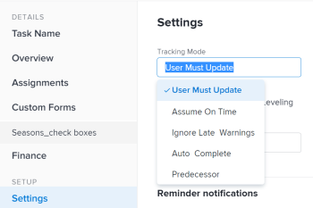

# Festlegen des Überwachungsmodus für Aufgaben

<!--Audited: 01/2025-->

Der Überwachungsmodus einer Aufgabe bestimmt, wie der Aufgabenstatus in Adobe Workfront aktualisiert wird.

Informationen zum Tracking-Modus für Aufgaben finden Sie unter [Übersicht über den Tracking-Modus für Aufgaben](../../../manage-work/tasks/task-information/task-tracking-mode.md).

## Zugriffsanforderungen

Sie müssen über folgenden Zugriff verfügen, um die Schritte in diesem Artikel ausführen zu können:

+++ Erweitern Sie , um die Zugriffsanforderungen für die -Funktion in diesem Artikel anzuzeigen.

<table style="table-layout:auto"> 
 <col> 
 <col> 
 <tbody> 
  <tr> 
   <td role="rowheader">Adobe Workfront-Plan</td> 
   <td> 
Beliebig
 </td> 
  </tr> 
  <tr> 
   <td role="rowheader">Adobe Workfront-Lizenz*</td> 
   <td> 
Neu: Standard
 
   Oder
   
Aktuell: Arbeit oder höher
 
   </td> 
  </tr> 
  <tr> 
   <td role="rowheader">Konfigurationen der Zugriffsebene</td> 
   <td> 
Zugriff auf Aufgaben bearbeiten 
 </td> 
  </tr> 
  <tr> 
   <td role="rowheader">Objektberechtigungen</td> 
   <td> 
Verwalten von Berechtigungen für eine Aufgabe
 </td> 
  </tr> 
 </tbody> 
</table>

*Weitere Informationen finden Sie unter [Zugriffsanforderungen in der Dokumentation zu Workfront](/help/quicksilver/administration-and-setup/add-users/access-levels-and-object-permissions/access-level-requirements-in-documentation.md).

+++

<!--old: 
You must have the following access to perform the steps in this article:

<table style="table-layout:auto"> 
 <col> 
 <col> 
 <tbody> 
  <tr> 
   <td role="rowheader">Adobe Workfront plan/td> 
   <td> 
Any
 </td> 
  </tr> 
  <tr> 
   <td role="rowheader"><a href="../../../administration-and-setup/add-users/access-levels-and-object-permissions/wf-licenses.md" class="MCXref xref">Adobe Workfront licenses overview</a>*</td> 
   <td> 
Work or higher
 </td> 
  </tr> 
  <tr> 
   <td role="rowheader">Access level configurations*</td> 
   <td> 
Edit access to Tasks 
 
Note: If you still don't have access, ask your Workfront administrator if they set additional restrictions in your access level. For information on how a Workfront administrator can modify your access level, see <a href="../../../administration-and-setup/add-users/access-levels-and-object-permissions/wf-licenses.md" class="MCXref xref">Adobe Workfront licenses overview</a>
 </td> 
  </tr> 
  <tr> 
   <td role="rowheader">Object permissions</td> 
   <td> 
Manage permissions on a task
 
For information on requesting additional access, see <a href="../../../workfront-basics/grant-and-request-access-to-objects/request-access.md" class="MCXref xref">Request access to objects </a>.
 </td> 
  </tr> 
 </tbody> 
</table>

&#42;To find out what plan, license type, or access you have, contact your Workfront administrator.

-->

## Festlegen des Überwachungsmodus für Aufgaben

So legen Sie den Tracking-Modus fest:

1. Gehen Sie zu der Aufgabe, für die Sie den Tracking-Modus festlegen möchten.
1. Klicken Sie auf **Mehr**-Symbol neben dem Namen der Aufgabe und dann auf **Bearbeiten**.

   Das Dialogfeld Aufgabe bearbeiten wird geöffnet.

1. Wählen Sie **Abschnitt** im Dropdown-Menü **Überwachungsmodus** den Überwachungsmodus für die Aufgabe aus.

   

1. Wählen Sie aus den folgenden Optionen aus:

   * Benutzer muss aktualisieren (dies ist die Standardoption)
   * Annahme: Pünktlich
   * Späte Warnungen ignorieren
   * Automatisch vervollständigen
   * Vorgänger

   Weitere Informationen zu den Optionen für den Tracking-Modus finden Sie unter [Übersicht über den Tracking-Modus für Aufgaben](../../../manage-work/tasks/task-information/task-tracking-mode.md)

1. Klicken Sie auf **Speichern**.
