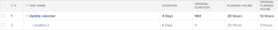
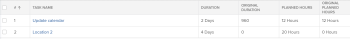

# Überblick über die ursprüngliche Dauer und die ursprünglich geplanten Stunden einer Aufgabe

Im Rahmen der Planung eines Projekts sollten Sie die Werte für die geplanten Stunden und für die Dauer (oder geplante Dauer) jeder Aufgabe im Projekt festlegen.

Weitere Informationen über geplante Stunden für Aufgaben finden Sie unter [Übersicht über geplante Stunden](../../../manage-work/tasks/task-information/planned-hours.md).

Weitere Informationen zur Aufgabendauer finden Sie unter [Übersicht über die Aufgabendauer und den ](../../../manage-work/tasks/taskdurtn/task-duration-and-duration-type.md)).

Diese Werte werden auf der Registerkarte „Aufgabendetails“ oder beim Bearbeiten einer Aufgabe angezeigt.

Wenn Sie eine Ansicht für eine Aufgabenliste oder einen Aufgabenbericht erstellen, können Sie zusätzlich die Felder Ursprüngliche geplante Stunden und Ursprüngliche Dauer für die Aufgaben anzeigen.

## Ursprüngliche geplante Stunden

Die ursprünglich geplanten Stunden einer Aufgabe stellen die Anzahl der geplanten Stunden dar, die eine Aufgabe ursprünglich hatte, bevor sie eine übergeordnete Aufgabe wurde. Wenn eine Aufgabe eine übergeordnete Aufgabe wird, werden die geplanten Stunden der untergeordneten Aufgaben auf die übergeordnete Aufgabe hochgerechnet, um die geplanten Stunden des übergeordneten Vorgangs anzugeben.

Wenn Sie das Feld Ursprüngliche geplante Stunden in einem Aufgabenbericht oder einer Aufgabenliste anzeigen, können Sie die ursprüngliche Anzahl der geplanten Stunden sehen, bevor die Aufgabe die Anzahl der geplanten Stunden ihrer untergeordneten Elemente übernommen hat.

>[!NOTE]
>
>Wenn Sie eine Aufgabe erstellen, ist die Anzahl der ursprünglich geplanten Stunden null. Wenn die Aufgabe zu einer übergeordneten Aufgabe wird, wird der Wert dieses Felds mit der Anzahl der geplanten Stunden der Aufgabe gefüllt, bevor sie in eine übergeordnete Aufgabe geändert wurde. Dieser Wert verbleibt auch dann in diesem Feld, wenn die Aufgabe wieder als eigenständige Aufgabe verwendet wird.

## Ursprüngliche Dauer

Die ursprüngliche Dauer einer Aufgabe ist die Dauer in Minuten, die eine Aufgabe ursprünglich hatte, bevor sie zu einer übergeordneten Aufgabe wurde. Wenn eine Aufgabe ein übergeordnetes Element wird, wird die Dauer zwischen dem geplanten Startdatum des frühesten untergeordneten Elements und dem geplanten Abschlussdatum des letzten untergeordneten Elements auf die übergeordnete Aufgabe angerechnet und wird zur Dauer der übergeordneten Aufgabe. Dadurch wird die Dauer der ursprünglichen Aufgabe ersetzt.

Wenn Sie das Feld Ursprüngliche Dauer in einem Aufgabenbericht oder einer Liste anzeigen, können Sie die ursprüngliche Anzahl von Tagen für die Dauer der Aufgabe sehen, bevor sie die Dauer ihrer untergeordneten Elemente geerbt hat.

>[!NOTE]
>
>Wenn Sie eine Aufgabe erstellen, ist die ursprüngliche Dauer null. Wenn die Aufgabe zu einer übergeordneten Aufgabe wird, wird der Wert dieses Felds mit der Dauer der Aufgabe gefüllt, bevor sie in eine übergeordnete Aufgabe geändert wurde. Dieser Wert verbleibt auch dann in diesem Feld, wenn die Aufgabe wieder als eigenständige Aufgabe verwendet wird. Dieser Wert wird in Minuten angezeigt.

## Beispiel

Wenn zwei Aufgaben beispielsweise eigenständige Aufgaben sind, sind ihre ursprüngliche Dauer und ihre ursprünglich geplanten Stunden null.

Wenn die erste Aufgabe der zweiten Aufgabe übergeordnet wird, werden die Felder Ursprüngliche Dauer und Ursprüngliche geplante Stunden mit den Werten für Dauer und Geplante Stunden der Aufgabe ausgefüllt, bevor sie übergeordnet wird. Die ursprüngliche Dauer wird in Minuten angezeigt. Die Dauer und die geplanten Stunden des untergeordneten Elements werden zur Dauer und zu den geplanten Stunden des übergeordneten Elements.

Wenn das übergeordnete Element erneut eine eigenständige Aufgabe wird, werden die Dauer und die geplanten Stunden auf die ursprünglichen Werte zurückgesetzt, während die ursprüngliche Dauer und die ursprünglich geplanten Stunden ausgefüllt bleiben. Sie werden nicht auf Null zurückgesetzt.

