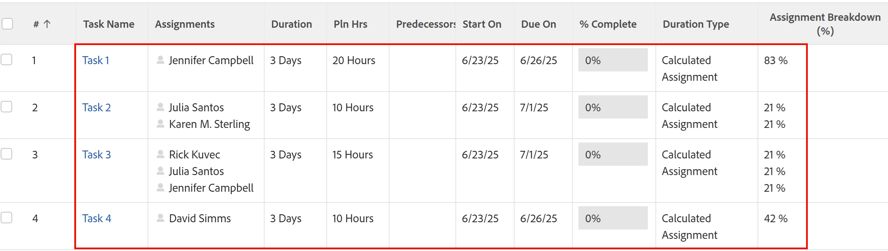

# Übersicht über den Dauer-Typ: Berechnete Zuweisung

Die berechnete Zuweisung ist eine Dauer, die Sie für eine Aufgabe in Adobe Workfront festlegen können. Allgemeine Informationen zu den Durationstypen in Workfront finden Sie unter [Übersicht über die Aufgabendauer und -dauer](../../../manage-work/tasks/taskdurtn/task-duration-and-duration-type.md).

## Übersicht über den Typ der berechneten Zuweisungsdauer

<!--
<p data-mc-conditions="QuicksilverOrClassic.Draft mode">(NOTE: This Hub issue has a powerpoint that highlights information that is useful to users when using Calculated Assignment duration type. I don't think we can use the powerpoint, because it's old. I also don't know if the things they discuss are still relevant, since the PP is from 2015. I've closed the issue, but I'm putting a link here just in case the info is useful. https://hub.workfront.com/issue/5a9dd7d5007d02a8966014557c23cc89/updates)</p>
-->

* Wenn Sie eine berechnete Zuweisungsdauer verwenden, müssen Sie für die Aufgabe sowohl eine Dauer als auch eine Anzahl geplanter Stunden angeben. Workfront teilt dann die Anzahl der geplanten Stunden durch die Anzahl der Stunden in der Dauer und dann durch die Anzahl der Ressourcen, die der Aufgabe zugewiesen sind, um den Zuordnungsprozentsatz (berechnet die Zuweisung) für jede Ressource zu berechnen. Jede Ressource weist denselben Wert für ihren Zuordnungsprozentsatz auf. In diesem Fall können Sie die Zuordnungswerte nicht für jede Ressource ändern.
* Ihr Workfront- oder Gruppenadministrator kann den Standardtyp für die Dauer Ihres Systems oder Ihrer Gruppe als &quot;Berechnete Zuweisung&quot;festlegen. In diesem Fall werden alle neuen Aufgaben mit diesem Typ Dauer erstellt. Informationen zum Ändern der Aufgaben- und Ausgabevoreinstellungen als Teil Ihrer Projektanforderungen auf System- oder Gruppenebene finden Sie unter [Konfigurieren von systemweiten Aufgaben- und Problemeinstellungen](../../../administration-and-setup/set-up-workfront/configure-system-defaults/set-task-issue-preferences.md).

  In diesem Fall hat die Aufgabe die Standardeinstellung &quot;Dauer von einem Tag&quot;und die Standardeinstellung &quot;0 Stunden geplant&quot;. Wenn der Projektmanager keine genauere Dauer festlegt und das Feld &quot;Geplante Stunden&quot;mit einer realistischen Schätzung füllt, werden die Ressourcen nicht ausreichend zugeordnet.

In den folgenden Situationen ist die berechnete Zuweisung der bevorzugte Dauer:

* Wenn Zuweisungen ein Aktivitätsfenster haben, aber nicht die gesamte Dauer in Anspruch nehmen, um ihre Arbeit abzuschließen. Beispielsweise wird Ihnen zugewiesen, Ihrem Verantwortlichen bis zum Ende der Woche einen Bericht zu übermitteln. Sie haben eine Dauer von fünf Tagen, aber es dauert nur zehn Stunden, bis Sie das Dokument verfassen.
* Wenn eine einzelne Ressource einer Aufgabe zugewiesen wird, weil der Projektmanager die geplante Dauer und den geplanten Aufwand unabhängig voneinander schätzen kann.

  Sie können den Typ &quot;Berechnete Arbeitsdauer&quot;für dasselbe Ergebnis verwenden. Der Projektmanager muss jedoch eine Prozentzuordnung für die Ressource eingeben, um den berechneten Wert für &quot;Geplante Stunden&quot;zu beeinflussen. Dadurch wird die Projektplanung schwieriger und zeitaufwendiger.

Der Zuordnungsprozentsatz für jede Ressource wird wie folgt berechnet:

```
Planned Hours / Duration / Number of Resources = Allocation Percentage for each resource
```

Im unten beschriebenen Szenario hat jede Aufgabe beispielsweise eine Dauer von 3 Tagen. Der Projektmanager gibt die Dauer (3 Tage oder 24 Stunden) und die geplanten Stunden manuell ein. Daher wird der Zuordnungsprozentsatz (oder Zuordnungsprozentsatz) berechnet:



## Ändern Sie den Aufgabentyp in &quot;Berechnete Zuweisung&quot;

Weitere Informationen zum Ändern des Dauer-Typs einer Aufgabe finden Sie unter [Aktualisieren des Dauer-Typs einer Aufgabe](../../../manage-work/tasks/taskdurtn/update-duration-type-of-task.md).

<!--
<p data-mc-conditions="QuicksilverOrClassic.Draft mode">(NOTE: replaced with new article linked above)</p>
-->

<!--
<ol data-mc-conditions="QuicksilverOrClassic.Draft mode">
<li value="1">Go to a task for which you want to change the Duration Type.</li>
<li value="2"> <p data-mc-conditions="QuicksilverOrClassic.Quicksilver">Click <strong>Task Details</strong> in the left panel, then in the Overview area double click <strong>Duration Type</strong>. </p> </li>
<li value="3">Select <strong>Calculated Assignment</strong> from the drop-down menu.</li>
<li value="4">Click <strong>Save</strong> <strong>Changes</strong>.</li>
</ol>
-->
