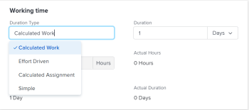

# Aktualisieren des Dauertyps einer Aufgabe

Der Dauertyp einer Aufgabe gibt die Beziehung zwischen der Anzahl der einer Aufgabe zugewiesenen Ressourcen, dem Gesamtaufwand und der Gesamtdauer der Aufgabe an. Weitere Informationen finden Sie unter [Übersicht über Aufgabendauer und -typ](../../../manage-work/tasks/taskdurtn/task-duration-and-duration-type.md).

## Zugriffsanforderungen

+++ Erweitern Sie , um die Zugriffsanforderungen für die -Funktion in diesem Artikel anzuzeigen.

<table style="table-layout:auto"> 
 <col> 
 <col> 
 <tbody> 
  <tr> 
   <td role="rowheader">Adobe Workfront-Paket</td> 
   <td> 
Beliebig
 </td> 
  </tr> 
  <tr> 
   <td role="rowheader">Adobe Workfront-Lizenz</td> 
   <td>
Standard oder höher
 
   
Arbeit oder höher
 </td> 
  </tr> 
  <tr> 
   <td role="rowheader">Konfigurationen der Zugriffsebene</td> 
   <td> 
Zugriff auf Projekte anzeigen oder höher
 
Zugriff auf Aufgaben bearbeiten
 </td> 
  </tr> 
  <tr> 
   <td role="rowheader">Objektberechtigungen</td> 
   <td> 
Zugriff auf die Aufgabe verwalten 
</td> 
  </tr> 
 </tbody> 
</table>

Weitere Informationen finden Sie unter [Zugriffsanforderungen in der Dokumentation zu Workfront](/help/quicksilver/administration-and-setup/add-users/access-levels-and-object-permissions/access-level-requirements-in-documentation.md).

+++

<!--Old:

<table style="table-layout:auto"> 
 <col> 
 <col> 
 <tbody> 
  <tr> 
   <td role="rowheader">Adobe Workfront plan*</td> 
   <td> 
Any 
 </td> 
  </tr> 
  <tr> 
   <td role="rowheader">Adobe Workfront license*</td> 
   <td> 
Work or higher
 </td> 
  </tr> 
  <tr> 
   <td role="rowheader">Access level configurations*</td> 
   <td> 
View or higher access to Projects
 
Edit access to Tasks
 
Note: If you still don't have access, ask your Workfront administrator if they set additional restrictions in your access level. For information on how a Workfront administrator can modify your access level, see <a href="../../../administration-and-setup/add-users/configure-and-grant-access/create-modify-access-levels.md" class="MCXref xref">Create or modify custom access levels</a>.
 </td> 
  </tr> 
  <tr> 
   <td role="rowheader">Object permissions</td> 
   <td> 
Manage access to the task 
 
For information on requesting additional access, see <a href="../../../workfront-basics/grant-and-request-access-to-objects/request-access.md" class="MCXref xref">Request access to objects </a>.
 </td> 
  </tr> 
 </tbody> 
</table>-->

## Aktualisieren des Dauertyps einer Aufgabe

Zusätzlich zur Aktualisierung des Dauertyps einer Aufgabe, wie in diesem Artikel beschrieben, können Sie den Dauertyp auch aktualisieren, wenn Sie eine Aufgabe bearbeiten oder erweiterte Zuweisungen vornehmen. Weitere Informationen finden Sie unter:

* [Aufgaben bearbeiten](../../../manage-work/tasks/manage-tasks/edit-tasks.md)
* [Erweiterte Zuweisungen erstellen](../../../manage-work/tasks/assign-tasks/create-advanced-assignments.md)

So aktualisieren Sie den Dauertyp einer Aufgabe:

1. Klicken Sie auf **Hauptmenü** > **Projekte** und dann auf ein Projekt, um darauf zuzugreifen.
1. Klicken Sie auf **Abschnitt** im linken Bedienfeld .
1. Klicken Sie **linken Bereich auf** Aufgabendetails“ und dann im Bereich Übersicht auf **Dauertyp**.

   

1. Wählen Sie aus den folgenden Optionen aus

   | Dauertyp | Weitere Informationen |
   |---|---|
   | Berechnete Arbeit | Weitere Informationen finden Sie unter [Übersicht über den Dauertyp: Berechnete Arbeit](../../../manage-work/tasks/taskdurtn/calculated-work.md). |
   | Leistungsgesteuert | Weitere Informationen finden Sie unter [Übersicht über den Dauertyp: Leistungsgesteuert](../../../manage-work/tasks/taskdurtn/effort-driven.md). |
   | Berechnete Zuweisung | Weitere Informationen finden Sie unter [Übersicht „Dauertyp: Berechnete Zuweisung](../../../manage-work/tasks/taskdurtn/calculated-assignment.md). |
   | Einfach | Weitere Informationen finden Sie unter [Duration Type Overview: Simple](../../../manage-work/tasks/taskdurtn/simple-duration-type.md). |

1. Klicken Sie auf **Änderungen speichern**.
