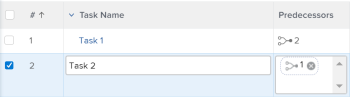

# Übersicht über Aufgabenabhängigkeitsschleife

Beim Hinzufügen von Vorgängerbeziehungen zu Aufgaben können Abhängigkeitsschleifen auftreten. Weitere Informationen zu Vorgängern finden Sie unter [Übersicht über Aufgabenverfasser](../../../manage-work/tasks/use-prdcssrs/predecessors-overview.md).

## Übersicht über Abhängigkeitsschleife

Abhängigkeitsschleifen treten auf, wenn Sie zwei oder mehr Aufgaben ausführen müssen, die voneinander abhängen. Adobe Workfront ermöglicht es Ihnen nicht, eine Vorgängerbeziehung zwischen Aufgaben zu erstellen, wenn eine Abhängigkeitsschleife erstellt wird.

**Beispiel:** Aufgabe 2 ist ein Vorgänger von Aufgabe 1. Das bedeutet, dass Sie Aufgabe 2 abschließen müssen, bevor Sie mit der Arbeit an Aufgabe 1 beginnen können.

Wenn Sie versuchen, Aufgabe 1 zu einem Vorgänger von Aufgabe 2 zu machen, erhalten Sie einen Abhängigkeitsschleiffehler, da Sie Aufgabe 1 erst starten können, nachdem Aufgabe 2 abgeschlossen wurde. Aufgabe 2 kann jedoch erst gestartet werden, wenn Aufgabe 1 abgeschlossen ist.

## Überlegungen zu Abhängigkeitsschleifen

* Abhängigkeitsschleifen können mehr als zwei Aufgaben umfassen. Manchmal sind einige übergeordnete Elemente der Aufgaben, die Sie mit einer Vorgängerbeziehung verbinden, diejenigen, die die Abhängigkeitsschleife erstellen.
* Eine Abhängigkeitsschleife kann auch auftreten, wenn Sie versuchen, ein übergeordnetes Element zum Vorgänger eines untergeordneten Elements zu machen.
* Im Falle einer Abhängigkeitsschleife können Sie die Aufgaben oder das Projekt nicht speichern. Um die Abhängigkeitsschleife zu korrigieren, müssen Sie die Vorgängerbeziehung zwischen den in der Fehlermeldung aufgelisteten Aufgaben neu bewerten und die Konflikte entfernen, bevor Sie die Aufgaben oder das Projekt speichern können.

 
