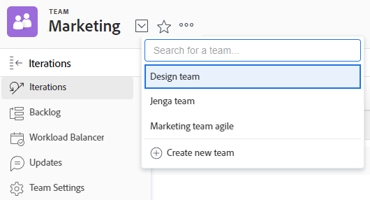

# Erstellen eines Teams

Wenn Sie ein Team erstellen, werden Sie standardmäßig zum Teambesitzer.

Sie können Teambesitzer für alle Teams anzeigen, wenn Sie einen Bericht für Teams erstellen, und das Feld [!UICONTROL Name des &#x200B;]&quot; in Ihren Bericht aufnehmen. (Weitere Informationen zum Erstellen eines Berichts finden Sie unter [Erstellen eines benutzerdefinierten Berichts](../../reports-and-dashboards/reports/creating-and-managing-reports/create-custom-report.md).)

Informationen dazu, wie ein [!DNL Adobe Workfront]-Administrator ein Team im Bereich [!UICONTROL Setup] erstellen kann, finden Sie [Erstellen eines Teams im Bereich [!UICONTROL Setup]](../../administration-and-setup/add-users/create-and-manage-teams/create-a-team-from-setup.md).

## Zugriffsanforderungen

+++ Erweitern, um die Zugriffsanforderungen für die in diesem Artikel beschriebene Funktionalität anzuzeigen.

<table style="table-layout:auto"> 
 <col> 
 <col> 
 <tbody> 
  <tr data-mc-conditions=""> 
   <td role="rowheader"> 
Adobe Workfront-Paket
 </td> 
   <td>Beliebig</td> 
  </tr> 
  <tr> 
   <td role="rowheader">Adobe Workfront-Lizenz</td> 
   <td>
   
Standard

   
Abo
</td>
  </tr> 
 </tbody> 
</table>

Weitere Details zu den Informationen in dieser Tabelle finden Sie unter [Zugriffsanforderungen in der Dokumentation zu Workfront](/help/quicksilver/administration-and-setup/add-users/access-levels-and-object-permissions/access-level-requirements-in-documentation.md).

+++

## Erstellen eines Teams

{{step1-to-team}}

1. Klicken Sie auf das Symbol **[!UICONTROL Teams wechseln]**  und klicken Sie dann auf **[!UICONTROL Neues Team erstellen]**.

   

1. Geben Sie in **[!UICONTROL angezeigten]** Neues Team“ die folgenden Informationen ein:

   * **[!UICONTROL Team-Name]:** Geben Sie einen Namen für das neue Team ein.
   * **[!UICONTROL Gruppe]**: Wenn Sie das Team einer zugehörigen Gruppe zuweisen möchten, geben Sie den Namen der Gruppe ein und wählen Sie den Namen aus, wenn er angezeigt wird.

     Sie können sicherstellen, dass Sie die richtige Gruppe mit dem Team verknüpfen, indem Sie den Mauszeiger darüber bewegen und auf das Informationssymbol  neben dem Team klicken. Dadurch wird eine QuickInfo angezeigt, die Informationen über die Gruppe auflistet, wie z. B. die Hierarchie der darüber liegenden Gruppen und deren Administratoren.

     >[!NOTE]
     >
     >Wenn ein Team einer Gruppe oder Untergruppe zugewiesen wird, können alle Gruppenadministratoren dieser Gruppe oder Untergruppe das Team verwalten, ohne Mitglied sein zu müssen. Gruppenadministratoren können im Hauptmenü zum Bereich Teams gehen und auf den Pfeil Teams wechseln  klicken, um alle Teams aufzulisten, die den von ihnen verwalteten Gruppen zugewiesen sind.

   * **[!UICONTROL Dies ist ein agiles Team]:** Wählen Sie diese Option aus, wenn Sie dieses neue Team als ein agiles Team konfigurieren möchten.

     Weitere Informationen zu Agile-Teams finden Sie unter [Erstellen eines Agile-Teams](../../agile/get-started-with-agile-in-workfront/create-an-agile-team.md).

   * **[!UICONTROL Team-Mitglieder]:** Beginnen Sie mit der Eingabe des Namens eines Benutzers, der dem Team hinzugefügt werden soll, und wählen Sie dann den Namen aus, wenn er in der Dropdown-Liste angezeigt wird.

     Wiederholen Sie diesen Vorgang, um dem Team mehrere Benutzer hinzuzufügen.

     Es gibt keine Begrenzung dafür, wie viele Benutzer Sie einem Team hinzufügen können. Wir empfehlen jedoch, nicht zu viele Benutzer in einem Team zu haben, da Ihr Arbeitsmanagement für diese Teams zu komplex werden könnte.

   * **[!UICONTROL Beschreibung]:** Geben Sie eine Beschreibung für das Team ein.

     Die Beschreibung wird oben rechts im Bereich Teams angezeigt, wenn das Team ausgewählt wird.

     >[!NOTE]
     >
     >Wenn die Beschreibung lang ist, können Sie darauf klicken, um sie in einem Popup anzuzeigen. Wenn Sie Zugriff haben, um die Team-Einstellungen zu bearbeiten, können Sie die Beschreibung auch direkt im Popup-Fenster bearbeiten.

1. Klicken Sie auf **[!UICONTROL Erstellen]**.
