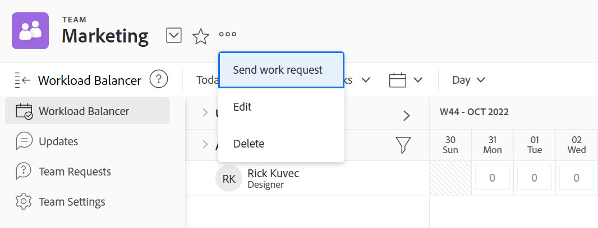

# Team-Einstellungen bearbeiten

Als [!DNL Adobe Workfront] Administrator oder Benutzer mit [!UICONTROL Plan] oder [!UICONTROL Arbeit] Lizenz, können Sie [!UICONTROL Team-Einstellungen].

Sie können Benutzer zu einem Team hinzufügen, die Vorlage für das Teamlayout festlegen und festlegen, wie der Status aufgezeichnet wird, wenn Arbeitselemente von einem Team abgeschlossen werden.

## Zugriffsanforderungen

Sie müssen über folgenden Zugriff verfügen, um die Schritte in diesem Artikel ausführen zu können:

<table style="table-layout:auto"> 
 <col> 
 </col> 
 <col> 
 </col> 
 <tbody> 
  <tr> 
   <td role="rowheader"><strong>[!DNL Adobe Workfront] Plan*</strong></td> 
   <td> 
Beliebig
 </td> 
  </tr> 
  <tr> 
   <td role="rowheader"><strong>[!DNL Adobe Workfront] license*</strong></td> 
   <td> 
Arbeit oder höher
 </td> 
  </tr> 
 </tbody> 
</table>

&#42;Wenden Sie sich an Ihren [!DNL Workfront] Administrator.

## Team-Einstellungen bearbeiten

1. Klicken Sie auf **[!UICONTROL Hauptmenü]** icon  Klicken Sie oben rechts in Adobe Workfront auf **[!UICONTROL Teams]**.

1. Klicken Sie auf **[!UICONTROL Switch Team]** icon , wählen Sie entweder aus dem Dropdown-Menü ein neues Team aus oder suchen Sie in der Suchleiste nach einem Team.

1. Klicken Sie auf **[!UICONTROL Mehr]** Menü , wählen Sie **[!UICONTROL Bearbeiten]**.

   Nur Teammitglieder mit einer [!UICONTROL Plan] oder [!UICONTROL Arbeit] -Lizenz sehen Sie diese Option.

   Wenn die Variable [!UICONTROL Bearbeiten] nicht angezeigt wird, bitten Sie Ihren Workfront-Administrator zu überprüfen, ob [!UICONTROL Team-Einstellungen] in der Layoutvorlage für [!UICONTROL Scrum Team], [!UICONTROL Kanban-Team]oder [!UICONTROL Wasserfallteam].

   

1. In den Teameinstellungen können Sie die folgenden Änderungen vornehmen:

   * Ändern des Teamnamens
   * Deaktivieren Sie das Team.
   * Team mit einer Gruppe verknüpfen

      >[!NOTE]
      >
      >Wenn ein Team einer Gruppe oder Untergruppe zugewiesen wird, können Gruppenadministratoren dieser Gruppe oder Untergruppe das Team verwalten, ohne Mitglied zu sein. Gruppenadministratoren können im Hauptmenü im Bereich Teams auf die Schaltfläche [!UICONTROL Switch-Teams] Pfeil  , um alle Teams aufzulisten, die den von ihnen verwalteten Gruppen zugewiesen sind.

      Sie können sicherstellen, dass Sie die richtige Gruppe mit dem Team verknüpfen, indem Sie den Mauszeiger darüber halten und auf das Informationssymbol klicken  , das daneben angezeigt wird. Dadurch wird eine QuickInfo mit Informationen zur Gruppe angezeigt, z. B. die Hierarchie der Gruppen darüber und deren Administratoren.

   * Teaminhaber bestimmen
   * Team-Mitglieder hinzufügen und entfernen
   * Beschreibung des Teams hinzufügen
   * Anwenden einer Layoutvorlage auf das Team

      Weitere Informationen zum Anwenden einer benutzerdefinierten Layoutvorlage auf ein Team finden Sie im Abschnitt &quot;Anwenden einer benutzerdefinierten Vorlage auf ein Team&quot;unter [!UICONTROL Meine Arbeit] und [!UICONTROL Arbeitsanforderungen] Bereiche mit Layout-Vorlagen.

   * Entscheiden Sie, ob dieses Team ein agiles Team ist, indem Sie die **[!UICONTROL Dies ist ein Agile-Team]** -Option.

      Weitere Informationen zu agilen Teams und zur Verwaltung von Arbeit in einem agilen Team finden Sie unter [Erstellen eines agilen Teams](../../agile/get-started-with-agile-in-workfront/create-an-agile-team.md).

   * Ändern Sie die [!UICONTROL Arbeiten daran] Schaltfläche zu einer [!UICONTROL Starten] Schaltfläche. Weitere Informationen zur Konfiguration der [!UICONTROL Starten] -Schaltfläche, siehe [Ersetzen Sie die Schaltfläche &quot;Bearbeiten&quot; durch eine [!UICONTROL Starten] button](../../people-teams-and-groups/create-and-manage-teams/work-on-it-button-to-start-button.md).
   * Anpassen der **[!UICONTROL Fertig]** Schaltfläche. Weitere Informationen zum Anpassen der [!UICONTROL Fertig] -Schaltfläche, siehe:

      * [Konfigurieren Sie die [!UICONTROL Fertig] Schaltfläche für Aufgaben](../../people-teams-and-groups/create-and-manage-teams/configure-the-done-button-for-tasks.md)
      * [Konfigurieren Sie die [!UICONTROL Fertig] Schaltfläche für Probleme](../../people-teams-and-groups/create-and-manage-teams/configure-the-done-button-for-issues.md)

1. Klicken **[!UICONTROL Änderungen speichern]**.
