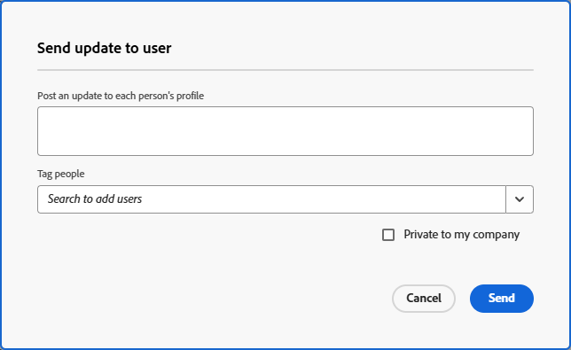

# Senden von Direktnachrichten an andere Benutzer

[!DNL Adobe Workfront] können Sie schnell und einfach Nachrichten, die mit keinem Arbeitselement in Verbindung stehen, direkt an andere [!DNL Workfront] senden. Nachrichten, die wie in diesem Abschnitt beschrieben gesendet werden[!UICONTROL  werden auf der Profilseite des Benutzers auf der Registerkarte ]Updates“ angezeigt und sind für alle Benutzer sichtbar. Weitere Informationen zu Aktualisierungen finden Sie unter [Arbeitselemente aktualisieren und Aktualisierungen anzeigen: Artikelindex](../../workfront-basics/updating-work-items-and-viewing-updates/update-work-items-and-view-updates.md).

Der Benutzer, an den Sie die Nachricht senden, erhält die folgenden Arten von Benachrichtigungen, wenn Sie eine Nachricht wie in diesem Abschnitt beschrieben senden:

* Eine In-App-Benachrichtigung, wie unter [Anzeigen und Verwalten von In-App-Benachrichtigungen beschrieben](../../workfront-basics/using-notifications/view-and-manage-in-app-notifications.md)
* Eine E-Mail-Benachrichtigung

  Dies hängt von den Arten von E-Mail-Benachrichtigungen ab, die der Benutzer bzw. die Benutzerin erhalten soll. Weitere Informationen finden Sie unter [Konfigurieren von Ereignisbenachrichtigungen für alle Personen im System](../../administration-and-setup/manage-workfront/emails/configure-event-notifications-for-everyone-in-the-system.md), [Anzeigen und Konfigurieren von Ereignisbenachrichtigungen für eine Gruppe](../../administration-and-setup/manage-groups/create-and-manage-groups/view-and-configure-event-notifications-group.md) und [Ändern Ihrer eigenen E-Mail-Benachrichtigungen](../../workfront-basics/using-notifications/activate-or-deactivate-your-own-event-notifications.md).

## Zugriffsanforderungen

+++ Erweitern Sie , um die Zugriffsanforderungen für die -Funktion in diesem Artikel anzuzeigen.

Sie müssen über folgenden Zugriff verfügen, um die Schritte in diesem Artikel ausführen zu können:

<table style="table-layout:auto"> 
 <col> 
 <col> 
 <tbody> 
  <tr data-mc-conditions=""> 
   <td role="rowheader">Adobe Workfront-Plan</td> 
   <td>Beliebig</td> 
  </tr> 
  <tr> 
   <td role="rowheader">Adobe Workfront-Lizenz</td> 
   <td>
   
Um eine Nachricht über die Profilseite des Benutzers zu senden, benötigen Sie Folgendes: 
   Neu: Licht oder höher 
   oder 
   Aktuell: Überprüfung oder höher

   
Um eine Nachricht über die Benutzerliste zu senden, benötigen Sie Folgendes: 
   Neu: Standard 
   oder 
   Aktuell: Arbeit oder höher
</td>
  </tr> 
 </tbody> 
</table>

Weitere Informationen zu den Informationen in dieser Tabelle finden Sie unter [Zugriffsanforderungen in der Dokumentation zu Workfront](/help/quicksilver/administration-and-setup/add-users/access-levels-and-object-permissions/access-level-requirements-in-documentation.md).

+++

## Senden einer Nachricht, die nicht mit einem Arbeitselement in Verbindung steht, an einen anderen Benutzer über dessen Profilseite

1. Navigieren Sie zur Profilseite des Benutzers, an den Sie eine Nachricht senden möchten.

   Um zur Profilseite eines Benutzers zu navigieren, klicken Sie auf den verknüpften Namen des Benutzers, wie er an einer beliebigen Stelle in der [!DNL Workfront] angezeigt wird. Benutzernamen werden in vielen Bereichen angezeigt, z. B. in einem Kommentar des Benutzers.

1. Klicken Sie auf **[!UICONTROL Registerkarte]** Updates“ in das Textfeld.

   ![Benutzer der Nachricht auf der Registerkarte [!UICONTROL Updates]](assets/send-message-to-user-on-updates-tab.png)

1. Geben Sie Ihre Nachricht ein.
1. (Optional) Klicken Sie in das Feld **[!UICONTROL Benachrichtigen]** und geben Sie dann den Namen eines anderen Benutzers ein, den Sie in diese Nachricht aufnehmen möchten.

1. (Optional) Wählen Sie **[!UICONTROL Privat für meine Firma]** aus, damit diese Nachricht nur für andere Benutzer in Ihrer Firma sichtbar ist.

1. Klicken Sie auf **[!UICONTROL Aktualisieren].**
Die Nachricht wird oben in der Nachrichtenliste auf der Registerkarte **[!UICONTROL Updates]** auf der Profilseite des Benutzers veröffentlicht.

## Senden einer Nachricht an einen oder mehrere Benutzer aus der Benutzerliste

Diese Option ist nur verfügbar, wenn Sie über eine Standard-, Plan- oder Arbeitslizenz verfügen.

{{step-1-to-users}}

1. Wählen Sie den/die Benutzer aus, an den/die Sie eine Nachricht senden möchten, und klicken Sie auf [!UICONTROL **Update an Benutzer senden**].
1. Geben Sie Ihre Nachricht in das Fenster [!UICONTROL Aktualisierung an Benutzer senden] ein.

   

1. (Optional) Suchen Sie nach allen zusätzlichen Benutzern, die Sie mit Tags in der Nachricht versehen möchten. Die bereits in der Benutzerliste ausgewählten Benutzer müssen nicht getaggt werden.
1. (Optional) Wählen Sie **[!UICONTROL Privat für meine Firma]** aus, damit diese Nachricht nur für andere Benutzer in Ihrer Firma sichtbar ist.
1. Klicken Sie [!UICONTROL **Senden**].
Die Nachricht wird oben in der Nachrichtenliste auf der Registerkarte **[!UICONTROL Updates]** auf der Profilseite jedes Benutzers veröffentlicht.
