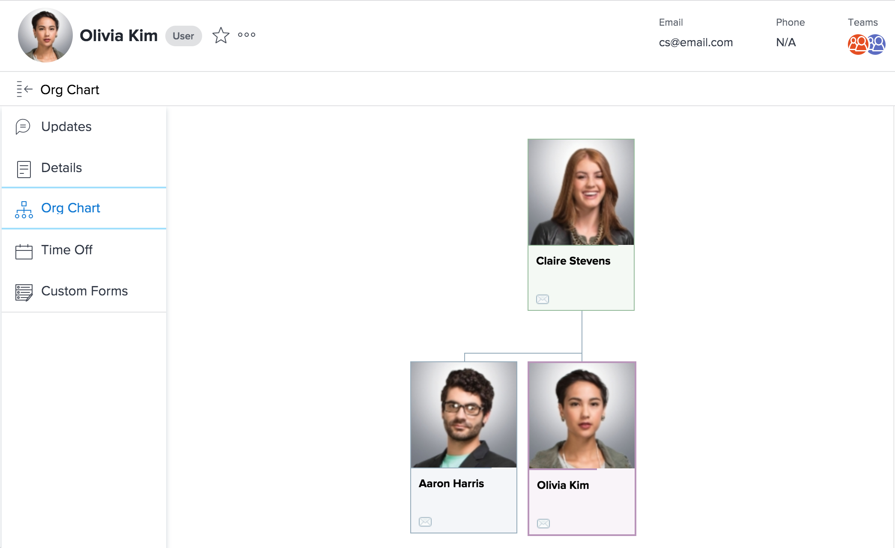

# Organigramm anzeigen

Die Organisationsdiagrammfunktion ermöglicht es Ihnen, die mit einem bestimmten [!DNL Adobe Workfront] Benutzer. Organizative Diagramme eignen sich hervorragend, um die Struktur einer bestimmten Abteilung zu visualisieren.

## Zugriffsanforderungen

Sie müssen über folgenden Zugriff verfügen, um die Schritte in diesem Artikel ausführen zu können:

<table style="table-layout:auto"> 
 <col> 
 </col> 
 <col> 
 </col> 
 <tbody> 
  <tr> 
   <td role="rowheader"><strong>[!DNL Adobe Workfront] Plan*</strong></td> 
   <td> 
Beliebig
 </td> 
  </tr> 
  <tr> 
   <td role="rowheader"><strong>[!DNL Adobe Workfront] license*</strong></td> 
   <td> 
Überprüfen oder höher
 </td> 
  </tr> 
 </tbody> 
</table>

&#42;Wenden Sie sich an Ihren [!DNL Workfront] Administrator.

## Organigramm eines Benutzers suchen

1. Klicken Sie auf **[!UICONTROL Hauptmenü]** icon  in der oberen rechten Ecke von [!DNL Adobe Workfront]und klicken Sie dann auf Ihren Benutzernamen neben Ihrem Profilbild.

1. Klicken Sie im linken Bereich auf **[!UICONTROL Organigramm]**.\
   
