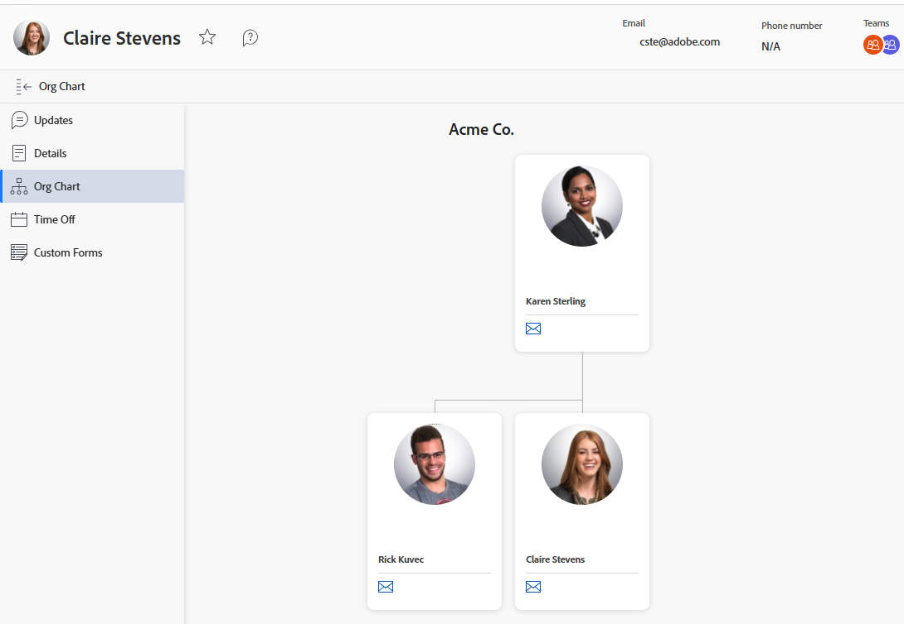

# Organigramm anzeigen

Mit der Funktion Organigramm können Sie das Organigramm anzeigen, das einem bestimmten [!DNL Adobe Workfront] Benutzer zugeordnet ist. Organigramme sind eine gute Möglichkeit, die Struktur einer bestimmten Abteilung zu visualisieren.

## Zugriffsanforderungen

+++ Erweitern Sie , um die Zugriffsanforderungen für die -Funktion in diesem Artikel anzuzeigen.

<table style="table-layout:auto">
 <col> 
 <col> 
 <tbody> 
  <tr> 
   <td>Adobe Workfront-Paket</td> 
   <td>
Beliebig
</td> 
  </tr> 
  <tr> 
   <td>Adobe Workfront-Lizenz</td> 
   <td>
   
Licht oder höher

   
Überprüfen oder höher
</td>
  </tr> 
 </tbody> 
</table>

Weitere Informationen finden Sie unter [Zugriffsanforderungen in der Dokumentation zu Workfront](/help/quicksilver/administration-and-setup/add-users/access-levels-and-object-permissions/access-level-requirements-in-documentation.md).

+++

## Suchen des Organigramms eines Benutzers

{{step1-click-profile-pic}}

1. Klicken Sie im linken Bedienfeld auf **[!UICONTROL Organigramm]**.
   

   Das Organigramm wird angezeigt.
