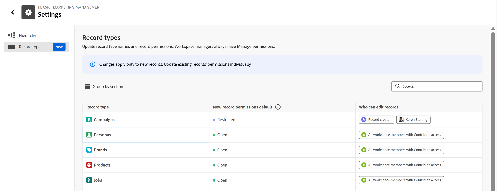

# Festlegen von Standardberechtigungen für Datensätze

Die Informationen auf dieser Seite beziehen sich auf Funktionen, die noch nicht allgemein verfügbar sind. Sie ist nur in der Vorschau -Umgebung für alle Kunden verfügbar. Nach der Veröffentlichung in der Vorschau sind dieselben Funktionen auch monatlich in der Produktionsumgebung für Kunden verfügbar, die schnelle Versionen aktiviert haben. \
Informationen zu Schnellversionen finden Sie unter [Aktivieren oder Deaktivieren von Schnellversionen für Ihre Organisation](/help/quicksilver/administration-and-setup/set-up-workfront/configure-system-defaults/enable-fast-release-process.md). 

{{planning-important-intro}}

Sie können Standardberechtigungen für Datensätze festlegen, wenn Sie den Datensatztyp oder die Arbeitsbereichseinstellungen ändern.

Sie können allen Datensätzen, die für einen Datensatztyp hinzugefügt werden, offene oder eingeschränkte Berechtigungen erteilen.

## Zugriffsanforderungen

+++ Erweitern, um die Zugriffsanforderungen für die in diesem Artikel beschriebene Funktionalität anzuzeigen. 

<!--
at GA, check that the Workfront plans article linked below has Planning info
-->

<table style="table-layout:auto"> 
<col> 
</col> 
<col> 
</col> 
<tbody> 
    <tr> 
<tr> 
   <td role="rowheader">
Adobe Workfront-Paket
</td> 
   <td> 

Beliebige Workfront oder Workflows mit einem Planungspaket

</tr>

<tr> 
   <td role="rowheader">
Adobe Workfront-Lizenz
</td> 
   <td>
Beliebig
 
   
<b>NOTIZ</b>

   
Nur Personen mit einer Standardlizenz können Berechtigungen zum Verwalten von Datensätzen erhalten. Alle anderen Lizenzen können nur über Anzeigeberechtigungen verfügen und die Option Verwalten ist für sie abgeblendet.

  </td> 
  </tr> 
  <tr> 
   <td role="rowheader">
Objektberechtigungen
</td> 
   <td>  
Verwalten von Berechtigungen für einen Arbeitsbereich und einen Datensatztyp
  
   
<b>WICHTIG</b>

   
Nur Benutzer mit der Berechtigung Verwalten für einen Arbeitsbereich können einen Datensatz freigeben
</td> 
  </tr>
</tbody> 
</table>

Weitere Informationen finden Sie unter [Zugriffsanforderungen in der Dokumentation zu Workfront](/help/quicksilver/administration-and-setup/add-users/access-levels-and-object-permissions/access-level-requirements-in-documentation.md).

+++

## Überlegungen zum Festlegen von standardmäßigen Datensatzberechtigungen

Beachten Sie Folgendes bei der Konfiguration von standardmäßigen Datensatzberechtigungen:

* Pro Datensatztyp kann jeweils nur eine Standardberechtigungsregel aktiv sein.
* Eine Änderung der Regel betrifft nur Datensätze, die nach der Änderung erstellt wurden. Vorhandene Datensätze behalten ihre aktuellen Berechtigungen bei.
* Systemadministratoren und Arbeitsbereichsmanager behalten unabhängig von der Regel immer den Verwaltungszugriff auf alle Datensätze.
* Nachdem ein Datensatz erstellt wurde, können seine Berechtigungen unabhängig in seinem Freigabedialog geändert werden, ohne dass die Standardregel betroffen ist.
* Für globale Datensatztypen kann jeder Arbeitsbereich (primär und sekundär) eine eigene Standardregel konfigurieren. Neue Datensätze übernehmen die Regel des Arbeitsbereichs, in dem sie erstellt werden.

## Konfigurieren von standardmäßigen Datensatzberechtigungen für einen Arbeitsbereich

1. Wechseln Sie zu einem Arbeitsbereich > **Mehr** Menü  > **Einstellungen** > **Datensatztypen**.

   

1. (Optional) Klicken Sie in die Zelle eines **Datensatztyps**, um Namen von Datensatztypen zu bearbeiten.

1. Klicken Sie in **Spalte „Standardeinstellung für neue**&quot; auf die Zelle für den Datensatztyp, dessen Berechtigungen Sie aktualisieren möchten.

1. Wählen Sie aus den folgenden Optionen:

   * **Öffnen**: Alle Mitwirkenden am Arbeitsbereich können einen neu erstellten Datensatz verwalten. Dies ist das aktuelle Standardverhalten für alle vorhandenen und neuen Datensatztypen.
   * **Eingeschränkt**: Nur der Ersteller des Datensatzes und alle explizit hinzugefügten Benutzer können neu erstellte Datensätze bearbeiten. Alle anderen erhalten schreibgeschützten Zugriff.

1. (Bedingt) Wenn Sie die Standardberechtigungen von **Eingeschränkt** in **Öffnen** ändern, klicken Sie im Feld **Wechseln zu Öffnen** auf **Umschalten**, um Ihre Auswahl zu bestätigen.
1. (Bedingt) Wenn Sie **Eingeschränkt** ausgewählt haben, fügen Sie in der Spalte **Wer kann Datensätze bearbeiten** zusätzliche Editoren hinzu. Sie können Benutzer, Gruppen, Teams, Rollen oder Unternehmen hinzufügen.

   >[!NOTE]
   >
   >* Der Ersteller des Datensatzes ist immer enthalten und kann nicht entfernt werden.
   >* Sie können nur Entitäten auswählen, die bereits über die Berechtigung Beitragen oder Verwalten für den Datensatztyp verfügen.

   Änderungen werden automatisch gespeichert. Nach dem Speichern wird die Regel sofort wirksam und gilt automatisch für alle Datensätze, die für diesen Datensatztyp erstellt wurden.

## Konfigurieren von Standardeintragsberechtigungen für einen Datensatztyp

1. Navigieren Sie zu Datensatztyp > **Mehr** Menü  > **Einstellungen** > **Datensatzeinstellungen**.

   

1. Klicken **im Feld** Datensatzberechtigungstyp“ auf eine der folgenden Optionen:

   * **Öffnen**: Alle Mitwirkenden am Arbeitsbereich können einen neu erstellten Datensatz verwalten. Dies ist das aktuelle Standardverhalten für alle vorhandenen und neuen Datensatztypen.
   * **Eingeschränkt**: Nur der Ersteller des Datensatzes und alle explizit hinzugefügten Benutzer können neu erstellte Datensätze bearbeiten. Alle anderen erhalten schreibgeschützten Zugriff.
1. (Bedingt) Wenn Sie die Standardberechtigungen von **Eingeschränkt** in **Öffnen** ändern, klicken Sie im Feld **Wechseln zu Öffnen** auf **Umschalten**, um Ihre Auswahl zu bestätigen.
1. (Bedingt) Wenn Sie **Eingeschränkt** ausgewählt haben, fügen Sie im Feld **Wer kann Datensätze bearbeiten** zusätzliche Editoren hinzu. Sie können Benutzer, Gruppen, Teams, Rollen oder Unternehmen hinzufügen.

   >[!NOTE]
   >
   >* Der Ersteller des Datensatzes ist immer enthalten und kann nicht entfernt werden.
   >* Sie können nur Entitäten auswählen, die bereits über die Berechtigung Beitragen oder Verwalten für den Datensatztyp verfügen.

   Änderungen werden automatisch gespeichert. Nach dem Speichern wird die Regel sofort wirksam und gilt automatisch für alle Datensätze, die für diesen Datensatztyp erstellt wurden.