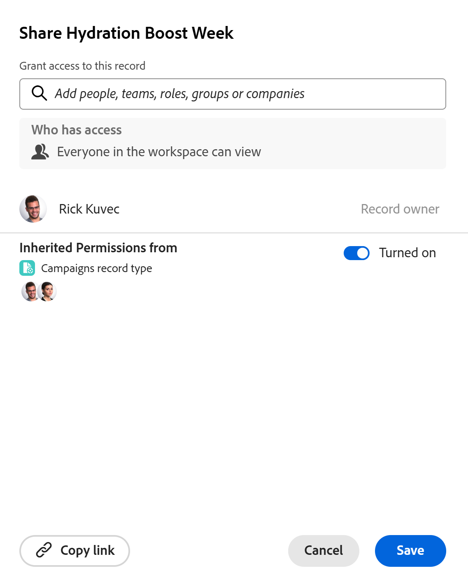

<!--update metadata with real information at release-->

# Freigeben von Einträgen

<!--
this will NOT be available in Preview ever - find a way to add this in this article that is prominent
-->

Die Informationen auf dieser Seite beziehen sich auf Funktionen, die noch nicht allgemein verfügbar sind. Sie ist nur in der Vorschau -Umgebung für alle Kunden verfügbar. Nach den monatlichen Releases in der Produktion stehen dieselben Funktionen auch in der Produktionsumgebung für Kunden zur Verfügung, die schnelle Releases aktiviert haben. \
Informationen zu Schnellversionen finden Sie unter [Aktivieren oder Deaktivieren von Schnellversionen für Ihre Organisation](/help/quicksilver/administration-and-setup/set-up-workfront/configure-system-defaults/enable-fast-release-process.md). 

{{planning-important-intro}}

Sie können die Berechtigungen von Personen für einzelne Datensätze in einem Datensatztyp in Adobe Workfront Planning anpassen.

Sie können einen Adobe Workfront Planning-Datensatz wie folgt freigeben:

* Freigeben eines Links zum Datensatz.

  Weitere Informationen finden Sie unter [Freigeben von Datensätzen über einen Link](/help/quicksilver/planning/records/share-records.md).

* Geben Sie alle Datensätze in einem Arbeitsbereich für andere Benutzer frei, indem Sie den Arbeitsbereich und den Datensatztyp freigeben.

  Weitere Informationen finden Sie in den folgenden Artikeln:

   * [Freigeben eines Arbeitsbereichs](/help/quicksilver/planning/access/share-workspaces.md)

   * [Datensatztyp freigeben](/help/quicksilver/planning/access/share-record-types.md)

* Freigeben eines einzelnen Datensatzes oder Massenfreigabe mehrerer Datensätze mithilfe der Option **Freigeben**.

  In diesem Artikel wird beschrieben, wie Sie Datensätze mithilfe der Option &quot;**&quot; für andere freigeben**.

>[!IMPORTANT]
>
>* Benutzende mit Zugriff auf einen Arbeitsbereich erhalten automatisch mindestens die Berechtigung Anzeigen für alle Datensätze im Arbeitsbereich.
>* Bei der Freigabe von Ansichten erhalten Benutzende keine Berechtigungen für Datensätze. Nur freigegebene Arbeitsbereiche können Benutzern Berechtigungen für Datensatztypen und Datensätze gewähren.
>
>Allgemeine Informationen zum Freigeben von Objekten in Workfront Planning finden Sie auch unter [Übersicht über Freigabeberechtigungen in Adobe Workfront Planning](/help/quicksilver/planning/access/sharing-permissions-overview.md).

## Zugriffsanforderungen

+++ Erweitern, um die Zugriffsanforderungen für die in diesem Artikel beschriebene Funktionalität anzuzeigen. 

<!--
at GA, check that the Workfront plans article linked below has Planning info
-->

<table style="table-layout:auto"> 
<col> 
</col> 
<col> 
</col> 
<tbody> 
    <tr> 
<tr> 
   <td role="rowheader">
Adobe Workfront-Paket
</td> 
   <td> 

Beliebiges Workfront- und Planungspaket
 
ODER

Beliebiges Workflow- und Planungspaket
 
 </tr>

<tr> 
   <td role="rowheader">
Adobe Workfront-Lizenz
</td> 
   <td>
Beliebig
 
   
<b>NOTIZ</b>

   
Nur Personen mit einer Standardlizenz können Berechtigungen zum Verwalten von Datensätzen erhalten. Alle anderen Lizenzen können nur über Anzeigeberechtigungen verfügen und die Option Verwalten ist für sie abgeblendet.

  </td> 
  </tr> 
  <tr> 
   <td role="rowheader">
Objektberechtigungen
</td> 
   <td>  
Verwalten von Berechtigungen für einen Arbeitsbereich, einen Datensatztyp und den Datensatz
  
   
<b>WICHTIG</b>

   
Nur Benutzer mit der Berechtigung Verwalten für einen Arbeitsbereich können einen Datensatz freigeben
</td> 
  </tr>
<tr>
   <td role="rowheader">
Layout-Vorlage
</td>
   <td> Benutzenden mit einer Light- oder Contributor-Lizenz muss eine Layout-Vorlage zugewiesen werden, die Planning enthält.
   
Für Standardbenutzer und Systemadministratoren sind die Planungsbereiche standardmäßig aktiviert.

</li></ul>
</td>
  </tr>

</tbody> 
</table>

Weitere Informationen finden Sie unter [Zugriffsanforderungen in der Dokumentation zu Workfront](/help/quicksilver/administration-and-setup/add-users/access-levels-and-object-permissions/access-level-requirements-in-documentation.md).

+++

## Überlegungen zur Freigabe von Datensätzen

<!--
maybe use the Share record types as example here and touch on the same points: help/quicksilver/planning/access/share-record-types.md; in addition to using Lilit's information
-->

<!--checking on the below with Lilit-->

* Sie können Datensätze für die folgenden Entitäten freigeben: Personen, Gruppen, Teams, Unternehmen oder Aufgabengebiete.
* Wenn Sie die Berechtigungen auf einen Datensatz beschränken, können Benutzer diesen Datensatz und die Werte für die Suchfelder an keiner Stelle des Systems mehr anzeigen, an der dieser Datensatz angezeigt wird.
* Workfront überprüft Datensatzberechtigungen in Verbindungen mit bis zu fünf Datensätzen, um sicherzustellen, dass Benutzende nur die für sie freigegebenen Datensätze sehen.
* Sie können einem Datensatz die folgenden Berechtigungsebenen gewähren:

   * Ansicht
   * Verwalten
* Wenn Sie einen Arbeitsbereich und einen Datensatztyp für Benutzende freigeben, erhalten diese standardmäßig auch dieselben Berechtigungen für die Datensätze im Arbeitsbereich.
Wenn Benutzende die Berechtigung Beitragen für einen Arbeitsbereich oder Datensatztyp haben, erhalten sie Verwaltungsberechtigungen für die Datensätze dieses Datensatztyps.
* Wenn Sie eine Entität aus einem Arbeitsbereich entfernen, werden alle Freigabeberechtigungen aus den Datensatztypen und allen darin enthaltenen Datensätzen entfernt.
* Sie können einen Datensatz nicht für einen Benutzer freigeben, der nicht über die Berechtigungen für den Arbeitsbereich oder den Datensatztyp verfügt.

  Wenn Sie einen Datensatz für eine Person freigeben, die sich nicht im Arbeitsbereich befindet, werden diese automatisch zum Arbeitsbereich hinzugefügt.
* Der Zugriff eines Benutzers auf den Datensatz wird durch die Kombination der folgenden drei Einstellungen bestimmt:

   * Berechtigungen, die vom Datensatztyp und Arbeitsbereich übernommen wurden
   * Berechtigungen werden einzeln im Feld für die Datensatzfreigabe hinzugefügt
   * Die Einstellung **Jeder Benutzer im Arbeitsbereich kann anzeigen**.

     Dadurch kann der Datensatz von allen Personen im Arbeitsbereich angezeigt werden

     <!--
      Cannot do this on a record: 
      * **Only invited people can access**: This is selected by default and allows restricting access to the record to specific people. 
      -->

* Wenn Sie einen Datensatz für einen Benutzer freigeben, werden diese standardmäßig mit derselben Berechtigung hinzugefügt, die sie für den Datensatztyp haben.

  Beispiel:

   * Wenn sie über Anzeigeberechtigungen für den Datensatztyp verfügen, erhalten sie Anzeigeberechtigungen für den Datensatz
   * Wenn sie die Berechtigungen Beitragen oder Verwalten für den Datensatztyp besitzen, erhalten sie die Berechtigung Verwalten für den Datensatz

* Wenn ein(e) Benutzende(r) über die Berechtigungen Verwalten oder Beitragen für den Arbeitsbereich und den Datensatztyp verfügt und Sie sie zu den Datensatzberechtigungen hinzufügen, sind die Anzeigeberechtigungen abgeblendet. Sie behalten dieselben Berechtigungen für den Datensatz wie für den Datensatztyp, und Sie können ihnen keine niedrigeren Berechtigungen für den Datensatz erteilen.

* Sie können geerbte Berechtigungen für einen einzelnen Datensatz deaktivieren. In diesem Fall können Sie ausgewählten Benutzern Berechtigungen für einzelne Datensätze erteilen. Wenn sie zum Arbeitsbereich gehören, können sie aufgrund der Option **Jeder im Arbeitsbereich kann anzeigen** Berechtigungen erlangen.

* Wenn für denselben Benutzer mehrere Freigabeberechtigungen gelten, erhalten sie die höchste Ebene dieser Berechtigungen.

  Wenn beispielsweise ein Datensatz für einen Benutzer mit Ansichtsberechtigungen und dessen Gruppe mit Verwaltungszugriff freigegeben wird, erhält dieser Benutzer Verwaltungsberechtigungen für den Datensatz.

* Wenn ein Formelfeld oder ein Nachschlagefeld aus einem verbundenen Datensatz auf einem Feld für einen Datensatz basiert, für den Sie keine Berechtigungen haben, wird die richtige Berechnung angezeigt, auf welche Faktoren im Datensatz Sie sonst nicht zugreifen können.

  <!--
   Not possible: 
   * As a workspace manager, you can share a record with a user that does not have permissions to the record type or the workspace. In this case, there is a warning next to the added entity notifying you that they don't have access to the workspace or the record type.  You can continue adding the user to the record which will also add them to the record type and workspace, or cancel the sharing.
   -->

  <!--
   ensure this is this way, because in devtest the warning only shows record type, but logged a bug to add "workspace" to the warning too
   -->

<!--
Lilit is checking on this, it is not working correctly
-->

<!--
   check on this: I cannot disable inherited permissions when this setting is ON and this documented in a TIP below: When they have View permissions to the workspace or the record type, they retain View permissions to the records. You can grant them Manage permissions to the record by disabling Inherited permissions and selecting the Only invited people can access setting.
   -->

<!-- 
   not sure what this means, confusing, hiding for now: * If you don't have permissions to add people to the workspace, you will only see and add users, teams, groups, roles, and companies that are already added to the workspace. You cannot add any other entity that is not already part of the workspace.
   -->

<!--
   Too granular??
   If the inheritance has not been disabled, the user gets the maximum of inherited+individual+wildcard access 
   If the inherited permissions are disabled, the user gets the maximum of wildcard+individual permissions 
   -->

<!--
   not sure if any of the Share record types points might match here - ask Lilit??
   -->

## Freigeben von Einträgen

Als Workspace-Manager können Sie Berechtigungen an einzelne Datensätze anpassen.

{{step1-to-planning}}

1. Öffnen Sie den Arbeitsbereich und dann den Datensatztyp, dessen Datensätze Sie freigeben möchten.

1. Führen Sie einen der folgenden Schritte aus:

   * Bewegen Sie in der Tabellenansicht den Mauszeiger über den Namen eines Datensatzes und klicken Sie auf das Menü **Mehr**  dann auf **Freigeben**.
   * Wählen Sie in der Tabellenansicht einen oder mehrere Datensätze aus und klicken Sie dann unten in **blauen Symbolleiste auf** Freigeben“.
   * Klicken Sie in einer beliebigen Ansicht auf den Namen eines Datensatzes und dann **Freigeben** in der oberen rechten Ecke der Detailseite des Datensatzes.

   Das Feld **Freigeben** wird geöffnet.

   

   >[!WARNING]
   >
   >Sie können keine Berechtigungen für Datensätze freigeben, die in verschiedenen Arbeitsbereichen hinzugefügt werden. Wenn Sie Datensätze stapelweise freigeben, müssen die Datensätze alle im selben Arbeitsbereich erstellt werden.

1. (Optional) Im Bereich **Wer Zugriff hat** ist die Option **Jeder Benutzer im Arbeitsbereich kann** anzeigen) standardmäßig ausgewählt.  Alle Benutzer mit **Anzeigen** oder höheren Berechtigungen für den Arbeitsbereich und den Datensatztyp haben dieselben Berechtigungen für den Datensatz.

1. (Optional) Klicken Sie unter der Option **Vererbte Berechtigungen von** auf die Avatare von Benutzern, um Benutzer, Teams, Gruppen, Unternehmen oder Aufgabengebiete anzuzeigen, die Berechtigungen vom Arbeitsbereich erben. <!--logged bug to move "Permissions" to lowercase-->

   Die Berechtigungen des Benutzers für den Datensatztyp werden angezeigt, wenn Sie die geerbten Berechtigungen erweitern.

   >[!TIP]
   >
   >Sie können keine einzelnen Entitäten aus der Liste der geerbten Berechtigungen entfernen. Die Benutzer aus Teams, Gruppen, Unternehmen oder Aufgabengebieten werden anstelle der Entitäten aufgelistet, mit denen sie verknüpft waren, als der Arbeitsbereich und der Datensatztyp für sie freigegeben wurden.

1. (Optional und bedingt) Wenn Sie den Datensatz für bestimmte Entitäten freigeben und ihnen einen anderen Zugriff auf den Datensatztyp gewähren möchten, als sie bereits für den Arbeitsbereich haben, gehen Sie wie folgt vor:

   1. Deaktivieren Sie die **Aktiviert** unter **Vererbte Berechtigungen**. Er ist standardmäßig ausgewählt.

      Die Option ändert sich in **Deaktiviert**.

      >[!TIP]
      >
      >Workspace-Manager und Datensatzersteller verfügen weiterhin über Verwaltungsberechtigungen für den Datensatztyp und den Datensatz.

      <!-- 
      This is no longer possible for a record: 
      (Optional) Select **Only invited people can access** from the **Who has access** area. You must indicate individual users, groups, teams, or companies to share the records with. 
      >[!TIP]
      >
      >You cannot disable or enable Inherited permissions when this setting is selected.
      -->

   1. Fügen Sie im Feld **Zugriff auf diesen Datensatz gewähren** die Benutzer, Teams, Gruppen, Unternehmen oder Aufgabengebiete hinzu, denen Sie eine andere Berechtigungsstufe gewähren möchten als für den Arbeitsbereich oder den Datensatztyp.

      Wenn Sie einen Datensatz für einen Benutzer freigeben, werden dessen primäres Aufgabengebiet und dessen E-Mail-Adresse ebenfalls im Feld angezeigt. Damit Sie die E-Mail-Adresse des Benutzers anzeigen können, muss für das Benutzerobjekt in Ihrer Zugriffsebene die Einstellung „Kontaktinformationen anzeigen“ aktiviert sein.

   1. Wählen Sie eine der folgenden Berechtigungsebenen aus:

      * Ansicht
      * Verwalten

      >[!IMPORTANT]
      >
      >* Wenn Benutzende über die Berechtigungen Beitragen oder Verwalten für den Arbeitsbereich und den Datensatztyp verfügen, können Sie ihnen Berechtigungen zum Verwalten des Datensatzes erteilen. Die Berechtigung zum Anzeigen ist abgeblendet.
      >* Benutzenden, die den Datensatztyp Contribute oder höher haben, können keine geringere Berechtigung für den Datensatz erteilt werden.
      >Weitere Informationen finden Sie unter [Übersicht über Freigabeberechtigungen in Adobe Workfront Planning](/help/quicksilver/planning/access/sharing-permissions-overview.md).
      >* Benutzern, die sich nicht im Arbeitsbereich befinden, können keine Berechtigungen erteilt werden. Benutzende, die keine Berechtigungen für den Arbeitsbereich und den Datensatztyp haben, können auf keinen der Datensätze zugreifen.

   <!--   
   Not possible:
   1. To give users who do not have permissions to the workspace access to view a record, in the **Grant access to this view** field, start typing the name of a user, a group, team, company, or job role, then click it when it displays in the list. 
      The entity you selected is added to the record and also to the record type and the workspace with **View** permissions. 
      System administrators always receive Manage permissions to records shared with them, and there is an indication that a user is a System administrator.
   -->

1. (Optional) Klicken Sie auf **Link kopieren**, um einen Link zum Datensatz in die Zwischenablage zu kopieren und für andere freizugeben. Durch Klicken auf diesen Link wird die Detailseite des Datensatzes geöffnet.
1. Klicken Sie auf **Speichern**.

   Der Datensatz wird jetzt für andere Benutzer freigegeben.

   Die Benutzer, für die Sie den Datensatz freigegeben haben, erhalten sowohl eine In-App- als auch eine E-Mail-Benachrichtigung darüber, dass sie Berechtigungen für den Datensatz erhalten haben.

   <!--
   not possible anymore: 
   * The record
   * The record type, if they never had permissions before
   * The workspace, if they had not had permissions to the workspace before the record was shared with them.
   -->

   Weitere Informationen finden Sie unter [Adobe Workfront-Planungsbenachrichtigungen: Artikelindex](/help/quicksilver/planning/notifications/notifications-information.md).

1. (Optional) Geben Sie den kopierten Link für andere frei.

   Benutzer, die den Link erhalten, müssen aktive Benutzer sein und sich bei Workfront anmelden, um auf die Seite für den Datensatztyp zugreifen und sie in der ausgewählten Ansicht anzeigen zu können.

   Sie müssen über Berechtigungen für den Datensatztyp verfügen, um ihn anzeigen zu können.

   Weitere Informationen finden Sie auch unter [Freigeben von Datensätzen über einen Link](/help/quicksilver/planning/records/share-records.md).

## Entfernen von Berechtigungen für einen Datensatz

Sie können Benutzerberechtigungen aus einem Datensatz entfernen. Sie behalten jedoch mindestens die Berechtigung Anzeigen für den Arbeitsbereich bei, wodurch sie mindestens die Berechtigung Anzeigen für den Datensatztyp erhalten.

Sie müssen ihren Zugriff aus dem Arbeitsbereich entfernen, wenn sie keine Berechtigungen für die Datensatztypen oder Datensätze im Arbeitsbereich haben sollen.

Sie können einen Benutzer nicht aus geerbten Berechtigungen entfernen.

{{step1-to-planning}}

1. Öffnen Sie den Arbeitsbereich, dessen Datensätze Sie nicht mehr freigeben möchten, und klicken Sie dann auf eine Karte vom Typ Datensatz. Dadurch wird die Seite „Datensatztyp“ geöffnet.
1. Führen Sie einen der folgenden Schritte aus:

   * Bewegen Sie in der Tabellenansicht den Mauszeiger über den Namen eines Datensatzes und klicken Sie auf das Menü **Mehr**  dann auf **Freigeben**.
   * Wählen Sie in der Tabellenansicht einen oder mehrere Datensätze aus und klicken Sie dann unten in **blauen Symbolleiste auf** Freigeben“.

     Sie müssen Datensätze auswählen, die im selben Arbeitsbereich erstellt wurden.
   * Klicken Sie in einer beliebigen Ansicht auf den Namen eines Datensatzes und dann **Freigeben** in der oberen rechten Ecke der Detailseite des Datensatzes.

   Das Feld **Freigeben** wird geöffnet.
1. Suchen Sie die Person, Gruppe, Team, Firma oder Aufgabengebiet, deren Berechtigungen Sie entfernen möchten, erweitern Sie das Dropdown-Menü Berechtigungen rechts neben ihrem Namen und klicken Sie auf **Entfernen**.

   

1. Klicken Sie auf **Speichern**.

   Die Personen verfügen nicht mehr über die angegebenen Berechtigungen für den Datensatz. Sie haben jedoch weiterhin Berechtigungen für den Datensatztyp und den Arbeitsbereich, es sei denn, Sie entfernen sie auch aus diesen Berechtigungen.

   Die Benutzer, die vom Zugriff auf den Datensatz entfernt wurden, erhalten keine Benachrichtigung, dass sie nicht mehr über diese Berechtigungen verfügen.
