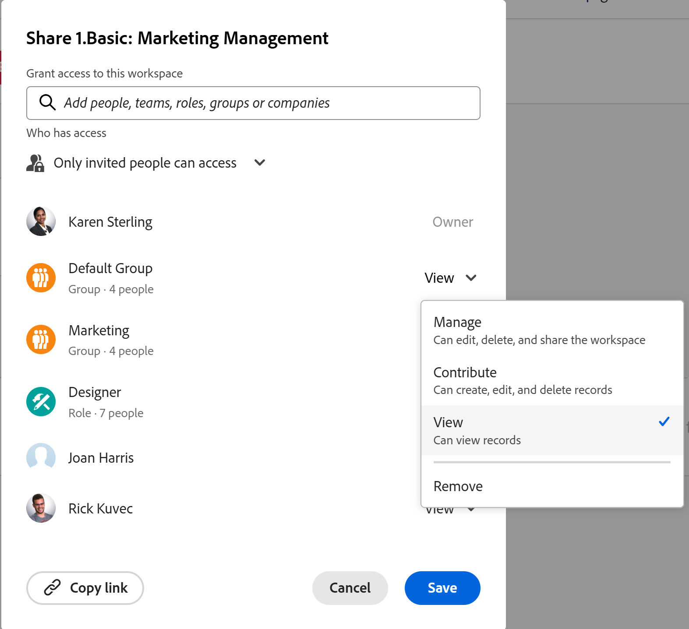

# Freigeben von Arbeitsbereichen

<!--
The highlighted information on this page refers to functionality not yet generally available. It is available only in the Preview environment for all customers. After the monthly releases to Production, the same features are also available in the Production environment for customers who enabled fast releases.    

For information about fast releases, see [Enable or disable fast releases for your organization](/help/quicksilver/administration-and-setup/set-up-workfront/configure-system-defaults/enable-fast-release-process.md). 
-->

{{planning-important-intro}}

Sie können einen Arbeitsbereich für andere freigeben, um die Zusammenarbeit bei der Arbeit in Adobe Workfront Planning sicherzustellen.

<!--
This article describes how you can share a view with others. For information about requesting, granting, or denying permissions to a view, see [Request permissions to a view or a workspace](/help/quicksilver/planning/access/request-permissions.md).
-->

>[!NOTE]
>
>Durch das Gewähren von Berechtigungen für einen Arbeitsbereich erhalten andere Benutzer keine Berechtigungen für die Ansichten auf den Datensatztypseiten. Sie müssen einzelnen Ansichten auf einer Datensatztypseite Berechtigungen erteilen, um sie für andere Benutzer freigeben zu können. Weitere Informationen finden Sie unter [Freigeben einer Ansicht](/help/quicksilver/planning/access/share-views.md).

## Zugriffsanforderungen

+++ Erweitern, um die Zugriffsanforderungen für die in diesem Artikel beschriebene Funktionalität anzuzeigen. 

<!--at GA, check that the Workfront plans article linked below has Planning info-->

<table style="table-layout:auto"> 
<col> 
</col> 
<col> 
</col> 
<tbody> 
<tr> 
   <td role="rowheader">
Adobe Workfront-Paket
</td> 
   <td> 

Beliebiges Workfront- und Planungspaket
 
ODER

Beliebiges Workflow- und Planungspaket
 
 </tr>
<tr> 
   <td role="rowheader">
Adobe Workfront-Lizenz
</td> 
   <td>
Standard
 
  </td> 
  </tr>

<td role="rowheader">
Objektberechtigungen
</td> 
   <td>  
Verwalten von Berechtigungen für einen Arbeitsbereich
  </td> 
  </tr>

</tbody> 
</table>

Weitere Informationen zu Zugriffsanforderungen für Workfront finden Sie unter [Zugriffsanforderungen in der Dokumentation zu Workfront](/help/quicksilver/administration-and-setup/add-users/access-levels-and-object-permissions/access-level-requirements-in-documentation.md).

+++

<!--
Old:
<table style="table-layout:auto"> 
<col> 
</col> 
<col> 
</col> 
<tbody> 
    <tr> 
<tr> 
<td> 
   
 Products
 </td> 
   <td> 
   <ul><li>
 Adobe Workfront
</li> 
   <li>
 Adobe Workfront Planning
</li></ul></td> 
  </tr>   
<tr> 
   <td role="rowheader">
Adobe Workfront plan*
</td> 
   <td> 

Any of the following Workfront plans:
 
<ul><li>Select</li> 
<li>Prime</li> 
<li>Ultimate</li></ul> 

Workfront Planning is not available for legacy Workfront plans
 
   </td> 
<tr> 
   <td role="rowheader">
Adobe Workfront Planning package*
</td> 
   <td> 

Any 
 

For more information about what is included in each Workfront Planning plan, contact your Workfront account manager. 
 
   </td> 
 <tr> 
   <td role="rowheader">
Adobe Workfront platform
</td> 
   <td> 

Your organization's instance of Workfront must be onboarded to the Adobe Unified Experience to be able to access Workfront Planning.

Your organization must be onboarded to the Adobe Unified Experience for users to be able to request and grant permissions to a workspace from a permission request. 
 

Users must be added to the Adobe Admin Console in order to gain permissions to Workfront Planning workspaces.

For more information, see <a href="/help/quicksilver/workfront-basics/navigate-workfront/workfront-navigation/adobe-unified-experience.md">Adobe Unified Experience for Workfront</a>. 
 
   </td> 
   </tr> 
  </tr> 
  <tr> 
   <td role="rowheader">
Adobe Workfront license*
</td> 
   <td>
 Standard 

   
Workfront Planning is not available for legacy Workfront licenses
 
  </td> 
  </tr> 
  <tr> 
   <td role="rowheader">
Access level configuration
</td> 
   <td> 
There are no access level controls for Adobe Workfront Planning
   
</td> 
  </tr> 
<tr> 
   <td role="rowheader">
Object permissions
</td> 
   <td>  
Manage permissions to a workspace
  </td> 
  </tr> 

</tbody> 
</table>
-->

## Überlegungen zur Freigabe von Arbeitsbereichen

* Allgemeine Informationen zum Freigeben von Objekten in Workfront Planning finden Sie auch unter [Übersicht über Freigabeberechtigungen in Adobe Workfront Planning](/help/quicksilver/planning/access/sharing-permissions-overview.md).
* Sie können Arbeitsbereiche für Benutzende, Teams, Rollen, Gruppen oder Unternehmen innerhalb Ihrer Organisation freigeben.
* Zusätzlich zu Teams, Gruppen, Unternehmen und Aufgabengebieten können Sie nur für Benutzende freigeben, die der Adobe Admin Console hinzugefügt wurden.
* Sie können Arbeitsbereiche nicht für Benutzende außerhalb Ihrer Organisation freigeben.
* Wenn Sie einen Arbeitsbereich freigeben, werden alle Datensatztypen, Datensätze und Felder, die mit den Arbeitsbereichen verknüpft sind, ebenfalls freigegeben.
* Wenn Sie einen Arbeitsbereich freigeben, werden Ansichten nicht freigegeben. Sie müssen Ansichten separat freigeben.
* Workspace-Berechtigungen werden für Datensatztypen als geerbte Berechtigungen angezeigt.

## Freigeben von Berechtigungen für einen Arbeitsbereich

Die folgenden Benutzer können einen Arbeitsbereich für andere Benutzer freigeben:

* Systemadministratoren können alle Arbeitsbereiche freigeben, auch die, die sie nicht erstellt haben.
* Alle anderen Benutzer können nur Arbeitsbereiche freigeben, für die sie über Verwaltungsberechtigungen verfügen.

So geben Sie einen Arbeitsbereich für andere frei:

{{step1-to-planning}}

1. Öffnen Sie den Arbeitsbereich, den Sie freigeben möchten, und klicken **oben rechts** Bildschirm auf „Freigeben“. Das Feld Freigabe wird geöffnet.

   

1. (Bedingt) Führen Sie je nach Zugriffsebene eine der folgenden Aktionen aus:

   * Wenn Sie Systemadministrator sind, wählen Sie aus den folgenden Optionen:

      * **Nur eingeladene Personen können zugreifen**: Sie müssen Entitäten im Freigabefeld auswählen und ihren Zugriff auf den Arbeitsbereich auswählen. Dies ist die Standardauswahl.
      * **Jeder im System kann Folgendes anzeigen**: Jeder im System mit Zugriff auf Planning kann den Workspace in seinem Bereich **Arbeitsbereiche** in Planning anzeigen.

   * (Bedingt) Wenn Sie ein Workspace Manager mit einer Standardlizenz sind, können Sie eine der folgenden Auswahlen sehen, sie jedoch nicht ändern:

      * **Nur eingeladene Personen können darauf zugreifen**. Dies ist die Standardeinstellung.
      * **Jeder im System kann Folgendes anzeigen**

     Sie müssen einen Systemadministrator bitten, eine globale Berechtigung für einen Arbeitsbereich zu ändern.

1. Beginnen Sie im Feld **Zugriff auf diesen Arbeitsbereich gewähren** mit der Eingabe des Namens eines Benutzers, einer Gruppe, eines Teams, eines Unternehmens oder eines Aufgabengebiets und klicken Sie darauf, wenn es in der Liste angezeigt wird.

   

   >[!NOTE]
   >
   >* Zusätzlich zu Teams, Gruppen, Unternehmen und Aufgabengebieten können Sie nur für Benutzende freigeben, die der Adobe Admin Console hinzugefügt wurden. Benutzende, die nur Workfront unterstützen, können nicht hinzugefügt werden. Weitere Informationen finden Sie unter [Verwalten von Benutzern in der Adobe Admin Console](/help/quicksilver/administration-and-setup/add-users/create-and-manage-users/admin-console.md).
   >
   >* Wenn Sie einen Arbeitsbereich für einen Benutzer freigeben, werden dessen primäres Aufgabengebiet und dessen E-Mail-Adresse ebenfalls im Feld angezeigt. Damit Sie die E-Mail-Adresse des Benutzers anzeigen können, muss für das Benutzerobjekt in Ihrer Zugriffsebene die Einstellung „Kontaktinformationen anzeigen“ aktiviert sein.

1. (Optional) Wenn Sie eine Freigabe für eine Gruppe, ein Team, eine Rolle oder ein Unternehmen durchführen, bewegen Sie den Mauszeiger über den Namen der Entität und klicken Sie auf den Pfeil nach rechts, um eine Liste der Benutzer zu erweitern, die die Berechtigungen erhalten.

   

1. Wählen Sie eine der folgenden Berechtigungsebenen aus dem Dropdown-Menü aus:
   * Ansicht
   * Mitwirken
   * Verwalten

     Informationen zu Berechtigungsebenen und den Aktionen, die Benutzende für die einzelnen Ebenen ausführen können, finden Sie unter [Übersicht über Freigabeberechtigungen in Adobe Workfront Planning](/help/quicksilver/planning/access/sharing-permissions-overview.md).
1. Klicken Sie **Link kopieren**, um einen Link in den Arbeitsbereich in die Zwischenablage zu kopieren.
1. Geben Sie den kopierten Link für andere frei. Benutzer, die den Link erhalten, müssen aktive Benutzer sein und sich bei Workfront anmelden, um auf den Arbeitsbereich zugreifen zu können.
1. Klicken Sie auf **Speichern**.

   Die Benutzenden, für die Sie den Arbeitsbereich freigegeben haben, erhalten sowohl eine In-App- als auch eine E-Mail-Benachrichtigung über Berechtigungen für diesen Arbeitsbereich.

## Erteilen von Berechtigungen für einen Arbeitsbereich über eine Berechtigungsanfrage

Benutzende, die auf einen Link zu einem Arbeitsbereich zugreifen, für den sie keine Berechtigungen haben, können Berechtigungen für den Arbeitsbereich anfordern. Alle Benutzenden mit der Berechtigung Verwalten für den Arbeitsbereich erhalten die Berechtigungsanfrage und können die Berechtigungen erteilen oder verweigern.

1. (Bedingt) Wenn Sie der Manager eines Arbeitsbereichs sind, erhalten Sie möglicherweise eine Anfrage eines anderen Benutzers, in den folgenden Bereichen auf die Ansicht zuzugreifen:

   * In-App-Benachrichtigung
     
   * Eine E-Mail-Benachrichtigung
     
1. (Bedingt) Klicken Sie im Benachrichtigungsbereich in Workfront auf die In-App-Benachrichtigung
ODER
Klicken Sie in der E-Mail-Benachrichtigung **Alle Benachrichtigungen anzeigen** und klicken Sie dann auf die Benachrichtigung in der Liste.

   Das **Ausstehende**&quot; wird angezeigt.

   

1. (Optional) Wählen Sie für den Benutzer, dessen Berechtigungen Sie genehmigen möchten, eine der folgenden Optionen aus dem Dropdown-Menü rechts neben dem Namen des Benutzers aus:
   * **Anzeigen**
   * **Beitragen**
   * **Verwalten**
1. Wählen Sie den Benutzer aus, für den Sie die Berechtigung genehmigen oder ablehnen möchten, und klicken Sie dann auf **Alle genehmigen** oder **Alle ablehnen**.
1. Klicken Sie auf den nach links zeigenden Pfeil links neben **Ausstehende**) und dann auf **Speichern**.

   Wenn Sie die Anfrage genehmigt haben, werden die Benutzer zum Feld Freigabe des Arbeitsbereichs hinzugefügt. Der Benutzer, der die Berechtigung anfordert, erhält eine E-Mail-Bestätigung, dass seine Anforderung genehmigt wurde. <!--will they also get an in-app notification??-->

## Entfernen von Berechtigungen für einen Arbeitsbereich

{{step1-to-planning}}

1. Öffnen Sie den Arbeitsbereich, dem Berechtigungen entfernt werden sollen, und klicken Sie **oben rechts** Bildschirm auf „Freigeben“.
1. Klicken Sie auf das Dropdown-Menü rechts neben dem Namen einer Entität, für die Sie den Arbeitsbereich freigeben, und klicken Sie dann auf **Entfernen**.
1. Klicken Sie auf **Speichern**.

   Die entfernten Benutzer haben keinen Zugriff mehr auf den Arbeitsbereich oder dessen Objekte.

   Die Benutzer, die vom Zugriff auf den Arbeitsbereich entfernt wurden, werden nicht darüber informiert, dass sie nicht mehr über diese Berechtigungen verfügen.
