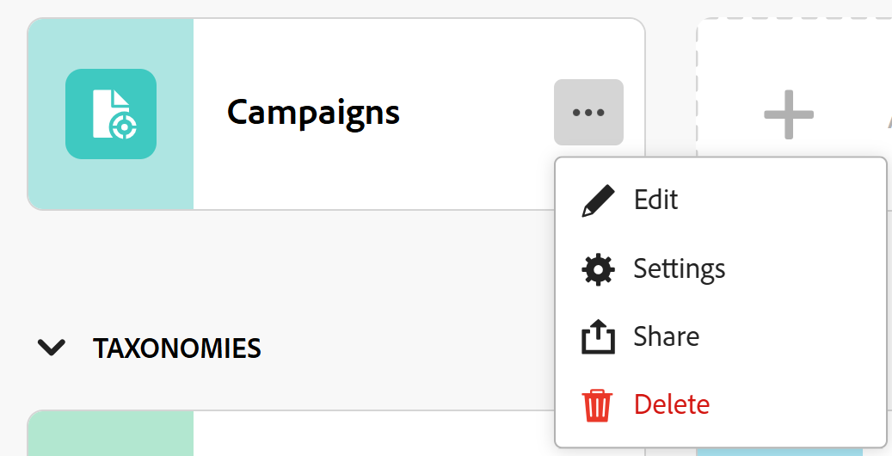
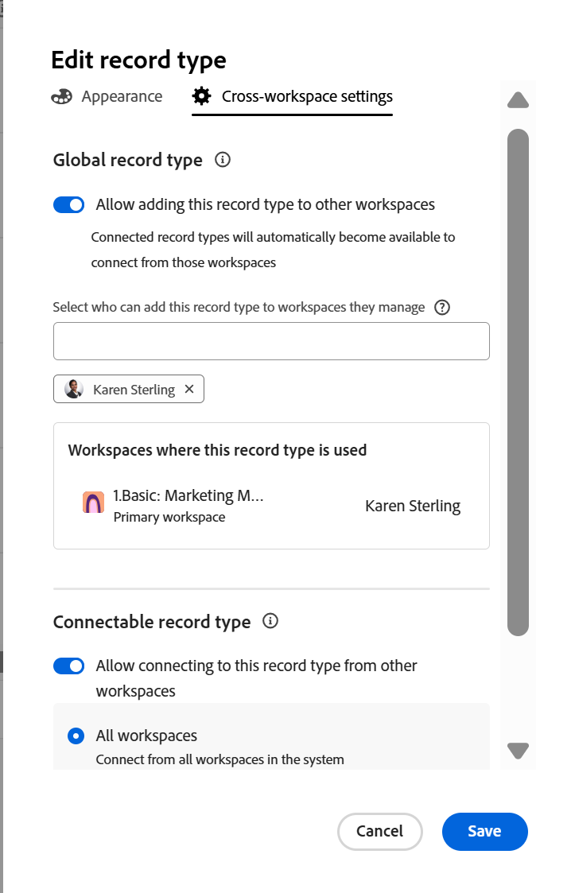
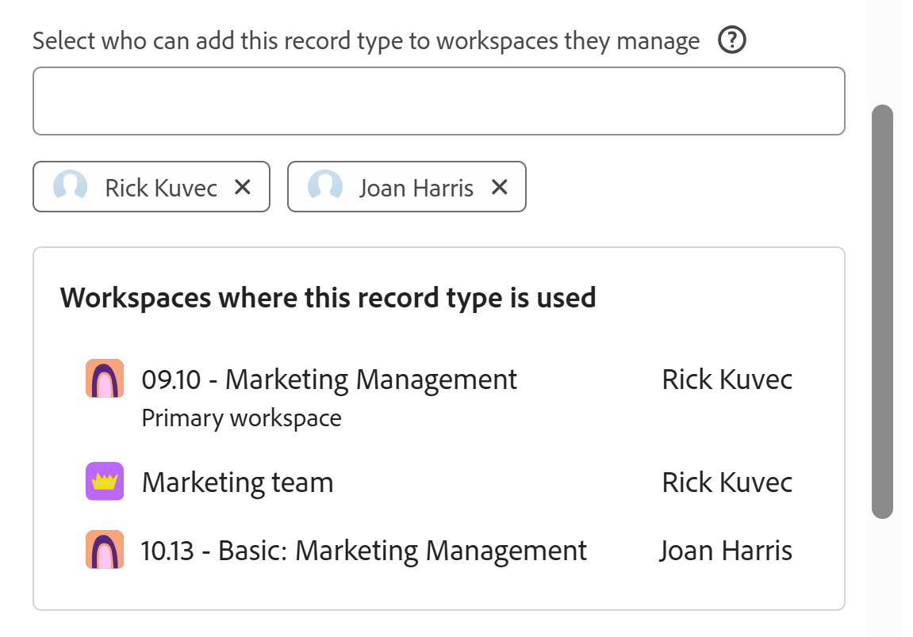

<!--
*******************REPLACE THE "ADVANCED SETTINGS" SECTION IN THE "EDIT RECORD TYPES" ARTICLE WITH A LINK TO THIS ARTICLE INSTEAD AND REMOVE THE STEPS FROM THE "EDIT RECORD TYPES" ARTICLE ON HOW TO ALLOW CROSS-WORKSPACE SETTINGS FOR RECORD TYPES*************
-->

# Konfigurieren von arbeitsbereichsübergreifenden Funktionen für Eintragstypen

<!--
this article is linked to the UI in the Advanced settings/ Cross-workspace settings tab - do not delete or change the URL
-->

{{planning-important-intro}}

<!--
The information highlighted on this page refers to functionality not yet generally available. It is available only in the Preview environment for all customers. After the monthly releases to Production, the same features are also available in the Production environment for customers who enabled fast releases.    

For information about fast releases, see [Enable or disable fast releases for your organization](/help/quicksilver/administration-and-setup/set-up-workfront/configure-system-defaults/enable-fast-release-process.md). 
-->

In Adobe Workfront Planning können Sie Datensatztypen so konfigurieren, dass sie in mehreren Arbeitsbereichen funktionieren.

Sie können einen Datensatztyp als einen der folgenden Typen festlegen:

* **Ein globaler Datensatztyp**: Benutzer können globale Datensatztypen zu anderen Arbeitsbereichen hinzufügen, die sie verwalten können.
* **Ein verbindbarer Datensatztyp**: Benutzer können von anderen Arbeitsbereichen aus eine Verbindung zu diesem Datensatztyp herstellen.

Sie müssen zunächst die arbeitsbereichsübergreifenden Funktionen eines Datensatztyps definieren, bevor Workspace-Manager ihn entweder zu anderen Arbeitsbereichen hinzufügen oder von anderen Arbeitsbereichen aus verbinden können.

Sie definieren die arbeitsbereichsübergreifenden Funktionen eines Datensatztyps, wenn Sie einen Datensatztyp erstellen oder bearbeiten.

Weitere Informationen finden Sie in einem der folgenden Artikel:

* [Erstellen von Eintragstypen](/help/quicksilver/planning/architecture/create-record-types.md)
* [Bearbeiten von Eintragstypen](/help/quicksilver/planning/architecture/edit-record-types.md)

## Zugriffsanforderungen

+++ Erweitern Sie , um die Zugriffsanforderungen für die Funktion in diesem Artikel anzuzeigen.

<table style="table-layout:auto"> 
<col> 
</col> 
<col> 
</col> 
<tbody> 
    <tr> 
<tr> 
</tr>   
<tr> 
   <td role="rowheader">
Adobe Workfront-Paket
</td> 
   <td> 

So konfigurieren Sie verbindbare Datensatztypen: 

<ul> 
<li>
Jedes Workfront-Paket und jedes Planungspaket
</li>
ODER
<li>Beliebiger Workflow und ein Planning Prime- oder Ultimate-Paket
</li></ul>

So konfigurieren Sie globale Datensatztypen:

<ul> 
<li>
Beliebiges Workfront-Paket und Planning Plus-Paket
</li>
ODER
<li>
Beliebiger Workflow und ein Planning Prime- oder Ultimate-Paket
</li></ul>

Weitere Informationen zu den einzelnen Workfront-Planungspaketen erhalten Sie von Ihrem Workfront-Kundenbetreuer. 

</td> 
  <tr> 
   <td role="rowheader">
Adobe Workfront-Lizenz
</td> 
   <td>
   <!--
   
In the Production environment: 

   
To make a record global:

   <ul><li>Standard or higher</li></ul>
   
To make a record connectable:

   <ul><li>System Administrator</li></ul>
   -->

So erstellen Sie einen globalen Datensatz:

   <ul><li>Standard oder höher</li></ul>
   
So machen Sie einen Datensatz verbindbar:

<ul><li>Standard, um aus bestimmten Arbeitsbereichen eine Verbindung zu einem Datensatz herzustellen</li>
   <li>Systemadministrator, um einen Datensatz aus allen Arbeitsbereichen verbindbar zu machen</li></ul>

</td> 
  </tr> 
  <tr> 
   <td role="rowheader">
Objektberechtigungen
</td> 
   <td>   
Verwalten von Berechtigungen für einen Arbeitsbereich
  
   
Systemadministratoren haben Berechtigungen für alle Arbeitsbereiche, einschließlich der nicht erstellten
  </td> 
  </tr>  
</tbody> 
</table>

Weitere Informationen zu Zugriffsanforderungen für Workfront finden Sie unter [Zugriffsanforderungen in der Dokumentation zu Workfront](/help/quicksilver/administration-and-setup/add-users/access-levels-and-object-permissions/access-level-requirements-in-documentation.md).

+++   

<!--
Old:
<table style="table-layout:auto"> 
<col> 
</col> 
<col> 
</col> 
<tbody> 
    <tr> 
<tr> 
  </tr>   
<tr> 
   <td role="rowheader">
Adobe Workfront package
</td> 
   <td> 
<ul><li>
Any Workfront package
</li>

And

<li>
Any Planning package to create connectable record types
</li>
<li>
A Planning Plus package to create global record types
</li>
</ul>
Or:
<ul><li>
A Workflow Prime or Ultimate package
 </li>
And
<li>
A Planning Prime or Ultimate package
</li></ul>

For more information about what is included in each Workfront Planning package, contact your Workfront account manager. 
 
   </td> 
  <tr> 
   <td role="rowheader">
Adobe Workfront license
</td> 
   <td>
Standard

   </td> 
  </tr> 
  <tr> 
   <td role="rowheader">
Object permissions
</td> 
   <td>   
Manage permissions to a workspace and to the record type</a> 
  
   
System Administrators have permissions to all workspaces, including the ones they did not create
  </td> 
  </tr>  
</tbody> 
</table>
-->

## Konfigurieren globaler Datensatztypen

<!--
this is a UI term; don't change the title of this section
-->

Als Workspace-Manager können Sie einen Datensatztyp als globalen Datensatztyp konfigurieren. Ein globaler Datensatztyp kann anderen Arbeitsbereichen hinzugefügt werden.

Ein Workspace-Manager kann einem von ihm verwalteten Workspace einen globalen Datensatztyp hinzufügen. Die ursprünglichen Felder des Datensatztyps werden auch dem sekundären Arbeitsbereich hinzugefügt.

Benutzer können Datensätze zu einem globalen Datensatztyp aus jedem Arbeitsbereich hinzufügen, in dem sie über die Berechtigung Beitragen verfügen und in dem der globale Datensatztyp hinzugefügt wird, einschließlich des ursprünglichen Arbeitsbereichs. Sie können Datensätze aus Arbeitsbereichen anzeigen, für die sie nur über Anzeigeberechtigungen für den primären Arbeitsbereich des globalen Datensatztyps verfügen.

Weitere Informationen finden Sie unter [Übersicht über Workspace-übergreifende Datensatztypen](/help/quicksilver/planning/architecture/cross-workspace-record-types-overview.md).

So konfigurieren Sie einen Datensatztyp als global:

{{step1-to-planning}}

1. Klicken Sie auf den Arbeitsbereich, dessen Datensatztypen Sie als „global“ konfigurieren möchten.

   Die Workspace-Seite wird geöffnet und die Datensatztypen werden angezeigt.
1. Führen Sie einen der folgenden Schritte aus:

   * Bewegen Sie den Mauszeiger über die Karte eines Datensatztyps und klicken Sie auf das Menü **Mehr**  in der oberen rechten Ecke der Karte Datensatztyp .

     

   * Klicken Sie auf eine Karte für den Datensatztyp, um die Seite für den Datensatztyp zu öffnen, und klicken Sie dann auf **Mehr** Menü  rechts neben dem Namen des Datensatztyps.
1. Klicken Sie **Bearbeiten** oder **Einstellungen**.

   >[!TIP]
   >
   >Wenn ein Datensatztyp zu einem anderen Arbeitsbereich hinzugefügt wird, wird er in diesem Arbeitsbereich als globaler Datensatztyp angezeigt. In diesem Fall werden die Optionen Bearbeiten und Einstellungen entfernt.

1. (Bedingt) Wenn Sie **Bearbeiten** im Feld **Datensatztyp bearbeiten** auf die Registerkarte **Workspace-Einstellungen** geklickt haben

   Wenn Sie auf **Einstellungen** geklickt haben, klicken Sie alternativ auf den **Arbeitsbereichsübergreifende Einstellungen** im linken Bedienfeld.
1. Aktivieren Sie die **Zulassen, dass dieser Datensatztyp anderen Arbeitsbereichen hinzugefügt**).

   

   >[!TIP]
   >
   >Nachdem Sie einen globalen Datensatztyp zu einem anderen Arbeitsbereich hinzugefügt haben, kann diese Einstellung nicht mehr deaktiviert werden.

1. Fügen Sie im Feld **Auswählen, wer diesen Datensatztyp zu von ihm verwalteten Arbeitsbereichen hinzufügen kann** Entitäten hinzu, denen Sie erlauben möchten, diesen Datensatztyp zu von ihnen verwalteten Arbeitsbereichen hinzuzufügen.

   Ihr Name wird dem Feld automatisch hinzugefügt.

   Sie können einzelne Benutzer, Gruppen, Teams, Aufgabengebiete oder Unternehmen hinzufügen, deren Benutzer diesen Datensatztyp den von ihnen verwalteten Arbeitsbereichen hinzufügen dürfen.

   Sie können dieses Feld bearbeiten, nachdem Sie den Datensatztyp gespeichert haben.

1. (Optional) Entfernen Sie Ihren Namen aus dem Feld **Auswählen, wer diesen Datensatztyp zu den von ihm verwalteten Arbeitsbereichen hinzufügen kann**.

   >[!TIP]
   >
   >Sie müssen mindestens eine Entität (Benutzer, Team, Gruppe, Rolle oder Unternehmen) festlegen, um diese Einstellung aktivieren zu können.

1. (Bedingt) Klicken Sie **&#x200B;**&#x200B;Feld **Datensatztyp bearbeiten** auf „Speichern“ oder klicken Sie auf den Rückwärtspfeil links neben dem Abschnitt **Einstellungen** in der Kopfzeile der Seite, um Ihre Änderungen zu speichern.

   Folgendes geschieht:

   * Der Datensatztyp und seine Felder können jetzt von den von Ihnen angegebenen Personen zu einem anderen Arbeitsbereich hinzugefügt werden.

   >[!NOTE]
   >
   >Sie können das Erscheinungsbild und die Einstellungen des Datensatztyps sowie seine ursprünglichen Felder nur über den ursprünglichen Arbeitsbereich bearbeiten.

   * Die Karte „Datensatztyp“ zeigt das Symbol **globaler Datensatztyp**  an, um anzugeben, dass der Datensatztyp anderen Arbeitsbereichen hinzugefügt werden kann.
   * Zur Tabellenansicht des Datensatztyps und **Details seiner Datensätze wird ein systemgeneriertes Workspace-Feld vom Typ** hinzugefügt.

     Das Feld Workspace zeigt den Arbeitsbereich an, aus dem jeder Datensatz erstellt wird.

     Dieses Feld ist schreibgeschützt und kann nicht gelöscht werden.

     >[!TIP]
     >
     >Wenn der Feldwert für das Feld **Workspace** leer ist, wurde der Datensatz aus einem sekundären Arbeitsbereich erstellt, in dem der globale Datensatztyp nach der Erstellung des Datensatzes gelöscht wurde.

1. (Optional) Wechseln Sie zu einem anderen Arbeitsbereich und erstellen Sie einen Datensatztyp mithilfe eines vorhandenen Datensatztyps. Wählen Sie den Datensatztyp aus, den Sie in den obigen Schritten aktiviert haben.

   Weitere Informationen finden Sie unter [Hinzufügen vorhandener Datensatztypen aus einem anderen Arbeitsbereich](/help/quicksilver/planning/architecture/add-existing-record-types-from-another-workspace.md).

   Der Datensatztyp, der von einem globalen Datensatztyp im sekundären Arbeitsbereich hinzugefügt wurde, zeigt das ähnliche Symbol **globaler Datensatztyp**  mit einem Pfeil an, der angibt, dass der Datensatztyp aus einem anderen Arbeitsbereich importiert wurde. Wenn Sie den Mauszeiger über das globale Symbol des sekundären Arbeitsbereichs bewegen, können Sie sich mit dem Namen des ursprünglichen Arbeitsbereichs vertraut machen.
1. (Optional) Wechseln Sie zurück zum ursprünglichen Arbeitsbereich, in dem Sie den globalen Datensatztyp erstellt haben, und bearbeiten Sie den Datensatztyp, indem Sie die Schritte 1 bis 4 oben <!--ensure this stays accurate-->
1. (Optional) Überprüfen Sie die Liste der Arbeitsbereiche, denen der globale Datensatz hinzugefügt wurde, im Abschnitt **Arbeitsbereiche, in denen dieser Datensatztyp verwendet wird** . Der Workspace-Inhaber wird auch neben dem Workspace-Namen aufgeführt.

   
1. (Optional) Klicken Sie auf den Namen eines der Arbeitsbereiche, die im Abschnitt **Arbeitsbereiche, in denen dieser Datensatztyp verwendet wird** aufgeführt sind, um diesen Arbeitsbereich zu öffnen.

## Konfigurieren verbindbarer Datensatztypen

<!--this is a UI term; don't change the title of this section-->

{{step1-to-planning}}

1. Klicken Sie auf den Arbeitsbereich, dessen Datensatztypen Sie als verbindbar konfigurieren möchten.

   Die Workspace-Seite wird geöffnet und die Datensatztypen werden angezeigt.
1. Führen Sie einen der folgenden Schritte aus:

   * Bewegen Sie den Mauszeiger über die Karte eines Datensatztyps und klicken Sie auf das Menü **Mehr**  in der oberen rechten Ecke der Karte Datensatztyp .

     

   * Klicken Sie auf eine Karte für den Datensatztyp, um die Seite für den Datensatztyp zu öffnen, und klicken Sie dann auf **Mehr** Menü  rechts neben dem Namen des Datensatztyps.
1. Klicken Sie **Bearbeiten** oder **Einstellungen**.

1. (Bedingt) Wenn Sie **Bearbeiten** im Feld **Datensatztyp bearbeiten** auf die Registerkarte **Workspace-Einstellungen** geklickt haben

   Wenn Sie auf **Einstellungen** geklickt haben, klicken Sie alternativ auf den **Arbeitsbereichsübergreifende Einstellungen** im linken Bedienfeld.

1. Aktivieren Sie die **Verbindung zu diesem Datensatztyp in anderen Arbeitsbereichen zulassen** Einstellung.

   

   Wenn diese Option aktiviert ist, ist der Datensatztyp verfügbar und kann von anderen Arbeitsbereichen aus mit verbunden werden.

1. (Bedingt) Wählen Sie je nach vorhandener Lizenz aus, aus welchen Arbeitsbereichen auf den Datensatztyp zugegriffen werden kann. Wählen Sie aus den folgenden Optionen:

   * **Alle Arbeitsbereiche**: Benutzer können von allen Arbeitsbereichen, für die sie über Verwaltungsberechtigungen verfügen, aus eine Verbindung zu diesem Datensatztyp herstellen. Diese Option ist für Workspace-Manager mit einer Standardlizenz abgeblendet. Nur Systemadministratoren können die Verbindung von Datensatztypen aus allen Arbeitsbereichen aktivieren.
   * **Spezifische Arbeitsbereiche**: Fügen Sie aus dem Dropdown-Menü die Namen der Arbeitsbereiche hinzu, über die sich Workspace-Manager mit diesem Datensatztyp verbinden können.

1. (Bedingt) Klicken Sie **&#x200B;**&#x200B;Feld **Datensatztyp bearbeiten** auf „Speichern“ oder klicken Sie links neben **Einstellungen** in der Seitenkopfzeile auf den Rückwärtspfeil, um Ihre Änderungen zu speichern.

   Folgendes geschieht:

   * Der Datensatztyp und seine Felder können jetzt über die von Ihnen angegebenen Arbeitsbereiche mit verbunden werden.
   * Auf der Karte „Datensatztyp“ wird das Symbol „Verbindbarer Datensatztyp“  um anzugeben, dass der Datensatztyp über jeden Arbeitsbereich, den Sie in Ihrer Konfiguration festgelegt haben, für die Verbindung verfügbar ist.

1. (Optional) Wechseln Sie zu einem anderen Arbeitsbereich und fügen Sie eine Verbindung zu dem Datensatztyp hinzu, den Sie in den obigen Schritten für eine Workspace-übergreifende Verbindbarkeit aktiviert haben.

   Weitere Informationen finden Sie unter [Verbinden von Datensatztypen](/help/quicksilver/planning/architecture/connect-record-types.md).

