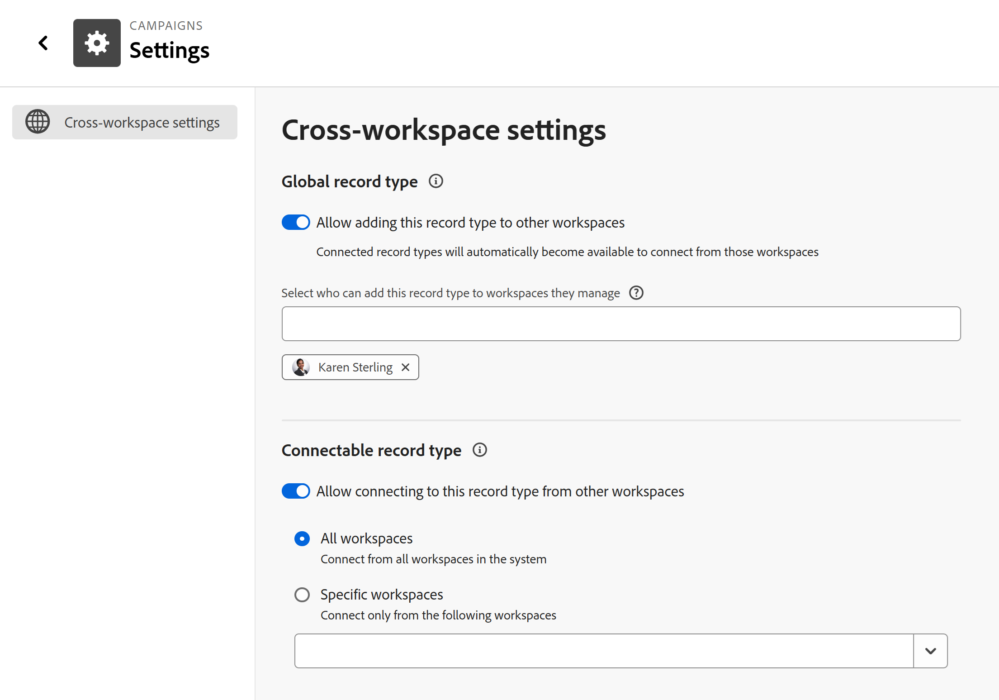

# Konfigurieren des Bereichs „Einstellungen“ eines Eintragstyps

<!--
The information on this page refers to functionality not yet generally available. It is available only in the Preview environment for all customers. After the monthly releases to Production, the same features are also available in the Production environment for customers who enabled fast releases.    

For information about fast releases, see [Enable or disable fast releases for your organization](/help/quicksilver/administration-and-setup/set-up-workfront/configure-system-defaults/enable-fast-release-process.md). 
-->

{{planning-important-intro}}

Sie können zusätzliche Einstellungen für einen Datensatztyp konfigurieren, nachdem sie in Adobe Workfront Planning gespeichert wurden.

Je nachdem, welche Funktionen Sie für einen Datensatztyp definieren möchten, können Sie zusätzliche Einstellungen konfigurieren, indem Sie einen der folgenden Schritte ausführen:

<!--the above will need to be reworded when we add automations and manage request forms to this area-->

* Bearbeiten

  Weitere Informationen finden Sie [Datensatztypen bearbeiten](/help/quicksilver/planning/architecture/edit-record-types.md).

* Konfigurieren der Seite „Einstellungen“ eines Datensatztyps.

  In diesem Artikel wird beschrieben, wie Sie einen Datensatztyp bearbeiten können, indem Sie seine Einstellungsseite konfigurieren.

## Zugriffsanforderungen

+++ Erweitern Sie , um die Zugriffsanforderungen für die Funktion in diesem Artikel anzuzeigen. 

<table style="table-layout:auto"> 
<col> 
</col> 
<col> 
</col> 
<tbody> 
    <tr> 
<tr> 
</tr>   
<tr> 
   <td role="rowheader">
Adobe Workfront-Paket
</td> 
   <td> 

Beliebiges Workfront- und Planungspaket

Beliebiges Workflow- und Planungspaket

<b>NOTIZ</b>

So konfigurieren Sie verbindbare Datensatztypen:

<ul> 
<li>
Beliebiges Workfront- und Planungspaket
</li>
ODER
<li>
Ein beliebiges Workflow-Paket und ein Planning Prime- oder Ultimate-Paket
</li></ul>

So konfigurieren Sie globale Datensatztypen:

<ul> 
<li>
Beliebiges Workfront-Paket und Planning Plus-Paket
</li>
ODER
<li>
Ein beliebiges Workflow-Paket und ein Planning Prime- oder Ultimate-Paket
</li></ul>

Weitere Informationen zu den einzelnen Workfront-Planungspaketen erhalten Sie von Ihrem Workfront-Kundenbetreuer. 

</td> </tr>
  <tr> 
   <td role="rowheader">
Adobe Workfront-Lizenz
</td> 
   <td>
Standard

   </td> 
  </tr> 
  <tr> 
   <td role="rowheader">
Objektberechtigungen
</td> 
   <td>   
Verwalten von Berechtigungen für einen Arbeitsbereich
  
   
Systemadministratoren haben Berechtigungen für alle Arbeitsbereiche, einschließlich der nicht erstellten
  </td> 
  </tr>  
</tbody> 
</table>

Weitere Informationen zu Zugriffsanforderungen für Workfront finden Sie unter [Zugriffsanforderungen in der Dokumentation zu Workfront](/help/quicksilver/administration-and-setup/add-users/access-levels-and-object-permissions/access-level-requirements-in-documentation.md).

+++    

<!--
Old:

<table style="table-layout:auto"> 
<col> 
</col> 
<col> 
</col> 
<tbody> 
    <tr> 
<tr> 
<td> 
   
 Products
 </td> 
   <td> 
   <ul><li>
 Adobe Workfront
</li> 
   <li>
 Adobe Workfront Planning
</li></ul></td> 
  </tr>   
<tr> 
   <td role="rowheader">
Adobe Workfront plan*
</td> 
   <td> 

Any of the following Workfront plans:
 
<ul><li>Select</li> 
<li>Prime</li> 
<li>Ultimate</li></ul> 

Workfront Planning is not available for legacy Workfront plans
 
   </td> 
<tr> 
   <td role="rowheader">
Adobe Workfront Planning package*
</td> 
   <td> 

Any 
 

For more information about what is included in each Workfront Planning plan, contact your Workfront account manager. 
 
   </td> 
 <tr> 
   <td role="rowheader">
Adobe Workfront platform
</td> 
   <td> 

Your organization's instance of Workfront must be onboarded to the Adobe Unified Experience to be able to access Workfront Planning.
 

For more information, see <a href="/help/quicksilver/workfront-basics/navigate-workfront/workfront-navigation/adobe-unified-experience.md">Adobe Unified Experience for Workfront</a>. 
 
   </td> 
   </tr> 
  </tr> 
  <tr> 
   <td role="rowheader">
Adobe Workfront license*
</td> 
   <td>
 Standard 

   
Workfront Planning is not available for legacy Workfront licenses
 
  </td> 
  </tr> 
  <tr> 
   <td role="rowheader">
Access level configuration
</td> 
   <td> 
There are no access level controls for Adobe Workfront Planning
   
</td> 
  </tr> 
<tr> 
   <td role="rowheader">
Object permissions
</td> 
   <td>   
Manage permissions to a workspace and record type 
  
   
System Administrators have permissions to all workspaces, including the ones they did not create

   
Only system administrators can enable record types to connect from other workspaces
 </td> 
  </tr> 

</tbody> 
</table> 

-->

## Konfigurieren Sie die Informationen zum Datensatztyp auf der Seite Einstellungen .

Sie können Workspace-übergreifende Funktionen für einen Datensatztyp definieren, indem Sie Informationen auf der Seite Einstellungen konfigurieren.

<!--the intro above will change when we can configure more in this area -->

{{step1-to-planning}}

1. Klicken Sie auf den Arbeitsbereich, dessen Datensatztypen Sie bearbeiten möchten.

   Die Workspace-Seite wird geöffnet und die Datensatztypen werden angezeigt.
1. Führen Sie einen der folgenden Schritte aus:

   * Bewegen Sie den Mauszeiger über die Karte eines Datensatztyps und klicken Sie auf das Menü **Mehr**  in der oberen rechten Ecke der Karte Datensatztyp und klicken Sie dann auf **Einstellungen**

     

     ODER

   * Klicken Sie auf eine Karte für den Datensatztyp, um die Seite für den Datensatztyp zu öffnen, klicken Sie auf das Menü **Mehr**  rechts neben dem Namen des Datensatztyps und klicken Sie dann auf **Einstellungen**.

   <!--update screen shot at prod??-->

   

1. Der **Arbeitsbereich-übergreifende Einstellungen** ist standardmäßig ausgewählt.
1. Schalten Sie eine der folgenden Einstellungen ein oder aus:

   * **Zulassen, dass dieser Datensatztyp anderen Arbeitsbereichen hinzugefügt**, um anzugeben, dass es sich um einen globalen Datensatztyp handelt
   * **Verbindung zu diesem Datensatztyp in anderen Arbeitsbereichen zulassen** um anzugeben, dass es sich um einen verbindbaren Datensatztyp handelt.

   Die Einstellungen sind standardmäßig deaktiviert.

   Weitere Informationen finden Sie unter [Konfigurieren von arbeitsbereichsübergreifenden Funktionen für Datensatztypen](/help/quicksilver/planning/architecture/configure-record-type-cross-workspace-capabilities.md)
