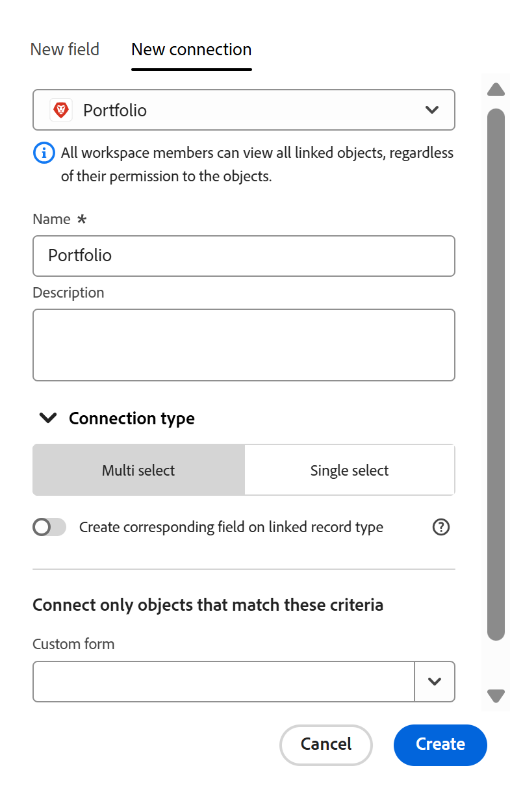

<!--keep the 30 limit verbiage in yellow til Jan 2026-->

# Übersicht über verbundene Datensatztypen

Die hervorgehobenen Informationen auf dieser Seite beziehen sich auf Funktionen, die noch nicht allgemein verfügbar sind. Sie ist nur in der Vorschau -Umgebung für alle Kunden verfügbar. Nach den monatlichen Releases in der Produktion stehen dieselben Funktionen auch in der Produktionsumgebung für Kunden zur Verfügung, die schnelle Releases aktiviert haben. 

Informationen zu Schnellversionen finden Sie unter [Aktivieren oder Deaktivieren von Schnellversionen für Ihre Organisation](/help/quicksilver/administration-and-setup/set-up-workfront/configure-system-defaults/enable-fast-release-process.md).

Sie können angeben, dass sich einzelne Datensatztypen gegenseitig oder auf Objekte aus anderen Anwendungen beziehen, indem Sie sie verbinden.

Dieser Artikel bietet eine Übersicht über Verbindungen vom Typ Datensätze und beschreibt die Arten von Verbindungen, die Sie zwischen Datensatz- und Objekttypen herstellen können.

Informationen zum Verbinden von Datensatztypen finden Sie unter [Verbinden von Datensatztypen](/help/quicksilver/planning/architecture/connect-record-types.md).

## Überlegungen zum Verbinden von Datensatztypen

* Damit einzelne Datensätze oder Objekte miteinander verbunden werden können, müssen die Datensatztypen zunächst mit Objekttypen verbunden werden.

  Sie können Datensatztypen und Objekttypen auf folgende Weise miteinander verbinden:

   * Manuell
   * Automatisch

  >[!NOTE]
  >
  >In Workfront Planning können bis zu 30 verbundene Felder für einen Datensatztyp verwendet werden.

* Beachten Sie Folgendes zum Verbinden von Datensatz- und Objekttypen:

   * Sie können manuell ein Feld „Neue Verbindung“ aus einem Datensatztyp hinzufügen, um die folgenden Entitäten in Workfront Planning zu verbinden:

      * Zwei Datensatztypen

        Standardmäßig können Sie zwei Datensatztypen aus demselben Arbeitsbereich verbinden. Sie können auch Datensatztypen einrichten, um eine Verbindung zu Datensatztypen aus anderen Arbeitsbereichen herzustellen, wenn Ihr Unternehmen ein höheres Workfront- oder Planning-Paket erworben hat. Weitere Informationen finden Sie unter [Datensatztypen bearbeiten](/help/quicksilver/planning/architecture/edit-record-types.md).
      * Einen Datensatztyp und einen Objekttyp aus einer anderen Anwendung.

     Informationen zum Verbinden von Datensatz- und Objekttypen finden Sie unter [Verbinden von Datensatztypen](/help/quicksilver/planning/architecture/connect-record-types.md).

     Nachdem Sie Datensatztypen manuell mit anderen Datensatz- oder Objekttypen verbunden haben, können Sie einzelne Datensätze und Objekte verbinden.

     Weitere Informationen finden Sie unter [Verbinden von Datensätzen](/help/quicksilver/planning/records/connect-records.md).

   * In den folgenden Szenarien wird automatisch eine Verbindung zwischen Entitäten hergestellt:

      * Wenn Sie eine Automatisierung verwenden, um Datensätze von der Seite eines Datensatztyps zu erstellen.

        Die Verbindung zwischen den Datensatztypen bzw. dem Datensatztyp und dem Objekttyp aus einer anderen Anwendung wird automatisch erstellt, wenn die Automatisierung den verbundenen Datensatz bzw. das verbundene Objekt erstellt.

        Weitere Informationen finden Sie unter [Konfigurieren von Adobe Workfront Planning Automations](/help/quicksilver/planning/records/configure-automations-to-create-records.md).

      * Beim Konfigurieren von Anfrageformularen für einen Datensatztyp, um einen Datensatz oder ein Objekt zu erstellen.

        Die Verbindung zwischen dem Datensatztyp und dem Anforderungsobjekttyp wird automatisch erstellt, wenn Sie eine Planungsanfrage, die einen Datensatz erstellt, senden und genehmigen.

        Weitere Informationen finden Sie unter [Senden von Adobe Workfront-Planungsanfragen zum Erstellen von Datensätzen](/help/quicksilver/planning/requests/submit-requests.md).

        Sie können die ursprüngliche Anfrage im Feld **Betreff** im Bereich Anfragen von Workfront oder im Feld für die ursprüngliche Anfrageverbindung in Workfront Planning..

   * Sie können Workfront Planning-Datensatztypen mit den folgenden Objekttypen aus den folgenden Programmen verbinden:

      * Adobe Workfront:

         * Projekte
         * Portfolios
         * Programme
         * Firmen
         * Gruppe

      * Adobe Experience Manager Assets:

         * Bilder
         * Ordner

      * Adobe GenStudio for Performance Marketing

         * Marken

        >[!IMPORTANT]
        >
        >Für die Verbindung mit Adobe Experience Manager Assets- und GenStudio-Marken sind folgende Voraussetzungen erforderlich:
        >* Eine Adobe Experience Manager Assets-Lizenz
        >* Eine Adobe GenStudio for Performance Marketing-Lizenz
        >* Die Workfront-Instanz Ihres Unternehmens muss in die Adobe Business Platform oder die Adobe Admin Console integriert werden, um Workfront-Planungsdatensätze mit Adobe Experience Manager Assets zu verbinden.
        >Informationen zu Adobe Admin Console finden Sie in den häufig gestellten Fragen zu [Adobe Unified Experience](/help/quicksilver/workfront-basics/navigate-workfront/workfront-navigation/unified-experience-faq.md).

* Wenn zwei Datensatztypen oder ein Datensatztyp und ein Objekttyp aus einer anderen Anwendung verbunden sind, gibt es die folgenden Szenarien:

   * **Wenn Sie zwei Planning-Datensatztypen verbinden**: Für den Datensatztyp, von dem aus Sie eine Verbindung herstellen, wird ein verknüpftes Datensatzfeld erstellt. Ein ähnliches verknüpftes Datensatzfeld wird nur dann für den Datensatztyp erstellt, mit dem Sie eine Verbindung herstellen, wenn Sie die Einstellung Entsprechendes Feld für verknüpften Datensatztyp erstellen auf der Registerkarte Neue Verbindung aktivieren.

     Wenn Sie beispielsweise den Datensatztyp „Kampagne“ mit dem Datensatztyp „Produkt“ verbinden, wird ein verknüpftes Datensatzfeld (Verbindungsfeld), das Sie „Verknüpftes Produkt“ nennen, für den Datensatztyp der Kampagne erstellt. Ein verknüpfter Datensatztyp mit der automatischen Bezeichnung „Kampagne“ wird für den Produktdatensatztyp erstellt.

     Beispielsweise sind folgende Szenarien vorhanden:

      * Wenn Sie die Einstellung Entsprechendes Feld für verknüpften Datensatztyp erstellen aktivieren und den Datensatztyp „Kampagne“ mit dem Datensatztyp „Produkt“ verbinden, wird ein verknüpftes Datensatzfeld (Verbindungsfeld), das Sie „Verknüpftes Produkt“ nennen, für den Datensatztyp der Kampagne erstellt. Ein verknüpfter Datensatztyp mit der automatischen Bezeichnung „Kampagne“ wird für den Produktdatensatztyp erstellt.
      * Wenn Sie die Einstellung Entsprechendes Feld für verknüpften Datensatztyp erstellen deaktivieren und den Datensatztyp „Kampagne“ mit dem Datensatztyp „Produkt“ verbinden, wird ein verknüpftes Datensatzfeld (Verbindungsfeld), das Sie „Verknüpftes Produkt“ nennen, für den Datensatztyp der Kampagne erstellt. Ein verknüpfter Datensatztyp mit dem automatischen Namen „Kampagne“ wird nicht für den Produktdatensatztyp erstellt.

     Weitere Informationen finden Sie unter [Verbinden von Datensatztypen](/help/quicksilver/planning/architecture/connect-record-types.md).

   * **Wenn Sie einen Datensatztyp mit einem Objekttyp aus einer anderen Anwendung verbinden**:

      * Für den Datensatztyp, von dem aus Sie eine Verbindung herstellen, wird ein verknüpftes Datensatzfeld erstellt. Für den Objekttyp des anderen Programms wird automatisch kein verknüpftes Datensatzfeld erstellt.
      * Auf Felder für Planungsdatensätze kann nicht über Workfront-Objekte zugegriffen werden.
      * Planungsdatensätze sind im Abschnitt Planung des Workfront-Objekts sichtbar. Weitere Informationen finden Sie unter [Verwalten von Datensatzverbindungen aus Workfront-Objekten](/help/quicksilver/planning/records/manage-records-in-planning-section.md).
      * Sie können ein benutzerdefiniertes Feld für die Planning-Verbindung erstellen und es an das benutzerdefinierte Formular eines Workfront-Objekts anhängen. Weitere Informationen finden Sie unter [Erstellen eines benutzerdefinierten Formulars](/help/quicksilver/administration-and-setup/customize-workfront/create-manage-custom-forms/form-designer/design-a-form/design-a-form.md).
      * Auf Planungs-Datensatzfelder kann über Experience Manager Assets zugegriffen werden, wenn der Workfront-Administrator die Metadatenzuordnung durch die Integration zwischen Workfront und Adobe Experience Manager Assets konfiguriert. Weitere Informationen finden Sie unter &quot;[&#x200B; der Asset-Metadatenzuordnung zwischen Adobe Workfront und Experience Manager Assets &#x200B;](https://experienceleague.adobe.com/de/docs/experience-manager-cloud-service/content/assets/integrations/configure-asset-metadata-mapping).
      * Auf die Felder der Planungsdatensätze kann von den Marken in GenStudio for Performance Marketing nicht zugegriffen werden.

   * **Beim Hinzufügen von Suchfeldern aus dem Datensatz oder Objekt, mit dem Sie eine Verbindung herstellen**: Zusätzlich zum Erstellen eines verknüpften Datensatzfelds können Sie auch eine Verbindung zu Feldern aus dem verbundenen Datensatz oder Objekttyp herstellen, die als Suchfelder bezeichnet werden. Ein verknüpftes Feld (oder Suchfeld) mit Informationen aus dem Datensatz, mit dem Sie eine Verbindung herstellen, wird für den Datensatz angezeigt, von dem aus Sie eine Verbindung herstellen.

     Sie können Felder aus anderen Datensatztypen oder den Objekten einer anderen Anwendung mit dem Workfront Planning-Datensatztyp verbinden.

     Verknüpfte Felder sind schreibgeschützt und zeigen automatisch Informationen aus verbundenen Datensätzen an.

     Sie können in Formeln, Filtern oder Gruppierungen auf Suchfelder aus anderen Datensatz- oder Objekttypen verweisen.

     Wenn Sie beispielsweise den Datensatztyp „Kampagne“ mit einem Workfront-Projekt verbinden und auswählen, dass das Feld Geplantes Abschlussdatum des Projekts dem Workfront-Planungsdatensatz hinzugefügt werden soll, wird automatisch ein verknüpftes Feld namens Geplantes Abschlussdatum (aus Projekt) für die Kampagne erstellt. Dieses verknüpfte Feld kann nicht manuell bearbeitet werden. Das Feld Geplantes Abschlussdatum (aus Projekt) zeigt das geplante Abschlussdatum der verknüpften Projekte an.

     >[!IMPORTANT]
     >
     >Alle Personen mit Anzeigen- oder höheren Berechtigungen für den Arbeitsbereich können die Informationen in den Suchfeldern anzeigen, unabhängig von ihren Berechtigungen oder Zugriffsebenen bei der Anwendung der verknüpften Objekttypen oder ihren Berechtigungen in anderen Arbeitsbereichen.

     Verknüpfte Datensatzfelder werden durch ein Beziehungssymbol (Beziehungsfeldsymbol.

     Verknüpfte Felder werden durch ein Symbol vorangestellt, das den Feldtyp angibt. Beispielsweise werden verknüpften Feldern (oder Suchfeldern) Symbole vorangestellt, die angeben, dass ein Feld eine Zahl, ein Absatz oder ein Datum ist.

     >[!TIP]
     >
     >Die Datumsfeldinformationen der Workfront-Objekte werden in Workfront Planning im 24-Stunden-Format angezeigt, unabhängig davon, wie sie in Workfront angezeigt werden.
     >
     >Wenn beispielsweise das geplante Startdatum eines Projekts in Workfront um 15 :00 angezeigt wird, wird es in Workfront :00 in einem importierten Suchfeld als 15 angezeigt.

   * Sie müssen Datensatztypen verbinden, um in Workfront Planning Hierarchien erstellen zu können. Wenn keine Verbindungen vom Typ Datensatz vorhanden sind, werden sie automatisch erstellt, wenn Sie eine Hierarchie erstellen. Weitere Informationen finden Sie unter [Erstellen von Workspace-Hierarchien](/help/quicksilver/planning/architecture/create-workspace-hierarchies.md).

## Verbindungstypen

Nachdem Sie eine Verbindung zwischen zwei Datensatztypen oder zwischen einem Datensatz und einem Objekttyp aus einer anderen Anwendung hergestellt haben, können Sie Datensätze in die verbundenen Datensatzfelder einfügen.

>[!WARNING]
>
>Die in diesem Abschnitt beschriebenen Optionen sind beim Verbinden von Folgendem nicht verfügbar:
>
>* Zwei Datensätze aus verschiedenen Arbeitsbereichen
>
>* Datensatztyp und Experience Manager-Assets
>
>* Einen Datensatztyp und eine Adobe GenStudio-Marke

Sie können auswählen, ob Sie jeweils einen Datensatz mit mehreren Datensätzen oder einen Datensatz miteinander verbinden möchten.

Im Folgenden finden Sie die Verbindungstypen, aus denen Sie beim Verbinden von Datensatztypen auswählen können:

* Wenn die Einstellung **Entsprechendes Feld für verknüpften Datensatztyp erstellen** deaktiviert ist, können Sie aus folgenden Optionen wählen:

   * [Mehrfachauswahl](#multi-select-connection-type)
   * [Einzelauswahl](#single-select-connection-type)

* Wenn die Einstellung **Entsprechendes Feld für verknüpften Datensatztyp erstellen** aktiviert ist, können Sie aus folgenden Optionen wählen:

   * [Viele-zu-viele](#many-to-many-connection-type)
   * [Eins zu viele](#one-to-many-connection-type)
   * [Viele-zu-eins](#many-to-one-connection-type)
   * [Eins zu eins](#many-to-one-connection-type)

### Mehrfachauswahl-Verbindungstyp

Wenn Sie eine Mehrfachauswahl-Verbindung zwischen Datensatztypen erstellen, können Sie dann im Verbindungsfeld mehrere verbundene Datensätze aus dem ursprünglichen Datensatztyp auswählen.

Wenn Sie beispielsweise eine Mehrfachauswahl-Verbindung zwischen Kampagnen und Projekten erstellen, können Sie für eine Kampagne mehrere Projekte auswählen. Für den Projektobjekttyp wird kein mit Campaign verbundener Datensatztyp erstellt.

Nachdem Sie diesen Verbindungstyp ausgewählt haben, können Sie den Verbindungstyp nach dem Speichern in einem der folgenden Typen nicht mehr ändern:

* Einzelauswahl
* Eins zu viele
* Viele-zu-eins
* Eins zu eins

### Verbindungstyp mit Einzelauswahl

Wenn Sie eine Verbindung zwischen Datensatztypen erstellen, die nur einmal ausgewählt werden kann, können Sie dann im Verbindungsfeld einen Datensatz aus dem ursprünglichen Datensatztyp auswählen.

Wenn Sie beispielsweise eine Einzelauswahlverbindung zwischen Kampagnen und Unternehmen erstellen, können Sie ein Unternehmen für eine Kampagne auswählen. Für den Objekttyp „Unternehmen“ wird kein mit Campaign verbundener Datensatztyp erstellt.

Nachdem Sie diesen Verbindungstyp ausgewählt haben, können Sie den Verbindungstyp nicht mehr ändern, nachdem Sie ihn in einem der folgenden Elemente gespeichert haben:

* Eins zu viele
* Eins zu eins

<!--
* [Many to many](#many-to-many-connection-type)
* [One to many](#one-to-many-connection-type)
* [Many to one](#many-to-one-connection-type)
* [One to one](#many-to-one-connection-type)
-->

### Viele-zu-viele-Verbindungstyp

Wenn Sie eine n:n-Verbindung zwischen Datensatztypen erstellen, können Sie mehrere Datensätze im Verbindungsfeld aus beiden Datensatztypen auswählen.

Wenn Sie beispielsweise eine n:n-Verbindung zwischen Kampagnen und Projekten herstellen, können Sie für jede Kampagne mehrere Projekte und für jedes Projekt mehrere Kampagnen auswählen.

Ein reales Beispiel für einen Viele-zu-viele-Beziehungstyp ist die Beziehung zwischen Filmen und Schauspielern. Jeder Film kann mehrere Schauspieler haben, und jeder Schauspieler kann in mehreren Filmen spielen.

Wenn Sie diesen Verbindungstyp auswählen, können Sie den Verbindungstyp nach dem Speichern nicht mehr ändern.

### 1:n-Verbindungstyp

Wenn Sie eine Eins-zu-Viele-Verbindung zwischen Datensatztypen erstellen, können Sie dann im Verbindungsfeld des aktuellen Datensatztyps mehrere Datensätze auswählen. Das entsprechende Verbindungsfeld im Datensatztyp, mit dem Sie eine Verbindung herstellen, ermöglicht jedoch die Auswahl nur eines Datensatzes. Das verbundene Datensatzfeld, das automatisch für den zweiten Datensatztyp erstellt wird, wird automatisch auf einen Viele-zu-eins-Beziehungstyp eingestellt.

Wenn Sie beispielsweise eine Eins-zu-Viele-Verbindung zwischen Kampagnen und Projekten erstellen, können Sie für jede Kampagne mehrere Projekte auswählen, jedes Projekt kann jedoch nur mit einer Kampagne verbunden werden.

Ein reales Beispiel für eine Eins-zu-viele-Beziehung ist die Beziehung zwischen Bibliotheken und Büchern: Eine Bibliothek hat viele Bücher im Inventar, aber ein bestimmtes Buch kann zu einem bestimmten Zeitpunkt nur in einer Bibliothek sein.

Wenn Sie diesen Verbindungstyp auswählen, können Sie ihn später nur in einen n:n-Verbindungstyp ändern.

### Viele-zu-eins-Verbindung

Wenn Sie eine n:1-Verbindung zwischen Datensatztypen erstellen, können Sie dann jeden Datensatz im aktuellen Datensatztyp mit nur einem Datensatz aus dem verbundenen Datensatztyp verbinden. Das verbundene Datensatzfeld, das automatisch für den zweiten Datensatztyp erstellt wird, wird automatisch auf einen Eins-zu-Viele-Beziehungstyp eingestellt.

Wenn Sie beispielsweise Kampagnen mit Projekten verbinden und diesen Verbindungstyp auswählen, können Sie einer Kampagne nur ein Projekt hinzufügen. Sie können jedoch mehrere Kampagnen zu einem Projekt hinzufügen.

Ein reales Beispiel für einen Viele-zu-eins-Beziehungstyp ist die Beziehung zwischen vielen Filmen und einem Schauspieler: Ein Schauspieler kann in vielen Filmen sein, aber jeder Film kann nur einen bestimmten Schauspieler einmal in seiner Besetzung haben.

Wenn Sie diesen Verbindungstyp auswählen, können Sie ihn später nur in einen n:n-Verbindungstyp ändern.

### 1:1-Verbindungstyp

Wenn Sie eine Eins-zu-eins-Verbindung zwischen Datensatztypen erstellen, können Sie in beiden Datensatztypen jeden Datensatz nur mit einem Datensatz aus dem anderen Datensatztyp verbinden.

Wenn Sie beispielsweise Kampagnen mit Projekten verbinden und diesen Verbindungstyp auswählen, können Sie eine Kampagne mit einem Projekt verbinden. Ein Projekt kann nur mit einer Kampagne verbunden werden.

Ein reales Beispiel für eine Eins-zu-eins-Beziehung ist die Beziehung zwischen einer Person und der eindeutigen Kennung ihres Landes (z. B. Sozialversicherungsnummer, Reisepass-ID, lokale Kennung): Jede Person hat nur eine eindeutige Kennung für ein Land und jede eindeutige Kennung kann mit nur einer Person verknüpft werden.

Wenn Sie diesen Verbindungstyp auswählen, können Sie ihn später in einen anderen Verbindungstyp ändern.
