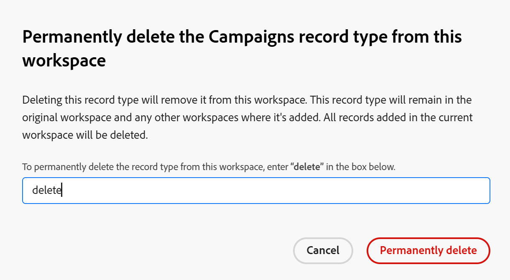

<!--keep the global record type reference in yellow till January 2026-->

# Datensatztypen löschen

<!--The information on this page refers to functionality not yet generally available. It is available only in the Preview environment for all customers. After the monthly releases to Production, the same features are also available in the Production environment for customers who enabled fast releases.    

For information about fast releases, see [Enable or disable fast releases for your organization](/help/quicksilver/administration-and-setup/set-up-workfront/configure-system-defaults/enable-fast-release-process.md). -->

{{planning-important-intro}}

Sie können Datensatztypen löschen, wenn sie nicht mehr relevant sind.

Beim Löschen von Datensatztypen werden jedoch auch alle mit den Datensatztypen verknüpften Informationen gelöscht. Weitere Informationen finden Sie im Abschnitt [Überlegungen beim Löschen von Datensatztypen](#considerations-when-deleting-record-types) in diesem Artikel.

Weitere Informationen zu Datensatztypen finden Sie unter [Datensatztypen - Übersicht](/help/quicksilver/planning/architecture/overview-of-record-types.md).

<!-- last sentence might need to be deleted when we can recover or replace deleted record types-->

## Zugriffsanforderungen

+++ Erweitern Sie , um die Zugriffsanforderungen für die Funktion in diesem Artikel anzuzeigen. 

<table style="table-layout:auto"> 
<col> 
</col> 
<col> 
</col> 
<tbody> 
    <tr> 
<tr> 
</tr>   
<tr> 
   <td role="rowheader">
Adobe Workfront-Paket
</td> 
   <td> 
<ul> 
<li>
Beliebiges Workfront und beliebiges Planungspaket
</li>

Oder

<li>
Beliebiger Workflow und beliebiges Planungspaket
</li></ul>
<!--
To delete global record types:

<ul><li>
Any Workfront package and a Planning Plus package
</li>

Or

<li>
Workflow and Planning Prime and Ultimate packages
</li></ul>-->

Weitere Informationen zu den einzelnen Workfront-Planungspaketen erhalten Sie von Ihrem Workfront-Kundenbetreuer. 
 
   </td> 
  <tr> 
   <td role="rowheader">
Adobe Workfront-Lizenz
</td> 
   <td>
Standard

   </td> 
  </tr> 
  <tr> 
   <td role="rowheader">
Objektberechtigungen
</td> 
   <td>   
Verwalten von Berechtigungen für einen Arbeitsbereich
  
   
Systemadministratoren haben Berechtigungen für alle Arbeitsbereiche, einschließlich der nicht erstellten
  </td> 
  </tr>  
</tbody> 
</table>

*Weitere Informationen zu Zugriffsanforderungen für Workfront finden Sie unter [Zugriffsanforderungen in der Dokumentation zu Workfront](/help/quicksilver/administration-and-setup/add-users/access-levels-and-object-permissions/access-level-requirements-in-documentation.md).

+++   

<!--Old:
<table style="table-layout:auto"> 
<col> 
</col> 
<col> 
</col> 
<tbody> 
    <tr> 
<tr> 
<td> 
   
 Products
 </td> 
   <td> 
   <ul><li>
 Adobe Workfront
</li> 
   <li>
 Adobe Workfront Planning
</li></ul></td> 
  </tr>   
<tr> 
   <td role="rowheader">
Adobe Workfront plan*
</td> 
   <td> 

Any of the following Workfront plans:
 
<ul><li>Select</li> 
<li>Prime</li> 
<li>Ultimate</li></ul> 

Workfront Planning is not available for legacy Workfront plans
 
   </td> 
<tr> 
   <td role="rowheader">
Adobe Workfront Planning package*
</td> 
   <td> 

Any 
 

For more information about what is included in each Workfront Planning plan, contact your Workfront account manager. 
 
   </td> 
 <tr> 
   <td role="rowheader">
Adobe Workfront platform
</td> 
   <td> 

Your organization's instance of Workfront must be onboarded to the Adobe Unified Experience to be able to access Workfront Planning.
 

For more information, see <a href="/help/quicksilver/workfront-basics/navigate-workfront/workfront-navigation/adobe-unified-experience.md">Adobe Unified Experience for Workfront</a>. 
 
   </td> 
   </tr> 
  </tr> 
  <tr> 
   <td role="rowheader">
Adobe Workfront license*
</td> 
   <td>
 Standard

   
Workfront Planning is not available for legacy Workfront licenses
 
  </td> 
  </tr> 
  <tr> 
   <td role="rowheader">
Access level configuration
</td> 
   <td> 
There are no access level controls for Adobe Workfront Planning
   
</td> 
  </tr> 
<tr> 
   <td role="rowheader">
Object permissions
</td> 
   <td>   
Manage permissions to a workspace and record type
  
   
System Administrators have permissions to all workspaces, including the ones they did not create
</td> 
  </tr> 
</tbody> 
</table> 
-->

## Überlegungen beim Löschen von Datensatztypen

<!--check this and ensure these are still true - some things might change with / after closed beta-->

* Sie können nur Datensatztypen aus Arbeitsbereichen löschen, für die Sie über Verwaltungsberechtigungen verfügen.
* Durch das Löschen von Datensatztypen werden die folgenden mit ihnen verknüpften Informationen entfernt:

   * Alle Datensätze dieses Typs.
   * Alle mit dem Datensatztyp verknüpften Felder.
   * Alle Ansichten (einschließlich Filtern, Gruppierungen und Sortierkriterien) des Datensatztyps.
* Der Datensatztyp wird aus allen Benutzern entfernt, die auf den Arbeitsbereich zugreifen.
* Gelöschte Datensatztypen oder deren Informationen können nicht wiederhergestellt werden.
* Es wird empfohlen, die Felder und die mit dem Datensatztyp verknüpften Datensätze, die Sie löschen möchten, in einem anderen Datensatztyp neu zu erstellen, bevor Sie sie löschen.

<!--

* You cannot delete a global record type that has been added to other workspaces. 

   For more information, see the section [Delete global record types](#delete-global-record-types) in this article. 

-->

## Datensatztypen löschen

{{step1-to-planning}}

1. Klicken Sie auf den Arbeitsbereich, dessen Datensatztypen Sie löschen möchten.

   Oder

   Erweitern Sie in einem Arbeitsbereich den nach unten zeigenden Pfeil rechts neben einem vorhandenen Arbeitsbereichsnamen, suchen Sie nach einem Arbeitsbereich und wählen Sie ihn aus, wenn er in der Liste angezeigt wird.

   Der Arbeitsbereich wird geöffnet und die Datensatztypen werden angezeigt.
1. Führen Sie einen der folgenden Schritte aus:

   * Zeigen Sie mit der Maus auf die Karte für den Datensatztyp und klicken Sie auf das Menü **Mehr** und dann auf **Löschen**.
   * Klicken Sie auf die Karte für den Datensatztyp, den Sie löschen möchten, und klicken Sie auf der Seite Datensatztyp auf das Menü **Mehr**  rechts neben dem Namen des Datensatztyps und dann auf **Löschen**.

   

1. Geben Sie **Bestätigungsfeld** Löschen“ ein und klicken Sie dann auf **Dauerhaft löschen**. Hierbei wird nicht zwischen Groß- und Kleinschreibung unterschieden.

   Der ausgewählte Datensatztyp wird zusammen mit den zugehörigen Feldern, zugehörigen Datensätzen und Ansichten gelöscht und kann nicht wiederhergestellt werden.

<!--

## Delete global record types

The following scenarios exist when deleting global record types:

* If a record type configured as global has not yet been added to another workspace, you can delete it from its original workspace. 

* If a record type configured as a global record type has been added to at least one other workspace, you cannot delete it from its original workspace. You must first remove (by deleting) global record types from the secondary workspaces where they were added and then you can permanently delete the global record type from its original workspace. 

### Delete a global record type from the original workspace

You can delete a record type from its original workspace if it's no longer relevant. 

1. Go to the global record type in its original workspace. 

1. (Conditional) Do one of the following, depending on whether the global record type has been added to secondary workspaces: 

   * If the record type was not added to a secondary workspace, click on the **More** menu  on the record type's card, or to the right of the record type's name on its page, then click **Delete**. 
   * If the record type was added to at least one other secondary workspace, first, go to the secondary workspace and delete the global record from that space. 

      For information, see the section [Delete a global record type from a secondary workspace](#delete-a-global-record-type-from-a-secondary-workspace) in this article. 
   
1. (Conditional) Continue deleting the record type, as described in the section [Delete record types](#delete-record-types-1) in this article.

   The following things occur: 

   * The global record type is removed from the original workspace and the record type, its records and fields cannot be recovered.
   * All global record types from the secondary workspaces and their records are also removed.

### Delete a global record type from a secondary workspace

You can delete a record type you added from another workspace if no longer needed. 

Consider the following:

* Deleting a global record type from a secondary workspace will only remove it from the secondary workspace. The record type remains in the original workspace. 

* When you delete a global record type from a secondary workspace, the following are also deleted:

   * The records added from the secondary workspace.

   ***************Not yet there, coming soon:* The fields added from the secondary workspace.*********

* Global record types deleted from their secondary workspaces cannot be recovered. 

* The original record type remains in its original workspace as well as in other workspaces where it's been added. 

To delete a global record type from a secondary workspace: 

1. Go to the global record type in its secondary workspace. 

1. (Optional) Click on the **More** menu  on the record type's card, or to the right of the record type's name on its page, then click **Delete**.
1. (Conditional) Type **delete** in the field provided, then click **Permanently delete**.

   

   The following things occur: 

   * The record type created from a global record type is removed from the selected workspace. 
   * The original record type with its fields remain in their original workspace. 
   * The record type remains in all other workspaces where it's been added.
   * The records *******and fields****** added to the record type from the current workspace are deleted. All other records added from additional workspaces where the global record type was added are preserved in their respective workspaces and in the original workspace. <!--Fields are preserved in the workspaces where they were added.
   

   
   -->