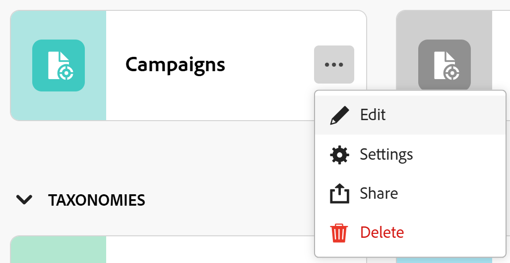
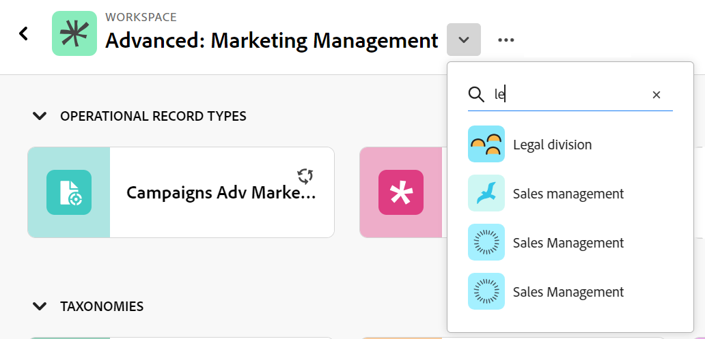

# Bearbeiten von Eintragstypen

<!--
The highlighted information on this page refers to functionality not yet generally available. It is available only in the Preview environment for all customers. After the monthly releases to Production, the same features are also available in the Production environment for customers who enabled fast releases.    

For information about fast releases, see [Enable or disable fast releases for your organization](/help/quicksilver/administration-and-setup/set-up-workfront/configure-system-defaults/enable-fast-release-process.md). 
-->

{{planning-important-intro}}

Datensatztypen sind die Objekttypen von Adobe Workfront Planning. Sie können das Erscheinungsbild von Datensatztypen bearbeiten, die Sie oder eine andere Person erstellt haben. Informationen zum Erstellen von Workfront Planning-Datensatztypen finden Sie unter [Erstellen von Datensatztypen](/help/quicksilver/planning/architecture/create-record-types.md).

## Zugriffsanforderungen

+++ Erweitern Sie , um die Zugriffsanforderungen für die Funktion in diesem Artikel anzuzeigen. 

<table style="table-layout:auto"> 
<col> 
</col> 
<col> 
</col> 
<tbody> 
    <tr> 
<tr> 
</tr>   
<tr> 
   <td role="rowheader">
Adobe Workfront-Paket
</td> 
   <td> 

Beliebiges Workfront- und Planungspaket

Beliebiges Workfront- und Planungspaket

<b>NOTIZ</b>

So konfigurieren Sie verbindbare Datensatztypen: 

<ul> 
<li>
Jedes Workfront-Paket und jedes Planungspaket
</li>
ODER
<li>
Beliebiger Workflow und ein Planning Prime- oder Ultimate-Paket
</li></ul>

So konfigurieren Sie globale Datensatztypen:

<ul> 
<li>
Beliebiges Workfront-Paket und Planning Plus-Paket
</li>
ODER
<li>
Beliebiger Workflow und ein Planning Prime- oder Ultimate-Paket
</li></ul>

Weitere Informationen zu den einzelnen Workfront-Planungspaketen erhalten Sie von Ihrem Workfront-Kundenbetreuer. 

</td> </tr>
  <tr> 
   <td role="rowheader">
Adobe Workfront-Lizenz
</td> 
   <td>
Standard

   </td> 
  </tr> 
  <tr> 
   <td role="rowheader">
Objektberechtigungen
</td> 
   <td>   
Verwalten von Berechtigungen für einen Arbeitsbereich
  
   
Systemadministratoren haben Berechtigungen für alle Arbeitsbereiche, einschließlich der nicht erstellten
  </td> 
  </tr>  
</tbody> 
</table>

Weitere Informationen zu Zugriffsanforderungen für Workfront finden Sie unter [Zugriffsanforderungen in der Dokumentation zu Workfront](/help/quicksilver/administration-and-setup/add-users/access-levels-and-object-permissions/access-level-requirements-in-documentation.md).

+++   

<!--
Old:
<table style="table-layout:auto"> 
<col> 
</col> 
<col> 
</col> 
<tbody> 
    <tr> 
<tr> 
<td> 
   
 Products
 </td> 
   <td> 
   <ul><li>
 Adobe Workfront
</li> 
   <li>
 Adobe Workfront Planning
</li></ul></td> 
  </tr>   
<tr> 
   <td role="rowheader">
Adobe Workfront plan*
</td> 
   <td> 

Any of the following Workfront plans:
 
<ul><li>Select</li> 
<li>Prime</li> 
<li>Ultimate</li></ul> 

Workfront Planning is not available for legacy Workfront plans
 
   </td> 
<tr> 
   <td role="rowheader">
Adobe Workfront Planning package*
</td> 
   <td> 

Any 
 

For more information about what is included in each Workfront Planning plan, contact your Workfront account manager. 
 
   </td> 
 <tr> 
   <td role="rowheader">
Adobe Workfront platform
</td> 
   <td> 

Your organization's instance of Workfront must be onboarded to the Adobe Unified Experience to be able to access Workfront Planning.
 

For more information, see <a href="/help/quicksilver/workfront-basics/navigate-workfront/workfront-navigation/adobe-unified-experience.md">Adobe Unified Experience for Workfront</a>. 
 
   </td> 
   </tr> 
  </tr> 
  <tr> 
   <td role="rowheader">
Adobe Workfront license*
</td> 
   <td>
 Standard 

   
Workfront Planning is not available for legacy Workfront licenses
 
  </td> 
  </tr> 
  <tr> 
   <td role="rowheader">
Access level configuration
</td> 
   <td> 
There are no access level controls for Adobe Workfront Planning
   
</td> 
  </tr> 
<tr> 
   <td role="rowheader">
Object permissions
</td> 
   <td>   
Manage permissions to a workspace and record type 
  
   
System Administrators have permissions to all workspaces, including the ones they did not create

   
Only system administrators can enable record types to connect from other workspaces
 </td> 
  </tr> 

</tbody> 
</table>
-->

## Bearbeiten von Eintragstypen

{{step1-to-planning}}

1. Klicken Sie auf den Arbeitsbereich, dessen Datensatztypen Sie bearbeiten möchten.

   Die Workspace-Seite wird geöffnet und die Datensatztypen werden angezeigt.
1. Führen Sie einen der folgenden Schritte aus:

   * Bewegen Sie den Mauszeiger über die Karte eines Datensatztyps und klicken Sie auf das Menü **Mehr**  in der oberen rechten Ecke der Karte Datensatztyp und klicken Sie dann auf **Bearbeiten** oder **Einstellungen**
oder
   * Klicken Sie auf eine Karte für den Datensatztyp, um die Seite für den Datensatztyp zu öffnen. Klicken Sie auf das Menü **Mehr**  rechts neben dem Namen des Datensatztyps und dann auf **Bearbeiten** oder **Einstellungen**.

   

1. Im Feld **Datensatztyp bearbeiten** wird standardmäßig die Registerkarte **Erscheinungsbild** geöffnet.

   

   Aktualisieren Sie die folgenden Informationen auf der Registerkarte **Erscheinungsbild**:

   * Bearbeiten Sie bei Bedarf den Namen des Datensatztyps. <!--did they add a field label for this?-->
   * **Beschreibung**: Bearbeiten oder fügen Sie eine Beschreibung für den Datensatztyp mit weiteren Informationen hinzu.
   * Bearbeiten Sie die Farbe und Form des Symbols, das mit dem Datensatztyp verknüpft ist. Gehen Sie folgendermaßen vor:
      * Farbe zur Identifizierung des Datensatztyps auswählen. Dies ist die Farbe des Symbols für den Datensatztyp.
      * Wählen Sie ein Symbol aus der Liste aus oder geben Sie den Namen eines Symbols ein, um zu beschreiben, was es darstellt, und wählen Sie es dann aus, wenn es angezeigt wird. Dies ist das Symbol des Datensatztyps. Standardmäßig ist ein Dateisymbol ausgewählt.

1. (Optional und bedingt) Wenn Sie Systemadministrator sind, klicken Sie auf die Registerkarte **Arbeitsbereichsübergreifende Einstellungen** und aktualisieren Sie die Informationen zu den arbeitsbereichsübergreifenden Funktionen des Datensatztyps.

   Weitere Informationen finden Sie unter [Konfigurieren von arbeitsbereichsübergreifenden Funktionen für Datensatztypen](/help/quicksilver/planning/architecture/configure-record-type-cross-workspace-capabilities.md).

   

1. Klicken Sie auf **Speichern**.

   Wenn Sie ausgewählt haben, diesen Datensatz von anderen Arbeitsbereichen zu verbinden, wird das Symbol **Verbindbarer Datensatz** (Symbol ) auf der Datensatzkarte angezeigt.

   Wenn Sie ausgewählt haben, dass dieser Datensatz anderen Arbeitsbereichen hinzugefügt werden kann, wird **Symbol „Globaler**&quot;  auf der Datensatzkarte angezeigt.

1. (Optional) Klicken Sie im Arbeitsbereich auf die Karte Datensatztyp , um die Seite des Datensatztyps zu öffnen, und benennen Sie dann den Datensatztyp in der Kopfzeile um.

1. (Optional) Zum Bearbeiten eines anderen Datensatztyps erweitern Sie auf der Seite „Datensatztyp“ den nach unten zeigenden Pfeil rechts neben dem Namen eines Datensatztyps, suchen Sie nach einem Datensatztyp und wählen Sie ihn aus, wenn er in der Liste angezeigt wird.

   

   >[!TIP]
   >
   >Sie können die folgende Tastaturkombination verwenden, um das globale Suchfeld von jeder Workfront-Planungs -Seite aus zu öffnen und nach Datensatztypen zu suchen:
   >
   >* STRG+K für Windows
   >* ⌘+K für Mac
   >
   >
