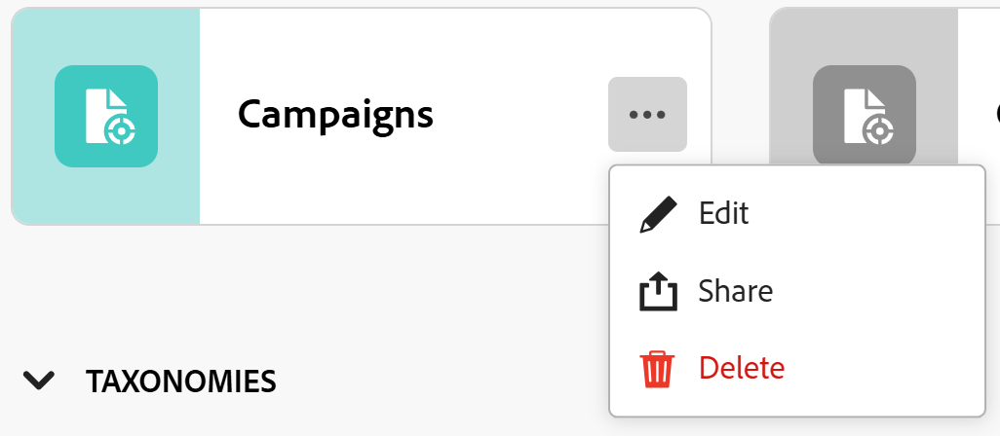

<!--update the metadata with real information when making this available in TOC and in the left nav
---
title: Edit record types
description: You can edit record types after they have been saved. Record types are the object types of Adobe Workfront Planning.
author: Alina
role: User
feature: Work Management 
topic: Architecture
hidefromtoc: yes
hide: yes
---

-->

# Datensatztypen bearbeiten

{{planning-important-intro}}

Datensatztypen sind die Objekttypen der Adobe Workfront-Planung. Sie können das Erscheinungsbild von Datensatztypen bearbeiten, die Sie oder andere Benutzer erstellt haben. Informationen zum Erstellen von Datensatztypen für die Workfront-Planung finden Sie unter [Erstellen von Datensatztypen](/help/quicksilver/planning/architecture/create-record-types.md).

## Zugriffsanforderungen

Sie müssen über folgenden Zugriff verfügen, um die Schritte in diesem Artikel ausführen zu können:

<table style="table-layout:auto">
 <col>
 </col>
 <col>
 </col>
 <tbody>
    <tr>
<tr>
<td>
   
 Produkt
 </td>
   <td>
   
 Adobe Workfront
 
Um Adobe Workfront Planning-Record-Typen mit Experience Manager Assets zu verbinden, müssen Sie über eine Adobe Experience Manager Assets-Lizenz verfügen und die Workfront-Instanz Ihres Unternehmens muss mit der Adobe Business Platform oder der Adobe Admin Console integriert sein.
 </td>
  </tr>  
 <td role="rowheader">
Adobe Workfront-Abkommen
</td>
   <td>

Ihr Unternehmen muss in der Phase des frühen Zugriffs für die Workfront-Planung eingeschrieben sein 

   </td>
  </tr>
  <tr>
   <td role="rowheader">
Adobe Workfront-Abo
</td>
   <td>

Alle

   </td>
  </tr>
  <tr>
   <td role="rowheader">
Adobe Workfront-Lizenz
</td>
   <td>
   
Alle
 
  </td>
  </tr>

<tr>
   <td role="rowheader">
Konfigurationen auf Zugriffsebene
</td>
   <td> 
Für die Workfront-Planung gibt es keine Zugriffssteuerungselemente
  
</td>
  </tr>

<tr>
   <td role="rowheader">
Berechtigungen
</td>
   <td> 
Berechtigungen für einen Arbeitsbereich verwalten</a> 
  
   
Systemadministratoren haben Berechtigungen für alle Arbeitsbereiche, einschließlich derjenigen, die sie nicht erstellt haben
</td>
  </tr>
<tr>
   <td role="rowheader">
Layout-Vorlage
</td>
   <td> 
Ihr Workfront- oder Gruppenadministrator muss den Planungsbereich in Ihre Layoutvorlage einfügen. Weitere Informationen finden Sie unter <a href="/help/quicksilver/planning/access/access-overview.md">Zugriffsübersicht</a>. 
  
</td>
  </tr>

</tbody>
</table>

<!--Maybe enable this at GA - but Planning is not supposed to have Access controls in the Workfront Access Level: 
>[!NOTE]
>
>If you don't have access, ask your Workfront administrator if they set additional restrictions in your access level. For information on how a Workfront administrator can change your access level, see [Create or modify custom access levels](/help/quicksilver/administration-and-setup/add-users/configure-and-grant-access/create-modify-access-levels.md). -->

## Datensatztypen bearbeiten

{{step1-to-planning}}

1. Klicken Sie auf den Arbeitsbereich, dessen Datensatztypen Sie bearbeiten möchten.

   Oder

   Erweitern Sie in einem Arbeitsbereich den nach unten zeigenden Pfeil rechts neben einem vorhandenen Arbeitsbereichnamen, suchen Sie nach einem Arbeitsbereich und wählen Sie ihn aus, wenn er in der Liste angezeigt wird.

   Der Arbeitsbereich wird geöffnet und die Datensatztypen werden angezeigt.
1. Bewegen Sie den Mauszeiger über die Karte eines Datensatztyps und klicken Sie auf **Mehr** Menü  in der rechten oberen Ecke der Datensatztypkarte klicken Sie auf **Bearbeiten**.

   

1. Im **Datensatztyp bearbeiten** die folgenden Informationen aktualisieren:

   * Bearbeiten Sie bei Bedarf den Namen des Datensatztyps. <!--did they add a field label for this? -->
   * **Beschreibung**: Bearbeiten oder fügen Sie eine Beschreibung für den Datensatztyp mit weiteren Informationen hinzu.
   * Bearbeiten Sie die Farbe und Form des Symbols, das dem Datensatztyp zugeordnet ist. Gehen Sie wie folgt vor:
      * Wählen Sie eine Farbe aus, um den Datensatztyp zu identifizieren. Dies ist die Farbe des Symbols für den Datensatztyp. Graustufen ist standardmäßig ausgewählt.
      * Wählen Sie ein Symbol aus der Liste aus oder geben Sie den Namen eines Symbols ein, um zu beschreiben, was es darstellt, und wählen Sie es dann aus, wenn es angezeigt wird. Dies ist das Symbol des Datensatztyps. Standardmäßig ist ein Dateisymbol ausgewählt.

     

1. Klicken Sie auf **Speichern**.
1. (Optional) Klicken Sie im Arbeitsbereich auf die Karte vom Typ Datensatz , um die Seite des Datensatztyps zu öffnen.
1. Klicken Sie auf **Mehr** Menü rechts neben dem Namen des Datensatztyps und klicken Sie auf **Bearbeiten** , um Informationen zum Datensatztyp zu aktualisieren.

   >[!TIP]
   >
   >   Sie können den Datensatztyp in der Kopfzeile umbenennen.

   

   <!--check this screen shot - not sure this is valid ???-->

1. (Optional) Um einen anderen Datensatztyp zu bearbeiten, erweitern Sie den nach unten zeigenden Pfeil rechts neben einem Namen des Datensatztyps, suchen Sie nach einem Datensatztyp und wählen Sie ihn aus, wenn er in der Liste angezeigt wird.
