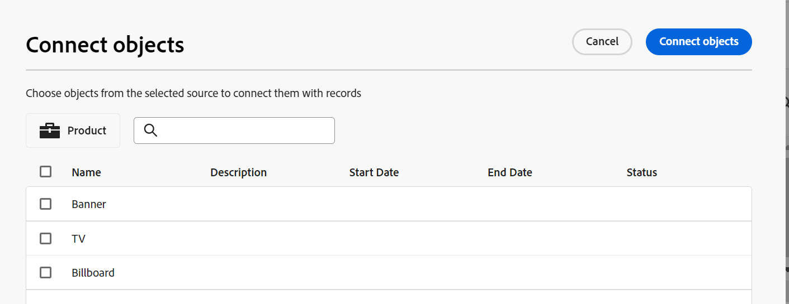
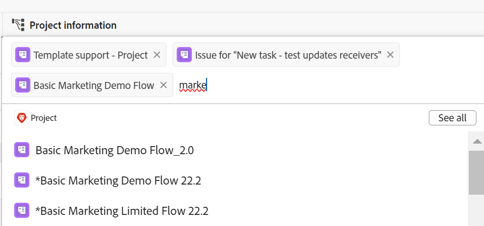

# Beispiel für das Verbinden von Datensatztypen und Datensätzen

{{planning-important-intro}}

In diesem Artikel wird ein Beispiel für Folgendes beschrieben:

* Erstellen einer Verbindung zwischen zwei Workfront Planning-Datensatztypen und zwei Datensätzen.

* Erstellen einer Verbindung zwischen einem Workfront Planning-Datensatztyp und einem Workfront Project-Objekttyp sowie einer Verbindung zwischen einem Datensatz und einem Projekt.

Weitere Informationen finden Sie auch in den folgenden Artikeln:

* [Verbinden von Datensatztypen](/help/quicksilver/planning/architecture/connect-record-types.md)
* [Einträge verbinden](/help/quicksilver/planning/records/connect-records.md)

## Verbinden von zwei Workfront Planning-Datensatztypen und -Datensätzen (Beispiel)

Angenommen, Sie haben einen Datensatztyp mit dem Namen Kampagne als ursprünglichen Datensatztyp.

Sie haben auch einen anderen Datensatztyp namens „Produkt“, der ein Währungsfeld namens „Budget“ hat.

Erstellen Sie ein Feld für den Datensatztyp von Campaign, in dem Sie die Werte des Budgetfelds des Datensatztyps „Produkt“ anzeigen können.

Gehen Sie dazu folgendermaßen vor:

1. Öffnen Sie die Tabellenansicht für den Campaign-Datensatztyp in einem Arbeitsbereich.
1. Klicken Sie auf das Symbol **+** in der oberen rechten Ecke der Tabellenansicht, um ein neues Feld hinzuzufügen, klicken Sie dann auf **Neue Verbindung** und klicken Sie dann im Abschnitt **Ausgewählter** auf „Produkt“.
1. Fügen Sie die folgenden Informationen hinzu, z. B.:

   * **Datensatztyp**: <!--did they change the casing here?-->
   * **Name**: Geben Sie dem neuen Feld einen Namen. Zum Beispiel „Produktinformationen“. Dies ist der Name des verknüpften Datensatzfelds.
   * **Beschreibung**: Hinzufügen einer Beschreibung für das neue Feld. Beispiel: „Dies sind die Produkte, mit denen meine Kampagnen verknüpft werden sollen.“ Die Beschreibung des Felds wird angezeigt, wenn Sie den Mauszeiger über das Feld in der Spaltenüberschrift bewegen.
   * **Verbindungstyp**: Wählen Sie aus den folgenden Optionen aus:
      * **Viele zu viele**: Benutzer können eine Kampagne mit mehreren Produkten und ein Produkt mit mehreren Kampagnen verbinden.
      * **Eins zu viele**: Benutzer können eine Kampagne mit mehreren Produkten und ein Produkt mit einer Kampagne verbinden.
      * **Viele zu eins**: Benutzer können eine Kampagne mit einem Produkt und ein Produkt mit vielen Kampagnen verbinden.
      * **Eins-zu**: Benutzer können eine Kampagne mit einem Produkt und ein Produkt mit einer Kampagne verbinden.

     >[!NOTE]
     >
     >Die Option **Verbindungstyp** ist beim Verbinden von Datensätzen aus verschiedenen Arbeitsbereichen oder beim Verbinden von Experience Manager-Assets oder GenStudio-Marken nicht verfügbar. Weitere Informationen finden Sie unter [Übersicht über verbundene Datensatztypen](/help/quicksilver/planning/architecture/connect-record-types-overview.md).

   * **Erscheinungsbild aufzeichnen**: Wählen Sie aus den folgenden Optionen:
      * **Name und Bild**: Zeigt den Namen und die Miniaturansicht oder das Symbol der verbundenen Datensätze an. Dies ist standardmäßig ausgewählt.
      * **Name**: Zeigt nur den Namen der verbundenen Datensätze an.
      * **Bild**: Zeigt nur die Miniaturansicht oder das Symbol der verbundenen Datensätze an.
   * **Suchfelder auswählen**: Wenn Sie diese Option aktiviert lassen, wird als Nächstes das Feld **Suchfelder hinzufügen** geöffnet, in dem Sie Produktfelder mit dem Datensatztyp der Kampagne verknüpfen können. Sie können auf **Überspringen** klicken, um diesen Schritt zu überspringen und später Produktfelder hinzuzufügen.

     

1. (Bedingt) Wenn Sie im vorherigen Schritt die Option **Suchfelder auswählen** ausgewählt haben, klicken Sie in der Liste der mit dem Datensatztyp **Produkt** verknüpften Felder auf das Symbol **+** für das Feld **Budget** und dann auf **Felder hinzufügen**. Dadurch wird ein Feld mit dem Namen **Budget (aus Produktinformationen)** erstellt. Dies ist der Name des verknüpften Felds. In diesem Feld werden alle Informationen zum Produktbudget für die Kampagnendatensätze angezeigt.

   

   >[!TIP]
   >
   >    Wenn Sie das Budget aller ausgewählten Produkte als eine Gesamtzahl anzeigen möchten, wählen Sie **SUM** im Dropdown-Menü rechts neben dem Feldnamen aus. Wenn Benutzende im Feld &quot;**&quot; mehrere Produkte auswählen** addiert das Feld **Budget (aus Produktinformationen)** alle Budgetwerte und zeigt die Gesamtsumme an. <!-- check the shot below - added a bug with a couple of UI changes here-->
   >
   > Wenn Sie **Keine** anstelle von **SUMME** auswählen, werden die einzelnen Budgets der ausgewählten Produkte durch Kommas getrennt angezeigt.

   Dadurch werden die folgenden Felder generiert:

   * In der Tabellenansicht der Kampagne und auf der Seite Kampagnenaufzeichnung einer Kampagne:

      * **Produktinformationen** (das verknüpfte Datensatzfeld): Zeigt den Namen oder die Namen der Produkte an, wenn Sie sie hinzufügen.
      * **Budget (aus Produktinformationen)** (verknüpftes Feld): Dadurch werden die Budgets der im Feld Produktinformationen ausgewählten Produkte angezeigt.

   * In der Ansicht „Produktdatensatztabelle“ und auf der Seite „Produktdatensatz“ eines Produkts:

      * **Kampagne**: Dies bedeutet, dass der Produktdatensatztyp mit dem Kampagnendatensatztyp verknüpft ist.

     

   >[!TIP]
   >
   >    Verknüpfte Datensatzfelder werden durch das Beziehungssymbol (Beziehungsfeldsymbol.

1. Erstellen Sie in **Tabellenansicht** Kampagne) eine Kampagne, indem Sie eine neue Zeile zur Tabelle des Kampagnendatensatztyps hinzufügen.

1. Doppelklicken Sie in die Spalte **Produktinformationen** der neuen Kampagne.

   

1. Führen Sie einen der folgenden Schritte aus:

   * Klicken Sie in der Liste auf den Namen eines verbundenen Produkts, um es zum ausgewählten Datensatz hinzuzufügen. Das Produkt wird automatisch hinzugefügt.
   * Beginnen Sie mit der Eingabe des Namens eines Produkts und klicken Sie darauf, wenn es in der Liste angezeigt wird. Das Produkt wird automatisch hinzugefügt.
   * Klicken Sie **Alle anzeigen**, um alle Produkte anzuzeigen.

1. (Bedingt) Wenn Sie im vorherigen Schritt auf **Alle anzeigen** geklickt haben, wird das Feld **Objekte verbinden** angezeigt.

   

1. Beginnen Sie, den Namen eines Produkts in das Suchfeld einzugeben, und wählen Sie es aus, wenn es in der Liste angezeigt wird

   Oder

   Wählen Sie die Produktdatensätze aus, die Sie mit den Campaign-Datensätzen verbinden möchten, und klicken Sie dann auf **Objekte verbinden**.

   >[!TIP]
   >
   >    Sie können die Datensatzseite einer Kampagne öffnen, das verknüpfte Datensatzfeld suchen und auf das Symbol **+** im Feld klicken, um Produkte aus dem verknüpften Produktdatensatztyp hinzuzufügen.

   In der Tabelle Kampagnendatensatztyp werden die folgenden Spalten ausgefüllt:
   * Das Feld **Produktinformationen** wird für den Kampagnendatensatz mit den ausgewählten Produkten ausgefüllt.
   * **Das Feld Budget (aus Produktinformationen)** wird mit dem Budgetwert für jedes ausgewählte Produkt oder mit der Summe aller Budgets der ausgewählten Produkte ausgefüllt (wenn Sie „SUMME“ für Ihren Aggregator ausgewählt haben).

   

   >[!TIP]
   >
   >Wenn Sie für die Mehrfachwerte keinen Aggregator auswählen, werden alle Werte aus den ausgewählten Produkten durch Kommas getrennt angezeigt.

1. Um das Feld **Kampagne** in der Tabellenansicht **Produkt** auszufüllen, wiederholen Sie die Schritte 5 bis 7, indem Sie in der Tabellenansicht Produktdatensatztyp beginnen und Kampagneninformationen auswählen. Dadurch wird auch das Feld Produktinformationen in der Tabelle der Kampagnendatensatztyp-Seite aktualisiert. <!--ensure the step numbers remain correct-->

## Verbinden eines Workfront Planning-Datensatztyps mit einem Workfront Project-Objekttyp und Verbinden eines Datensatzes mit einzelnen Projekten

>[!IMPORTANT]
>
>    Alle Personen mit Anzeigen- oder höheren Berechtigungen für den Arbeitsbereich können die Informationen in den verknüpften Feldern anzeigen, unabhängig von ihren Berechtigungen oder Zugriffsebenen in Workfront.

Angenommen, Sie haben einen Datensatztyp mit dem Namen Kampagne als ursprünglichen Datensatztyp.

Es gibt auch Projekte in Workfront mit dem Feld „Geplanter Umsatz“.

Erstellen Sie ein Verbindungsfeld für den Datensatztyp einer Kampagne, in dem Sie die Werte des Feldes Geplanter Umsatz der Projekte in Workfront anzeigen können, die mit Kampagnen in Workfront Planning verbunden sind.

Gehen Sie dazu folgendermaßen vor:

1. Wechseln Sie zu einer Workspace, in der Sie den Campaign-Datensatztyp mit Workfront-Projekten verbinden möchten.
1. Öffnen Sie im ausgewählten Arbeitsbereich die Tabellenansicht für den Campaign-Datensatztyp.
1. Klicken Sie auf das Symbol **+** oben rechts in der Tabellenansicht, um ein neues Feld hinzuzufügen, klicken Sie dann auf **Neue Verbindung** und klicken Sie anschließend **Projekt** im Abschnitt **Workfront-Objekttypen**.
1. Fügen Sie die folgenden Informationen hinzu, z. B.:

   * **Datensatztyp**: Projekt (aus dem Workfront-Unterabschnitt)
   * **Name**: Benennen Sie das neue Feld, z. B. „Projektinformationen“.
   * **Beschreibung**: Hinzufügen einer Beschreibung für das neue Feld. Beispiel: „Dies sind die Projekte, mit denen meine Kampagnen verknüpft werden sollen.“ Die Beschreibung wird in der Tabellenansicht angezeigt, wenn Sie den Mauszeiger über den Feldnamen in der Spaltenüberschrift bewegen.
   * **Verbindungstyp**: Wählen Sie aus den folgenden Optionen aus:
      * **Viele zu viele**: Benutzer können eine Kampagne mit mehreren Produkten und ein Produkt mit mehreren Kampagnen verbinden.
      * **Eins zu viele**: Benutzer können eine Kampagne mit mehreren Produkten und ein Produkt mit einer Kampagne verbinden.
      * **Viele zu eins**: Benutzer können eine Kampagne mit einem Produkt und ein Produkt mit vielen Kampagnen verbinden.
      * **Eins-zu**: Benutzer können eine Kampagne mit einem Produkt und ein Produkt mit einer Kampagne verbinden.
   * **Nur Objekte verknüpfen, die diesen Kriterien entsprechen**: Wählen Sie ein benutzerdefiniertes Formular aus dem **Benutzerdefiniertes Formular** Dropdown-Menü aus. Nur Projekte, die mit den angegebenen Formularen verknüpft sind, können mit Kampagnen verbunden werden. Sie können mehrere Formulare auswählen.
   * **Suchfelder auswählen**: Wenn Sie diese Option aktiviert lassen, wird als Nächstes das Feld **Suchfelder hinzufügen** geöffnet, in dem Sie Projektfelder mit dem Kampagnendatensatztyp verknüpfen können. Sie können auf **Überspringen** klicken, um diesen Schritt zu überspringen und später Projektfelder hinzuzufügen.

   

1. (Bedingt) Wenn Sie im vorherigen Schritt die Option **Suchfelder auswählen** ausgewählt haben, klicken Sie in der Liste der mit dem Objekttyp **Projekt** verknüpften Felder auf das Symbol **+** für das Feld **Geplanter Umsatz** und dann auf **Felder hinzufügen**. Dadurch wird ein Feld mit dem Namen **Geplanter Umsatz (aus Projektinformationen)** erstellt. Dies ist der Name des verknüpften Felds. Alle Informationen aus dem Feld Geplanter Projektumsatz werden automatisch in diesem Feld für die Kampagnenaufzeichnungen angezeigt.

   >[!TIP]
   >
   >    Wenn Sie die geplanten Einnahmen aller ausgewählten Projekte als eine Gesamtzahl anzeigen möchten, wählen Sie **SUM** im Dropdown-Menü rechts neben dem Feldnamen aus. Wenn Benutzer im Feld **Projektinformationen** Verknüpftes Objekt mehrere Projekte auswählen, werden im Feld **Geplanter Umsatz (aus Produktinformationen)** alle Werte addiert und die Gesamtsumme angezeigt. <!-- check the shot below - added a bug with a couple of UI changes here-->
   >
   > Wenn Sie **Keine** anstelle von **SUMME** auswählen, werden die einzelnen geplanten Einnahmen durch Kommas getrennt angezeigt.

   

   Dadurch werden die folgenden Felder generiert:

   * In der Tabellenansicht der Kampagne und auf der Seite Kampagnendatensatz :

      * **Projektinformationen** (das verknüpfte Objektfeld): Zeigt den Namen der Projekte an.
      * **Geplante Einnahmen (aus Projektinformationen)** (verknüpftes Feld): Hier werden die geplanten Einnahmen der im Feld Projektinformationen ausgewählten Projekte angezeigt.

   >[!TIP]
   >
   >    Verknüpfte Objektfelder werden durch das Beziehungssymbol (Beziehungsfeldsymbol.

1. Erstellen Sie in **Tabellenansicht** Datensatztyps (Campaign) eine Kampagne, indem Sie eine neue Zeile in der Tabelle hinzufügen.

1. Doppelklicken Sie in die Spalte Projektinformationen** der neuen Kampagne.

   

1. Führen Sie einen der folgenden Schritte aus:

   * Klicken Sie in der Liste auf den Namen eines Projekts, um es dem ausgewählten Datensatz hinzuzufügen. Das Projekt wird automatisch hinzugefügt.
   * Beginnen Sie mit der Eingabe des Namens eines Projekts und klicken Sie darauf, wenn es in der Liste angezeigt wird. Das Projekt wird automatisch hinzugefügt.
   * Klicken Sie **Alle anzeigen**, um alle Projekte anzuzeigen.

1. (Bedingt) Wenn Sie im vorherigen Schritt auf **Alle anzeigen** geklickt haben, wird das Feld **Objekte verbinden** angezeigt.

   

1. Beginnen Sie, den Namen eines Projekts in das Suchfeld einzugeben, und wählen Sie ihn aus, wenn er in der Liste angezeigt wird

   Oder

   Wählen Sie die Projektdatensätze aus, die Sie mit den Campaign-Datensätzen verbinden möchten, und klicken Sie dann auf **Objekte verbinden**.

   >[!TIP]
   >
   >    Sie können die Seite einer Kampagne öffnen, das verknüpfte Projektfeld suchen und auf das **+**-Symbol im Feld klicken, um Projekte aus dem verknüpften Produktdatensatztyp hinzuzufügen.

   Dadurch werden dem ausgewählten Arbeitsbereich folgende Elemente hinzugefügt:

   * In der Tabelle Kampagnendatensatztyp :
      * Das Feld **Projektinformationen** wird für den Kampagnendatensatz mit den ausgewählten Projekten ausgefüllt.
      * Das Feld **Geplanter Umsatz (aus Produktinformationen)** wird für jedes ausgewählte Produkt mit dem Budgetwert ausgefüllt. Dies ist ein schreibgeschütztes Feld.

   

   >[!TIP]
   >
   >Wenn Sie für die Mehrfachwerte keinen Aggregator auswählen und im objektverknüpften Feld mehrere Objekte auswählen, werden alle Werte durch Kommas getrennt angezeigt.

1. Klicken Sie auf den Namen eines Projekts im Feld Verbundener Datensatz .

   Dadurch wird das Projekt in Workfront geöffnet, wenn Sie mindestens über Anzeigeberechtigungen für das Projekt verfügen.
1. (Optional) Aktualisieren Sie die Informationen zum Projekt in Workfront, wenn Sie dazu berechtigt sind.

1. (Optional) Bewegen Sie in der Kampagnentabellenansicht den Mauszeiger über die **Projektinformationen** Feldüberschrift, klicken Sie auf den nach unten zeigenden Pfeil und dann auf **Suchfelder bearbeiten.**
1. Klicken Sie auf das Symbol **+** für alle Projektfelder, die Sie dem Workfront-Planungsdatensatz des Projekts im Abschnitt „Nicht **Felder“** möchten.
1. Klicken Sie auf das Symbol **-** für alle Projektfelder, die Sie aus dem Workfront-Projektplanungsdatensatz im Abschnitt **Ausgewählte Felder** entfernen möchten.
1. Klicken Sie auf **Speichern**.

   Zusätzliche verknüpfte Felder werden dem Kampagnendatensatztyp hinzugefügt.
