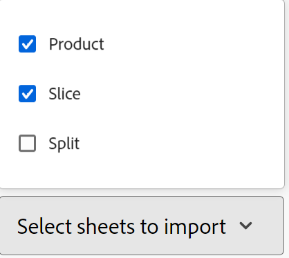

# Erstellen von Datensatztypen durch Importieren von Informationen aus einer CSV- oder Excel-Datei

<!--The information on this page refers to functionality not yet generally available. It is available only in the Preview environment for all customers. After the monthly releases to Production, the same features are also available in the Production environment for customers who enabled fast releases.    

For information about fast releases, see [Enable or disable fast releases for your organization](/help/quicksilver/administration-and-setup/set-up-workfront/configure-system-defaults/enable-fast-release-process.md). -->

{{planning-important-intro}}

Datensatztypen sind die Objekttypen von Adobe Workfront Planning. In Workfront Planning können Sie benutzerdefinierte Datensatztypen erstellen, die die im Lebenszyklus Ihres Unternehmens erforderlichen Arbeitselemente veranschaulichen, indem Sie Informationen aus einer CSV- oder Excel-Datei importieren.

## Zugriffsanforderungen

+++ Erweitern Sie , um die Zugriffsanforderungen für die Funktion in diesem Artikel anzuzeigen. 

<table style="table-layout:auto"> 
<col> 
</col> 
<col> 
</col> 
<tbody> 
    <tr> 
<tr> 
</tr>   
<tr> 
   <td role="rowheader">
Adobe Workfront-Paket
</td> 
   <td> 
<ul> 
<li>
Beliebiges Workfront und beliebiges Planungspaket
</li>

Oder

<li>
Beliebiger Workflow und beliebiges Planungspaket
</li></ul>

Weitere Informationen zu den einzelnen Workfront-Planungspaketen erhalten Sie von Ihrem Workfront-Kundenbetreuer. 
 
   </td> 
  <tr> 
   <td role="rowheader">
Adobe Workfront-Lizenz
</td> 
   <td>
Standard

   </td> 
  </tr> 
  <tr> 
   <td role="rowheader">
Objektberechtigungen
</td> 
   <td>   
Verwalten von Berechtigungen für einen Arbeitsbereich
  
   
Systemadministratoren haben Berechtigungen für alle Arbeitsbereiche, einschließlich der nicht erstellten
  </td> 
  </tr>  
</tbody> 
</table>

Weitere Informationen zu Zugriffsanforderungen für Workfront finden Sie unter [Zugriffsanforderungen in der Dokumentation zu Workfront](/help/quicksilver/administration-and-setup/add-users/access-levels-and-object-permissions/access-level-requirements-in-documentation.md).

+++   

<!--Old:
<table style="table-layout:auto"> 
<col> 
</col> 
<col> 
</col> 
<tbody> 
    <tr> 
<tr> 
<td> 
   
 Products
 </td> 
   <td> 
   <ul><li>
 Adobe Workfront
</li> 
   <li>
 Adobe Workfront Planning
</li></ul></td> 
  </tr>   
<tr> 
   <td role="rowheader">
Adobe Workfront plan*
</td> 
   <td> 

Any of the following Workfront plans:
 
<ul><li>Select</li> 
<li>Prime</li> 
<li>Ultimate</li></ul> 

Workfront Planning is not available for legacy Workfront plans
 
   </td> 
<tr> 
   <td role="rowheader">
Adobe Workfront Planning package*
</td> 
   <td> 

Any 
 

For more information about what is included in each Workfront Planning plan, contact your Workfront account manager. 
 
   </td> 
 <tr> 
   <td role="rowheader">
Adobe Workfront platform
</td> 
   <td> 

Your organization's instance of Workfront must be onboarded to the Adobe Unified Experience to be able to access Workfront Planning.
 

For more information, see <a href="/help/quicksilver/workfront-basics/navigate-workfront/workfront-navigation/adobe-unified-experience.md">Adobe Unified Experience for Workfront</a>. 
 
   </td> 
   </tr> 
  </tr> 
  <tr> 
   <td role="rowheader">
Adobe Workfront license*
</td> 
   <td>
 Standard

   
Workfront Planning is not available for legacy Workfront licenses
 
  </td> 
  </tr> 
  <tr> 
   <td role="rowheader">
Access level configuration
</td> 
   <td> 
There are no access level controls for Adobe Workfront Planning
   
</td> 
  </tr> 
<tr> 
   <td role="rowheader">
Object permissions
</td> 
   <td>   
Manage permissions to a workspace
  
   
System Administrators have permissions to all workspaces, including the ones they did not create
  </td> 
  </tr> 
 
</tbody> 
</table>-->

## Überlegungen zum Importieren von Datensatztypen mithilfe einer Excel- oder CSV-Datei

* Jedes Blatt der Excel-Datei wird zu einem Datensatztyp. Der Name des Blatts wird zum Namen des Datensatztyps.
* Wenn nur ein Blatt vorhanden ist oder Sie eine CSV-Datei importieren, wird der Name der Datei zum Namen des Datensatztyps.
* Die Spaltenüberschriften in jedem Blatt werden zu den Feldern, die mit jedem Datensatztyp verknüpft sind.
* Felder sind für die jeweiligen Datensatztypen eindeutig.
* Jede Zeile in jedem Blatt wird zu einem eindeutigen Datensatz, der mit seinem jeweiligen Datensatztyp verknüpft ist.
* Jedes Blatt der Excel-Datei sollte Folgendes nicht überschreiten:
   * 25.000 Zeilen
   * 500 Spalten
* Die Datei sollte nicht größer als 5 MB sein.
* Leere Blätter werden nicht unterstützt.
* Felder der folgenden Typen werden nicht unterstützt und können nicht den Feldern im Importblatt zugeordnet werden:

   * Verbindungsfelder zu Workfront- und AEM Assets-Objekttypen.
   * Nachschlagen von Feldern aus verbundenen Planungsdatensätzen oder Workfront- und AEM Assets-Objekten
   * Formelfelder
   * Erstellungsdatum, Erstellt von
   * Datum der letzten Änderung, letzte Änderung von
   * Genehmigt am, Genehmigt von
   * Personen

So importieren Sie Datensatztypen mithilfe einer Excel- oder CSV-Datei:

{{step1-to-planning}}

1. Klicken Sie auf den Arbeitsbereich, in dem Sie Datensatztypen erstellen möchten,

   Oder

   Erweitern Sie in einem Arbeitsbereich den nach unten zeigenden Pfeil rechts neben einem vorhandenen Arbeitsbereichsnamen, suchen Sie nach einem Arbeitsbereich und wählen Sie ihn aus, wenn er in der Liste angezeigt wird.
1. Klicken Sie **Datensatztyp hinzufügen**.
1. Klicken Sie **Aus Datei hochladen**.
1. Ziehen Sie eine zuvor auf Ihrem Computer gespeicherte Excel- oder CSV-Datei per Drag-and-Drop oder klicken Sie **CSV- oder Excel-Datei auswählen** um eine Datei zu suchen, und wählen Sie sie aus.
1. Klicken Sie auf **Vorschau und Bearbeitung**.

   Das **„Vorschau und**&quot; wird mit den folgenden Informationen angezeigt:

   * Die Namen der Tabellen oder der zukünftigen Datensatztypen werden im linken Bereich angezeigt. Workfront Planning wählt standardmäßig ein Symbol und eine Farbe für jeden neuen Datensatztyp aus.
   * Das erste Blatt oder der erste Datensatztyp wird ausgewählt, und die Namen der mit ihm verknüpften Felder werden als Spaltenüberschriften angezeigt. Der Typ jedes Felds ist standardmäßig ausgewählt.
   * Jede Zeile stellt einen neuen Datensatz dar. Nur die ersten 10 Datensätze werden im Vorschau- und Bearbeitungsfeld angezeigt.

   

1. (Optional) Klicken Sie auf den Namen der einzelnen Blätter im linken Bereich, um die darin enthaltenen Informationen zu überprüfen.

   >[!NOTE]
   >
   >Leere Blätter werden nicht unterstützt und sind abgeblendet.

1. (Optional) Deaktivieren Sie im linken Bereich die Auswahl der Blätter, die Sie nicht importieren möchten.

   

   Blättert, wenn Sie die Auswahl aufgehoben haben, wird die Anzeige mit grauem Hintergrund angezeigt.

1. (Optional) Klicken Sie auf den nach unten zeigenden Pfeil rechts neben einer Spaltenüberschrift, um auf der Registerkarte **Feld** eine der folgenden Aktionen auszuführen:

   

   * Eines der Felder umbenennen
   * Ändern des **Feldtyps**
   * Aktualisieren Sie das Feld **Beschreibung**

1. (Optional) Klicken Sie auf die **Verbindung**, um die Informationen in der Spalte einem verbundenen Feld von anderen Datensatztypen zuzuordnen.

   

   >[!TIP]
   >
   >Sie können nur Felder aus Workfront Planning-verbundenen Datensätzen zuordnen. Sie können keine Felder von Workfront- oder AEM Assets-Verbindungen zuordnen. Weitere Informationen finden Sie im Abschnitt [Überlegungen zum Importieren von Datensatztypen mithilfe einer Excel- oder CSV](#considerations-about-importing-record-types-using-an-excel-or-csv-file)Datei in diesem Artikel.

1. (Bedingt) Klicken Sie nach dem Aktualisieren der Feldinformationen auf **Speichern**.

1. Klicken Sie **Importieren** wenn Sie bereit sind, Ihre Datei zu importieren.

   Die folgenden Informationen werden in Workfront Planning importiert:

   * Neue Datensatztypen
   * Neue Felder, die mit jedem Datensatztyp verknüpft sind
   * Neue Datensätze, die mit jedem Datensatztyp verknüpft sind

   Sie können mit der Verwaltung von Feldern und Datensätzen auf den Datensatztypseiten beginnen.

   Alle Personen mit Zugriff auf Workfront Planning und den Arbeitsbereich können jetzt die importierten Datensatztypen und deren Informationen anzeigen und bearbeiten.
