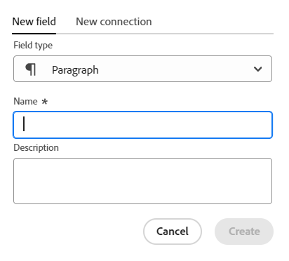
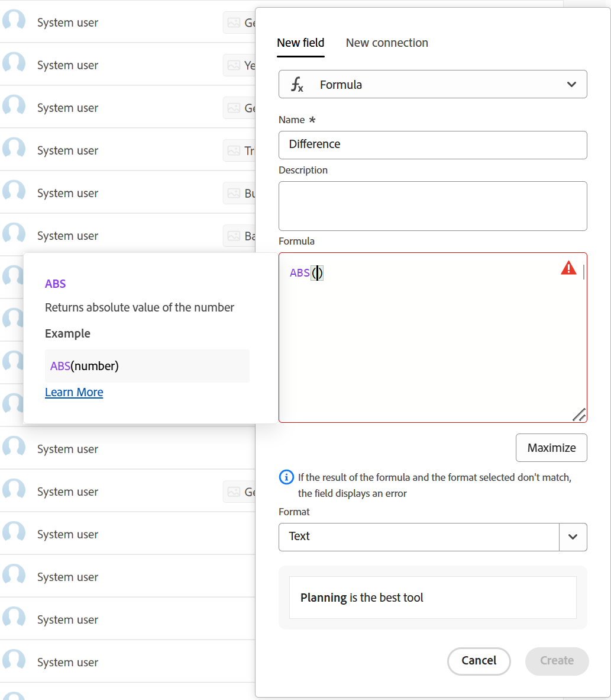

<!--Should the structure of this article be like this other one: https://experienceleague.adobe.com/docs/workfront/using/administration-and-setup/customize/custom-forms/custom-form-builder/use-the-custom-form-builder/add-a-custom-field-to-a-custom-form.html?lang=en ??-->

<!--will they add a way to create fields elsewhere than in a table?! - how will that change the structure of this article? -->

<!--Do we need this for FORMULAS: when we release permissions to RECORDS and we release referring lookup fields in a formula field, update considerations to say that lookup fields from linked records depends on the permissions to the record; if they have no permissions to view a linked record, they won't be able to use that records's lookup fields in a formula - not sure is needed??-->

# Erstellen von Feldern

<span class="preview">Die hervorgehobenen Informationen auf dieser Seite beziehen sich auf Funktionen, die noch nicht allgemein verfügbar sind. Sie ist nur in der Vorschau -Umgebung für alle Kunden verfügbar. Nach den monatlichen Releases in der Produktion stehen dieselben Funktionen auch in der Produktionsumgebung für Kunden zur Verfügung, die schnelle Releases aktiviert haben. </span>

<span class="preview">Informationen zu Schnellversionen finden Sie unter [Aktivieren oder Deaktivieren von Schnellversionen für Ihre Organisation](/help/quicksilver/administration-and-setup/set-up-workfront/configure-system-defaults/enable-fast-release-process.md). </span>


{{planning-important-intro}}

In Adobe Workfront Planning können Sie benutzerdefinierte Felder für Datensatztypen erstellen. Anschließend können Sie die Felder mit Workfront Planning-Datensätzen verknüpfen, um die Datensatzinformationen zu verbessern.

Sie müssen Datensatztypen erstellen, bevor Sie Felder erstellen können, die mit ihnen verknüpft werden sollen. Weitere Informationen finden Sie [Datensatztypen erstellen](/help/quicksilver/planning/architecture/create-record-types.md).

Sie können Felder in Workfront Planning auf folgende Weise erstellen:

* Neu
* Durch Verbinden von Datensatztypen
* Durch Erstellen eines Datensatztyps
* Durch Erstellen eines Arbeitsbereichs aus einer Vorlage
* Durch Importieren von Datensatztypen mithilfe einer Excel- oder CSV-Datei
* Durch Importieren von Kopien bestehender Workfront-Felder

Weitere Informationen zu Workfront Planning-Feldern finden Sie unter [Feldübersicht](/help/quicksilver/planning/fields/fields-overview.md).

## Zugriffsanforderungen

+++ Erweitern Sie , um die Zugriffsanforderungen anzuzeigen.

Sie müssen über folgenden Zugriff verfügen, um die Schritte in diesem Artikel ausführen zu können:

<table style="table-layout:auto"> 
<col> 
</col> 
<col> 
</col> 
<tbody> 
    <tr> 
<tr> 
<td> 
   <p> Produkte</p> </td> 
   <td> 
   <ul><li><p> Adobe Workfront</p></li> 
   <li><p> Adobe Workfront-Planung<p></li></ul></td> 
  </tr>   
<tr> 
   <td role="rowheader"><p>Adobe Workfront-Plan*</p></td> 
   <td> 
<p>Einer der folgenden Workfront-Pläne:</p> 
<ul><li>Auswählen</li> 
<li>Erstklassig</li> 
<li>Ultimativ</li></ul> 
<p>Workfront Planning ist nicht für ältere Workfront-Pläne verfügbar</p> 
   </td> 
<tr> 
   <td role="rowheader"><p>Adobe Workfront-Planungspaket*</p></td> 
   <td> 
<p>Beliebig </p> 
<p>Weitere Informationen zu den einzelnen Workfront-Planungsplänen erhalten Sie von Ihrem Workfront Account Manager. </p> 
   </td> 
 <tr> 
   <td role="rowheader"><p>Adobe Workfront-Plattform</p></td> 
   <td> 
<p>Um auf Workfront Planning zugreifen zu können, muss die Workfront-Instanz Ihres Unternehmens in das einheitliche Adobe-Erlebnis integriert sein.</p> 
<p>Weitere Informationen finden Sie unter <a href="/help/quicksilver/workfront-basics/navigate-workfront/workfront-navigation/adobe-unified-experience.md">Adobe Unified Experience for Workfront</a>. </p> 
   </td> 
   </tr> 
  </tr> 
  <tr> 
   <td role="rowheader"><p>Adobe Workfront-Lizenz*</p></td> 
   <td><p> Standard </p>
   <p>Workfront Planning ist nicht für ältere Workfront-Lizenzen verfügbar</p> 
  </td> 
  </tr> 
  <tr> 
   <td role="rowheader"><p>Konfiguration der Zugriffsebene</p></td> 
   <td> <p>Es gibt keine Zugriffssteuerungsebenen für Adobe Workfront Planning</p>   
</td> 
  </tr> 
<tr> 
   <td role="rowheader"><p>Objektberechtigungen</p></td> 
   <td>   <p>Verwalten von Berechtigungen für einen Arbeitsbereich <span class="preview">und Datensatztyp</span> </a> </p>  
   <p>Systemadministratoren haben Berechtigungen für alle Arbeitsbereiche, einschließlich der nicht erstellten.</p> </td> 
  </tr> 
<tr> 
   <td role="rowheader"><p>Layout-Vorlage</p></td> 
   <td> <p>In der Produktionsumgebung müssen alle Benutzer, einschließlich der Systemadministratoren, einer Layoutvorlage zugewiesen werden, die Planning enthält.</p>
<p><span class="preview">In der Vorschau-Umgebung ist für Standardbenutzer und Systemadministratoren „Planung“ standardmäßig aktiviert.</span></p></td> 
  </tr> 
</tbody> 
</table>

*Weitere Informationen zu Zugriffsanforderungen für Workfront finden Sie unter [Zugriffsanforderungen in der Dokumentation zu Workfront](/help/quicksilver/administration-and-setup/add-users/access-levels-and-object-permissions/access-level-requirements-in-documentation.md).

+++

## Erstellen neuer Felder {#create-fields-from-scratch}

<!--in a table (not sure if this can be done elsewhere?!-->

<!--the first 3 steps are the same as in Import fields from Workfront-->

{{step1-to-planning}}

1. Klicken Sie auf den Arbeitsbereich, für dessen Datensätze Sie Felder erstellen möchten.

   Der Arbeitsbereich wird geöffnet und die Datensatztypen werden angezeigt.

1. Klicken Sie auf die Karte eines Datensatztyps.

   Alle vorhandenen Datensätze, die mit dem Datensatztyp verknüpft sind, werden in den Zeilen der Tabellenansicht angezeigt.

   >[!TIP]
   >
   >    Wenn keine Datensätze angezeigt werden, haben Sie möglicherweise noch keine Datensätze, oder Sie haben einen Filter angewendet, der begrenzt, was Sie auf dem Bildschirm sehen.

   Alle vorhandenen Felder, die mit dem Datensatztyp verknüpft sind, werden in den Spalten der Tabellenansicht angezeigt.

   >[!TIP]
   >
   >    Einige Felder sind möglicherweise ausgeblendet. Klicken Sie auf Felder und aktivieren Sie den Umschalter der Felder, die als Spalten in der Tabellenansicht angezeigt werden sollen.

1. Klicken Sie oben rechts in der Tabellenansicht auf das Symbol **+** .

   Oder

   Bewegen Sie den Mauszeiger über die Kopfzeile einer Spalte, klicken Sie auf den nach unten zeigenden Pfeil nach dem Feldnamen und klicken Sie dann auf **Links einfügen** oder **Rechts einfügen** um das neue Feld hinzuzufügen.
1. Suchen Sie auf **Registerkarte** Neues Feld“ im Feld **Feldtyp** nach einem Feldtyp, oder wählen Sie einen der folgenden Feldtypen aus:

   Suchen Sie auf der Registerkarte **Neues** mithilfe eines beliebigen zugehörigen Keywords im Feld **Feldtyp** nach einem Feldtyp, oder wählen Sie einen der unten aufgeführten Feldtypen aus.

   >[!TIP]
   >
   >    Sie können „Budget“ eingeben und die Feldtypen „Zahl“ und „Währung“ werden in einer Auswahlliste angezeigt.


   * [Einzeiliger Text](#single-line-text)
   * [Absatz](#paragraph)
   * [Mehrfachauswahl](#multi-select)
   * [Einzelauswahl](#single-select)
   * [Datum](#date)
   * [Zahl](#number)
   * [Prozentsatz](#percentage)
   * [Währung](#currency)
   * [checkbox](#checkbox)
   * [Formel](#formula)
   * [Personen](#people)
   * [Erstellt von](#created-by)
   * [Erstellungsdatum](#created-date)
   * [Zuletzt geändert von](#last-modified-by)
   * [Datum der letzten Änderung](#last-modified-date)
     <!--* [Object](#object-field-type)-->

   >[!IMPORTANT]
   >
   >Sie können den Feldtyp nach dem Speichern des Felds nicht mehr ändern.

   <!--Add this to the IMPORTANT above and make it a NOTE - should do directly to Prod:
    * You can use any keyword that might be related to any of the field type names. For example, a search for "Budget" will display the Number or Currency field type.-->

1. Fahren Sie mit dem Hinzufügen jedes Felds fort, wie in den folgenden Abschnitten beschrieben.

### Einzeiliger Text {#single-line-text}

Einzeilige Textfelder erfassen begrenzte alphanumerische Informationen. Sie können beispielsweise die Informationen zu Verantwortlichen, Verantwortlichen, Teams oder Organisationseinheiten in einem einzeiligen Textfeld erfassen. Der Inhalt eines einzeiligen Textfelds kann bis zu 1.000 Zeichen lang sein. <!-- used to be 250 but just tested with 1000 and it allowed this as a maximum. -->

1. Beginnen Sie mit der Erstellung eines Felds, wie im Abschnitt [Erstellen neuer Felder](#create-fields-from-scratch) in diesem Artikel beschrieben, und wählen Sie dann den Feldtyp **Einzeiliger Text** aus.

   

1. Fügen Sie die folgenden Informationen auf der Registerkarte **Neues Feld** hinzu:
   * **Name**: Der Name des Feldtyps, wie er in einer Tabelle oder auf der Detailseite des Datensatzes angezeigt wird. <!--ensure they updated this; and update the screen shot: it used to be "Label"-->
   * **Beschreibung**: Zusätzliche Informationen über das Feld. Die Beschreibung eines Felds wird angezeigt, wenn Sie den Mauszeiger über die Spaltenüberschrift des Felds in einer Tabelle bewegen oder auf das Informationssymbol neben dem Feldnamen auf der Detailseite des Datensatzes klicken.
1. Klicken Sie auf **Erstellen**.

   Das neue einzeilige Feld wird dem Datensatztyp als Spalte hinzugefügt und seine Werte können Datensätzen zugeordnet werden.


### Absatz {#paragraph}

Absatzfelder erfassen zusätzliche alphanumerische Informationen über einen Datensatz, ähnlich dem Feld Beschreibung .

>[!TIP]
>
>* Sie können maximal 20 Absatzfelder für einen Datensatztyp haben.
>
>* Der Inhalt eines Absatzfelds kann bis zu 10.000 Zeichen lang sein.
>* Sie können die Rich-Text-Formatierung verwenden, um den Inhalt von Absatzfeldern zu verbessern, wenn sie in der Tabellenansicht oder auf der Detailseite eines Datensatzes angezeigt werden. Weitere Informationen finden Sie unter [Datensätze bearbeiten](/help/quicksilver/planning/records/edit-records.md).
>


1. Beginnen Sie mit der Erstellung eines Felds, wie im Abschnitt [Erstellen neuer Felder](#create-fields-from-scratch) in diesem Artikel beschrieben, und wählen Sie dann den **Absatz**-Feldtyp aus.

   


1. Fügen Sie die folgenden Informationen auf der Registerkarte **Neues Feld** hinzu:
   * **Name**: Der Name des Feldtyps, wie er in einer Tabelle oder auf der Detailseite des Datensatzes angezeigt wird. <!--ensure they updated this; and update the screen shot: it used to be "Label"-->
   * **Beschreibung**: Zusätzliche Informationen über das Feld. Die Beschreibung eines Felds wird angezeigt, wenn Sie den Mauszeiger über die Spalte des Felds in einer Tabelle bewegen oder auf das Informationssymbol neben dem Feldnamen auf der Detailseite des Datensatzes klicken.
1. Klicken Sie auf **Erstellen**.

   Das neue Absatzfeld wird dem Datensatztyp als Spalte hinzugefügt und seine Werte können Datensätzen zugeordnet werden.


### Mehrfachauswahl {#multi-select}

Sie können ein Feld mit Mehrfachauswahl verwenden, um zusätzliche Informationen in einem beliebigen Format zu erfassen, indem Sie mehr als eine Option aus einem Dropdown-Menü auswählen.

1. Beginnen Sie mit der Erstellung eines Felds, wie im Abschnitt [Erstellen neuer Felder](#create-fields-from-scratch) in diesem Artikel beschrieben, und wählen Sie dann **Feldtyp Mehrfachauswahl** aus.

   


1. Fügen Sie die folgenden Informationen auf der Registerkarte **Neues Feld** hinzu:
   * **Name**: Der Name des Feldtyps, wie er in einer Tabelle oder auf der Detailseite des Datensatzes angezeigt wird. <!--ensure they updated this; and update the screen shot: it used to be "Label"-->
   * **Beschreibung**: Zusätzliche Informationen über das Feld. Die Beschreibung eines Felds wird angezeigt, wenn Sie den Mauszeiger über die Spalte des Felds in einer Tabelle bewegen oder auf das Informationssymbol neben dem Feldnamen auf der Detailseite des Datensatzes klicken.
   * **Wahlen**: Die Optionen, die Benutzende beim Aktualisieren dieses Felds auswählen können. Sie können sowohl Zahlen als auch Buchstaben für den Namen jeder Auswahl verwenden.
1. Klicken Sie **Auswahl hinzufügen**, um weitere Auswahlmöglichkeiten hinzuzufügen. Es gibt keine Begrenzung dafür, wie viele Auswahlmöglichkeiten Sie einem Mehrfachauswahlfeld hinzufügen können.
1. (Optional) Ziehen Sie jede Auswahl manuell in die gewünschte Reihenfolge oder wählen Sie sie aus.
   **Auswahl sortieren A-Z** Option, wenn die Auswahl automatisch in alphabetischer Reihenfolge aufgeführt werden soll. <!--Add this if they added this functionality: You cannot edit this option after you save the field.-->
1. (Optional) Um eine Auswahl zu entfernen, klicken Sie auf das Symbol **x** rechts neben ihr.
1. Klicken Sie links neben einer Auswahl auf das Farbfeld, um die Farbauswahl zu erweitern und die Farbe der einzelnen Optionen anzupassen.

1. Klicken Sie auf **Farbfelder**, um eine vordefinierte Farbe auszuwählen

   Oder

   Klicken Sie **Benutzerdefiniert**, um eine benutzerdefinierte Farbe mithilfe einer Farbauswahl oder eines Hexadezimalcodes auszuwählen.
1. Klicken Sie auf eine Stelle außerhalb des Farbfelds, um es zu schließen.
1. Klicken Sie auf **Erstellen**.

   Das neue Mehrfachauswahlfeld wird als Spalte zum Datensatztyp hinzugefügt und seine Werte können Datensätzen zugeordnet werden.

### Einzelauswahl {#single-select}

Mit Einzelauswahlfeldern können Sie zusätzliche Informationen in jedem beliebigen Format erfassen, indem Sie eine Option aus einem Dropdown-Menü auswählen.

1. Beginnen Sie mit der Erstellung eines Felds, wie im Abschnitt [Erstellen neuer Felder](#create-fields-from-scratch) in diesem Artikel beschrieben, und wählen Sie dann den Feldtyp **Einzelauswahl** aus.

   


1. Fügen Sie die folgenden Informationen auf der Registerkarte **Neues Feld** hinzu:
   * **Name**: Der Name des Feldtyps, wie er in einer Tabelle oder auf der Detailseite des Datensatzes angezeigt wird. <!--ensure they updated this; and update the screen shot: it used to be "Label"-->
   * **Beschreibung**: Zusätzliche Informationen über das Feld. Die Beschreibung eines Felds wird angezeigt, wenn Sie den Mauszeiger über die Spalte des Felds in einer Tabelle bewegen oder auf das Informationssymbol neben dem Feldnamen auf der Detailseite des Datensatzes klicken.
   * **Wahlen**: Die Optionen, die nach dem Speichern des Felds aus dem Dropdown-Menü ausgewählt werden können. Sie können sowohl Zahlen als auch Buchstaben für den Namen jeder Auswahl haben.

1. Klicken Sie **Auswahl hinzufügen**, um weitere Auswahlmöglichkeiten hinzuzufügen. Es gibt keine Begrenzung dafür, wie viele Auswahlmöglichkeiten Sie einem Feld mit nur einer Auswahl hinzufügen können.
1. (Optional) Ziehen Sie die einzelnen Auswahlmöglichkeiten manuell in die gewünschte Reihenfolge oder wählen Sie die Option **Auswahl sortieren A-Z** aus, wenn die Auswahlmöglichkeiten automatisch in alphabetischer Reihenfolge aufgeführt werden sollen. <!--Add this if they added this functionality: You cannot edit this option after you save the field.-->
1. (Optional) Um eine Auswahl zu entfernen, klicken Sie auf das Symbol **x** rechts neben ihr.
1. Klicken Sie links neben einer Auswahl auf das Farbfeld, um die Farbauswahl zu erweitern und die Farbe der einzelnen Optionen anzupassen.
1. Klicken Sie auf **Farbfelder**, um eine vordefinierte Farbe auszuwählen

   Oder

   Klicken Sie **Benutzerdefiniert**, um eine benutzerdefinierte Farbe mithilfe einer Farbauswahl oder eines Hexadezimalcodes auszuwählen.

1. Klicken Sie auf eine Stelle außerhalb des Farbfelds, um es zu schließen.
1. Klicken Sie auf **Erstellen**.

   Das neue Einzelauswahlfeld wird als Spalte zum Datensatztyp hinzugefügt und seine Werte können Datensätzen zugeordnet werden.

### Datum {#date}

Sie können ein Datumsfeld verwenden, um zusätzliche Informationen im Datums- und Uhrzeitformat zu erfassen.

1. Beginnen Sie mit der Erstellung eines Felds, wie im Abschnitt [Erstellen neuer Felder](#create-fields-from-scratch) in diesem Artikel beschrieben, und wählen Sie dann den Feldtyp **Datum** aus.

   


1. Fügen Sie die folgenden Informationen auf der Registerkarte **Neues Feld** hinzu:
   * **Name**: Der Name des Feldtyps, wie er in einer Tabelle oder auf der Datensatzseite angezeigt wird. <!--ensure they updated this; and update the screen shot: it used to be "Label"-->
   * **Beschreibung**: Zusätzliche Informationen über das Feld. Die Beschreibung eines Felds wird angezeigt, wenn Sie den Mauszeiger über die Spalte des Felds in einer Tabelle bewegen oder auf das Informationssymbol neben dem Feldnamen auf der Detailseite des Datensatzes klicken.
   * **Datumsformat**: Der Typ des Datumsformats, das Sie in diesem Feld anzeigen möchten. <!--update this casing - submitted bug for it-->

     Wählen Sie aus den folgenden Formaten aus:
      * **Locale**: Entspricht dem Gebietsschema Ihres Browsers.
      * **Standard**: 05/16/2023
      * **Long**: 16. Mai 2023
      * **Europäisch**: 16/05/2023
      * **ISO**: 16.05.2023
      * **Zeit einbeziehen**: Wählen Sie diese Option aus, wenn Sie einen Zeitstempel einbeziehen möchten. Diese Option ist standardmäßig deaktiviert. Nach dem Speichern des Felds kann keine Zeit angegeben werden.

     Wählen Sie aus den folgenden Optionen aus:

      * **24hr**: Beispiel: 18:00
      * **12**: Beispiel: 18:00 Uhr

1. Klicken Sie auf **Erstellen**.

   Das neue Datumsfeld wird dem Datensatztyp als Spalte hinzugefügt und seine Werte können Datensätzen zugeordnet werden.

### Zahl {#number}

Zahlenfeldtypen erfassen Informationen in einem Zahlenformat.

>[!TIP]
>
>Zahlenfelder werden in einem Formular-Builder für Anfragen als einzeiliger Textfeldtyp angezeigt.
>
>Das Feldformat wird jedoch beibehalten, und die Werte dieser Felder werden nach dem Senden der Anfrage auf der Seite mit den Datensatztypen und Anfragedetails als Zahlen angezeigt.
>&#x200B;>Weitere Informationen finden Sie unter [Erstellen und Verwalten eines Anfrageformulars in Adobe Workfront Planning](/help/quicksilver/planning/requests/create-request-form.md).


1. Beginnen Sie mit der Erstellung eines Felds, wie im Abschnitt [Erstellen neuer Felder](#create-fields-from-scratch) in diesem Artikel beschrieben, und wählen Sie dann den Feldtyp **Zahl** aus.

   
1. Fügen Sie die folgenden Informationen auf der Registerkarte **Neues Feld** hinzu:

   * **Name**: Der Name des Feldtyps, wie er in einer Tabelle oder auf der Datensatzseite angezeigt wird.
   * **Beschreibung**: Zusätzliche Informationen über das Feld. Die Beschreibung eines Felds wird angezeigt, wenn Sie den Mauszeiger über die Spalte des Felds in einer Tabelle bewegen oder auf das Informationssymbol neben dem Feldnamen auf der Detailseite des Datensatzes klicken.
   * **Genauigkeit**: Die Anzahl der Dezimalstellen, die Sie für das Feld aufzeichnen möchten. Sie können bis zu 6 Dezimalstellen anzeigen.
   * **Negative Zahlen zulassen**: Wählen Sie diese Option aus, wenn Sie negative Zahlen in diesem Feld zulassen möchten. Diese Option ist standardmäßig deaktiviert.

   >[!NOTE]
   >
   >    Wenn Sie Negative Zahlen zulassen auswählen und negative Werte in den Datensätzen gespeichert werden, mit denen das Feld verknüpft ist, können Sie die Auswahl der Einstellung in Zukunft nicht mehr aufheben.

1. Klicken Sie auf **Erstellen**.

   Das neue Zahlenfeld wird dem Datensatztyp als Spalte hinzugefügt und seine Werte können Datensätzen zugeordnet werden.

### Prozentsatz {#percentage}

Prozentuale Feldtypen erfassen Informationen in einem Zahlenformat, gefolgt von einem Prozentzeichen.

>[!TIP]
>
>Prozentuale Felder werden in einem Formular-Builder für Anfragen als einzeiliger Textfeldtyp angezeigt.
>
>Das Feldformat wird jedoch beibehalten und die Werte dieser Felder werden nach dem Senden der Anfrage als Prozentwerte für den Datensatztyp und auf der Seite mit den Anfragedetails angezeigt.
>&#x200B;>Weitere Informationen finden Sie unter [Erstellen und Verwalten eines Anfrageformulars in Adobe Workfront Planning](/help/quicksilver/planning/requests/create-request-form.md).


1. Beginnen Sie mit der Erstellung eines Felds, wie im Abschnitt [Erstellen neuer Felder](#create-fields-from-scratch) in diesem Artikel beschrieben, und wählen Sie dann den Feldtyp **Prozentsatz** aus.

   

1. Fügen Sie die folgenden Informationen auf der Registerkarte **Neues Feld** hinzu:
   * **Name**: Der Name des Feldtyps, wie er in einer Tabelle oder auf der Datensatzseite angezeigt wird.
   * **Beschreibung**: Zusätzliche Informationen über das Feld. Die Beschreibung eines Felds wird angezeigt, wenn Sie den Mauszeiger über die Spalte des Felds in einer Tabelle bewegen oder auf das Informationssymbol neben dem Feldnamen auf der Detailseite des Datensatzes klicken.
   * **Genauigkeit**: Die Anzahl der Dezimalstellen, die Sie für das Feld aufzeichnen möchten. Sie können bis zu 6 Dezimalstellen anzeigen.
   * **Negative Zahlen zulassen**: Wählen Sie diese Option aus, wenn Sie negative Prozentwerte in diesem Feld zulassen möchten. Diese Option ist standardmäßig deaktiviert.

     >[!NOTE]
     >
     >Wenn Sie Negative Zahlen zulassen auswählen und negative Werte in den Datensätzen gespeichert werden, mit denen das Feld verknüpft ist, können Sie die Auswahl der Einstellung in Zukunft nicht mehr aufheben.

   * **Anzeigen als**: Wählen Sie aus dem Dropdown-Menü aus, wie die Prozentwerte in der Tabellenansicht angezeigt werden sollen. Wählen Sie aus den folgenden Optionen aus:
      * **Zahl**: Der Prozentwert wird als Zahl angezeigt, gefolgt vom Prozentzeichen.
      * **Balken**: Der Prozentwert wird als Balken neben der Prozentzahl angezeigt. Die Füllfarbe des Balkens gibt den Prozentwert an. Dies ist die Standardauswahl.
      * **Kreis**: Der Prozentwert wird als Umriss eines Kreises neben der Prozentzahl angezeigt. Die Füllfarbe des Umrisses des Kreises gibt den Prozentwert an.

   >[!NOTE]
   >
   >* Die Auswahl, die Sie im Feld Anzeigen als treffen, gilt nur für den in der Tabellenansicht sichtbaren Prozentwert. Der Prozentwert des Felds wird als Zahl angezeigt, gefolgt vom Prozentzeichen überall sonst in Workfront Planning. Dies gilt auch für das Feld des Typs Prozentsatz, wenn es in den Tabellenansichten anderer Datensätze als Suchfeld angezeigt wird.
   >* Sie können die Auswahl Anzeigen als ändern, wenn Sie das Feld später bearbeiten.

1. Klicken Sie auf **Erstellen**.

   Das neue Prozentfeld wird als Spalte zum Datensatztyp hinzugefügt und seine Werte können Datensätzen zugeordnet werden.

### Währung {#currency}

Währungs -Feldtypen erfassen Informationen in einem Zahlenformat mit vorangestelltem Währungssymbol.

>[!TIP]
>
>Währungsfelder werden in einem Formular-Builder für Anfragen als einzeilige Textfelder angezeigt.
>
>Das Feldformat wird jedoch beibehalten, und die Werte dieser Felder werden nach dem Senden der Anfrage auf der Seite mit den Datensatztypen und Anfragedetails als Währung angezeigt.
>&#x200B;>Weitere Informationen finden Sie unter [Erstellen und Verwalten eines Anfrageformulars in Adobe Workfront Planning](/help/quicksilver/planning/requests/create-request-form.md).

1. Beginnen Sie mit der Erstellung eines Felds, wie im Abschnitt [Erstellen neuer Felder](#create-fields-from-scratch) in diesem Artikel beschrieben, und wählen Sie dann den Feldtyp **Währung** aus.

   

1. Fügen Sie die folgenden Informationen auf der Registerkarte **Neues Feld** hinzu:
   * **Name**: Der Name des Feldtyps, wie er in einer Tabelle oder auf der Datensatzseite angezeigt wird. <!--ensure they updated this; and update the screen shot: it used to be "Label"-->
   * **Beschreibung**: Zusätzliche Informationen über das Feld. Die Beschreibung eines Felds wird angezeigt, wenn Sie den Mauszeiger über die Spalte des Felds in einer Tabelle bewegen oder auf das Informationssymbol neben dem Feldnamen auf der Detailseite des Datensatzes klicken.
   * **Währung**: Der Währungstyp, der in diesem Feld angezeigt werden soll. Dies ist eine Liste der Währungen nach der Internationalen Organisation für Normung (ISO).
   * **Genauigkeit**: Die Anzahl der Dezimalstellen, die Sie für das Feld aufzeichnen möchten. Es können bis zu 6 Dezimalstellen angezeigt werden.
   * **Negative Zahlen zulassen**: Wählen Sie diese Option aus, wenn Sie negative Währungswerte in diesem Feld zulassen möchten. Diese Option ist standardmäßig deaktiviert.

   >[!NOTE]
   >
   >    Wenn Sie Negative Zahlen zulassen auswählen und negative Werte in den Datensätzen gespeichert werden, mit denen das Feld verknüpft ist, können Sie die Auswahl der Einstellung in Zukunft nicht mehr aufheben.

1. Klicken Sie auf **Erstellen**.

   Das neue Währungsfeld wird dem Datensatztyp als Spalte hinzugefügt und seine Werte können Datensätzen zugeordnet werden.

### Kontrollkästchen

Sie können den Feldtyp Kontrollkästchen verwenden, um einem Datensatz eine einzelne Kontrollkästchen-Option hinzuzufügen. Sie können dieses Feld verwenden, um ein bestimmtes Attribut oder einen bestimmten Status für diesen Datensatz anzugeben. Sie können sie beispielsweise als Markierung für das Tracking von Fertigstellung, Genehmigung oder anderen binären Attributen für jeden Datensatz verwenden.

1. Beginnen Sie mit der Erstellung eines Felds, wie im Abschnitt [Erstellen neuer Felder](#create-fields-from-scratch) in diesem Artikel beschrieben, und wählen Sie dann den Feldtyp **Kontrollkästchen** aus.

   

1. Fügen Sie die folgenden Informationen auf der Registerkarte **Neues Feld** hinzu:
   * **Name**: Der Name des Feldtyps, wie er in einer Tabelle oder auf der Datensatzseite angezeigt wird. <!--ensure they updated this; and update the screen shot: it used to be "Label"-->
   * **Beschreibung**: Zusätzliche Informationen über das Feld. Die Beschreibung eines Felds wird angezeigt, wenn Sie den Mauszeiger über die Spalte des Felds in einer Tabelle bewegen oder auf das Informationssymbol neben dem Feldnamen auf der Detailseite des Datensatzes klicken.
1. Klicken Sie auf **Erstellen**.

   Das neue Kontrollkästchen-Feld wird dem Datensatztyp als Spalte hinzugefügt und seine Werte können Datensätzen zugeordnet werden.

### Formel

Formelfelder generieren einen neuen Wert anhand vorhandener Werte aus anderen Feldern in einem Datensatztyp und einer Funktion, die angibt, wie die vorhandenen Werte berechnet werden sollen.

Weitere Informationen finden Sie unter [Übersicht über Formelfelder](/help/quicksilver/planning/fields/formula-fields.md).

1. Beginnen Sie mit der Erstellung eines Felds, wie im Abschnitt [Erstellen neuer Felder](#create-fields-from-scratch) in diesem Artikel beschrieben, und wählen Sie dann den Feldtyp **Formel** aus.

   

1. Fügen Sie die folgenden Informationen auf der Registerkarte **Neues Feld** hinzu:

   * **Name**: Geben Sie einen Namen für das neue Feld ein.
   * **Beschreibung**: Hinzufügen von Informationen zum neuen Feld. Die Beschreibung eines Felds wird angezeigt, wenn Sie den Mauszeiger über die Spalte des Felds in einer Tabelle bewegen oder auf das Informationssymbol neben dem Feldnamen auf der Detailseite des Datensatzes klicken.
   * **Formel**: Beginnen Sie mit der Eingabe mindestens eines Zeichens, um auf einen Ausdruck zuzugreifen, und wählen Sie ihn aus, wenn er in der Liste angezeigt wird.

1. Klicken Sie auf den ausgewählten Ausdruck, um die Definition anzuzeigen und ihre Formatierung anzuzeigen.

   

   Weitere Informationen dazu, welche Ausdrücke unterstützt werden, finden Sie unter [Übersicht über Formelfelder](/help/quicksilver/planning/fields/formula-fields.md).


   >[!TIP]
   >
   >Beim Bearbeiten oder Erstellen eines Formelfelds erhalten Sie eine Warnmeldung. Dies kann zu einem Zirkelbezug auf sich selbst oder auf freigegebene Felder führen. Sie können kein Formelfeld speichern, das entweder auf sich selbst oder auf Elemente verweist, auf die in seiner Berechnung verwiesen wird.


1. Fügen Sie Feldnamen so hinzu, wie sie in Workfront Planning angezeigt werden, um in einer Formel darauf zu verweisen.

   >[!NOTE]
   >
   >* Sie können keine Felder vom Typ Mehrfachauswahl zu einer Formel hinzufügen.
   >
   >* Sie können auf ein Feld verweisen, das bis zu vier Felder (und Objekte) vom aktuellen Datensatztyp entfernt ist. Wenn Sie z. B. ein Formelfeld für eine Aktivitätsdatensatzart (1) erstellen und die Aktivität mit der Kampagnendatensatzart (2) verknüpft ist, die mit einem Workfront-Projekt (3) verbunden ist, können Sie in der Formel, die Sie für die Aktivitätsdatensatzart erstellen, auf das Budgetfeld (4) des Projekts verweisen.
   >
   >
   >

1. Wählen Sie im Feld **Format** eine der folgenden Optionen, um das Format des im Feld „Formeltyp“ angezeigten Ergebnisses zu bestimmen:

   * **Text**: Das Ergebnis des Formelfelds wird als einfacher Text angezeigt.
   * **Zahl**: Das Ergebnis des Formelfelds wird als Zahl angezeigt.
   * **Prozent**: Das Ergebnis des Formelfelds wird als Zahl angezeigt, gefolgt von einem Prozentsymbol.
   * **Währung**: Das Ergebnis des Formelfelds wird als Zahl angezeigt, der ein Währungssymbol vorangestellt oder gefolgt wird.
   * **Tags**: Das Ergebnis des Formelfelds wird als Tag mit dem Namen des Objekts angezeigt.

     >[!TIP]
     >
     >Wir empfehlen Tags für Felder, die Arrays anzeigen. In diesem Fall wird jedes Array-Element als separates Tag angezeigt.

     

   * **Datum**: Das Ergebnis des Formelfelds wird als Datum angezeigt.

     Eine Vorschau davon, wie das Ergebnis aussehen wird, wird unter dem Feld **Format** angezeigt.

     >[!WARNING]
     >
     >Wenn das Ergebnis der Formel nicht mit dem ausgewählten Format übereinstimmt, wird im Feld an der Stelle, an der es angezeigt wird, eine Fehlermeldung angezeigt.

1. Klicken Sie auf **Erstellen**.

   Das neue Formelfeld wird dem Datensatztyp als Spalte hinzugefügt und seine Werte können Datensätzen zugeordnet werden.

### Personen

Sie können den Feldtyp Personen verwenden, um eine <!--, job role, or team--> zu einem Datensatz hinzuzufügen. Dies ist ein Feld mit automatischer Textvervollständigung, in dem Sie nur Benutzer hinzufügen können<!--, roles, or teams--> die bereits in Ihrer Workfront-Instanz vorhanden sind.

>[!TIP]
>
>* Wenn Sie den Namen eines Benutzers in ein Feld „Personen“ einfügen, werden der Name des Benutzers und sein primäres Aufgabengebiet im Feld angezeigt.
>
>* Personenfelder werden in einem Formular-Builder als Referenz- (oder Verbindungs-) Feldtyp angezeigt.
>
>Weitere Informationen finden Sie unter [Erstellen und Verwalten eines Anfrageformulars in Adobe Workfront Planning](/help/quicksilver/planning/requests/create-request-form.md).

1. Beginnen Sie mit der Erstellung eines Felds, wie im Abschnitt [Erstellen neuer Felder](#create-fields-from-scratch) in diesem Artikel beschrieben, und wählen Sie dann den Feldtyp **Personen** aus.

   

1. Fügen Sie die folgenden Informationen auf der Registerkarte **Neues Feld** hinzu:
   * **Name**: Der Name des Feldtyps, wie er in einer Tabelle oder auf der Datensatzseite angezeigt wird.
   * **Beschreibung**: Zusätzliche Informationen über das Feld. Die Beschreibung eines Felds wird angezeigt, wenn Sie den Mauszeiger über die Spalte des Felds in einer Tabelle bewegen oder auf das Informationssymbol neben dem Feldnamen auf der Detailseite des Datensatzes klicken.
   * **Mehrere Werte zulassen**: Wählen Sie diese Option aus, wenn Sie Benutzern das Hinzufügen mehrerer Benutzer zu diesem Feld ermöglichen möchten. Diese Option ist standardmäßig deaktiviert.

   >[!NOTE]
   >
   >    Wenn Sie Mehrere Werte zulassen auswählen und mehrere Benutzende in den Datensätzen gespeichert werden, mit denen das Feld verbunden ist, können Sie die Auswahl der Einstellung in Zukunft nicht mehr aufheben, wenn Sie dieses Feld bearbeiten.

1. Klicken Sie auf **Erstellen**.

   Das neue Feld vom Typ „Personen“ wird dem Datensatztyp als Spalte hinzugefügt und seine Werte können Datensätzen zugeordnet werden.

### Erstellt von

Mit dem Feldtyp Erstellt von können Sie den Benutzer, der den Datensatz erstellt hat, zu einem Datensatz hinzufügen. Dies ist ein schreibgeschütztes Feld, das automatisch mit dem Namen des Benutzers ausgefüllt wird, der beim Erstellen des Datensatzes angemeldet war.

1. Beginnen Sie mit der Erstellung eines Felds, wie im Abschnitt [Erstellen neuer Felder](#create-fields-from-scratch) in diesem Artikel beschrieben, und wählen Sie dann den Feldtyp **Erstellt von** aus.

   

1. Fügen Sie die folgenden Informationen auf der Registerkarte **Neues Feld** hinzu:

   * **Name**: Der Name des Feldtyps, wie er in einer Tabelle oder auf der Datensatzseite angezeigt wird. <!--this might change and they might prepopulate it with "Created by"-->
   * **Beschreibung**: Zusätzliche Informationen über das Feld. Die Beschreibung eines Felds wird angezeigt, wenn Sie den Mauszeiger über die Spalte des Felds in einer Tabelle bewegen oder auf das Informationssymbol neben dem Feldnamen auf der Detailseite des Datensatzes klicken.

1. Klicken Sie auf **Erstellen**.

   Das neue Feld Erstellt nach Typ wird dem Datensatztyp als Spalte hinzugefügt und seine Werte werden mit dem Namen des Benutzers vorausgefüllt, der jeden Datensatz erstellt hat.


### Erstellungsdatum

Mit dem Feldtyp Erstellungsdatum können Sie das Datum, an dem der Datensatz erstellt wurde, zu einem Datensatz hinzufügen. Dies ist ein schreibgeschütztes Feld, das automatisch mit dem Datum (und optional mit der Uhrzeit) gefüllt wird, an dem der Datensatz erstellt wurde.

1. Beginnen Sie mit der Erstellung eines Felds, wie im Abschnitt [Erstellen neuer Felder](#create-fields-from-scratch) in diesem Artikel beschrieben, und wählen Sie dann den Feldtyp **Erstellungsdatum** aus.

   

   <!--check the image above - added bug fix for UI text changes-->

1. Fügen Sie die folgenden Informationen auf der Registerkarte **Neues Feld** hinzu:

   * **Name**: Der Name des Feldtyps, wie er in einer Tabelle oder auf der Datensatzseite angezeigt wird. <!--this might change and they might prepopulate it with "Created date"-->
   * **Beschreibung**: Zusätzliche Informationen über das Feld. Die Beschreibung eines Felds wird angezeigt, wenn Sie den Mauszeiger über die Spalte des Felds in einer Tabelle bewegen oder auf das Informationssymbol neben dem Feldnamen auf der Detailseite des Datensatzes klicken.
   * **Datumsformat**: Wählen Sie aus den folgenden Formaten:

      * **Locale**: Entspricht dem Gebietsschema Ihres Browsers.
      * **Standard**: 05/16/2023
      * **Long**: 16. Mai 2023
      * **Europäisch**: 16/05/2023
      * **ISO**: 16.05.2023
   * **Zeitfeld einbeziehen**: Wählen Sie diese Option, wenn Sie einen Zeitstempel einbeziehen möchten. Diese Option ist standardmäßig deaktiviert. <!--submitted a UI text change for this - check the UI-->

     Wählen Sie aus den folgenden Optionen aus:

      * **24hr**: Beispiel: 18:00
      * **12**: Beispiel: 18:00 Uhr

1. Klicken Sie auf **Erstellen**.

   Das neue Feld vom Typ Erstelltes Datum wird dem Datensatztyp als Spalte hinzugefügt und seine Werte werden mit dem Datum (oder Datum und Uhrzeit) vorausgefüllt, an dem der Datensatz erstellt wurde.


### Zuletzt geändert von

Mit dem Feldtyp Zuletzt geändert von können Sie den Benutzer, der den Datensatz zuletzt geändert hat, zu einem Datensatz hinzufügen. Dies ist ein schreibgeschütztes Feld, das automatisch mit dem Namen des Benutzers ausgefüllt wird, der beim letzten Aktualisieren des Datensatzes angemeldet war.

1. Beginnen Sie mit der Erstellung eines Felds, wie im Abschnitt [Erstellen neuer Felder](#create-fields-from-scratch) in diesem Artikel beschrieben, und wählen Sie dann den Feldtyp **Zuletzt geändert von** aus.

   

1. Fügen Sie die folgenden Informationen auf der Registerkarte **Neues Feld** hinzu:

   * **Name**: Der Name des Feldtyps, wie er in einer Tabelle oder auf der Datensatzseite angezeigt wird. <!--this might change and they might prepopulate it with "Created by"-->
   * **Beschreibung**: Zusätzliche Informationen über das Feld. Die Beschreibung eines Felds wird angezeigt, wenn Sie den Mauszeiger über die Spalte des Felds in einer Tabelle bewegen oder auf das Informationssymbol neben dem Feldnamen auf der Detailseite des Datensatzes klicken.

1. Klicken Sie auf **Erstellen**.

   Das neue Feld Letzte Änderung nach Typ wird als Spalte zum Datensatztyp hinzugefügt und seine Werte werden mit dem Namen des Benutzers vorausgefüllt, der jeden Datensatz zuletzt geändert hat.


### Zuletzt geändert am

Mit dem Feldtyp Datum der letzten Änderung können Sie einem Datensatz das Datum der letzten Änderung eines Datensatzes hinzufügen. Dies ist ein schreibgeschütztes Feld, das automatisch mit dem Datum (und optional mit der Uhrzeit) der letzten Änderung des Datensatzes ausgefüllt wird.

1. Beginnen Sie mit der Erstellung eines Felds, wie im Abschnitt [Erstellen neuer Felder](#create-fields-from-scratch) in diesem Artikel beschrieben, und wählen Sie dann den Feldtyp **Erstellungsdatum** aus.

   

   <!--check the image above - added bug fix for UI text changes-->

1. Fügen Sie die folgenden Informationen auf der Registerkarte **Neues Feld** hinzu:

   * **Name**: Der Name des Feldtyps, wie er in einer Tabelle oder auf der Datensatzseite angezeigt wird. <!--this might change and they might prepopulate it with "Created date"-->
   * **Beschreibung**: Zusätzliche Informationen über das Feld. Die Beschreibung eines Felds wird angezeigt, wenn Sie den Mauszeiger über die Spalte des Felds in einer Tabelle bewegen oder auf das Informationssymbol neben dem Feldnamen auf der Detailseite des Datensatzes klicken.
   * **Datumsformat**: Wählen Sie aus den folgenden Formaten:

      * **Locale**: Entspricht dem Gebietsschema Ihres Browsers.
      * **Standard**: 05/16/2023
      * **Long**: 16. Mai 2023
      * **Europäisch**: 16/05/2023
      * **ISO**: 16.05.2023

   * **Zeitfeld einbeziehen**: Wählen Sie diese Option, wenn Sie einen Zeitstempel einbeziehen möchten. Diese Option ist standardmäßig deaktiviert. <!--submitted a UI text change for this - check the UI-->

     Wählen Sie aus den folgenden Optionen aus:

      * **24hr**: Beispiel: 18:00
      * **12**: Beispiel: 18:00 Uhr

1. Klicken Sie auf **Erstellen**.

   Das neue Feld vom Typ „Zuletzt geändert“ wird als Spalte zum Datensatztyp hinzugefügt und seine Werte werden mit dem Datum (oder Datum und Uhrzeit) vorausgefüllt, an dem der Datensatz zuletzt geändert wurde.

<!--

## Object field type

You can use the Object field type when you need to store several fields that might include several pieces of information. For example, you can store the source, code, error message, or details of an object in one field. In this case, instead of having several separate single-line text fields for that, you can use an Object field to store all information in one place. 

For example, when using an Object-type field, you can store the following type of information: 

```
"{
""source"": ""string"",
""code"": ""string"",
""subCode"": ""string"",
""message"": ""string"",
""details"": ""string""
}"

```

You can also store an array of values in one field and you would rather rely on user input for each element of the array, instead of using a multi-select field type for the same purpose. For example, you can store information in the following format: 

`["EMEA", "APAC"] `

Consider the following when using Object-type fields:

* In addition to strings and arrays, you can store other value formats like HTML.
* There is no format validation for this field. 
* Object-type fields have a limit of 10,000 characters.

Create an Object field: 

1. Start creating a field as described in the section [Create fields from scratch](#create-fields-from-scratch) in this article, then select the **Created date** field type.

    

1. Add the following information in the **New field** tab:

     * **Name**: The name of the field type, as it will appear in a table or the record page. (***********this might change and they might prepopulate it with "Created date"********)
     * **Description**: Additional information about the field. The description of a field displays when you hover over the field's column in a table, or when you click the information icon next to the field name in the record's details page.

1. Click **Create**.

    The new Object-type field is added as a column to the record type.

-->

## Erstellen von Feldern durch Verbinden von Datensatztypen

Sie können verknüpfte Datensatzfelder erstellen, wenn Sie eine neue Verbindung zwischen zwei Datensatztypen oder einem Datensatztyp und einem Objekttyp aus anderen Anwendungen hinzufügen.

Informationen zum Verbinden von Workfront Planning-Datensatztypen finden Sie unter [Verbinden von Datensatztypen](/help/quicksilver/planning/architecture/connect-record-types.md).

<!--## Create fields by importing record types using an Excel or CSV file

For more information, see [Create record types](/help/quicksilver/planning/architecture/create-record-types.md).-->

## Erstellen von Feldern durch Erstellen eines Datensatztyps

Beim Erstellen eines Datensatztyps werden standardmäßig auch mehrere mit dem neuen Datensatztyp verknüpfte Felder erstellt. Weitere Informationen finden Sie unter [Datensatztypen erstellen](/help/quicksilver/planning/architecture/create-record-types.md).

## Erstellen von Feldern durch Erstellen eines Arbeitsbereichs aus einer Vorlage

Adobe Workfront Planning erstellt Felder für Datensatztypen, wenn Sie einen Arbeitsbereich aus einer Vorlage erstellen.

Weitere Informationen finden Sie unter [Erstellen von Arbeitsbereichen](/help/quicksilver/planning/architecture/create-workspaces.md).


## Erstellen von Feldern beim Importieren von Datensatztypen aus einer CSV- oder Excel-Datei

Sie können Felder importieren, wenn Sie Datensatztypen mithilfe einer CSV- oder Excel-Datei importieren.

Weitere Informationen finden Sie [Datensatztypen erstellen](/help/quicksilver/planning/architecture/create-record-types.md).

## Erstellen von Feldern durch Importieren aus Workfront

Sie können Kopien bestehender Workfront-Felder importieren.

Beim Importieren von Feldern aus Workfront wird von jedem Feld eine Kopie für einen Workfront Planning-Datensatztyp erstellt.

Nachdem Sie die Felder kopiert haben, sind sie voneinander unabhängig und tauschen keine Informationen aus.

Weitere Informationen finden Sie unter [Felder aus Workfront ](/help/quicksilver/planning/fields/import-fields-from-workfront.md).


