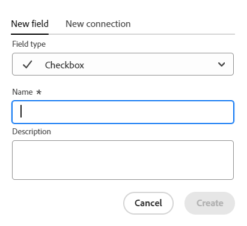
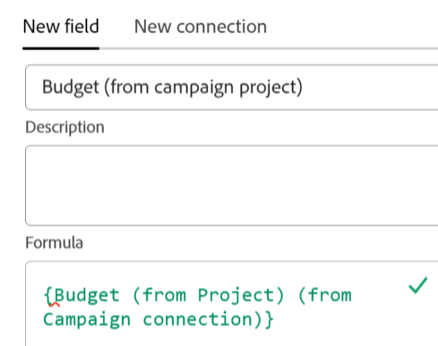

<!--Should the structure of this article be like this other one: https://experienceleague.adobe.com/docs/workfront/using/administration-and-setup/customize/custom-forms/custom-form-builder/use-the-custom-form-builder/add-a-custom-field-to-a-custom-form.html?lang=en ??-->

<!--will they add a way to create fields elsewhere than in a table?! - how will that change the structure of this article? -->

<!--Do we need this for FORMULAS: when we release permissions to RECORDS and we release referring lookup fields in a formula field, update considerations to say that lookup fields from linked records depends on the permissions to the record; if they have no permissions to view a linked record, they won't be able to use that records's lookup fields in a formula - not sure is needed??-->

# Felder erstellen

{{planning-important-intro}}

In der Adobe Workfront-Planung können Sie benutzerdefinierte Felder für Datensatztypen erstellen. Anschließend können Sie die Felder mit Workfront-Planungsdatensätzen verknüpfen, um die Datensatzinformationen zu verbessern.

Sie müssen Datensatztypen erstellen, bevor Sie Felder erstellen können, die mit ihnen verknüpft werden sollen. Weitere Informationen finden Sie unter [Erstellen von Datensatztypen](/help/quicksilver/planning/architecture/create-record-types.md).

In der Workfront-Planung können Sie Felder auf folgende Weise erstellen:

* Neu
* Durch Verbinden von Datensatztypen
* Erstellen eines Datensatztyps
* Erstellen eines Arbeitsbereichs aus einer Vorlage
  <!--* By importing record types using an Excel or CSV file-->

Weitere Informationen zu Workfront-Planungsfeldern finden Sie unter [Feldübersicht](/help/quicksilver/planning/fields/fields-overview.md).

## Zugriffsanforderungen

+++ Erweitern Sie , um die Zugriffsanforderungen für die Workfront-Planung anzuzeigen.

Sie müssen über folgenden Zugriff verfügen, um die Schritte in diesem Artikel ausführen zu können:

<table style="table-layout:auto"> 
<col> 
</col> 
<col> 
</col> 
<tbody> 
    <tr> 
<tr> 
<td> 
   
 Produkte
 </td> 
   <td> 
   <ul><li>
 Adobe Workfront
</li> 
   <li>
 Adobe Workfront-Planung
</li></ul></td> 
  </tr>   
<tr> 
   <td role="rowheader">
Adobe Workfront-Plan*
</td> 
   <td> 

Die folgenden Workfront-Pläne:
 
<ul><li>Auswählen</li> 
<li>Erstklassig</li> 
<li>Ultimativ</li></ul> 

Die Workfront-Planung ist für veraltete Workfront-Pläne nicht verfügbar
 
   </td> 
<tr> 
   <td role="rowheader">
Adobe Workfront-Planungsplan*
</td> 
   <td> 

Alle 
 

Weitere Informationen zu den Funktionen der einzelnen Workfront-Planungspläne erhalten Sie von Ihrem Workfront-Kundenbetreuer. 
 
   </td> 
 <tr> 
   <td role="rowheader">
Adobe Workfront-Plattform
</td> 
   <td> 

Die Workfront-Instanz Ihres Unternehmens muss in das Adobe Unified Experience integriert sein, damit Sie auf alle Funktionen der Workfront-Planung zugreifen können.
 

Weitere Informationen finden Sie unter <a href="/help/quicksilver/workfront-basics/navigate-workfront/workfront-navigation/adobe-unified-experience.md">Adobe Unified Experience for Workfront</a>. 
 
   </td> 
   </tr> 
  </tr> 
  <tr> 
   <td role="rowheader">
Adobe Workfront-Lizenz*
</td> 
   <td>
 Standard 

   
Für ältere Workfront-Lizenzen ist die Workfront-Planung nicht verfügbar.
 
  </td> 
  </tr> 
  <tr> 
   <td role="rowheader">
Konfiguration der Zugriffsebene
</td> 
   <td> 
Für die Adobe Workfront-Planung gibt es keine Zugriffssteuerungselemente
   
</td> 
  </tr> 
<tr> 
   <td role="rowheader">
Objektberechtigungen
</td> 
   <td>   
Berechtigungen für einen Arbeitsbereich verwalten</a> 
  
   
Systemadministratoren haben Berechtigungen für alle Arbeitsbereiche, einschließlich der Arbeitsbereiche, die sie nicht erstellt haben.
 </td> 
  </tr> 
<tr> 
   <td role="rowheader">
Layout-Vorlage
</td> 
   <td> 
Allen Benutzern, einschließlich Workfront-Administratoren, muss eine Layoutvorlage zugewiesen werden, die den Planungsbereich im Hauptmenü enthält. 
 </td> 
  </tr> 
</tbody> 
</table>

*Weitere Informationen zu den Zugriffsanforderungen für Workfront finden Sie unter [Zugriffsanforderungen in der Workfront-Dokumentation](/help/quicksilver/administration-and-setup/add-users/access-levels-and-object-permissions/access-level-requirements-in-documentation.md).

+++

<!--
OLD:

<table style="table-layout:auto">
 <col>
 </col>
 <col>
 </col>
 <tbody>
    <tr>
<tr>
<td>
   
 Product
 </td>
   <td>
   
 Adobe Workfront
 </td>
  </tr>  
 <td role="rowheader">
Adobe Workfront agreement
</td>
   <td>

Your organization must be enrolled in the early access stage for Workfront Planning 

   </td>
  </tr>
  <tr>
   <td role="rowheader">
Adobe Workfront plan
</td>
   <td>

Any

   </td>
  </tr>
  <tr>
   <td role="rowheader">
Adobe Workfront license*
</td>
   <td>
   
New: Standard
 
   
Current: Plan

  </td>
  </tr>
  
  <tr>
   <td role="rowheader">
Access level configurations
</td>
   <td> 
There are no access level control for Workfront Planning
  
</td>
  </tr>

  <tr>
   <td role="rowheader">
Permissions
</td>
   <td> 
Manage permissions to a workspace</a> 
  
   
System Administrators have permissions to all workspaces, including the ones they did not create.

</td>
  </tr>
<tr>
   <td role="rowheader">
Layout template
</td>
   <td> 
Your Workfront or group administrator must add the Planning area in your layout template. For information, see <a href="/help/quicksilver/planning/access/access-overview.md">Access overview</a>. 
  
</td>
  </tr>

 </tbody>
</table>

*For information, see [Access requirements in Workfront documentation](/help/quicksilver/administration-and-setup/add-users/access-levels-and-object-permissions/access-level-requirements-in-documentation.md). 

-->

## Felder von Grund auf neu erstellen {#create-fields-from-scratch}

<!--in a table (not sure if this can be done elsewhere?!-->

{{step1-to-planning}}

1. Klicken Sie auf den Arbeitsbereich, für den die Datensätze erstellt werden sollen.

   Der Arbeitsbereich wird geöffnet und die Datensatztypen werden angezeigt.

1. Klicken Sie auf die Karte eines Datensatztyps.

   Alle vorhandenen Datensätze, die mit dem Datensatztyp verknüpft sind, werden in den Zeilen der Tabellenansicht angezeigt.

   >[!TIP]
   >
   >    Wenn keine Datensätze angezeigt werden, sind möglicherweise noch keine Datensätze vorhanden oder es wird ein Filter angewendet, der die Anzeige auf dem Bildschirm einschränkt.

   Alle vorhandenen Felder, die mit dem Datensatztyp verknüpft sind, werden in den Spalten der Tabellenansicht angezeigt.

   >[!TIP]
   >
   >    Einige Felder sind möglicherweise ausgeblendet. Klicken Sie auf Felder und aktivieren Sie den Umschalter der Felder, die in der Tabellenansicht als Spalten angezeigt werden sollen.

1. Klicken Sie oben rechts in der Tabellenansicht auf das Symbol **+** .

   Oder

   Bewegen Sie den Mauszeiger über die Kopfzeile einer Spalte, klicken Sie auf den nach unten zeigenden Pfeil nach dem Feldnamen und klicken Sie dann auf **Links einfügen** oder **Rechts einfügen** , um das neue Feld hinzuzufügen.
1. Suchen Sie auf der Registerkarte **Neues Feld** im Feld **Feldtyp** nach einem Feldtyp oder wählen Sie aus den folgenden Feldtypen aus:

   * [Einzeiliger Text](#single-line-text)
   * [Absatz](#paragraph)
   * [Mehrfachauswahl](#multi-select)
   * [Einzelauswahl](#single-select)
   * [Datum](#date)
   * [Nummer](#number)
   * [Prozentsatz](#percentage)
   * [Währung](#currency)
   * [Kontrollkästchen](#checkbox)
   * [Formel](#formula)
   * [Personen](#people)
   * [Erstellt von](#created-by)
   * [Erstellungsdatum](#created-date)
   * [Zuletzt geändert von](#last-modified-by)
   * [Zuletzt geändert am](#last-modified-date)

   >[!IMPORTANT]
   >
   >    Der Feldtyp kann nach dem Speichern nicht mehr geändert werden.

1. Fahren Sie mit dem Hinzufügen der einzelnen Felder fort, wie in den folgenden Abschnitten beschrieben.

### Einzeiliger Text {#single-line-text}

Einzelzeilige Textfelder erfassen begrenzte alphanumerische Informationen. Sie können beispielsweise die Informationen zu Eigentümern, Interessenvertretern, Teams oder Organisationseinheiten in einem einzeiligen Textfeld erfassen. Der Inhalt eines einzeiligen Textfelds kann bis zu 1.000 Zeichen enthalten. <!-- used to be 250 but just tested with 1000 and it allowed this as a maximum. -->

1. Beginnen Sie mit der Erstellung eines Felds, wie im Abschnitt [Felder von Grund auf erstellen](#create-fields-from-scratch) in diesem Artikel beschrieben, und wählen Sie dann den Feldtyp **Einzeiliger Text** aus.

   

1. Fügen Sie auf der Registerkarte **Neues Feld** die folgenden Informationen hinzu:
   * **Name**: Der Name des Feldtyps, wie er in einer Tabelle oder auf der Detailseite des Datensatzes angezeigt wird. <!--ensure they updated this; and update the screen shot: it used to be "Label"-->
   * **Beschreibung**: Zusätzliche Informationen zum Feld. Die Beschreibung eines Felds wird angezeigt, wenn Sie den Mauszeiger über die Spaltenüberschrift eines Felds in einer Tabelle bewegen.
1. Klicken Sie auf **Erstellen**.

   Das neue einzeilige Feld wird dem Datensatztyp als Spalte hinzugefügt und seine Werte können Datensätzen zugeordnet werden.

### Absatz {#paragraph}

Absatzfelder erfassen zusätzliche alphanumerische Informationen zu einem Datensatz, ähnlich dem Feld Beschreibung .

>[!TIP]
>
>* Sie können für einen Datensatztyp maximal 20 Absatzfelder verwenden.
>
>* Der Inhalt eines Absatzfelds kann bis zu 10.000 Zeichen lang sein.
>* Sie können die Rich-Text-Formatierung verwenden, um den Inhalt von Absatzfeldern zu verbessern, wenn sie in der Tabellenansicht oder auf der Detailseite eines Datensatzes angezeigt werden. Weitere Informationen finden Sie unter [Datensätze bearbeiten](/help/quicksilver/planning/records/edit-records.md).
>

1. Erstellen Sie ein Feld wie im Abschnitt [Felder von Grund auf neu erstellen](#create-fields-from-scratch) in diesem Artikel beschrieben, und wählen Sie dann den Feldtyp **Absatz** aus.

   

1. Fügen Sie auf der Registerkarte **Neues Feld** die folgenden Informationen hinzu:
   * **Name**: Der Name des Feldtyps, wie er in einer Tabelle oder auf der Detailseite des Datensatzes angezeigt wird. <!--ensure they updated this; and update the screen shot: it used to be "Label"-->
   * **Beschreibung**: Zusätzliche Informationen zum Feld. Die Beschreibung eines Felds wird angezeigt, wenn Sie den Mauszeiger über die Spalte eines Felds in einer Tabelle bewegen.
1. Klicken Sie auf **Erstellen**.

   Das neue Absatzfeld wird dem Datensatztyp als Spalte hinzugefügt und seine Werte können Datensätzen zugeordnet werden.

### Mehrfachauswahl {#multi-select}

Sie können ein Mehrfachauswahlfeld verwenden, um zusätzliche Informationen in einem beliebigen Format zu erfassen, indem Sie mehrere Optionen aus einem Dropdown-Menü auswählen.

1. Erstellen Sie ein Feld wie im Abschnitt [Felder von Grund auf neu erstellen](#create-fields-from-scratch) in diesem Artikel beschrieben, und wählen Sie dann den Feldtyp **Mehrfachauswahl** aus.

   

1. Fügen Sie auf der Registerkarte **Neues Feld** die folgenden Informationen hinzu:
   * **Name**: Der Name des Feldtyps, wie er in einer Tabelle oder auf der Detailseite des Datensatzes angezeigt wird. <!--ensure they updated this; and update the screen shot: it used to be "Label"-->
   * **Beschreibung**: Zusätzliche Informationen zum Feld. Die Beschreibung eines Felds wird angezeigt, wenn Sie den Mauszeiger über die Spalte eines Felds in einer Tabelle bewegen.
   * **Auswahlmöglichkeiten**: Die Optionen, die Benutzer beim Aktualisieren dieses Felds auswählen können. Sie können sowohl Zahlen als auch Buchstaben für den Namen jeder Wahl verwenden.
1. Klicken Sie auf **Auswahl hinzufügen** , um weitere Auswahlmöglichkeiten hinzuzufügen. Es gibt keine Beschränkung dafür, wie viele Auswahlmöglichkeiten Sie einem Mehrfachauswahlfeld hinzufügen können.
1. (Optional) Ziehen Sie die einzelnen Auswahlmöglichkeiten manuell in die gewünschte Reihenfolge oder wählen Sie die
   **Sortieren Sie die Optionen A-Z** , wenn die Auswahl automatisch in alphabetischer Reihenfolge aufgeführt werden soll. <!--Add this if they added this functionality: You cannot edit this option after you save the field.-->
1. (Optional) Um eine Auswahl zu entfernen, klicken Sie auf das Symbol **x** rechts davon.
1. Klicken Sie auf das Farbfeld links neben einer Auswahl, um die Farbauswahl zu erweitern und die Farbe der einzelnen Optionen anzupassen.
1. Klicken Sie auf **Erstellen**.

   Das neue Mehrfachauswahlfeld wird dem Datensatztyp als Spalte hinzugefügt und seine Werte können Datensätzen zugeordnet werden.

### Einzelauswahl {#single-select}

Felder mit einmaliger Auswahl erfassen zusätzliche Informationen in einem beliebigen Format, indem Sie eine Option aus einem Dropdown-Menü auswählen.

1. Beginnen Sie mit der Erstellung eines Felds, wie im Abschnitt [Felder von Grund auf erstellen](#create-fields-from-scratch) in diesem Artikel beschrieben, und wählen Sie dann den Feldtyp **Einzelauswahl** aus.

   

1. Fügen Sie auf der Registerkarte **Neues Feld** die folgenden Informationen hinzu:
   * **Name**: Der Name des Feldtyps, wie er in einer Tabelle oder auf der Detailseite des Datensatzes angezeigt wird. <!--ensure they updated this; and update the screen shot: it used to be "Label"-->
   * **Beschreibung**: Zusätzliche Informationen zum Feld. Die Beschreibung eines Felds wird angezeigt, wenn Sie den Mauszeiger über die Spalte eines Felds in einer Tabelle bewegen.
   * **Auswahlmöglichkeiten**: Die Optionen, die nach dem Speichern des Felds aus dem Dropdownmenü ausgewählt werden können. Sie können sowohl Zahlen als auch Buchstaben für den Namen jeder Wahl haben.

1. Klicken Sie auf **Auswahl hinzufügen** , um weitere Auswahlmöglichkeiten hinzuzufügen. Es gibt keine Beschränkung dafür, wie viele Auswahlmöglichkeiten Sie einem Feld mit Einzelauswahl hinzufügen können.
1. (Optional) Ziehen Sie jede Auswahl manuell in die gewünschte Reihenfolge oder wählen Sie die Option **Sortieroptionen A-Z** aus, wenn die Auswahlmöglichkeiten automatisch in alphabetischer Reihenfolge aufgeführt werden sollen. <!--Add this if they added this functionality: You cannot edit this option after you save the field.-->
1. (Optional) Um eine Auswahl zu entfernen, klicken Sie auf das Symbol **x** rechts davon.
1. Klicken Sie auf das Farbfeld links neben einer Auswahl, um die Farbauswahl zu erweitern und die Farbe der einzelnen Optionen anzupassen.
1. Klicken Sie auf **Erstellen**.

   Das neue Einzelauswahlfeld wird dem Datensatztyp als Spalte hinzugefügt und seine Werte können Datensätzen zugeordnet werden.

### Datum {#date}

Sie können ein Datumsfeld verwenden, um zusätzliche Informationen im Datums- und Uhrzeitformat zu erfassen.

1. Erstellen Sie ein Feld wie im Abschnitt [Felder von Grund auf neu erstellen](#create-fields-from-scratch) in diesem Artikel beschrieben, und wählen Sie dann den Feldtyp **Datum** aus.

   

1. Fügen Sie auf der Registerkarte **Neues Feld** die folgenden Informationen hinzu:
   * **Name**: Der Name des Feldtyps, wie er in einer Tabelle oder auf der Datensatzseite angezeigt wird. <!--ensure they updated this; and update the screen shot: it used to be "Label"-->
   * **Beschreibung**: Zusätzliche Informationen zum Feld. Die Beschreibung eines Felds wird angezeigt, wenn Sie den Mauszeiger über die Spalte eines Felds in einer Tabelle bewegen.
   * **Datumsformat**: Der Typ des Datumsformats, das in diesem Feld angezeigt werden soll. <!--update this casing - submitted bug for it-->

     Wählen Sie aus den folgenden Formaten aus:
      * **Locale**: Entspricht dem Gebietsschema Ihres Browsers.
      * **Standard**: 16.05.2023
      * **Long**: 16. Mai 2023
      * **europäisch**: 16.05.2023
      * **ISO**: 2023-05-16
   * **Ein Zeitfeld einschließen**: Wählen Sie diese Option, wenn Sie einen Zeitstempel einschließen möchten. Diese Option ist standardmäßig deaktiviert. <!--update this setting name - submitted bug for it to be changed-->

     Wählen Sie aus den folgenden Optionen aus:

      * **24hr**: Beispiel: 18:00
      * **12hr**: Beispiel: 18:00 PM

1. Klicken Sie auf **Erstellen**.

   Das neue Datumsfeld wird dem Datensatztyp als Spalte hinzugefügt und seine Werte können Datensätzen zugeordnet werden.

### Zahl {#number}

Zahlenfeldtypen erfassen Informationen im Zahlenformat.

1. Erstellen Sie ein Feld wie im Abschnitt [Felder von Grund auf neu erstellen](#create-fields-from-scratch) in diesem Artikel beschrieben, und wählen Sie dann den Feldtyp **Zahl** aus.

   
1. Fügen Sie auf der Registerkarte **Neues Feld** die folgenden Informationen hinzu:

   * **Name**: Der Name des Feldtyps, wie er in einer Tabelle oder auf der Datensatzseite angezeigt wird.
   * **Beschreibung**: Zusätzliche Informationen zum Feld. Die Beschreibung eines Felds wird angezeigt, wenn Sie den Mauszeiger über die Spalte eines Felds in einer Tabelle bewegen.
   * **Präzision**: Die Anzahl der Dezimalstellen, die für das Feld aufgezeichnet werden sollen. Sie können bis zu 6 Dezimalstellen anzeigen.
   * **Negative Zahlen zulassen**: Wählen Sie diese Option aus, wenn Sie negative Zahlen in diesem Feld zulassen möchten. Diese Option ist standardmäßig deaktiviert.

   >[!NOTE]
   >
   >    Wenn Sie negative Zahlen zulassen auswählen und negative Werte auf den Datensätzen gespeichert werden, an die das Feld angehängt ist, können Sie die Auswahl der Einstellung in Zukunft nicht mehr aufheben.

1. Klicken Sie auf **Erstellen**.

   Das neue Zahlenfeld wird dem Datensatztyp als Spalte hinzugefügt und seine Werte können Datensätzen zugeordnet werden.

### Prozentsatz {#percentage}

Prozentfeldtypen erfassen Informationen in einem Zahlenformat, gefolgt von einem Prozentzeichen.

1. Beginnen Sie mit der Erstellung eines Felds, wie im Abschnitt [Felder von Grund auf erstellen](#create-fields-from-scratch) in diesem Artikel beschrieben, und wählen Sie dann den Feldtyp **Prozentsatz** aus.

   

1. Fügen Sie auf der Registerkarte **Neues Feld** die folgenden Informationen hinzu:
   * **Name**: Der Name des Feldtyps, wie er in einer Tabelle oder auf der Datensatzseite angezeigt wird.
   * **Beschreibung**: Zusätzliche Informationen zum Feld. Die Beschreibung eines Felds wird angezeigt, wenn Sie den Mauszeiger über die Spalte eines Felds in einer Tabelle bewegen.
   * **Präzision**: Die Anzahl der Dezimalstellen, die für das Feld aufgezeichnet werden sollen. Sie können bis zu 6 Dezimalstellen anzeigen.
   * **Negative Zahlen zulassen**: Wählen Sie diese Option aus, wenn Sie negative Prozentwerte in diesem Feld zulassen möchten. Diese Option ist standardmäßig deaktiviert.

   >[!NOTE]
   >
   >    Wenn Sie negative Zahlen zulassen auswählen und negative Werte auf den Datensätzen gespeichert werden, an die das Feld angehängt ist, können Sie die Auswahl der Einstellung in Zukunft nicht mehr aufheben.

1. Klicken Sie auf **Erstellen**.

   Das neue Prozentfeld wird dem Datensatztyp als Spalte hinzugefügt und seine Werte können Datensätzen zugeordnet werden.

### Währung {#currency}

Währungsfeldtypen erfassen Informationen in einem Zahlenformat, dem ein Währungssymbol vorangestellt ist.

1. Erstellen Sie ein Feld wie im Abschnitt [Felder von Grund auf neu erstellen](#create-fields-from-scratch) in diesem Artikel beschrieben, und wählen Sie dann den Feldtyp **Währung** aus.

   

1. Fügen Sie auf der Registerkarte **Neues Feld** die folgenden Informationen hinzu:
   * **Name**: Der Name des Feldtyps, wie er in einer Tabelle oder auf der Datensatzseite angezeigt wird. <!--ensure they updated this; and update the screen shot: it used to be "Label"-->
   * **Beschreibung**: Zusätzliche Informationen zum Feld. Die Beschreibung eines Felds wird angezeigt, wenn Sie den Mauszeiger über die Spalte eines Felds in einer Tabelle bewegen.
   * **Währung**: Der Typ der Währung, die in diesem Feld angezeigt werden soll. Dies ist eine Liste der Währungen gemäß der Internationalen Organisation für Normung (ISO).
   * **Präzision**: Die Anzahl der Dezimalstellen, die für das Feld aufgezeichnet werden sollen. Sie können bis zu 6 Dezimalstellen anzeigen.
   * **Negative Zahlen zulassen**: Wählen Sie diese Option aus, wenn Sie negative Währungswerte in diesem Feld zulassen möchten. Diese Option ist standardmäßig deaktiviert.

   >[!NOTE]
   >
   >    Wenn Sie negative Zahlen zulassen auswählen und negative Werte auf den Datensätzen gespeichert werden, an die das Feld angehängt ist, können Sie die Auswahl der Einstellung in Zukunft nicht mehr aufheben.

1. Klicken Sie auf **Erstellen**.

   Das neue Währungsfeld wird dem Datensatztyp als Spalte hinzugefügt und seine Werte können Datensätzen zugeordnet werden.

### Kontrollkästchen

Sie können den Feldtyp Kontrollkästchen verwenden, um einem Datensatz eine einzelne Kontrollkästchen-Option hinzuzufügen. Sie können dieses Feld verwenden, um ein bestimmtes Attribut oder einen bestimmten Status für diesen Datensatz anzugeben. Sie können sie beispielsweise als Markierung zum Tracking der Fertigstellung, Genehmigung oder eines anderen Binärattributs für jeden Datensatz verwenden.

1. Erstellen Sie ein Feld wie im Abschnitt [Felder von Grund auf neu erstellen](#create-fields-from-scratch) in diesem Artikel beschrieben, und wählen Sie dann den Feldtyp **Kontrollkästchen** aus.

   

1. Fügen Sie auf der Registerkarte **Neues Feld** die folgenden Informationen hinzu:
   * **Name**: Der Name des Feldtyps, wie er in einer Tabelle oder auf der Datensatzseite angezeigt wird. <!--ensure they updated this; and update the screen shot: it used to be "Label"-->
   * **Beschreibung**: Zusätzliche Informationen zum Feld. Die Beschreibung eines Felds wird angezeigt, wenn Sie den Mauszeiger über die Spalte eines Felds in einer Tabelle bewegen.
1. Klicken Sie auf **Erstellen**.

   Das neue Kontrollkästchen wird dem Datensatztyp als Spalte hinzugefügt und seine Werte können Datensätzen zugeordnet werden.

### Formel

Formelfelder generieren einen neuen Wert anhand vorhandener Werte aus anderen Feldern eines Datensatztyps und einer Funktion, die angibt, wie die vorhandenen Werte berechnet werden sollen.

Weitere Informationen finden Sie unter [Übersicht über Formelfelder](/help/quicksilver/planning/fields/formula-fields.md).

1. Erstellen Sie ein Feld wie im Abschnitt [Felder von Grund auf neu erstellen](#create-fields-from-scratch) in diesem Artikel beschrieben, und wählen Sie dann den Feldtyp **Formel** aus.

   

1. Fügen Sie auf der Registerkarte **Neues Feld** die folgenden Informationen hinzu:

   * **Name**: Geben Sie einen Namen für das neue Feld ein.
   * **Beschreibung**: Fügen Sie Informationen zum neuen Feld hinzu.
   * **Formel**: Beginnen Sie mit der Eingabe von mindestens einem Zeichen, um auf einen Ausdruck zuzugreifen, und wählen Sie ihn aus, wenn er in der Liste angezeigt wird.

1. Klicken Sie auf den ausgewählten Ausdruck, um die Definition anzuzeigen und die Formatierung anzuzeigen.

   

   Weitere Informationen dazu, welche Ausdrücke unterstützt werden, finden Sie unter [Übersicht über Formelfelder](/help/quicksilver/planning/fields/formula-fields.md).

1. Fügen Sie Feldnamen hinzu, wie sie in der Workfront-Planung angezeigt werden, um sie in einer Formel zu referenzieren.

   >[!NOTE]
   >
   >* Es ist nicht möglich, Felder vom Typ Mehrfachauswahl in einer Formel hinzuzufügen.
   >
   >* Sie können ein Feld referenzieren, das bis zu 4 Felder (und Objekte) vom aktuellen Datensatztyp entfernt ist. Wenn Sie beispielsweise ein Formelfeld für einen Aktivitäts-Record-Typ (1) erstellen und die Aktivität mit dem Campaign-Record-Typ (2) verbunden ist, der mit einem Workfront-Projekt (3) verbunden ist, können Sie das Feld Budget (4) des Projekts in der für den Aktivitäts-Record-Typ erstellten Formel referenzieren.
   >
   >
   >

1. Wählen Sie im Feld **Format** aus den folgenden Optionen aus, um das Format des Ergebnisses anzugeben, das im Feld Formeltyp angezeigt wird:

   * **Text**: Das Ergebnis des Formelfelds wird als normaler Text angezeigt.
   * **Zahl**: Das Ergebnis des Formelfelds wird als Zahl angezeigt.
   * **Prozent**: Das Ergebnis des Formelfelds wird als Zahl gefolgt von einem Prozentzeichen angezeigt.
   * **Währung**: Das Ergebnis des Formelfelds wird als Zahl angezeigt, der ein Währungssymbol vorangestellt oder gefolgt ist.
   * **Tags**: Das Ergebnis des Formelfelds wird als Tag mit dem Namen des Objekts angezeigt.

     >[!TIP]
     >
     >Wir empfehlen Tags für Felder, die Arrays anzeigen. In diesem Fall wird jedes Array-Element als separates Tag angezeigt.

     

   * **Datum**: Das Ergebnis des Formelfelds wird als Datum angezeigt.

     Eine Vorschau des Ergebnisses wird unter dem Feld **Format** angezeigt.

     >[!WARNING]
     >
     >Wenn das Ergebnis der Formel nicht dem ausgewählten Format entspricht, wird im Feld eine Fehlermeldung angezeigt.

1. Klicken Sie auf **Erstellen**.

   Das neue Formelfeld wird dem Datensatztyp als Spalte hinzugefügt und seine Werte können Datensätzen zugeordnet werden.

### Personen

Sie können den Typ Personen verwenden, um einem Datensatz den Benutzer <!--, job role, or team--> hinzuzufügen. Es handelt sich um ein Feld vom Typ &quot;head&quot;. Sie können nur Benutzer<!--, roles, or teams--> hinzufügen, die bereits in Ihrer Workfront-Instanz vorhanden sind.

1. Erstellen Sie ein Feld wie im Abschnitt [Felder von Grund auf neu erstellen](#create-fields-from-scratch) in diesem Artikel beschrieben, und wählen Sie dann den Feldtyp **Personen** aus.

   

1. Fügen Sie auf der Registerkarte **Neues Feld** die folgenden Informationen hinzu:
   * **Name**: Der Name des Feldtyps, wie er in einer Tabelle oder auf der Datensatzseite angezeigt wird.
   * **Beschreibung**: Zusätzliche Informationen zum Feld. Die Beschreibung eines Felds wird angezeigt, wenn Sie den Mauszeiger über die Spalte eines Felds in einer Tabelle bewegen.
   * **Mehrere Werte zulassen**: Wählen Sie diese Option, wenn Sie zulassen möchten, dass Benutzer mehr als einen Benutzer in dieses Feld hinzufügen können. Diese Option ist standardmäßig deaktiviert.

   >[!NOTE]
   >
   >    Wenn Sie die Option Mehrere Werte zulassen auswählen und mehrere Benutzer in den Datensätzen gespeichert sind, an die das Feld angehängt ist, können Sie die Auswahl der Einstellung bei der Bearbeitung dieses Felds in Zukunft nicht mehr aufheben.

1. Klicken Sie auf **Erstellen**.

   Das neue Feld vom Typ Personen wird dem Datensatztyp als Spalte hinzugefügt und seine Werte können Datensätzen zugeordnet werden.

### Erstellt von

Sie können den Feldtyp Erstellt nach verwenden, um den Benutzer, der den Datensatz erstellt hat, einem Datensatz hinzuzufügen. Dies ist ein schreibgeschütztes Feld, in dem automatisch der Name des Benutzers eingetragen wird, der bei der Erstellung des Datensatzes angemeldet war.

1. Beginnen Sie mit der Erstellung eines Felds, wie im Abschnitt [Felder von Grund auf erstellen](#create-fields-from-scratch) in diesem Artikel beschrieben, und wählen Sie dann den Feldtyp **Erstellt von** aus.

   

1. Fügen Sie auf der Registerkarte **Neues Feld** die folgenden Informationen hinzu:

   * **Name**: Der Name des Feldtyps, wie er in einer Tabelle oder auf der Datensatzseite angezeigt wird. <!--this might change and they might prepopulate it with "Created by"-->
   * **Beschreibung**: Zusätzliche Informationen zum Feld. Die Beschreibung eines Felds wird angezeigt, wenn Sie den Mauszeiger über die Spalte eines Felds in einer Tabelle bewegen.

1. Klicken Sie auf **Erstellen**.

   Das neue Feld Erstellt nach Typ wird dem Datensatztyp als Spalte hinzugefügt und seine Werte werden mit dem Namen des Benutzers vorausgefüllt, der jeden Datensatz erstellt hat.

### Erstellungsdatum

Sie können den Feldtyp Erstellungsdatum verwenden, um das Datum der Erstellung des Datensatzes zu einem Datensatz hinzuzufügen. Dies ist ein schreibgeschütztes Feld, das automatisch mit dem Datum (und optional mit der Uhrzeit) ausgefüllt wird, an dem der Datensatz erstellt wurde.

1. Erstellen Sie ein Feld wie im Abschnitt [Felder von Grund auf neu erstellen](#create-fields-from-scratch) in diesem Artikel beschrieben, und wählen Sie dann den Feldtyp **Erstellungsdatum** aus.

   

   <!--check the image above - added bug fix for UI text changes-->

1. Fügen Sie auf der Registerkarte **Neues Feld** die folgenden Informationen hinzu:

   * **Name**: Der Name des Feldtyps, wie er in einer Tabelle oder auf der Datensatzseite angezeigt wird. <!--this might change and they might prepopulate it with "Created date"-->
   * **Beschreibung**: Zusätzliche Informationen zum Feld. Die Beschreibung eines Felds wird angezeigt, wenn Sie den Mauszeiger über die Spalte eines Felds in einer Tabelle bewegen.
   * **Datumsformat**: Wählen Sie aus den folgenden Formaten aus:

      * **Locale**: Entspricht dem Gebietsschema Ihres Browsers.
      * **Standard**: 16.05.2023
      * **Long**: 16. Mai 2023
      * **europäisch**: 16.05.2023
      * **ISO**: 2023-05-16
   * **Ein Zeitfeld einschließen**: Wählen Sie diese Option, wenn Sie einen Zeitstempel einschließen möchten. Diese Option ist standardmäßig deaktiviert. <!--submitted a UI text change for this - check the UI-->

     Wählen Sie aus den folgenden Optionen aus:

      * **24hr**: Beispiel: 18:00
      * **12hr**: Beispiel: 18:00 PM

1. Klicken Sie auf **Erstellen**.

   Das neue Feld Erstelltes Datum wird dem Datensatztyp als Spalte hinzugefügt und seine Werte werden mit dem Datum (oder Datum und Uhrzeit) zum Zeitpunkt der Erstellung des Datensatzes vorausgefüllt.

### Zuletzt geändert von

Mit dem Feldtyp Letzte Änderung können Sie den Benutzer, der den Datensatz zuletzt geändert hat, zu einem Datensatz hinzufügen. Dies ist ein schreibgeschütztes Feld, das automatisch mit dem Namen des Benutzers gefüllt wird, der bei der letzten Aktualisierung des Datensatzes angemeldet war.

1. Beginnen Sie mit der Erstellung eines Felds, wie im Abschnitt [Felder von Grund auf erstellen](#create-fields-from-scratch) in diesem Artikel beschrieben, und wählen Sie dann den Feldtyp **Zuletzt geändert von** aus.

   

1. Fügen Sie auf der Registerkarte **Neues Feld** die folgenden Informationen hinzu:

   * **Name**: Der Name des Feldtyps, wie er in einer Tabelle oder auf der Datensatzseite angezeigt wird. <!--this might change and they might prepopulate it with "Created by"-->
   * **Beschreibung**: Zusätzliche Informationen zum Feld. Die Beschreibung eines Felds wird angezeigt, wenn Sie den Mauszeiger über die Spalte eines Felds in einer Tabelle bewegen.

1. Klicken Sie auf **Erstellen**.

   Das neue Feld Letzte Änderung nach Typ wird dem Datensatztyp als Spalte hinzugefügt und seine Werte werden mit dem Namen des Benutzers vorausgefüllt, der jeden Datensatz zuletzt geändert hat.

### Zuletzt geändert am

Sie können den Feldtyp Letzte Änderung des Datums verwenden, um das Datum hinzuzufügen, an dem ein Datensatz zuletzt in einen Datensatz geändert wurde. Dies ist ein schreibgeschütztes Feld, das automatisch mit dem Datum (und optional mit der Uhrzeit) gefüllt wird, an dem der Datensatz zuletzt geändert wurde.

1. Erstellen Sie ein Feld wie im Abschnitt [Felder von Grund auf neu erstellen](#create-fields-from-scratch) in diesem Artikel beschrieben, und wählen Sie dann den Feldtyp **Erstellungsdatum** aus.

   

   <!--check the image above - added bug fix for UI text changes-->

1. Fügen Sie auf der Registerkarte **Neues Feld** die folgenden Informationen hinzu:

   * **Name**: Der Name des Feldtyps, wie er in einer Tabelle oder auf der Datensatzseite angezeigt wird. <!--this might change and they might prepopulate it with "Created date"-->
   * **Beschreibung**: Zusätzliche Informationen zum Feld. Die Beschreibung eines Felds wird angezeigt, wenn Sie den Mauszeiger über die Spalte eines Felds in einer Tabelle bewegen.
   * **Datumsformat**: Wählen Sie aus den folgenden Formaten aus:

      * **Locale**: Entspricht dem Gebietsschema Ihres Browsers.
      * **Standard**: 16.05.2023
      * **Long**: 16. Mai 2023
      * **europäisch**: 16.05.2023
      * **ISO**: 2023-05-16
   * **Ein Zeitfeld einschließen**: Wählen Sie diese Option, wenn Sie einen Zeitstempel einschließen möchten. Diese Option ist standardmäßig deaktiviert. <!--submitted a UI text change for this - check the UI-->

     Wählen Sie aus den folgenden Optionen aus:

      * **24hr**: Beispiel: 18:00
      * **12hr**: Beispiel: 18:00 PM

1. Klicken Sie auf **Erstellen**.

   Das neue Feld Letzte Änderung des Datentyps wird dem Datensatztyp als Spalte hinzugefügt und seine Werte werden mit dem Datum (oder Datum und Uhrzeit) der letzten Änderung des Datensatzes vorausgefüllt.

## Erstellen von Feldern durch Verbinden von Datensatztypen

Sie können verknüpfte Datensatzfelder erstellen, wenn Sie eine neue Verbindung zwischen zwei Datensatztypen oder einen Datensatztyp und einen Objekttyp aus anderen Anwendungen hinzufügen.

Informationen zum Verbinden von Workfront-Planungs-Datensatztypen finden Sie unter [Verbinden von Datensatztypen](/help/quicksilver/planning/architecture/connect-record-types.md).

<!--## Create fields by importing record types using an Excel or CSV file

For more information, see [Create record types](/help/quicksilver/planning/architecture/create-record-types.md).-->

## Erstellen von Feldern durch Erstellung eines Datensatztyps

Beim Erstellen eines Datensatztyps werden standardmäßig auch mehrere mit dem neuen Datensatztyp verknüpfte Felder erstellt. Weitere Informationen finden Sie unter [Erstellen von Datensatztypen](/help/quicksilver/planning/architecture/create-record-types.md).

## Erstellen von Feldern durch Erstellen eines Arbeitsbereichs aus einer Vorlage

Adobe Workfront Planning erstellt Felder für Datensatztypen, wenn Sie einen Arbeitsbereich aus einer Vorlage erstellen.

Weitere Informationen finden Sie unter [Erstellen von Arbeitsbereichen](/help/quicksilver/planning/architecture/create-workspaces.md).