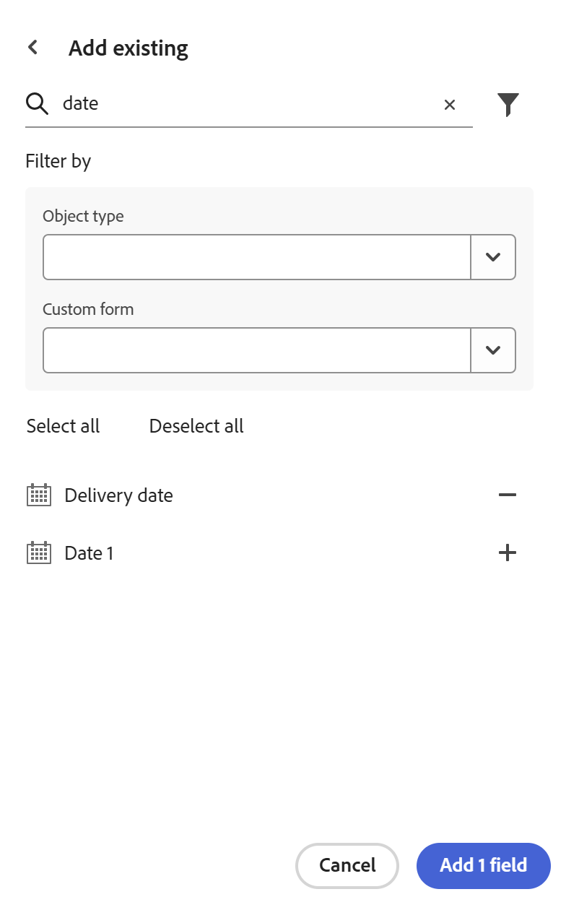

<!--add to TOC-->

# Importieren von Feldern aus Adobe Workfront

<!--The highlighted information on this page refers to functionality not yet generally available. It is available only in the Preview environment for all customers. After the monthly releases to Production, the same features are also available in the Production environment for customers who enabled fast releases.    

For information about fast releases, see [Enable or disable fast releases for your organization](/help/quicksilver/administration-and-setup/set-up-workfront/configure-system-defaults/enable-fast-release-process.md).   -->

{{planning-important-intro}}

Sie können Kopien bestehender Workfront-Felder importieren. Beim Importieren von Feldern aus Workfront wird von jedem Feld eine Kopie für einen Workfront Planning-Datensatztyp erstellt.

## Zugriffsanforderungen

+++ Erweitern Sie , um die Zugriffsanforderungen für die Funktion in diesem Artikel anzuzeigen. 

<table style="table-layout:auto"> 
<col> 
</col> 
<col> 
</col> 
<tbody> 
    <tr> 
<tr> 
</tr>   
<tr> 
   <td role="rowheader">
Adobe Workfront-Paket
</td> 
   <td> 

Beliebiges Workfront und beliebiges Planungspaket
 
Beliebiger Workflow und beliebiges Planungspaket

Weitere Informationen zu den einzelnen Workfront-Planungspaketen erhalten Sie von Ihrem Workfront-Kundenbetreuer. 
 
   </td> 
  <tr> 
   <td role="rowheader">
Adobe Workfront-Lizenz
</td> 
   <td>
Standard

   </td> 
  </tr> 
  <tr> 
   <td role="rowheader">
Objektberechtigungen
</td> 
   <td>   
Verwalten von Berechtigungen für einen Arbeitsbereich
  
   
Systemadministratoren haben Berechtigungen für alle Arbeitsbereiche, einschließlich der nicht erstellten
  </td> 
  </tr>  
</tbody> 
</table>

Weitere Informationen zu Zugriffsanforderungen für Workfront finden Sie unter [Zugriffsanforderungen in der Dokumentation zu Workfront](/help/quicksilver/administration-and-setup/add-users/access-levels-and-object-permissions/access-level-requirements-in-documentation.md).

+++  

<!--Old:

<table style="table-layout:auto"> 
<col> 
</col> 
<col> 
</col> 
<tbody> 
    <tr> 
<tr> 
<td> 
   
 Products
 </td> 
   <td> 
   <ul><li>
 Adobe Workfront
</li> 
   <li>
 Adobe Workfront Planning
</li></ul></td> 
  </tr>   
<tr> 
   <td role="rowheader">
Adobe Workfront plan*
</td> 
   <td> 

Any of the following Workfront plans:
 
<ul><li>Select</li> 
<li>Prime</li> 
<li>Ultimate</li></ul> 

Workfront Planning is not available for legacy Workfront plans
 
   </td> 
<tr> 
   <td role="rowheader">
Adobe Workfront Planning package*
</td> 
   <td> 

Any 
 

For more information about what is included in each Workfront Planning plan, contact your Workfront account manager. 
 
   </td> 
 <tr> 
   <td role="rowheader">
Adobe Workfront platform
</td> 
   <td> 

Your organization's instance of Workfront must be onboarded to the Adobe Unified Experience to be able to access Workfront Planning.
 

For more information, see <a href="/help/quicksilver/workfront-basics/navigate-workfront/workfront-navigation/adobe-unified-experience.md">Adobe Unified Experience for Workfront</a>. 
 
   </td> 
   </tr> 
  </tr> 
  <tr> 
   <td role="rowheader">
Adobe Workfront license*
</td> 
   <td>
 Standard 

   
Workfront Planning is not available for legacy Workfront licenses
 
  </td> 
  </tr> 
  <tr> 
   <td role="rowheader">
Access level configuration
</td> 
   <td> 
There are no access level controls for Adobe Workfront Planning
   
</td> 
  </tr> 
<tr> 
   <td role="rowheader">
Object permissions
</td> 
   <td>   
Manage permissions to a workspace and record type </a> 
  
   
System Administrators have permissions to all workspaces, including the ones they did not create.
 </td> 
  </tr> 
</tbody> 
</table> -->

## Überlegungen zum Importieren von Feldern aus Workfront

* In Workfront Planning können Sie native oder benutzerdefinierte Workfront-Felder in einen Datensatztyp importieren.
* Beim Importieren von Workfront-Feldern werden Kopien derselben Felder erstellt und der Feldname wird in Workfront Planning beibehalten. Nachdem sie in Workfront Planning kopiert wurden, sind die Felder von den Workfront-Originalfeldern unabhängig und geben keine Informationen weiter.
<!--check this: * You do not need permissions or access to Workfront objects to be able to add their fields to Workfront Planning. -->
* Sie können native oder benutzerdefinierte Felder aus den folgenden Workfront-Objekten hinzufügen:
   * Portfolio
   * Programm
   * Projekt
   * Aufgabe
   * Problem
   * Dokument
   * Firma
   * Gruppe
   * Benutzerin bzw. Benutzer
   * Aufgabengebiet
   * Zuweisung
   * Hour
   * Abrechnungseintrag
     <!--Available only to Preview, but might not come to Prod:* Rate card - visible in Production but asking PM if it should be hidden-->
   * Ausgabe
   * Wiederholung
     <!--* Non-labor resource - - visible in Production but asking PM if it should be hidden-->
     <!--* Non-labour resource category - - visible in Production but asking PM if it should be hidden-->
* Workfront-Felder behalten ihren Feldtyp möglicherweise nicht bei, nachdem sie in Workfront Planning importiert wurden.

  Die nachstehende Tabelle zeigt die Workfront-Feldtypen und den entsprechenden Workfront Planning-Feldtyp.

  | Workfront-Feldtyp | Workfront Planning-Feldtyp |
  |------------------------------------------|-------------------------------|
  | Textformatierter einzeiliger Text | Einzeiliger Text |
  | Zahlenformatierter einzeiliger Text | Zahl |
  | Währungsformatierter einzeiliger Text | Währung |
  | Absatz | Absatz |
  | Text mit Formatierung | Absatz |
  | Einfachauswahl-Dropdown | Einzelauswahl |
  | Mehrfachauswahl-Dropdown | Mehrfachauswahl |
  | Filter mit automatischer Textvervollständigung werden nicht unterstützt | Personen |
  | Berechnet* | Formel |
  | Datum | Datum |
  | Kontrollkästchen-Gruppe | Mehrfachauswahl |
  | Optionsfeld | Mehrfachauswahl |

  *Berechnete Felder stehen zu einem späteren Zeitpunkt zur Verfügung.
Alle anderen Workfront-Feldtypen werden in Workfront Planning nicht unterstützt.

## Felder aus Workfront importieren

<!--the first 3 steps are the same as in Create fields-->

{{step1-to-planning}}

1. Klicken Sie auf den Arbeitsbereich, für dessen Datensatztypen Sie Felder erstellen möchten.

   Der Arbeitsbereich wird geöffnet und die Datensatztypen werden angezeigt.

1. Klicken Sie auf die Karte eines Datensatztyps.

   Alle vorhandenen Datensätze, die mit dem Datensatztyp verknüpft sind, werden in den Zeilen der Tabellenansicht angezeigt.

   >[!TIP]
   >
   >    Einige Felder sind möglicherweise ausgeblendet. Klicken Sie **Felder** und aktivieren Sie den Umschalter für die Felder, die als Spalten in der Tabellenansicht angezeigt werden sollen.

1. Klicken Sie oben rechts in der Tabellenansicht auf das Symbol **+** .

   Oder

   Bewegen Sie den Mauszeiger über die Kopfzeile einer Spalte, klicken Sie auf den nach unten zeigenden Pfeil nach dem Feldnamen und klicken Sie dann auf **Links einfügen** oder **Rechts einfügen** um das neue Feld hinzuzufügen.
1. Klicken Sie **Vorhandenes** hinzufügen“ in der rechten unteren Ecke der Registerkarte **Neues Feld**. <!--check UI - did they change this??-->

   

1. Beginnen Sie mit der Eingabe des Namens eines bestehenden Workfront-Felds in den Suchbereich und klicken Sie dann auf **+**, wenn es in der Liste angezeigt wird.
1. (Optional) Geben Sie ein anderes Feld ein und klicken Sie dann auf **+**, wenn es in der Liste angezeigt wird.
1. (Optional) Klicken Sie auf **Filter**-Symbol  und aktualisieren Sie dann eines oder beide der folgenden Felder:

   * Objekttyp: Wählen Sie einen Workfront-Objekttyp aus, dessen Felder Sie importieren möchten.
   * Benutzerdefiniertes Formular: Wählen Sie ein oder mehrere benutzerdefinierte Formulare in Workfront aus. Sie können ein benutzerdefiniertes Formular auswählen, ohne zuerst einen Objekttyp auszuwählen.
1. Klicken Sie auf **+** und dann auf **Felder hinzufügen**.
Die Felder werden der Tabellenansicht und den Detailseiten der Datensätze hinzugefügt.

   >[!IMPORTANT]
   >
   >    Für jeden Datensatztyp sind maximal 500 Felder zulässig. Die vorhandenen Felder zusammen mit den importierten Feldern tragen zu dieser Beschränkung bei.

   Die hinzugefügten Felder sind Kopien der Workfront-Felder und stellen keine Verbindung mehr zu den Originalfeldern in Workfront her.
