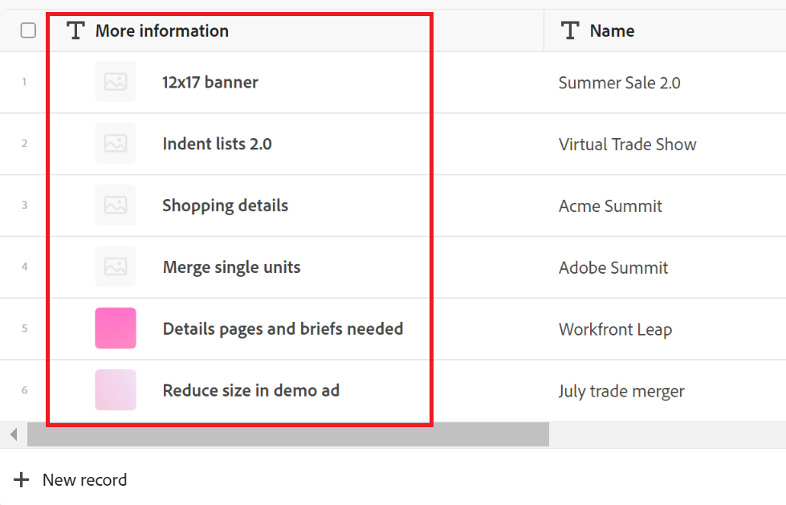

# Überblick über primäre Felder

<!--
The highlighted information on this page refers to functionality not yet generally available. It is available only in the Preview environment for all customers. After the release to Preview, the same features are also available monthly in the Production environment for customers who enabled fast releases.    

For information about fast releases, see [Enable or disable fast releases for your organization](/help/quicksilver/administration-and-setup/set-up-workfront/configure-system-defaults/enable-fast-release-process.md). 
-->

{{planning-important-intro}}

Das Primärfeld ist das Feld, das in der ersten Spalte einer Datensatztyp-Tabellenansicht in Adobe Workfront Planning angezeigt wird.

Standardmäßig ist das Namensfeld das primäre Feld. Sie können jedoch alle Felder der folgenden Typen als primäre Felder der Datensätze festlegen:

* Einzeiliges Textfeld
* Zahl
* Formel

Weitere Informationen zum Bestimmen eines Felds als primäres Feld finden Sie unter [Verwalten der Tabellenansicht](/help/quicksilver/planning/views/manage-the-table-view.md).

## Übersicht über Primärfelder

* Die Informationen in dem als primär gekennzeichneten Feld werden zum Titel eines Datensatzes.

  >[!NOTE]
  >
  >    Die Namen „Primärfeld“ und „Datensatztitel“ sind in Workfront Planning synonym. Bei der Anzeige des Datensatzes in der Tabellenansicht wird das &quot;Primäre Feld“ bevorzugt.

* Der Titel eines Datensatzes wird in den folgenden Bereichen angezeigt:

   * Der Kopfzeilenbereich der Seite und des Vorschaufelds des Datensatzes
   * Verbundene Datensatzfelder
   * Ansichten
* Das Primärfeld in der Tabellenansicht kann nicht verschoben, ausgeblendet oder gelöscht werden, es sei denn, Sie haben ein anderes Feld als Primärfeld festgelegt.
* Das primäre Feld ist immer gesperrt und es ist nicht Teil des horizontalen Bildlaufs der Tabellenansicht.
* Das Ändern des primären Felds in der Tabellenansicht wirkt sich auf die Ansicht für alle anderen Benutzenden aus, die es auswählen.
* Das Ändern des Primärfelds in einer Tabellenansicht wirkt sich auf alle Tabellenansichten des Datensatztyps aus.
* Der im primären Feld aufgeführte Wert ist immer mit der Seite des Datensatzes per Hyperlink verbunden.
* Wenn Sie über die Berechtigung Beitragen oder höhere Berechtigungen für einen Arbeitsbereich und einen Datensatztyp verfügen, können Sie den Wert von Primärfeldern mit Ausnahme von Formelfeldern bearbeiten. Formeln sind Berechnungen, die automatisch aktualisiert werden.
