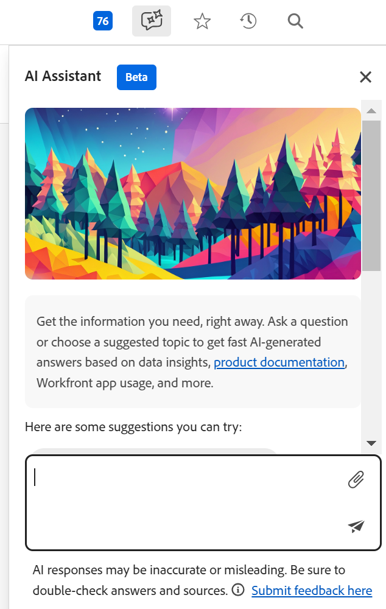

# Überblick über den KI-Assistenten von Adobe Workfront-Planung

<!--
The highlighted information on this page refers to functionality not yet generally available. It is available only in the Preview environment for all customers. After the monthly releases to Production, the same features are also available in the Production environment for customers who enabled fast releases.    

For information about fast releases, see [Enable or disable fast releases for your organization](/help/quicksilver/administration-and-setup/set-up-workfront/configure-system-defaults/enable-fast-release-process.md). 
-->

{{planning-important-intro}}

You can use the AI Assistant to generate, update, or remove records based on the current page context and record structure.

Die Benutzerbefehle und die Ausführung dieser Befehle durch die KI arbeiten zusammen, um sicherzustellen, dass die von der KI vorgenommenen Änderungen genau in Ihrer Umgebung widergespiegelt werden.

## Zugriffsanforderungen

+++ Erweitern, um die Zugriffsanforderungen für die in diesem Artikel beschriebene Funktionalität anzuzeigen. 

<table style="table-layout:auto"> 
<col> 
</col> 
<col> 
</col> 
<tbody> 
<tr> 
   <td role="rowheader">
Adobe Workfront-Pakete
</td> 
   <td> 

Beliebiges Workfront- und Planungspaket

Beliebiges Workflow- und Planungspaket

   </td> </tr>

</tr> 
  <tr> 
   <td role="rowheader">
Adobe Workfront-Lizenz
</td> 
   <td>
Standard
 
  </td> 
  </tr> 
  <tr> 
   <td role="rowheader">
Objektberechtigungen
</td> 
   <td>   
Verwalten von Berechtigungen für einen Arbeitsbereich</a> 
  
   
Systemadministratoren haben Berechtigungen für alle Arbeitsbereiche, einschließlich der nicht erstellten
  </td> 
  </tr>  
</tbody> 
</table>

Weitere Informationen zu Zugriffsanforderungen für Workfront finden Sie unter [Zugriffsanforderungen in der Dokumentation zu Workfront](/help/quicksilver/administration-and-setup/add-users/access-levels-and-object-permissions/access-level-requirements-in-documentation.md).

+++

## Considerations about the AI Assistant

* The AI Assistant must be enabled for your organization before it is available for users in your company. For information, see [AI Assistant overview](/help/quicksilver/workfront-basics/ai-assistant/ai-assistant-overview.md).
* After Workfront has enabled the AI Assistant for your organization, it is available for the main Workfront administrator. For information, see [Configure basic information for your system](/help/quicksilver/administration-and-setup/get-started-wf-administration/configure-basic-info.md).

* The Workfront administrator must enable the AI Assistant for all other users. Weitere Informationen finden Sie unter [Aktivieren oder Deaktivieren des KI-Assistenten](/help/quicksilver/workfront-basics/ai-assistant/enable-or-disable-assistant.md).

* Der KI-Assistent arbeitet im Kontext jeder Seite. Die Anfragen, die Sie für den KI-Assistenten senden, müssen auf Funktionen verweisen, die auf der geöffneten Seite verfügbar sind.

* Die vom KI-Assistenten im Bereich Planung durchgeführten Aktionen stehen im Kontext Ihrer Workfront-Planungsberechtigungen und Ihrer Workfront-Zugriffsebene. Weitere Informationen finden Sie in den folgenden Artikeln:

   * [Überblick über das Freigeben von Berechtigungen in Adobe Workfront-Planung](/help/quicksilver/planning/access/sharing-permissions-overview.md)
   * [Überblick über die Lizenztypen bei Verwendung von Adobe Workfront-Planung](/help/quicksilver/planning/access/license-type-overview.md)

* Änderungen, die der KI-Assistent im Auftrag des Benutzers vornimmt, werden im Verlaufsfenster des Datensatzes erfasst.

* Die vom KI-Assistenten durchgeführten Aktionen sind dauerhaft und könnten unumkehrbar sein. Das Löschen eines Felds kann beispielsweise nicht rückgängig gemacht werden. Überprüfen Sie alle vom KI-Assistenten vorgeschlagenen Aktionen, bevor Sie sie akzeptieren.

* Beim Erstellen, Aktualisieren oder Löschen eines Objekts über den KI-Assistenten zeigt der KI-Assistent die beabsichtigten Aktionen an und bittet um Bestätigung. Anschließend können Sie die Aktionen bestätigen oder abbrechen.

## Derzeit für den KI-Assistenten verfügbare Funktionen

Derzeit ist der KI-Assistent im Planungsbereich von Workfront für die folgenden Seiten verfügbar:

* Workspace-Seite
* Seite des Datensatztyps
* Seite aufzeichnen

Sie können den KI-Assistenten verwenden, um zu diesem Zeitpunkt die folgenden Aktionen auszuführen:

* Search for records. You can search by information contained in any record fields.
* Create records. An ID with a link to the new record displays after the record is created. You can specify the fields you want to update during the creation process, like dates or description.
* Create records based on a document that you upload. Workfront supports the following document formats for the AI Assistant:

  PPTX, PDF, DOCX, XLSX, PPT, DOC, TXT und die meisten Bildformate
* Aktualisieren Sie die Felder für die Datensätze, die Sie auf dem Bildschirm sehen
* Löschen von Einträgen
* Restore records that you just deleted

## Locate the AI Assistant in Workfront Planning

You can locate the AI Assistant in the following areas of Workfront Planning:

* Die Hauptnavigationsleiste in der oberen rechten Ecke des Bildschirms.
* Innerhalb des Detailbereichs eines Datensatzes, nachdem Sie den Datensatz in der Vorschau geöffnet oder nachdem Sie die Datensatzseite geöffnet haben.

## Zugriff auf den KI-Assistenten im Bereich Planung

1. Melden Sie sich bei Workfront an und klicken Sie dann oben links auf **&#x200B;**-Symbol  und dann auf **Planung**.

   Der Bereich Planung wird geöffnet.

1. Klicken Sie auf eine **Arbeitsbereichskarte**.

1. (Optional) Click a **record type card**.

1. (Optional) Click a **record** to open the record&#39;s **Details** page.

1. Click the **AI Assistant icon** in the upper-right corner of the screen in the global navigation bar or in the upper-right corner of the record&#39;s preview or page.

   

1. In the space provided, start typing commands for the AI Assistant, then click Enter when you are done.

   

   Sie können beispielsweise einen der folgenden Typen eingeben:

   * Erstellen Sie eine Kampagne mit dem Startdatum 4. Juli und dem Enddatum 30. Juli
   * Aktualisieren Sie das Feld Beschreibung des Sommerkampagnendatensatzes mit dem zu bestimmenden Datum
   * Delete the last record
   * Restore the record

   Während der Verarbeitung von Befehlen durch den KI-Assistenten wird ein visueller Indikator angezeigt, der Erwartungen für die Antwortzeit festlegt.

   Folgen Sie nach Erhalt einer erfolgreichen Antwort den angegebenen Links oder beachten Sie die Änderungen auf der linken Seite.

