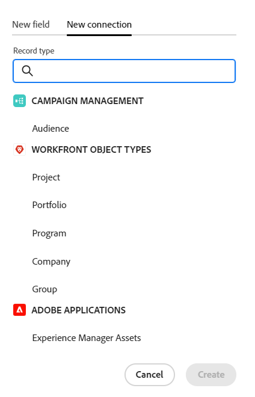
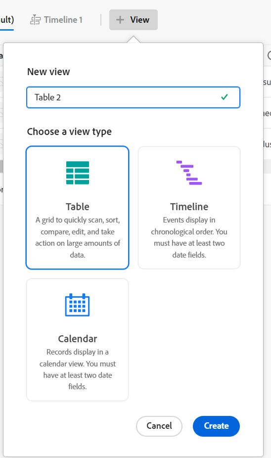
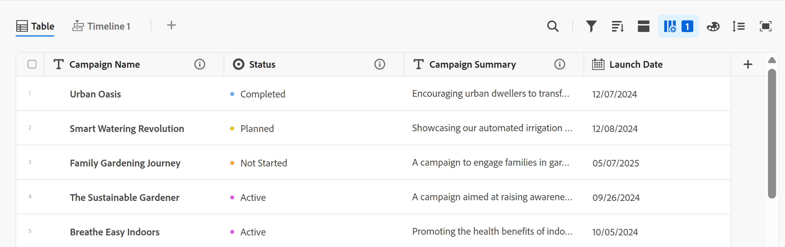

# Übersicht über die Adobe Workfront-Planung

<!--this article is linked to the WF Planning landing page - do not change URL or move it; send the team a new URL after we add the redirects for this page-->

<!--do not use the snippet for IMPORTANT as it links to this article-->

Die hervorgehobenen Informationen auf dieser Seite beziehen sich auf Funktionen, die noch nicht allgemein verfügbar sind. Sie ist nur in der Vorschau -Umgebung für alle Kunden verfügbar. Nach den monatlichen Releases in der Produktion stehen dieselben Funktionen auch in der Produktionsumgebung für Kunden zur Verfügung, die schnelle Releases aktiviert haben. 

Informationen zu Schnellversionen finden Sie unter [Aktivieren oder Deaktivieren von Schnellversionen für Ihre Organisation](/help/quicksilver/administration-and-setup/set-up-workfront/configure-system-defaults/enable-fast-release-process.md). 

>[!IMPORTANT]
>
>Die Informationen in diesem Artikel beziehen sich auf Adobe Workfront Planning, eine zusätzliche Funktion von Adobe Workfront.
>
>Sie müssen über Folgendes verfügen, um vollen Zugriff auf alle Funktionen in Workfront Planning zu erhalten:
>
>* Ein neues Workfront-Paket und eine neue Lizenz. Workfront Planning ist nicht für ältere Workfront-Pakete oder -Lizenzen verfügbar.
>* Ein Workfront-Planungspaket.
>* Die Workfront-Instanz Ihres Unternehmens muss in das einheitliche Adobe-Erlebnis integriert werden.
>
> Eine vollständige Liste der Anforderungen für den Zugriff auf Workfront Planning finden Sie unter [Zugriffsübersicht für Adobe Planning](/help/quicksilver/planning/access/access-overview.md).
> 

Dieser Artikel enthält allgemeine Informationen zur Planung von Workfront.

Eine vollständige Liste der Artikel mit der Dokumentation für Workfront Planning finden Sie unter [Adobe Workfront Planning: Artikelindex](/help/quicksilver/planning/planning-information.md).

## Einführung in Adobe Workfront Planning

Adobe Workfront Planning ist eine zusätzliche Funktion von Adobe Workfront. Workfront Planning dient dazu, einen umfassenden Überblick über die betrieblichen Details eines Unternehmens zu erhalten und wichtige geschäftliche Fragen in jeder Phase des Work-Management-Lebenszyklus zu beantworten.

Workfront Planning kann zum Beispiel folgende Fragen beantworten:

* Wie viele Kampagnen führen wir in EMEA im 4. Quartal durch?
* Gibt es Zielgruppenüberschneidungen zwischen gleichzeitigen Kampagnen?
* Wie gut sind die Aufklärungsprogramme im Moment?
* Wie sehen die Assets für eine bestimmte Kampagne aus? Welche von ihnen müssen noch genehmigt werden?

Um diese Fragen zu beantworten, benötigen Führungskräfte eine Lösung, die einen ganzheitlichen Überblick über alle Phasen der Arbeit bietet, von der Planung bis zur Ausführung, von der Bereitstellung bis zur Messung der Ergebnisse. Derzeit verfügen Unternehmen über Tools, die einige Teile des Prozesses abdecken können, aber viele haben keine gute Verbindung zu allen Arbeitsphasen und können auch keine zuverlässigen Ergebnisse liefern.

Im Folgenden finden Sie einige der Hauptfunktionen:

* Lösen Sie das Problem der Verwaltung der Arbeit über alle Phasen und für alle Stakeholder, die am Arbeitsprozess teilnehmen.
* Passen Sie Ihre Workflows vollständig an, von der Entscheidung, welche Objekttypen (oder Datensatztypen) Ihr Unternehmen verwendet, bis zur Konfiguration, wie diese Objekte miteinander verknüpft werden.
* Verknüpfen Sie Objekttypen aus anderen Systemen und erstellen Sie so ein kohärentes Framework für alle Ihre Prozesse.

<!--
## Currently available Workfront Planning features
(*****for GA just make a list of what features ARE included in Planning and eliminate the last 2 columns; also update the title of this section*****)

(*****at GA: update the link below to the new place for release notes *****)

For information about new features and when they are released, see [Adobe Workfront Planning release activity for 2024](/help/quicksilver/planning/general/release-activity.md). 

The following features are currently available in Workfront Planning:

* Create workspaces             
* Create record types             
* Create record custom fields             
(************ * Import record types and fields using an Excel or CSV file*****)
          
* Display records in a table view            
* Display records in a timeline view            
* Display records in a calendar view            
* Filter, sort, and group records in a table view
* Filter, group, and color code records in the timeline view
* Filter records in the calendar view 
* Search for records in the table and timeline views             
* Connect records that belong to the same workspace  
* Connect records that belong to different workspaces   
* Connect Workfront Planning records to Workfront projects, programs, portfolios, companies, groups             
* Connect Workfront Planning records to Adobe Experience Manager assets          
    You must have an Adobe Experience Manager Assets license and an integration between AEM Assets and Workfront.
    For information, see [Adobe Workfront for Experience Manager Assets and Assets Essentials: article index](/help/quicksilver/documents/adobe-workfront-for-experience-manager-assets-essentials/workfront-for-aem-asset-essentials.md). 
* View record information in the Details tab
* View record connections in the Connections tab
* Customize the layout of a record's page             
* Share workspaces             
* Share views             
* Share views publicly with any external resource, even people who are not Workfront users         
* Duplicate views             
* Submit requests to create records            
* Export record details to Word and PDF.
* Add comments to records             
* Receive in-app notifications             
* Receive email notifications             
* Add thumbnails and cover pages to records             
* View the history of changes on a record             
* Rich Text formatting for Paragraph fields             
* Access Planning records from Workfront objects             
* Connect and disconnect Planning records from Workfront objects 
* Create Planning records by submitting a request form            
* Workfront Planning public API             
* Adobe Workfront Planning modules for Adobe Workfront Fusion             
* Workfront Planning AI Assistant
* Reporting on Workfront Planning information
    You can report on Planning information using the Canvas Dashboard. For information, see [Canvas Dashboards overview](/help/quicksilver/reports-and-dashboards/canvas-dashboards/canvas-dashboards-overview.md). 

-->

<!--OLD: 

|       Feature                                      |     Available now  |     Coming soon   |     In research  |
|----------------------------------------------------|:-----------------------------:|:--------------------------------:|:----------------:|
|     Create workspaces                              |   ✓                           |                                  |                  |
|     Create record types                |   ✓                           |                                  |                  |
|     Create record custom fields                    |   ✓                           |                                  |                  |
|     Import record types and fields using an Excel  or CSV file                              |                              |           ✓                       |                  |
|     Link records                                   |   ✓                           |                                  |                  |
|     View records in a table                        |   ✓                           |                                  |                  |
|     View records in a timeline                     |   ✓                           |                                  |                  |
|     View records in a calendar                     |   ✓                           |                                  |                  |
|     Filter records                                 |   ✓                           |                                  |                  |
|     Group records in the timeline view             |   ✓                           |                                  |                  |
|     Group records in the table view                | ✓                              |                                 |                  |
|     Sort records in the table view                                 |  ✓                             |                                 |                  |
|     Sort records in the timeline view                                 |                               |   ✓                              |                  |
|     Sort groupings in the table view                                 |                               |   ✓                              |                  |
|     Sort groupings in the timeline view                                 |                               |   ✓                              |                  |
|   Search for records in the table view    | ✓    |   |
|   Search for records in the timeline view    | ✓    |   |
|     Connect Workfront Planning records to Workfront projects, programs, portfolios, companies, groups  |   ✓                            |                                 |                  |
|     Connect Workfront Planning records to Adobe Experience Manager assets                                  |      ✓                         |                                  |                 |
|     Connect Planning records from different workspaces                                  |      ✓                         |                                  |                 | 
|     Record page with detailed information                            |   ✓                           |                                  |                  |
|     Update the layout of the record's page              |    ✓                           |                                 |                  |
|  Share workspaces | ✓| |  |
|  Share views |✓ | |  |
|  Share views publicly with external resources |✓ | |  |
|  Duplicate views |✓ | |  |
|     Submit requests                                |                               |          ✓                        |                 |
|     Export record details to Word                                 |    ✓                           |                                  |                 |
|     Export record details to PDF                                 |                               |                                  |       ✓          |
|     Customize the color and icon of a record                                 |      ✓                         |                                  |                 |
|     Add comments to records                                 | ✓                              |                                  |                 |
|     Receive in-app notifications                                 | ✓                              |                                  |                 |
|     Receive email notifications                                 | ✓                              |                                  |                 |
|     Add thumbnails to records                                 | ✓                              |                                  |                 |
|     View history of changes on a record                                 | ✓                              |                                  |                 |
|     Rich Text formatting for Paragraph fields                                 |      ✓                         |                                  |                 | 
|     Adobe Workfront Planning modules for Adobe Workfront Fusion                                 |      ✓                         |                                  |                 | 
|     Copy and paste information from one field to another                                  |      ✓                         |                                  |                 | 
|     Access Planning records from Workfront objects                                  |      ✓                         |                                  |                 |
|     Connect Planning records from Workfront objects                                  |      ✓                         |                                  |                 |
|     Workfront Planning public API                                 |      ✓                         |                                  |                 |
|     Workfront Planning AI Assistant*                                 |      ✓                         |                                  |                 |
|     Reporting on Workfront Planning information (Canvas Dashboard)                              |                               |       ✓                           |                 |
-->

## Aktivieren von Workfront Planning für die Benutzer in Ihrer Workfront-Instanz

Nachdem Ihr Unternehmen ein Workfront Planning-Paket erworben hat, müssen Sie als Workfront-Administrator Folgendes sicherstellen, bevor Benutzerinnen und Benutzer auf Workfront Planning zugreifen können:

* Weisen Sie je nach verwendeter Umgebung den folgenden Benutzern eine Layout-Vorlage zu, die Planning im Hauptmenü enthält:

   * Weisen Sie in der Produktionsumgebung die Vorlage allen Benutzern aller Lizenztypen zu, einschließlich Systemadministratoren.

   * Weisen Sie in der Vorschau-Umgebung die Vorlage Benutzern von Light und Contribute zu. Für Standardbenutzer und Systemadministratoren ist die Planung standardmäßig aktiviert. 

  Weitere Informationen finden Sie unter [Anpassen des Hauptmenüs mithilfe einer Layout](/help/quicksilver/administration-and-setup/customize-workfront/use-layout-templates/customize-main-menu.md) und [Zuweisen von Benutzern zu einer Layout-Vorlage](/help/quicksilver/administration-and-setup/customize-workfront/use-layout-templates/assign-users-to-layout-template.md).

* Weisen Sie Benutzenden eine Workfront-Lizenz und Workfront Planning-Berechtigungen zu, mit denen sie in Workfront Planning Objekte anzeigen oder erstellen können. Weitere Informationen zum Gewähren des Zugriffs auf und zum Aktivieren anderer für die Verwendung von Workfront Planning finden Sie unter [Adobe Planning-Zugriffsübersicht](/help/quicksilver/planning/access/access-overview.md).

## Workfront-Planungsterminologie

Obwohl Workfront Planning Teil von Workfront ist, enthält es proprietäre Konzepte und Terminologie. Machen Sie sich mit diesen Konzepten vertraut, bevor Sie Workfront Planning für Ihr Unternehmen einrichten.

Das Framework für Workfront Planning ist vollständig anpassbar. Sie können alle Datensatztypen, ihre Attribute und alle ihnen zugeordneten Felder für die exakten Anforderungen Ihres Unternehmens erstellen.

Es gibt Einschränkungen für die Anzahl der Workfront Planning-Objekte, die Sie erstellen können. Weitere Informationen finden Sie unter [Übersicht über Adobe Workfront Planning-Objektbeschränkungen](/help/quicksilver/planning/general/limitations-overview.md).

Im Folgenden finden Sie die wichtigsten Workfront-Planungsobjekte und -konzepte:

* **Workspace**: Eine Sammlung von Datensatztypen, die den Betriebslebenszyklus eines bestimmten Unternehmens definieren. Ein Arbeitsbereich ist der Arbeitsrahmen einer Organisationseinheit.

  

  Weitere Informationen finden Sie unter [Erstellen von Arbeitsbereichen](/help/quicksilver/planning/architecture/create-workspaces.md).

* **Datensatztyp**: Der Name von Objekttypen in Workfront Planning.

  Datensatztypen befüllen Arbeitsbereiche.

  Im Gegensatz zu Workfront, wo die Objekttypen vordefiniert sind, können Sie in Workfront Planning Ihre eigenen Objekttypen erstellen.

  In Workfront werden beispielsweise die Objekttypen „Programm“, &quot;Portfolio&quot;, „Projekt“, „Aufgabe“ oder „Problem“ bereits erstellt.

  In Workfront Planning können Sie beliebige Datensatztypen erstellen, die den Workflows Ihres Unternehmens entsprechen. Später können Sie definieren, wie die Datensatztypen miteinander oder mit Formularabhängigkeiten in Beziehung stehen.

  Weitere Informationen finden Sie unter [Datensatztypen - Übersicht](/help/quicksilver/planning/architecture/overview-of-record-types.md).

* **Record**: Eine Instanz eines Datensatztyps.

  

  Nachdem Sie einem Arbeitsbereich einen Datensatztyp hinzugefügt haben, können Sie damit beginnen, Datensätze dieses Typs auf der Seite des Datensatztyps hinzuzufügen.

  Beispiel: „Kampagne“ kann ein Datensatztyp sein und „Sommerkampagne für EMEA“ ist ein Datensatz des Datensatztyps der Kampagne.

  Weitere Informationen finden Sie unter [Einträge erstellen](/help/quicksilver/planning/records/create-records.md).

* **Workspace-Vorlage**: Sie können einen Arbeitsbereich mithilfe vordefinierter Vorlagen erstellen. Sie können die vordefinierten Datensatztypen und Felder in einer Vorlage verwenden oder eigene hinzufügen.

  

  Adobe Workfront Planning enthält die folgenden Vorlagen:

   * Einfach: Marketing-Verwaltung
   * Erweitert: Marketing-Verwaltung
   * Unternehmen: Marketing-Management
   * Vertriebsleitung
   * Produktverwaltung

  Weitere Informationen finden Sie unter [Liste der Arbeitsbereichsvorlagen](/help/quicksilver/planning/architecture/workspace-templates.md).

* **Felder**: Felder sind Attribute, die Sie Datensatztypen hinzufügen können. Felder enthalten Informationen über den Datensatztyp. <!--check the shot below, "Connection" needs to be in lowercase-->

  

  Überlegungen zu Datensatzfeldern:

   * Die Felder, die Sie für einen Datensatztyp hinzufügen, werden automatisch mit allen Datensätzen dieses Typs verknüpft und können verwendet werden, um Daten über diese Datensätze zu erfassen.

   * Felder werden als Spalten in der Tabellenansicht angezeigt, die auf eine Datensatztypseite angewendet wird. Sie werden auch auf der Datensatzseite angezeigt.

   * Felder sind für einen Datensatztyp eindeutig und werden nicht von einem Datensatztyp in einen anderen übertragen.

   * Felder können vollständig angepasst werden und sind nur in Workfront Planning verfügbar. Sie können über Workfront nicht auf Workfront Planning-Felder zugreifen.

  Weitere Informationen finden Sie unter [Felder erstellen](/help/quicksilver/planning/fields/create-fields.md).

  Standardmäßig ist ein neuer Datensatztyp mit den folgenden vordefinierten Feldern verknüpft:

   * Name
   * Beschreibung
   * Startdatum
   * Enddatum
   * Status

  Sie können benutzerdefinierte Felder der folgenden Typen erstellen:

   * Einzeiliger Text
   * Absatz
   * Mehrfachauswahl
   * Einzelauswahl
   * Datum
   * Zahl
   * Prozentsatz
   * Währung
   * Kontrollkästchen
   * Formel
   * Personen
   * Erstellt von
   * Erstellungsdatum
   * Zuletzt geändert von
   * Zuletzt geändert am

* **Verbundene Datensatztypen**, **Verbundene Datensätze** und **Verbundene Felder**: In Workfront Planning können Sie eine Verbindung zwischen den folgenden Entitäten erstellen:

   * Zwei Workfront Planning-Datensatztypen.
   * Ein Datensatztyp und ein Workfront-Projekt-, -Programm-, -Portfolio-, -Unternehmens- oder -Gruppenobjekttyp.
   * Einen Datensatztyp und ein Adobe Experience Manager-Asset oder -Ordner.

     Sie müssen über eine Adobe Experience Manager-Lizenz verfügen, um Datensatztypen mit Experience Manager-Objekten zu verbinden.

     

  Nachdem Sie eine Verbindung zwischen den Datensatztypen hergestellt haben, können Sie einzelne Datensätze oder Objekte dieser Typen miteinander verbinden. Die Verbindung zwischen den Datensätzen wird als verbundenes Datensatzfeld oder als Verbindung angezeigt.

  Das Verbinden von Datensatztypen ist hilfreich, wenn sich mehrere Typen von Arbeitsobjekten gegenseitig beeinflussen. Sie können beispielsweise mit Kampagnen arbeiten, wobei jede Kampagne mehreren Marken gerecht werden kann. Um diese Beziehung anzugeben, können Sie Kampagnen mit Marken verbinden. Darüber hinaus kann es sein, dass die Arbeit für jede Kampagne in mehreren Projekten in Workfront geplant wird. Um dies anzuzeigen, können Sie die Kampagnen mit den entsprechenden Projekten verbinden. Durch das Verbinden von Datensatztypen und das anschließende Verbinden einzelner Datensätze wird diese Beziehung in Workfront Planning erreicht.

* **Suchfelder** (oder verknüpfte Felder): Nachdem Sie die Verbindung zwischen zwei Datensatztypen hergestellt und einzelne Datensätze miteinander verbunden haben, können Sie die Felder der verbundenen Datensätze aus dem Datensatz referenzieren, von dem aus Sie eine Verbindung herstellen.

  Wenn Sie beispielsweise einen Campaign-Datensatztyp mit einem Workfront-Projektobjekttyp verbinden, können Sie das Budgetfeld der verbundenen Projekte in den Kampagnendatensätzen anzeigen.

  

  >[!TIP]
  >
  > Die folgenden Feldtypen können nicht als Suchfelder aus den verbundenen Datensatz- oder Objekttypen hinzugefügt werden:
  >
  >* Personen
  >* Erstellt von
  >* Zuletzt geändert von
  >* Workfront-Felder mit automatischer Textvervollständigung (einschließlich Feldern wie Projektbesitzer oder Projektsponsor)

  Informationen zum Verbinden von Datensatztypen, Datensätzen und Erstellen verknüpfter Felder finden Sie in den folgenden Artikeln:

   * [Verbinden von Datensatztypen](/help/quicksilver/planning/architecture/connect-record-types.md)
   * [Datensätze verbinden](/help/quicksilver/planning/records/connect-records.md)

<!--not yet:* Fields are reusable across Record Types.  -->

* **Ansichten**: Datensätze werden auf verschiedenen Ansichtstypen unter der entsprechenden Seite für den Datensatztyp angezeigt.

  

  Ansichten enthalten personalisierte Einstellungen eines bestimmten Ansichtstyps, z. B. die Liste von Feldern (Spalten), eine Liste von Datensätzen (Zeilen), ihre Reihenfolge (Sortierung), einen angewendeten oder anwendbaren Filter und eine Gruppierung.

  Im Folgenden finden Sie Ansichtstypen, die Sie auf die Seite „Datensatztyp“ anwenden können:

   * **Tabellenansicht** Zeigt Datensätze und ihre Felder, einschließlich verbundener und Lookup-Felder, in einem Tabellenformat an. Die Zeilen der Tabelle sind die einzelnen Datensätze, und die Spalten sind die Datensatzfelder. Die Tabellenansicht ist die Standardansicht.

     

   * **Zeitleisten-Ansicht**: Zeigt Datensätze an, die mindestens zwei Datumsfelder in einer chronologischen Zeitleiste aufweisen. In der Zeitleisten -Ansicht können bis zu 5 miteinander verbundene Datensatztypen und deren Datensätze angezeigt werden.

     

   * **Kalenderansicht** Zeigt Datensätze mit mindestens zwei Feldern vom Typ Datum in einem Kalenderformat an.

     

Weitere Informationen finden Sie unter [Verwalten von Datensatzansichten](/help/quicksilver/planning/views/manage-record-views.md).

## Adobe Workfront-Planung suchen

Um Adobe Planning zu finden, stellen Sie sicher, dass Ihr Unternehmen Zugriff auf Workfront Planning erhalten hat und dass Ihr System- oder Gruppenadministrator den Bereich Planning zum Hauptmenü hinzugefügt hat. Weitere Informationen finden Sie unter [Adobe Planning-Zugriffsübersicht](/help/quicksilver/planning/access/access-overview.md).

So suchen Sie Workfront Planning:

1. Melden Sie sich bei Workfront an.

{{step1-click-main-menu}}

1. Klicken Sie **Planung** .

   Die Hauptseite von Workfront Planning wird geöffnet.

   

   >[!TIP]
   >
   >    Ihr Workfront-Administrator kann der Option Landingpage auswählen in Ihrer Layout-Vorlage den Bereich Planung hinzufügen, sodass Sie Planning öffnen können, sobald Sie sich bei Workfront anmelden. Weitere Informationen finden Sie unter [Anpassen der Landingpage mithilfe einer Layout-Vorlage](/help/quicksilver/administration-and-setup/customize-workfront/use-layout-templates/customize-landing-page.md).

1. (Bedingt und optional) Wenn Sie Workfront-Administrator sind, klicken Sie auf eine der folgenden Registerkarten:
   * **Arbeitsbereiche, an denen ich mitwirke**: Zeigt von Ihnen erstellte Arbeitsbereiche oder Arbeitsbereiche an, die für Sie freigegeben sind.
   * **Andere Arbeitsbereiche**: Zeigt alle anderen Arbeitsbereiche im System an.

   Für alle anderen Benutzer werden die von ihnen erstellten oder für sie freigegebenen Arbeitsbereiche im Bereich **Arbeitsbereiche** angezeigt.

1. (Optional und empfohlen) Fahren Sie mit einigen der folgenden Aktionen fort, um Ihre Arbeitsstruktur zu erstellen:

   1. Erstellen Sie einen neuen Arbeitsbereich mithilfe einer Vorlage. Weitere Informationen finden Sie unter [Erstellen von Arbeitsbereichen](/help/quicksilver/planning/architecture/create-workspaces.md).

   1. Fügen Sie dem neuen Arbeitsbereich Abschnitte hinzu. Weitere Informationen finden Sie unter [Arbeitsbereiche bearbeiten](/help/quicksilver/planning/architecture/edit-workspaces.md).
   1. Umbenennen der vorhandenen Abschnitte im neuen Arbeitsbereich.
   1. Datensatztypen zum neuen Arbeitsbereich hinzufügen. Weitere Informationen finden Sie [Datensatztypen erstellen](/help/quicksilver/planning/architecture/create-record-types.md).

   1. Klicken Sie auf den Namen eines Datensatztyps, um die Seite des Datensatztyps zu öffnen. Die Seite „Datensatztyp“ wird standardmäßig in der Tabellenansicht geöffnet.

      Sie können auch eine Timeline- oder eine Kalenderansicht erstellen. Weitere Informationen finden Sie unter [Verwalten von Datensatzansichten](/help/quicksilver/planning/views/manage-record-views.md).

   1. Beginnen Sie in der Tabellenansicht mit dem Hinzufügen von Datensätzen, indem Sie Zeilen hinzufügen

      Oder

      Datensatzfelder durch Hinzufügen von Spalten hinzufügen.

      Weitere Informationen finden Sie in den folgenden Artikeln:

      * [Erstellen von Datensätzen](/help/quicksilver/planning/records/create-records.md)
      * [Felder erstellen](/help/quicksilver/planning/fields/create-fields.md).

## Workfront Planning-Versionsaktivität

<!--update this with the new release activity page - the article index for all Planning releases-->

Wir veröffentlichen regelmäßig neue Funktionen für Workfront Planning.

Eine aktuelle Liste der veröffentlichten Funktionen finden Sie unter [Adobe Workfront Planning Release-Aktivität: Artikelindex](/help/quicksilver/product-announcements/product-releases/planning-release-activity/planning-release-activity-article-index.md).

## Zusätzliche Ressourcen für die Workfront-Planung

* [Adobe Workfront Planning: Artikelindex](/help/quicksilver/planning/planning-information.md): Ein Index aller Artikel, die Dokumentationen zu Workfront Planning enthalten, gruppiert nach Interessenbereich.
* [Übersicht über den Adobe Workfront Planning AI-Assistenten](/help/quicksilver/planning/general/planning-ai-assistant-overview.md): Mit dem Workfront AI-Assistenten für Planning können Sie nach Datensätzen suchen oder Datensätze erstellen, aktualisieren und löschen, indem Sie Befehle verwenden und den Assistenten die Arbeit für Sie erledigen lassen.
  <!--
    >[!NOTE]
    >
    >    The Workfront AI Assistant has been temporarily removed and it will be available at a later date.-->

* [Adobe Workfront-Planungsmodule für Workfront Fusion](https://experienceleague.adobe.com/de/docs/workfront-fusion/using/references/apps-and-their-modules/adobe-connectors/workfront-planning-modules): Mit den Adobe Workfront-Planungsmodulen können Sie Trigger erstellen, wenn in Workfront Planning Ereignisse auftreten. Sie können auch Datensätze erstellen, lesen, aktualisieren und löschen oder einen benutzerdefinierten API-Aufruf an Ihr Adobe Workfront Planning-Konto durchführen.

* [Grundlagen der Adobe Workfront Planning-](/help/quicksilver/planning/general/planning-api-basics.md): Ziel der Adobe Workfront Planning-API ist es, die Erstellung von Integrationen mit Planning zu vereinfachen, indem eine REST-ful-Architektur eingeführt wird, die über HTTP ausgeführt wird.

* **Berichterstellungsfunktionen für Workfront Planning**: Sie können jetzt mithilfe des Workfront Canvas-Dashboards Workfront-Planungsinformationen in einem Bericht in Workfront anzeigen. Weitere Informationen finden Sie unter [Übersicht über Canvas-Dashboards](/help/quicksilver/reports-and-dashboards/canvas-dashboards/canvas-dashboards-overview.md).

