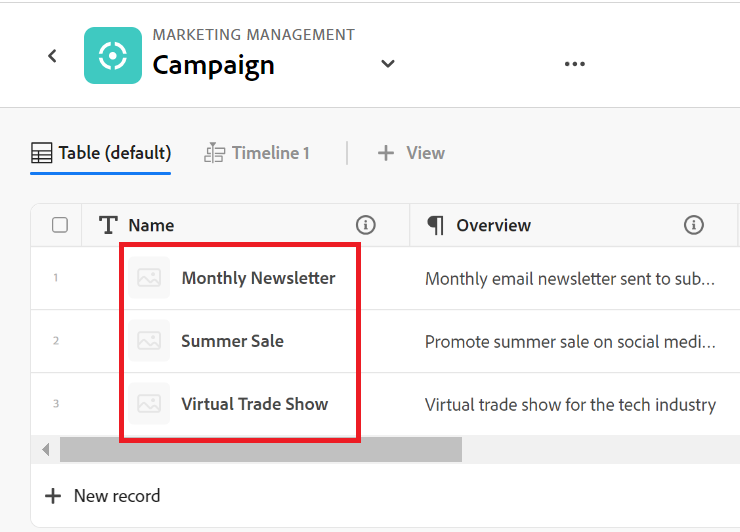
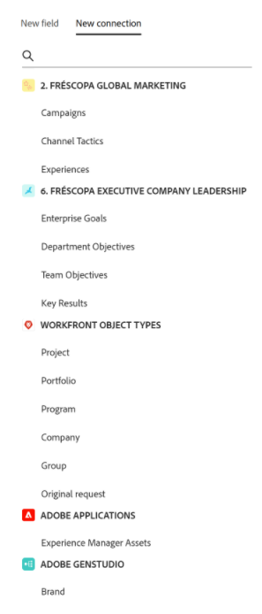
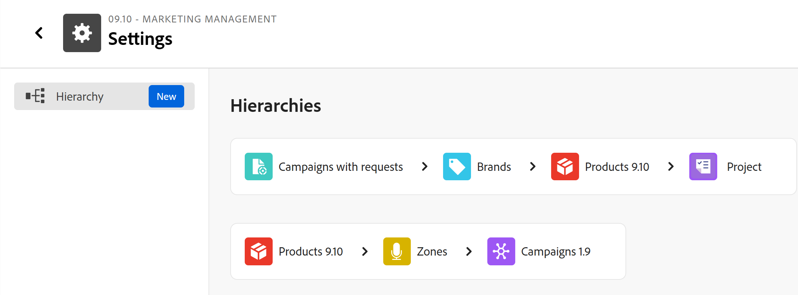

# Erste Schritte mit Adobe Workfront-Planung

<!--this article is linked to the WF Planning landing page - do not change URL or move it; send the team a new URL after we add the redirects for this page-->

<!--do not use the snippet for IMPORTANT as it links to this article-->

Die hervorgehobenen Informationen auf dieser Seite beziehen sich auf Funktionen, die noch nicht allgemein verfügbar sind. Sie ist nur in der Vorschau -Umgebung für alle Kunden verfügbar. Nach den monatlichen Releases in der Produktion stehen dieselben Funktionen auch in der Produktionsumgebung für Kunden zur Verfügung, die schnelle Releases aktiviert haben. 

Informationen zu Schnellversionen finden Sie unter [Aktivieren oder Deaktivieren von Schnellversionen für Ihre Organisation](/help/quicksilver/administration-and-setup/set-up-workfront/configure-system-defaults/enable-fast-release-process.md). 

>[!IMPORTANT]
>
>Die Informationen in diesem Artikel beziehen sich auf Adobe Workfront-Planung, eine zusätzliche Funktion von Adobe Workfront.
>
>Eine Liste der Anforderungen für den Zugriff auf Workfront-Planung finden Sie unter [Überblick über den Zugriff auf Adobe Workfront-Planung](/help/quicksilver/planning/access/access-overview.md).

Dieser Artikel enthält allgemeine Informationen zu Workfront-Planung.

Eine vollständige Liste der Artikel mit Dokumentationen zu Workfront Planning finden Sie unter [Allgemeine Informationen und Artikelindex für Adobe Workfront Planning](/help/quicksilver/planning/planning-information.md).

## Einführung in Adobe Workfront-Planung

Adobe Workfront-Planung ist eine zusätzliche Funktion von Adobe Workfront. Der Zweck von Workfront-Planung besteht darin, Ihnen umfassende Einblicke in die betrieblichen Details einer Organisation zu liefern und Antworten auf wichtige geschäftliche Fragen in jeder Phase des Work-Management-Zyklus zu geben.

Workfront-Planung kann zum Beispiel folgende Fragen beantworten:

* Wie viele Kampagnen führen wir in EMEA im 4. Quartal durch?
* Gibt es Überschneidungen bei Zielgruppen zwischen gleichzeitigen Kampagnen?
* Wie gut laufen die Bekanntheitsgrad-Programme derzeit?
* Wie sehen die Assets für eine bestimmte Kampagne aus? Welche davon müssen noch genehmigt werden?

Um diese Fragen zu beantworten, benötigen Führungskräfte eine Lösung, die einen ganzheitlichen Überblick über alle Phasen der Arbeit bietet, von der Planung bis zur Ausführung, von der Bereitstellung bis zur Messung der Ergebnisse. Derzeit verfügen Organisationen über Tools, die einige Teile des Prozesses abdecken können, viele haben jedoch keine gute Verbindung zu allen Arbeitsphasen und können auch keine zuverlässigen Ergebnisse liefern.

Im Folgenden finden Sie einige der Hauptfunktionen:

* Lösung des Problems der Verwaltung der Arbeit über alle Phasen hinweg und für alle Verantwortlichen, die am Arbeitsprozess beteiligt sind.
* Vollständige Anpassung Ihrer Workflows, von der Entscheidung, welche Objekttypen (oder Eintragstypen) Ihre Organisation verwendet, bis zur Konfiguration, wie diese Objekte miteinander verknüpft werden.
* Verknüpfung mit Objekttypen aus anderen Systemen und somit Erstellung eines kohärenten Frameworks für alle Ihre Prozesse.

<!--
## Currently available Workfront Planning features
(*****for GA just make a list of what features ARE included in Planning and eliminate the last 2 columns; also update the title of this section*****)

(*****at GA: update the link below to the new place for release notes *****)

For information about new features and when they are released, see [Adobe Workfront Planning release activity for 2024](/help/quicksilver/planning/general/release-activity.md). 

The following features are currently available in Workfront Planning:

* Create workspaces             
* Create record types             
* Create record custom fields             
(************ * Import record types and fields using an Excel or CSV file*****)
          
* Display records in a table view            
* Display records in a timeline view            
* Display records in a calendar view            
* Filter, sort, and group records in a table view
* Filter, group, and color code records in the timeline view
* Filter records in the calendar view 
* Search for records in the table and timeline views             
* Connect records that belong to the same workspace  
* Connect records that belong to different workspaces   
* Connect Workfront Planning records to Workfront projects, programs, portfolios, companies, groups             
* Connect Workfront Planning records to Adobe Experience Manager assets          
    You must have an Adobe Experience Manager Assets license and an integration between AEM Assets and Workfront.
    For information, see [Adobe Workfront for Experience Manager Assets and Assets Essentials: article index](/help/quicksilver/documents/adobe-workfront-for-experience-manager-assets-essentials/workfront-for-aem-asset-essentials.md). 
* View record information in the Details tab
* View record connections in the Connections tab
* Customize the layout of a record's page             
* Share workspaces             
* Share views             
* Share views publicly with any external resource, even people who are not Workfront users         
* Duplicate views             
* Submit requests to create records            
* Export record details to Word and PDF.
* Add comments to records             
* Receive in-app notifications             
* Receive email notifications             
* Add thumbnails and cover pages to records             
* View the history of changes on a record             
* Rich Text formatting for Paragraph fields             
* Access Planning records from Workfront objects             
* Connect and disconnect Planning records from Workfront objects 
* Create Planning records by submitting a request form            
* Workfront Planning public API             
* Adobe Workfront Planning modules for Adobe Workfront Fusion             
* Workfront Planning AI Assistant
* Reporting on Workfront Planning information
    You can report on Planning information using the Canvas Dashboard. For information, see [Canvas Dashboards overview](/help/quicksilver/reports-and-dashboards/canvas-dashboards/canvas-dashboards-overview.md). 

-->

<!--OLD: 

|       Feature                                      |     Available now  |     Coming soon   |     In research  |
|----------------------------------------------------|:-----------------------------:|:--------------------------------:|:----------------:|
|     Create workspaces                              |   ✓                           |                                  |                  |
|     Create record types                |   ✓                           |                                  |                  |
|     Create record custom fields                    |   ✓                           |                                  |                  |
|     Import record types and fields using an Excel  or CSV file                              |                              |           ✓                       |                  |
|     Link records                                   |   ✓                           |                                  |                  |
|     View records in a table                        |   ✓                           |                                  |                  |
|     View records in a timeline                     |   ✓                           |                                  |                  |
|     View records in a calendar                     |   ✓                           |                                  |                  |
|     Filter records                                 |   ✓                           |                                  |                  |
|     Group records in the timeline view             |   ✓                           |                                  |                  |
|     Group records in the table view                | ✓                              |                                 |                  |
|     Sort records in the table view                                 |  ✓                             |                                 |                  |
|     Sort records in the timeline view                                 |                               |   ✓                              |                  |
|     Sort groupings in the table view                                 |                               |   ✓                              |                  |
|     Sort groupings in the timeline view                                 |                               |   ✓                              |                  |
|   Search for records in the table view    | ✓    |   |
|   Search for records in the timeline view    | ✓    |   |
|     Connect Workfront Planning records to Workfront projects, programs, portfolios, companies, groups  |   ✓                            |                                 |                  |
|     Connect Workfront Planning records to Adobe Experience Manager assets                                  |      ✓                         |                                  |                 |
|     Connect Planning records from different workspaces                                  |      ✓                         |                                  |                 |
|     Record page with detailed information                            |   ✓                           |                                  |                  |
|     Update the layout of the record's page              |    ✓                           |                                 |                  |
|  Share workspaces | ✓| |  |
|  Share views |✓ | |  |
|  Share views publicly with external resources |✓ | |  |
|  Duplicate views |✓ | |  |
|     Submit requests                                |                               |          ✓                        |                 |
|     Export record details to Word                                 |    ✓                           |                                  |                 |
|     Export record details to PDF                                 |                               |                                  |       ✓          |
|     Customize the color and icon of a record                                 |      ✓                         |                                  |                 |
|     Add comments to records                                 | ✓                              |                                  |                 |
|     Receive in-app notifications                                 | ✓                              |                                  |                 |
|     Receive email notifications                                 | ✓                              |                                  |                 |
|     Add thumbnails to records                                 | ✓                              |                                  |                 |
|     View history of changes on a record                                 | ✓                              |                                  |                 |
|     Rich Text formatting for Paragraph fields                                 |      ✓                         |                                  |                 |
|     Adobe Workfront Planning modules for Adobe Workfront Fusion                                 |      ✓                         |                                  |                 |
|     Copy and paste information from one field to another                                  |      ✓                         |                                  |                 |
|     Access Planning records from Workfront objects                                  |      ✓                         |                                  |                 |
|     Connect Planning records from Workfront objects                                  |      ✓                         |                                  |                 |
|     Workfront Planning public API                                 |      ✓                         |                                  |                 |
|     Workfront Planning AI Assistant*                                 |      ✓                         |                                  |                 |
|     Reporting on Workfront Planning information (Canvas Dashboard)                              |                               |       ✓                           |                 |
-->

## Aktivieren von Workfront-Planung für die Benutzenden in Ihrer Workfront-Instanz

Nachdem Ihre Organisation ein Workfront-Planung-Paket erworben hat, müssen Sie als Workfront-Admin Folgendes sicherstellen, bevor Benutzende auf Workfront-Planung zugreifen können:

* Weisen Sie folgenden Benutzenden eine Layout-Vorlage zu, bei der Planung im Hauptmenü enthalten ist:

   * Weisen Sie die Layout-Vorlage Benutzenden mit Lizenztyp „Light“ oder „Mitwirkender“ zu.

     Für Standard-Benutzende und Systemadmins ist Planung standardmäßig aktiviert.

  Weitere Informationen finden Sie unter [Anpassen des Hauptmenüs mithilfe einer Layout-Vorlage](/help/quicksilver/administration-and-setup/customize-workfront/use-layout-templates/customize-main-menu.md) und [Zuweisen von Benutzenden zu einer Layout-Vorlage](/help/quicksilver/administration-and-setup/customize-workfront/use-layout-templates/assign-users-to-layout-template.md).

* Weisen Sie Benutzenden eine Workfront-Lizenz und Berechtigungen für Workfront-Planung zu, mit denen sie in Workfront-Planung Objekte anzeigen oder erstellen können. Weitere Informationen zum Gewähren des Zugriffs auf und zum Aktivieren anderer für die Verwendung von Workfront-Planung finden Sie unter [Überblick über den Zugriff auf Adobe Workfront-Planung](/help/quicksilver/planning/access/access-overview.md).

## Terminologie von Workfront-Planung

Obwohl Workfront-Planung ein Teil von Workfront ist, verfügt es über proprietäre Konzepte und eigene Terminologie. Machen Sie sich mit diesen Konzepten vertraut, bevor Sie Workfront-Planung für Ihre Organisation einrichten.

Das Framework für Workfront-Planung ist vollständig anpassbar. Sie können alle Eintragstypen, ihre Attribute und alle diesen zugeordneten Felder für die genauen Anforderungen Ihrer Organisation erstellen.

Es gibt Einschränkungen im Hinblick auf die Anzahl der Workfront-Planung-Objekte, die Sie erstellen können. Weitere Informationen finden Sie unter [Überblick über Objektbeschränkungen für Adobe Workfront-Planung](/help/quicksilver/planning/general/limitations-overview.md).

Im Folgenden finden Sie die wichtigsten Objekte und Konzepte von Workfront-Planung:

* [Arbeitsbereiche](#workspaces)
* [Eintragstypen](#record-types)
* [Einträge](#records)
* [Arbeitsbereichsvorlagen](#workspace-templates)
* [Felder](#fields)
* [Verbundene Datensatztypen, Datensätze und Felder](#connected-record-types-records-and-fields)
* [Felder nachschlagen](#lookup-fields)
* [Hierarchien](#hierarchies)
* [Ansichten ](#views)
* [Automatisierungen](#automations)
* [Antragsformulare](#request-forms)

### Arbeitsbereiche

Arbeitsbereiche stellen den Rahmen einer Organisationseinheit dar. Es handelt sich um Sammlungen von Datensatztypen, die den Betriebslebenszyklus einer bestimmten Organisation definieren.

Weitere Informationen finden Sie unter [Erstellen von Arbeitsbereichen](/help/quicksilver/planning/architecture/create-workspaces.md).

### Eintragstypen

Datensatztypen sind die Objekttypen in Workfront Planning.

Eintragstypen befüllen Arbeitsbereiche.

Anders als bei Workfront, wo die Objekttypen vordefiniert sind, können Sie in Workfront-Planung Ihre eigenen Objekttypen erstellen.

In Workfront sind beispielsweise die Objekttypen „Programm“, „Portfolio“, „Projekt“, „Aufgabe“ oder „Problem“ bereits erstellt.

In Workfront-Planung können Sie beliebige Eintragstypen erstellen, die den Workflows Ihrer Organisation entsprechen. Später können Sie definieren, wie die Eintragstypen miteinander in Beziehung stehen oder Abhängigkeiten bilden.

Weitere Informationen finden Sie unter [Überblick über Eintragstypen](/help/quicksilver/planning/architecture/overview-of-record-types.md).

### Einträge

Ein Datensatz ist eine Instanz eines Datensatztyps.

Nachdem Sie einem Arbeitsbereich einen Eintragstyp hinzugefügt haben, können Sie damit beginnen, Einträge dieses Typs auf der Seite des Eintragstyps hinzuzufügen.

Beispiel: „Kampagne“ kann ein Eintragstyp sein und „Sommerkampagne für EMEA“ ist ein Eintrag des Eintragstyps „Kampagne“.

Weitere Informationen finden Sie unter [Erstellen von Einträgen](/help/quicksilver/planning/records/create-records.md).

### Arbeitsbereichsvorlagen

Sie können einen Arbeitsbereich mithilfe vordefinierter Vorlagen erstellen. Sie können die vordefinierten Eintragstypen und Felder in einer Vorlage verwenden oder eigene hinzufügen.

Adobe Workfront-Planung enthält die folgenden Vorlagen:

* Basis: Marketing-Management
* Erweitert: Marketing-Management
* Enterprise: Marketing-Management
* Vertriebs-Management
* Produkt-Management

Weitere Informationen finden Sie unter [Liste der Arbeitsbereichsvorlagen](/help/quicksilver/planning/architecture/workspace-templates.md).

### Felder

Felder sind Attribute, die Sie Datensatztypen hinzufügen können. Felder enthalten Informationen über den Datensatztyp.

Überlegungen zu Eintragsfeldern:

* Die Felder, die Sie für einen Eintragstyp hinzufügen, werden automatisch mit allen Einträgen dieses Typs verknüpft und können verwendet werden, um Daten zu diesen Einträgen zu erfassen.

* Felder werden als Spalten in der Tabellenansicht angezeigt, die auf eine Eintragstypseite angewendet wird. Sie werden auch auf der Seite des Eintrags angezeigt.

* Felder sind für einen Eintragstyp eindeutig und werden nicht von einem Eintragstyp zu einem anderen übertragen.

* Felder können vollständig angepasst werden und sind nur in Workfront-Planung verfügbar. Sie können über Workfront nicht auf Felder in Workfront-Planung zugreifen.

Weitere Informationen finden Sie unter [Erstellen von Feldern](/help/quicksilver/planning/fields/create-fields.md).

Standardmäßig ist ein neuer Eintragstyp mit den folgenden vordefinierten Feldern verknüpft:

* Name
* Beschreibung
* Startdatum
* Enddatum
* Status

Sie können benutzerdefinierte Felder der folgenden Typen erstellen:

* Einzeiliger Text
* Absatz
* Mehrfachauswahl
* Einzelauswahl
* Datum
* Zahl
* Prozentsatz
* Währung
* Kontrollkästchen
* Formel
* Personen
* Erstellt von
* Erstellungsdatum
* Zuletzt geändert von
* Zuletzt geändert am

### Verbundene Datensatztypen, Datensätze und Felder

Sie können in Workfront Planning eine Verbindung zwischen den folgenden Entitäten erstellen:

* Zwei Eintragstypen in Workfront-Planung.
* Einem Eintragstyp und einem Workfront-Projekt, -Programm, -Portfolio, -Unternehmen oder -Gruppenobjekttyp.
* Einem Eintragstyp und einem Adobe Experience Manager-Asset oder -Ordner.

  Sie müssen über eine Adobe Experience Manager-Lizenz verfügen, um Eintragstypen mit Experience Manager-Objekten verbinden zu können.

  

* Einem Eintragstyp und einer Adobe GenStudio for Performance Marketing-Marke.

  Sie müssen über eine Adobe GenStudio for Performance Marketing-Lizenz verfügen, um Eintragstypen mit GenStudio-Marken verbinden zu können.

  

Nachdem Sie eine Verbindung zwischen den Datensatztypen bzw. den Datensatz- und Objekttypen hergestellt haben, können Sie einzelne Datensätze oder Objekte dieser Typen miteinander verbinden. Die Verbindung zwischen den Einträgen wird als verbundenes Eintragsfeld oder als Verbindung angezeigt.

Das Verbinden von Eintragstypen ist hilfreich, wenn sich mehrere Typen von Arbeitsobjekten gegenseitig beeinflussen. Sie können beispielsweise mit Kampagnen arbeiten, wobei jede Kampagne mehreren Marken gerecht werden kann. Um diese Beziehung anzugeben, können Sie Kampagnen mit Marken verbinden. Darüber hinaus kann es sein, dass die Arbeit für jede Kampagne in mehreren Projekten in Workfront geplant wird. Um dies anzuzeigen, können Sie die Kampagnen mit den entsprechenden Projekten verbinden. Durch das Verbinden von Eintragstypen und das anschließende Verbinden einzelner Einträge wird diese Beziehung in Workfront-Planung erreicht.

### Felder nachschlagen

Nachdem Sie die Verbindung zwischen zwei Datensatztypen hergestellt und einzelne Datensätze miteinander verbunden haben, können Sie die Felder der verbundenen Datensätze aus dem Datensatz referenzieren, von dem aus Sie eine Verbindung herstellen.

Wenn Sie beispielsweise einen Kampagneneintragstyp mit einem Workfront-Projektobjekttyp verbinden, können Sie das Feld „Budget“ der verbundenen Projekte in den Kampagneneinträgen anzeigen.

>[!TIP]
>
>* Die folgenden Feldtypen können nicht als Suchfelder aus den verbundenen Eintrags- oder Objekttypen hinzugefügt werden:
>
>   * Erstellt von
>   * Zuletzt geändert von
>   * Workfront-Felder mit automatischer Textvervollständigung (einschließlich Feldern wie „Projektbesitzer“ oder „Projektsponsor“)
>
>* Sie können die folgenden Feldtypen nicht als Suchfelder aus dem verbundenen Datensatz oder Objekttyp in der Produktion hinzufügen Sie können sie jedoch in der Vorschau-Umgebung hinzufügen:
>
>   * Personen

Informationen zum Verbinden von Eintragstypen, Einträgen und zum Erstellen verknüpfter Felder finden Sie in den folgenden Artikeln:

* [Verbinden von Eintragstypen](/help/quicksilver/planning/architecture/connect-record-types.md)
* [Verbinden von Einträgen](/help/quicksilver/planning/records/connect-records.md)

<!--not yet:* Fields are reusable across Record Types.  -->

### Hierarchien

Nachdem Datensatztypen in einem Arbeitsbereich verbunden wurden, können Sie Hierarchien erstellen, die diese Verbindungen organisieren. Hierarchien organisieren Datensatz- und Objekttypen in hierarchischen Beziehungen und können bis zu vier Ebenen von Objekttypen enthalten.

Wenn noch keine Verbindung zwischen zwei Datensatztypen besteht, kann sie beim Einrichten der Hierarchie erstellt werden. Nach der Definition richtet die Hierarchie einen strukturierten Pfad über verwandte Datensatztypen hinweg im Arbeitsbereich ein.

Hierarchien generieren Breadcrumbs für die jeweiligen Datensätze, die in ihren Kopfzeilen angezeigt werden. Auf diese Weise wissen die Benutzer in jeder Phase ihres Workflows, wo sie sich in der Hierarchie befinden.

Allgemeine Informationen zu Hierarchien und Breadcrumbs finden Sie unter [Hierarchie und Breadcrumb - Übersicht](/help/quicksilver/planning/architecture/hierarchy-and-breadcrumb-overview.md).

### Ansichten 

Datensätze werden auf der jeweiligen Seite mit dem Datensatztyp in verschiedenen Ansichten angezeigt.

Ansichten enthalten personalisierte Einstellungen eines bestimmten Ansichtstyps, z. B. die Liste der Felder (Spalten), eine Liste mit Einträgen (Zeilen), ihre Reihenfolge (Sortierung), einen angewendeten oder anwendbaren Filter und eine Gruppierung.

Im Folgenden finden Sie Ansichtstypen, die Sie auf die Eintragstypseite anwenden können:

* **Tabellenansicht** Zeigt Einträge und ihre Felder, einschließlich verbundener Felder und Suchfelder, in einem Tabellenformat an. Die Zeilen der Tabelle sind die einzelnen Einträge und die Spalten sind die Eintragsfelder. Die Tabellenansicht ist die Standardansicht.

  

* **Timeline-Ansicht**: Zeigt Einträge an, die mindestens zwei Datumsfelder in einer chronologischen Timeline aufweisen. In der Timeline-Ansicht können maximal 5 miteinander verbundene Eintragstypen und ihre Einträge angezeigt werden.

  

* **Kalenderansicht**: Zeigt Einträge mit mindestens zwei Datumsfeldern in einem Kalenderformat an.
  

<!-- add List view here when it's possible to display Planning RTs in it??-->

Weitere Informationen finden Sie unter [Verwalten von Eintragsansichten](/help/quicksilver/planning/views/manage-record-views.md).

### Automatisierungen

Sie können Automatisierungen in Adobe Workfront Planning konfigurieren, die, wenn sie aktiviert sind, Datensätze in Workfront Planning erstellen, wenn sie aus einem Planungsdatensatz ausgelöst werden. Die erstellten Datensätze werden automatisch mit den Datensätzen verbunden, für die Sie die Automatisierung auslösen.

Sie können die Automatisierung auf der Seite „Datensatztyp“ in Workfront Planning konfigurieren und aktivieren.

Sie können beispielsweise eine Automatisierung erstellen, die eine Workfront Planning-Kampagne benötigt und eine Marke erstellt, die mit der Kampagne verknüpft werden soll.

Informationen zum Erstellen von Objekten mithilfe einer bestehenden Automatisierung finden Sie unter [Erstellen von Objekten mithilfe von Adobe Workfront Planning-Datensatzautomatisierungen](/help/quicksilver/planning/records/create-wf-objects-using-planning-automations.md).

### Antragsformulare

Sie können ein Anfrageformular erstellen und es mit einem Datensatztyp in Adobe Workfront Planning verknüpfen. Sie können das Formular dann für andere freigeben und diese können Anfragen zum Erstellen von Datensätzen dieses Typs senden.

Weitere Informationen finden Sie unter [Erstellen und Verwalten eines Anfrageformulars in Adobe Workfront Planning](/help/quicksilver/planning/requests/create-request-form.md).

## Suchen nach Adobe Workfront-Planung

Um Adobe Workfront-Planung zu finden, stellen Sie sicher, dass Ihre Organisation Zugriff auf Workfront-Planung erhalten hat und dass Ihre bzw. Ihr System- oder Gruppenadmin den Bereich „Planung“ zum Hauptmenü hinzugefügt hat. Weitere Informationen finden Sie unter [Überblick über den Zugriff auf Adobe Workfront-Planung](/help/quicksilver/planning/access/access-overview.md).

So suchen Sie nach Workfront-Planung:

1. Melden Sie sich bei Workfront an.

{{step1-click-main-menu-shell-only}}

1. Klicken Sie auf **Planung** ().

   Die Hauptseite von Workfront-Planung wird geöffnet.

   

   >[!TIP]
   >
   >    Die bzw. der Workfront-Admin kann der Option „Landingpage auswählen“ den Bereich „Planung“ in Ihrer Layout-Vorlage hinzufügen. Sie können Planung dann öffnen, sobald Sie sich bei Workfront anmelden. Weitere Informationen finden Sie unter [Anpassen der Landingpage mithilfe einer Layout-Vorlage](/help/quicksilver/administration-and-setup/customize-workfront/use-layout-templates/customize-landing-page.md).

1. (Bedingt und optional) Wenn Sie Workfront-Admin sind, klicken Sie auf eine der folgenden Registerkarten:
   * **Arbeitsbereiche, in denen ich arbeite**: Zeigt von Ihnen erstellte Arbeitsbereiche an oder Arbeitsbereiche, die für Sie freigegeben sind.
   * **Andere Arbeitsbereiche**: Zeigt alle anderen Arbeitsbereiche im System an.

   Für alle anderen Benutzenden werden die von ihnen erstellten oder für sie freigegebenen Arbeitsbereiche im Bereich **Arbeitsbereiche** angezeigt.

1. (Optional und empfohlen) Fahren Sie mit einigen der folgenden Aktionen fort, um Ihre Arbeitsstruktur zu erstellen:

   1. Erstellen Sie einen Arbeitsbereich von Grund auf neu oder mithilfe einer Vorlage. Weitere Informationen finden Sie unter [Erstellen von Arbeitsbereichen](/help/quicksilver/planning/architecture/create-workspaces.md).

   1. Fügen Sie dem neuen Arbeitsbereich Abschnitte hinzu. Weitere Informationen finden Sie unter [Bearbeiten von Arbeitsbereichen](/help/quicksilver/planning/architecture/edit-workspaces.md).
   1. Benennen Sie die vorhandenen Abschnitte im neuen Arbeitsbereich um.
   1. Fügen Sie dem neuen Arbeitsbereich Eintragstypen hinzu. Weitere Informationen finden Sie unter [Erstellen von Eintragstypen](/help/quicksilver/planning/architecture/create-record-types.md).

   1. Klicken Sie auf den Namen eines Eintragstyps, um die Seite des Eintragstyps zu öffnen. Die Eintragstypseite wird standardmäßig in der Tabellenansicht geöffnet.

      Sie können auch eine Timeline- oder eine Kalenderansicht erstellen. Weitere Informationen finden Sie unter [Verwalten von Eintragsansichten](/help/quicksilver/planning/views/manage-record-views.md).

   1. Beginnen Sie in der Tabellenansicht mit dem Hinzufügen von Einträgen, indem Sie Zeilen hinzufügen.

      Oder

      Beginnen Sie mit dem Hinzufügen von Eintragsfeldern, indem Sie Spalten hinzufügen.

      Weitere Informationen finden Sie in den folgenden Artikeln:

      * [Erstellen von Einträgen](/help/quicksilver/planning/records/create-records.md)
      * [Erstellen von Feldern](/help/quicksilver/planning/fields/create-fields.md)

## Zusätzliche Ressourcen für Workfront-Planung

* [Allgemeine Informationen und Artikelindex für Adobe Workfront Planning](/help/quicksilver/planning/planning-information.md): Ein Index aller Artikel, die Dokumentationen zu Workfront Planning enthalten, gruppiert nach Interessenbereich.
* [Überblick über den KI-Assistenten von Adobe Workfront-Planung](/help/quicksilver/planning/general/planning-ai-assistant-overview.md): Mit dem Workfront-KI-Assistenten für Planung können Sie mithilfe von Befehlen nach Einträgen suchen oder Einträge erstellen, aktualisieren und löschen und den Assistenten die Arbeit für Sie erledigen lassen.

  <!--
    >[!NOTE]
    >
    >    The Workfront AI Assistant has been temporarily removed and it will be available at a later date.-->

* [Adobe Workfront-Planung-Module für Workfront Fusion](https://experienceleague.adobe.com/de/docs/workfront-fusion/using/references/apps-and-their-modules/adobe-connectors/workfront-planning-modules): Mit den Adobe Workfront-Planung-Modulen können Sie Trigger erstellen, wenn in Workfront-Planung Ereignisse auftreten. Sie können auch Einträge erstellen, lesen, aktualisieren und löschen oder einen benutzerdefinierten API-Aufruf an Ihr Adobe Workfront-Planung-Konto durchführen.

* [Grundlagen der Adobe Workfront-Planung-API](/help/quicksilver/planning/general/planning-api-basics.md): Ziel der Adobe Workfront-Planung-API ist die Vereinfachung der Erstellung von Integrationen mit Planung durch Einführung einer REST-ful-Architektur, die über HTTP ausgeführt wird.

* [Erste Schritte mit der Integration von Adobe Workfront-Planung und Adobe GenStudio for Performance Marketing](/help/quicksilver/planning/planning-and-genstudio-integration/get-started-with-workfront-planning-and-genstudio-integration.md): Sie können Einträge aus GenStudio for Performance Marketing im GenStudio-Arbeitsbereich in Workfront-Planung verwalten.

* **Reporting-Funktionen für Workfront-Planung**: Sie können jetzt Informationen in Workfront-Planung in einem Bericht in Workfront über das Arbeitsflächen-Dashboard in Workfront anzeigen. Weitere Informationen finden Sie unter [Überblick über Arbeitsflächen-Dashboards](/help/quicksilver/reports-and-dashboards/canvas-dashboards/canvas-dashboards-overview.md).

