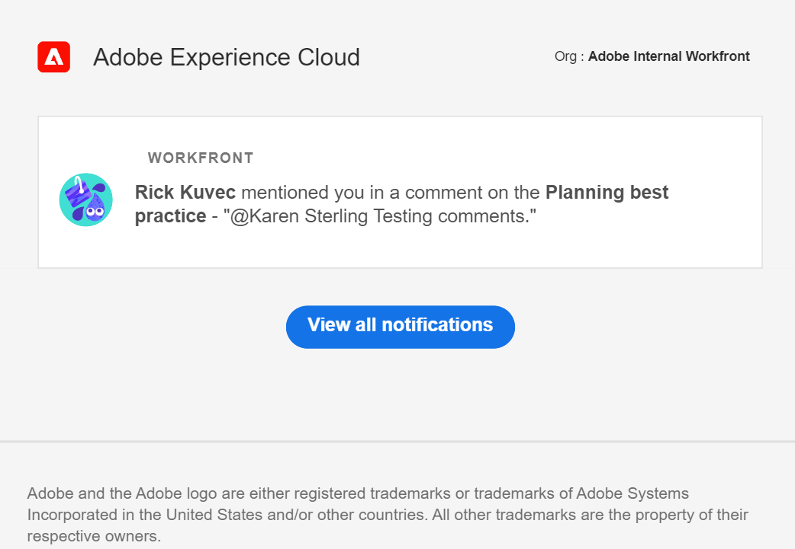

# Verwalten von Adobe Workfront Planning-E-Mail-Benachrichtigungen

<!--The highlighted information on this page refers to functionality not yet generally available. It is available only in the Preview environment for all customers. After the monthly releases to Production, the same features are also available in the Production environment for customers who enabled fast releases.    

For information about fast releases, see [Enable or disable fast releases for your organization](/help/quicksilver/administration-and-setup/set-up-workfront/configure-system-defaults/enable-fast-release-process.md). -->

{{planning-important-intro}}

Sie können E-Mail-Benachrichtigungen von Workfront Planning erhalten, wenn die folgenden Szenarien vorliegen:

* Jemand versieht Sie mit Tags in einem Datensatzkommentar

  Informationen zum Tagging anderer Personen in einem Datensatzkommentar finden Sie unter [Verwalten von Datensatzkommentaren](/help/quicksilver/planning/records/manage-record-comments.md).
* Jemand fragt nach Ihrer Berechtigung für den Zugriff auf eine Ansicht oder einen Arbeitsbereich
* Jemand bestätigt, dass Ihr Zugriff für eine Ansicht oder einen <!--Isk confirmed that there is nno email for denying access but did not test--> gewährt wurde
* Sie senden eine Workfront Planning-Anfrage. Weitere Informationen finden Sie unter [Erstellen und Verwalten eines Anfrageformulars in Adobe Workfront Planning](/help/quicksilver/planning/requests/create-request-form.md)
* Jemand genehmigt oder lehnt eine von Ihnen gesendete Workfront Planning-Anfrage ab. Weitere Informationen finden Sie unter [Genehmigen einer Anfrage in Adobe Workfront Planning](/help/quicksilver/planning/requests/approve-request.md)
* Der Status ändert sich in eine von Ihnen gesendete Workfront Planning-Anfrage.

## Zugriffsanforderungen

+++ Erweitern Sie , um die Zugriffsanforderungen anzuzeigen.

<table style="table-layout:auto"> 
<col> 
</col> 
<col> 
</col> 
<tbody> 
    <tr> 
<tr> 
<td> 
   
 Produkte
 </td> 
   <td> 
   <ul><li>
 Adobe Workfront
</li> 
   <li>
 Adobe Workfront-Planung
</li></ul></td> 
  </tr>   
<tr> 
   <td role="rowheader">
Adobe Workfront-Plan*
</td> 
   <td> 

Einer der folgenden Workfront-Pläne:
 
<ul><li>Auswählen</li> 
<li>Erstklassig</li> 
<li>Ultimativ</li></ul> 

Workfront Planning ist nicht für ältere Workfront-Pläne verfügbar
 
   </td> 
<tr> 
   <td role="rowheader">
Adobe Workfront-Planungspaket*
</td> 
   <td> 

Beliebig 
 

Weitere Informationen zu den einzelnen Workfront-Planungsplänen erhalten Sie von Ihrem Workfront Account Manager. 
 
   </td> 
 <tr> 
   <td role="rowheader">
Adobe Workfront-Plattform
</td> 
   <td> 

Die Workfront-Instanz Ihres Unternehmens muss in das einheitliche Adobe-Erlebnis integriert werden.
 

Die Benutzenden in Ihrem Unternehmen erhalten nur dann Benachrichtigungen von Workfront Planning, wenn Ihr Unternehmen zum einheitlichen Adobe-Erlebnis hinzugefügt wird. 

Weitere Informationen finden Sie unter <a href="/help/quicksilver/workfront-basics/navigate-workfront/workfront-navigation/adobe-unified-experience.md">Adobe Unified Experience for Workfront</a>. 
 
   </td> 
   </tr> 
  </tr> 
  <tr> 
   <td role="rowheader">
Adobe Workfront-Lizenz*
</td> 
   <td>
 Standard, Licht oder Mitwirkende

   
Workfront Planning ist nicht für ältere Workfront-Lizenzen verfügbar
 
  </td> 
  </tr> 
  <tr> 
   <td role="rowheader">
Konfiguration der Zugriffsebene
</td> 
   <td> 
Es gibt keine Zugriffssteuerungsebenen für Adobe Workfront Planning
   
</td> 
  </tr> 
<tr> 
   <td role="rowheader">
Objektberechtigungen
</td> 
   <td>   
Anzeigen oder Erweitern von Berechtigungen für einen Arbeitsbereich</a> 
  
   
Systemadministratoren haben Berechtigungen für alle Arbeitsbereiche, einschließlich der nicht erstellten
 </td> 
  </tr> 
<tr> 
   <td role="rowheader">
Layout-Vorlage
</td> 
   <td> 
Allen Benutzern, einschließlich Workfront-Administratoren, muss eine Layoutvorlage zugewiesen werden, die den Bereich Planung im Hauptmenü enthält. 
 </td> 
  </tr> 
</tbody> 
</table>

*Weitere Informationen zu Zugriffsanforderungen für Workfront finden Sie unter [Zugriffsanforderungen in der Dokumentation zu Workfront](/help/quicksilver/administration-and-setup/add-users/access-levels-and-object-permissions/access-level-requirements-in-documentation.md).

+++

<!--
OLD: 

<table style="table-layout:auto">
 <col>
 </col>
 <col>
 </col>
 <tbody>
    <tr>
<tr>
<td>
   
 Product
 </td>
   <td>
   
 Adobe Workfront
 
   
In order to receive notifications from Workfront Planning and manage notification preferences, your organization's instance of Workfront must be onboarded to the Adobe Unified Experience. For information, see <a href="/help/quicksilver/workfront-basics/navigate-workfront/workfront-navigation/adobe-unified-experience.md">Adobe Unified Experience for Workfront</a>.
</td>
  </tr>  
 <td role="rowheader">
Adobe Workfront agreement
</td>
   <td>

Your organization must be enrolled in the early access stage for Workfront Planning 

   </td>
  </tr>
  <tr>
   <td role="rowheader">
Adobe Workfront plan
</td>
   <td>

Any

   </td>
  </tr>
  <tr>
   <td role="rowheader">
Adobe Workfront license
</td>
   <td>
   
Any
 
  </td>
  </tr>
  
  <tr>
   <td role="rowheader">
Access level configuration
</td>
   <td> 
There are no access level controls in Workfront Planning. 
  
</td>
  </tr>
<tr>
   <td role="rowheader">
Permissions
</td>
   <td> 
View or higher permissions to a workspace</a> 
  
   
System Administrators have permissions to all workspaces, including the ones they did not create

</td>
  </tr>

<tr>
   <td role="rowheader">
Layout template
</td>
   <td> 
Your Workfront or group administrator must add the Planning area in your layout template. For information, see <a href="/help/quicksilver/planning/access/access-overview.md">Access overview</a>. 
  
</td>
  </tr>
 </tbody>
</table>
-->

## Verwalten von E-Mail-Benachrichtigungen, wenn jemand Sie in einem Kommentar taggt

1. (Bedingt und optional) Nachdem Sie in einem Kommentar zu einem Datensatz getaggt wurden, wechseln Sie zu der E-Mail-Benachrichtigung, die Sie über das Tag und den Kommentar informiert. Der Absender der E-Mail ist Adobe Experience Cloud.

   

1. (Optional) Klicken Sie auf die Nachricht im Feld **Workfront** in der E-Mail.

   Die Seite mit den Datensatzdetails wird in Workfront geöffnet. Sie können Aktualisierungen am Datensatz vornehmen oder auf den Kommentar antworten.

1. (Bedingt) Klicken Sie, falls verfügbar, auf **Alle Benachrichtigungen anzeigen**. <!--check with Lilit - do non-IMS users have this button??-->
Die **Benachrichtigungen** wird in Adobe Experience Cloud geöffnet. Alle Benachrichtigungen von allen Adobe Experience Cloud-Programmen werden angezeigt.

## Verwalten von E-Mail-Benachrichtigungen beim Anfordern und Gewähren von Berechtigungen

1. (Bedingt und optional) Nachdem Sie von einer Person aufgefordert oder Ihnen Berechtigungen für den Zugriff auf eine Ansicht oder einen Arbeitsbereich erteilt wurden, wechseln Sie zu der E-Mail, in der Sie über die Berechtigungsanfrage informiert werden. Der Absender der E-Mail ist Adobe Experience Cloud.

1. (Optional) Klicken Sie auf die Nachricht im Feld **Workfront** in der E-Mail.

   Die Seite mit den Datensatzdetails wird in Workfront geöffnet. Sie können Aktualisierungen am Datensatz vornehmen oder auf den Kommentar antworten.

1. (Bedingt) Klicken Sie, falls verfügbar, auf **Alle Benachrichtigungen anzeigen**.
Die **Benachrichtigungen** wird in Adobe Experience Cloud geöffnet. Alle Benachrichtigungen von allen Adobe Experience Cloud-Programmen werden angezeigt.

Informationen zum Anfordern, Gewähren oder Verweigern von Berechtigungen für eine Ansicht oder einen Arbeitsbereich finden Sie [Berechtigungen für eine Ansicht oder einen Arbeitsbereich anfordern](/help/quicksilver/planning/access/request-permissions.md).

Informationen zum Verwalten Ihrer Workfront Planning-Benachrichtigungen finden Sie unter [Verwalten von Adobe Workfront Planning-Benachrichtigungseinstellungen](/help/quicksilver/planning/notifications/manage-notification-preferences.md).

## Verwalten von E-Mail-Benachrichtigungen zum Senden, Genehmigen oder Ablehnen von Workfront Planning-Anfragen

1. (Optional) Wechseln Sie zu der E-Mail, die Workfront Ihnen sendet
nachdem Sie eine Anforderung gesendet haben oder nachdem eine von Ihnen gesendete Anforderung genehmigt oder abgelehnt wurde. Der Absender der E-Mail ist Adobe Workfront.

1. (Optional) Klicken Sie auf **Anfrage öffnen**. Dadurch wird die Anfrage in Workfront Planning geöffnet.

1. Klicken Sie auf **Benachrichtigungen**-Symbol  in der rechten oberen Ecke des Bildschirms, um auf die Seite **Benachrichtigungen** zuzugreifen.

   Informationen zum Verwalten Ihrer Workfront Planning-Benachrichtigungen finden Sie unter [Verwalten von Adobe Workfront Planning-Benachrichtigungseinstellungen](/help/quicksilver/planning/notifications/manage-notification-preferences.md).
