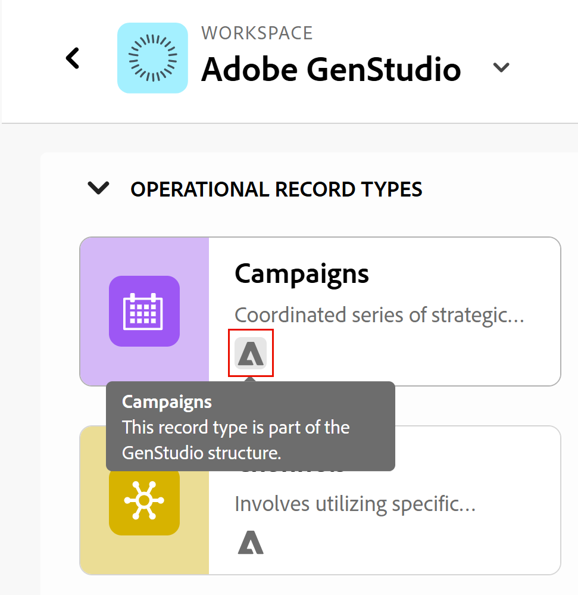

<!--Better metadata, at publishing:
---
title: Manage the GenStudio Workspace in Adobe Workfront Planning
description: The GenStudio for Performance Marketing workspace is available in Adobe Workfront Planning when your company has purchased both products and your instance of Workfront is integrated with your company's instance of GenStudio. You can view the GenStudio workspace from Planning and update information in both systems.
feature: Workfront Planning
role: User, Admin
author: Alina
recommendations: noDisplay, noCatalog
---
-->

<!--MUST update the access requirements below - not complete!!!!!!!!!-->

# Verwalten des GenStudio-Arbeitsbereichs in Adobe Workfront Planning

<!--The information on this page refers to functionality not yet generally available. It is available only in the Preview environment for all customers. After the monthly releases to Production, the same features are also available in the Production environment for customers who enabled fast releases.    

For information about fast releases, see [Enable or disable fast releases for your organization](/help/quicksilver/administration-and-setup/set-up-workfront/configure-system-defaults/enable-fast-release-process.md). -->

Der Adobe GenStudio for Performance Marketing-Arbeitsbereich ist in Adobe Workfront Planning verfügbar, wenn Ihr Unternehmen beide Produkte gekauft hat und Ihre Workfront-Instanz in die GenStudio-Instanz Ihres Unternehmens integriert ist.

Sie können den GenStudio-Arbeitsbereich unter „Planung“ anzeigen und Informationen in beiden Systemen aktualisieren.

Informationen zur Verwendung und Verwaltung des GenStudio-Arbeitsbereichs vom GenStudio-Leistungsmarketing aus finden Sie im [Adobe GenStudio for Performance Marketing-Benutzerhandbuch](https://experienceleague.adobe.com/de/docs/genstudio-for-performance-marketing/user-guide/home).

Allgemeine Informationen zur Planungsintegration von GenStudio in Workfront finden Sie unter [Erste Schritte mit der Adobe Workfront Planning and Adobe GenStudio for Performance Marketing-Integration](/help/quicksilver/planning/planning-and-genstudio-integration/get-started-with-workfront-planning-and-genstudio-integration.md).

>[!IMPORTANT]
>
>Die in diesem Artikel beschriebenen Schritte veranschaulichen, wie Sie den GenStudio-Arbeitsbereich in Workfront Planning aktualisieren können, wenn Sie über Verwaltungsberechtigungen für ihn verfügen.
>> Nicht alle Funktionen sind verfügbar, wenn Sie über die Berechtigung Beitragen für den GenStudio-Arbeitsbereich verfügen.
>
>Wenn Ihr Unternehmen über mehrere Instanzen von Workfront verfügt, erhalten alle Benutzenden Beitragsberechtigungen für den GenStudio-Arbeitsbereich in Workfront Planning.

## Zugriffsanforderungen

+++ Erweitern Sie , um die Zugriffsanforderungen für die Funktion in diesem Artikel anzuzeigen. 

<table style="table-layout:auto"> 
<col> 
</col> 
<col> 
</col> 
<tbody> 
    <tr> 
<tr> 
</tr>   
<tr> 
   <td role="rowheader">
Adobe Workfront-Paket
</td> 
   <td> 

Beliebiges Workfront und beliebiges Planungspaket

Beliebiger Workflow und beliebiges Planungspaket

Weitere Informationen zu den einzelnen Workfront-Planungspaketen erhalten Sie von Ihrem Workfront-Kundenbetreuer. 
 
   </td> 
   <tr> 
<td> 
   
 Zusätzliche Produkte
 </td> 
   <td> 
   
 Adobe GenStudio for Performance Marketing
</td> 
  </tr>
  <tr> 
   <td role="rowheader">
Adobe Workfront-Lizenz
</td> 
   <td>
Standard

   </td> 
  </tr> 
  <tr> 
   <td role="rowheader">
Adobe GenStudio for Performance Marketing-Benutzerrollen
</td> 
   <td>
<ul><li>Jede GenStudio-Benutzerrolle für den Zugriff auf Kampagnen, Produkte und Personas</li>
   <li>GenStudio System Manager für den Zugriff auf Aktivierungen <!--and Events--></li></ul>
   Weitere Informationen finden Sie unter <a href="https://experienceleague.adobe.com/en/docs/genstudio-for-performance-marketing/user-guide/intro/user-roles">Benutzerrollen und -berechtigungen</a>. 
   

  </td> 
  </tr>   
<tr> 
   <td role="rowheader">
Objektberechtigungen
</td> 
   <td>  
   
In Workfront Planning: 

   <ul>
   <li>
Verwalten Sie Berechtigungen für den GenStudio-Arbeitsbereich, um dem GenStudio-Arbeitsbereich neue Felder oder Datensatztypen hinzuzufügen
</li>
   <li>
Mitwirken an Berechtigungen für den GenStudio-Arbeitsbereich zum Hinzufügen, Aktualisieren oder Löschen von Datensätzen im GenStudio-Arbeitsbereich
 </li>  
   </ul>
   
Benutzende können in Workfront Planning keine GenStudio for Performance Marketing-Datensatztypen oder -Felder aus dem GenStudio-Arbeitsbereich entfernen

   
In Adobe GenStudio for Performance Marketing: 

   <ul>
   <li>
 Alle Berechtigungen in Adobe GenStudio for Performance Marketing
</li>
   <li>
 Erstellen von Berechtigungen in Adobe GenStudio for Performance Marketing zum Erstellen von Elementen
</li></ul>
   </td>  
</tbody> 
</table>

Informationen zum Adobe Workfront Planning-Zugriff finden Sie unter [Übersicht über den Adobe Workfront Planning-Zugriff](/help/quicksilver/planning/access/access-overview.md).

Weitere Informationen zu Adobe GenStudio for Performance Marketing finden Sie im [Adobe GenStudio for Performance Marketing-Benutzerhandbuch](https://experienceleague.adobe.com/de/docs/genstudio-for-performance-marketing/user-guide/home).

+++   

<!--Old:

<table style="table-layout:auto"> 
<col> 
</col> 
<col> 
</col> 
<tbody> 
    <tr> 
    <td role="rowheader">
Adobe Workfront package
</td> 
   <td> 

Any Workfront package

Any Planning package
  

   </td> </tr>
   <tr> 
<td> 
   
 Additional products
 </td> 
   <td> 
   
 Adobe GenStudio for Performance Marketing
</td> 
  </tr>
  <tr> 
   <td role="rowheader">
Adobe Workfront license
</td> 
   <td>
 Standard

  </td> 
  </tr> 
   
  <tr> 
   <td role="rowheader">
Adobe GenStudio for Performance Marketing user roles
</td> 
   <td>
<ul><li>Any GenStudio user role to access Campaigns, Products, and Personas</li>
   <li>GenSudio System Manager to access Activations ****** and Events*********</li></ul>
   For information, see <a href="https://experienceleague.adobe.com/en/docs/genstudio-for-performance-marketing/user-guide/intro/user-roles">User roles and permissions</a>. 
   

  </td> 
  </tr>   
<tr> 
   <td role="rowheader">
Object permissions
</td> 
   <td>  
   
In Workfront Planning: 

   <ul>
   <li>
Manage permissions to the GenStudio workspace to add new fields or record types to the GenStudio workspace
</li>
   <li>
Contribute permissions to the GenStudio workspace to add, update, or delete records in the GenStudio workspace
 </li>  
   </ul>
   
No users can remove GenStudio for Performance Marketing record types or fields from the GenStudio workspace in Workfront Planning

   
In Adobe GenStudio for Performance Marketing: 

   <ul>
   <li>
 Any permissions in Adobe GenStudio for Performance Marketing
</li>
   <li>
 Create permissions in Adobe GenStudio for Performance Marketing to create items
</li></ul>
   </td> 
  </tr> 
</tbody> 
</table> -->

## Überlegungen zum Verwalten eines GenStudio-Arbeitsbereichs in Workfront Planning

* Ihr Unternehmen muss Adobe GenStudio for Performance Marketing erwerben, bevor Sie einen GenStudio-Arbeitsbereich in Workfront Planning anzeigen können.

* Je nachdem, über wie viele Workfront-Instanzen Ihr Unternehmen verfügt, haben Sie automatisch die folgenden Berechtigungen für den GenStudio-Arbeitsbereich in Planning:

  <!--this table is also in the Get started article-->

  <table style="table-layout:auto"> 
   <col> 
   </col> 
   <col> 
   </col> 
   <tbody> 
      <tr> 
      <td role="rowheader">
Eine Instanz von Workfront
</td> 
      <td> 
   
Der GenStudio-Arbeitsbereich ist in Ihrer Instanz von Workfront Planning sichtbar

   
Workfront-Administratoren verfügen über Verwaltungsberechtigungen für den GenStudio-Arbeitsbereich in Planning

   
Alle anderen Benutzenden haben in Planning den Zugriff Beitragen zum GenStudio-Arbeitsbereich

   </td> </tr>
      <tr> 
   <td> 
      
 Mehrere Instanzen von Workfront
 </td> 
      <td> 
      
Der GenStudio Workspace ist in allen Workfront-Instanzen sichtbar

   
Alle Benutzenden mit Zugriff auf GenStudio for Performance Marketing und Workfront Planning haben Beitragsberechtigungen für GenStudio in Planning
 </td> 
   </tr>
      </tbody> 
   </table>

* Das Aktualisieren der Workspace-Konfiguration, der Datensatztypen, Ansichten und Felder für einen GenStudio Workspace entspricht dem Aktualisieren eines Workfront Planning Workspace mit seinen Elementen.

<!--
## Manage GenStudio workspace from Workfront Planning

CAN YOU DO THIS?? 
- OPTIONS FROM THE WORKSPACE CARD ??
- OPTIONS FROM THE MORE MENU ON A WORKSPACE ??
-->

## Verwalten des GenStudio-Arbeitsbereichs über Workfront Planning

>[!NOTE]
>
>Bevor Sie den GenStudio-Arbeitsbereich verwalten, lesen Sie den Artikel [Erste Schritte mit der Workfront-Planung und GenStudio for Performance Marketing](/help/quicksilver/planning/planning-and-genstudio-integration/get-started-with-workfront-planning-and-genstudio-integration.md) für weitere Informationen.
>

1. Melden Sie sich bei Workfront als Benutzer an, der auch Zugriff auf GenStudio hat.
1. Klicken Sie oben links auf **[!UICONTROL Hauptmenü]**-Symbol  und dann auf **[!UICONTROL Planung]**.

   Die Hauptseite von Workfront Planning wird geöffnet.

1. Klicken Sie auf **Andere Arbeitsbereiche** und suchen Sie einen Arbeitsbereich, der einen Hinweis enthält, der vom **System** erstellt wurde und das Tag **GenStudio** auf seiner Karte enthält.

   

1. Klicken Sie auf die Karte **GenStudio Workspace**, um den GenStudio Workspace in Workfront Planning zu öffnen.
1. Standardmäßig werden die folgenden GenStudio-Datensatztypen in Workfront Planning erstellt und angezeigt:

   * Kampagnen
   * Produkte
   * Personas
   * Aktivierungen
   * Kanäle
   * Regionen

   Auf der Karte für den Datensatztyp in GenStudio gibt es einen Hinweis darauf, dass sie ursprünglich in GenStudio erstellt wurden.

   <!--check screen shot-->

   

1. Klicken Sie auf das **Mehr** Menü  rechts neben dem Workspace-Namen und dann auf eine der folgenden Aktionen:

   * **Bearbeiten**

     Weitere Informationen finden Sie unter [Arbeitsbereiche bearbeiten](/help/quicksilver/planning/architecture/edit-workspaces.md).
     <!--* **Delete** - this will generate an error message, per Iskuhi, so don't document as an option/ possibility-->

     <!--For information, see [Delete workspaces](/help/quicksilver/planning/architecture/delete-workspaces.md). -->

1. Klicken Sie **Freigeben** oben rechts, um den Arbeitsbereich für andere freizugeben.

   Weitere Informationen finden Sie unter [Freigeben von Arbeitsbereichen](/help/quicksilver/planning/access/share-workspaces.md)

1. Klicken Sie auf eine der Karten des Datensatztyps, um Datensätze für diesen Typ anzuzeigen.

   Informationen zum Verwalten des Datensatztyps, der Ansichten und Felder finden Sie im Abschnitt [Verwalten von GenStudio-Datensatztypen aus Workfront Planning](#manage-genstudio-record-types-from-workfront-planning) in diesem Artikel.

## Verwalten von Datensatztypen, Ansichten und Datensätzen aus dem GenStudio-Arbeitsbereich in Workfront Planning

>[!NOTE]
>
>Bevor Sie den GenStudio-Arbeitsbereich verwalten, lesen Sie den Artikel [Erste Schritte mit der Workfront-Planung und GenStudio for Performance Marketing](/help/quicksilver/planning/planning-and-genstudio-integration/get-started-with-workfront-planning-and-genstudio-integration.md) für weitere Informationen.
>

1. Wechseln Sie zum GenStudio-Arbeitsbereich in Workfront Planning und öffnen Sie eine Seite für den Datensatztyp, wie im Abschnitt [Verwalten des GenStudio-Arbeitsbereichs von Workfront Planning](#manage-the-genstudio-workspace-from-workfront-planning) in diesem Artikel beschrieben.

1. Klicken Sie auf **Mehr** Menü  rechts neben einem Namen eines Datensatztyps und dann auf eine der folgenden Aktionen:

   * **Bearbeiten**

     Weitere Informationen finden Sie [Datensatztypen bearbeiten](/help/quicksilver/planning/architecture/edit-record-types.md).
   * **Automatisierungen verwalten**

     Weitere Informationen finden Sie unter [Konfigurieren von Adobe Workfront Planning Automations](/help/quicksilver/planning/records/configure-automations-to-create-records.md).
   * **Anfrageformulare verwalten**

     Sie können mehrere Anfrageformulare erstellen. Die Anfrageformulare sind im Bereich Anfragen von Workfront verfügbar und Sie können sie auch öffentlich oder über einen Link freigeben.

     Weitere Informationen finden Sie unter [Erstellen und Verwalten eines Anfrageformulars in Adobe Workfront Planning](/help/quicksilver/planning/requests/create-request-form.md).

1. Gehen Sie wie folgt vor, um eine Ansicht oder den Datensatztyp freizugeben:

   * Klicken **oben rechts** der Seite „Datensatztyp“ auf „Freigeben“ und dann auf eine der folgenden Aktionen:
      * **Datensatztyp freigeben**
Weitere Informationen finden Sie [Datensatztypen freigeben](/help/quicksilver/planning/access/share-record-types.md).
      * **Aktuelle Ansicht freigeben**
Weitere Informationen finden Sie unter [Freigeben von Ansichten](/help/quicksilver/planning/access/share-views.md).
      * **Kopieren Sie den Link Ansicht**
Ein Link zur Ansicht wird in die Zwischenablage kopiert.
      * **Exportiert die aktuelle Ansicht**
Weitere Informationen finden Sie [Exportieren von Datensätzen aus der Tabellenansicht](/help/quicksilver/planning/records/export-records-from-the-table-view.md).

1. Gehen Sie wie folgt vor, um die Ansichten des Datensatztyps zu verwalten:

   * Klicken Sie auf **+ Ansicht**, um eine Ansicht für den GenStudio-Datensatztyp zu erstellen.

     Weitere Informationen finden Sie unter [Verwalten von Datensatzansichten](/help/quicksilver/planning/views/manage-record-views.md).

   * Klicken Sie auf das **Vollbild**-Symbol  um eine beliebige Ansicht im Vollbildmodus zu öffnen.

   * Die Elemente einer Ansicht aus allen Ansichten verwalten.

     Sie können beispielsweise den Filter, die Gruppierungen, die Sortierung und die Einstellungen einer Ansicht ändern, sofern verfügbar.

     Weitere Informationen finden Sie unter [Verwalten von Datensatzansichten](/help/quicksilver/planning/views/manage-record-views.md).

1. Führen Sie einen der folgenden Schritte aus, um Datensätze hinzuzufügen:

   * Klicken Sie **Neuer Datensatz** in einer beliebigen Ansicht, um Datensätze von Grund auf neu zu erstellen

   * Importieren von Datensätzen mithilfe einer Excel- oder CSV-Datei in die Tabellenansicht

   * Klicken Sie auf eine beliebige Stelle in der Zeitleiste oder in den Kalenderansichten, um Datensätze hinzuzufügen.

     Weitere Informationen finden Sie unter [Erstellen von Datensätzen](/help/quicksilver/planning/records/create-records.md).

     Datensätze sind sowohl in Workfront als auch in GenStudio sichtbar.

     >[!NOTE]
     >
     >Es können keine Datensätze für den Datensatztyp Aktivierungen hinzugefügt werden.

1. Führen Sie einen der folgenden Schritte aus, um Datensätze zu bearbeiten:

   * Inline-Bearbeitung von Datensätzen über die Tabellenansicht

   * Klicken Sie in einer beliebigen Ansicht auf einen Datensatz, um die zugehörige Detailseite zu öffnen.

     Weitere Informationen finden Sie unter [Datensätze bearbeiten](/help/quicksilver/planning/records/edit-records.md).

     Die Änderungen, die Sie in GenStudio Workspace in Planning vornehmen, sind sofort in GenStudio sichtbar.

1. Wählen Sie einen Datensatz in der Tabellenansicht aus und klicken Sie dann auf **Löschen**.

   Weitere Informationen finden Sie unter [Datensätze löschen](/help/quicksilver/planning/records/delete-records.md).

   Gelöschte Datensätze werden sofort aus GenStudio entfernt.

   >[!TIP]
   >
   >Gelöschte Datensätze können aus der Tabellenansicht wiederhergestellt werden, die kürzlich gelöschte Container in Workfront Planning enthalten. Aus GenStudio gelöschte Datensätze können auch aus dem kürzlich gelöschten Bin in Workfront Planning wiederhergestellt werden.

   Weitere Informationen finden Sie unter [Wiederherstellen gelöschter Datensätze](/help/quicksilver/planning/records/restore-deleted-records.md)

1. Klicken Sie auf das Symbol &quot;+&quot; in der oberen rechten Ecke der Tabellenansicht, um Folgendes zu erstellen:

   * Datensatzfelder

     Weitere Informationen finden Sie unter [Felder erstellen](/help/quicksilver/planning/fields/create-fields.md)

   * Verbindungen aufzeichnen

     Weitere Informationen finden Sie unter [Verbinden von Datensatztypen](/help/quicksilver/planning/architecture/connect-record-types.md)

     Aus dem GenStudio-Arbeitsbereich erstellte Felder sind in den folgenden Bereichen sichtbar:

      * Workfront-Planungsansichten
      * Details zum Workfront-Planungsdatensatz
      * GenStudio-Datensatzdetails

     >[!TIP]
     >
     >In Workfront Planning erstellte Felder sind in der Listenansicht in GenStudio nicht sichtbar.

1. Bewegen Sie den Mauszeiger über ein Feld in der Tabellenansicht und klicken Sie dann auf das Dropdown-Menü, um eine der folgenden Aktionen auszuführen:

   * Nach sortieren
   * Ausblenden
   * Bearbeiten der Einstellungen
     <!--* Delete it - not possible now, per Iskuhi; the link is there but it will generate an error-->

     <!--GenStudio-native fields are note removed from GenStudio. -->

     >[!NOTE]
     >
     >Nur wenn Sie über Verwaltungsberechtigungen in GenStudio verfügen, können Sie die Konfiguration eines Felds bearbeiten und weitere Felder hinzufügen.

